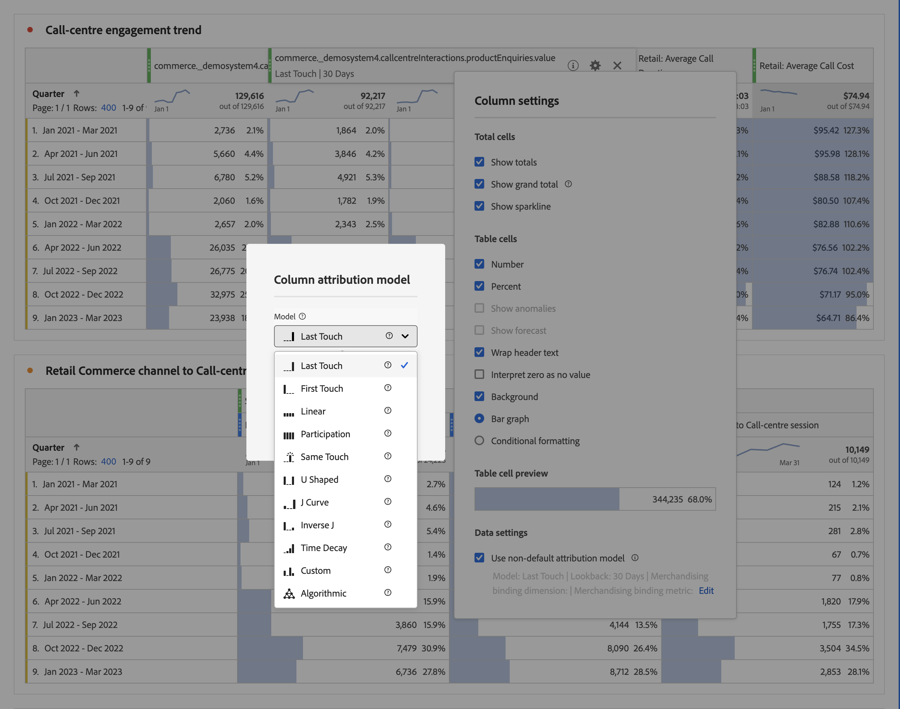

# [!UICONTROL 列設定]

[!UICONTROL 列設定]では、列の書式を設定できます。一部の列には条件付き書式を設定することもできます。

行と列の設定に関するビデオをこちらでご覧ください。

>[!VIDEO](https://video.tv.adobe.com/v/40382/?quality=12)

## [!UICONTROL 列設定]の編集 {#edit-column-settings}

アクセスするには [!UICONTROL 列設定]をクリックし、フリーフォームテーブルをプロジェクトにドラッグして、設定アイコンをクリックします。  」と入力します。

**一度に複数の列**&#x200B;の設定を編集できます。複数の列を選択し、いずれかの列の設定アイコンをクリックするだけです。加えた変更が、選択されているセルを含むすべての列に適用されます。

| 要素 | 説明 |
| --- | --- |
| 数値 | セルに指標の数値を表示するかどうかを決定します。例えば、指標がページビュー数の場合、数値は行項目のページ表示回数になります。 |
| パーセント | セルに指標の割合の値を表示するかどうかを決定します。例えば、指標がページビュー数の場合、割合の値は行項目のページ表示回数を列の合計ページ表示回数で割った数になります。メモ：より正確な数値を示すために、100％を超える割合が表示されるようになりました。列の幅をさらに大きくできるように、上限を 1,000％まで高める予定です。 |
| 異常値を表示 | この列の値に対して異常値検出を実行するかどうかを決定します。 |
| 予測を表示 | この列に予測値を表示するかどうかを指定します。 |
| ヘッダーテキストを折り返し | ヘッダーを読みやすく、またテーブルを共有しやすくするため、フリーフォームテーブルでヘッダーテキストを折り返せるようにします。これは、.pdf のレンダリングや名前の長い指標に使用すると便利です。デフォルトで有効です。 |
| ゼロを値なしとして解釈 | 値が 0 のセルについて、0 を表示するか空白にするかを決定します。この設定は、まだ終わっていない月の日ごとのデータを確認する際に便利です。将来の日付のセルに 0 を表示するのではなく、空にすることができます。この設定はグラフにも反映されます（つまり、この設定がオンの場合、値が 0 の線やバーはグラフに表示されません）。 |
| 背景 | セルのすべての書式（棒グラフや条件付き書式など）をセルに表示するかどうかを決定します。 |
| 棒グラフ | 列の合計を最大値としてセルの値を示す横棒グラフを表示します。 |
| 条件付き書式 | 次の節を参照してください。 |
| テーブルのセルのプレビュー | 現在選択されている書式オプションが適用されると各セルがどのように表示されるかを示すプレビューが表示されます。 |

## 条件付き書式 {#conditional-formatting}

条件付き書式により、上限、中間点、下限を定義して書式を適用できます。「カスタム」制限を選択した場合を除き、フリーフォームテーブルに適用した条件付き書式（色など）も分類で自動的に有効となります。

| 要素 | 説明 |
| --- | --- |
| 条件付き書式 | 事前設定された任意のカラーセットをセルに適用します。4 つの使用可能なカラースキームのうちどれを選択するかに応じて、高い値、中間の値、低い値にそれぞれ異なる色が割り当てられます。 テーブルのディメンションを置き換えると、条件付き書式の制限がリセットされます。指標を置き換えると、その列の制限が再計算されます（指標が X 軸、ディメンションが Y 軸で示される場合）。 |
| 割合制限を使用 | 絶対値ではなくパーセンテージに基づいて制限範囲を変更します。このオプションは、割合のみに基づいている指標（バウンス率など）のほか、カウントと割合を持つ指標（ページビュー数など）で使用できます。 |
| 自動生成 | データに基づいて自動的に上限／中間／下限を計算する。上限は、この列の最大値です。下限は最小値であり、中間点は上限と下限の平均値です。 |
| カスタム | 上限／中間／下限を手動で割り当てる。これにより、どのような場合に列の値が良好、平均的、望ましくないと判断されるかを柔軟に決定できます。 |
| 条件付き書式パレット | 4 つのうちどのカラースキームを条件付き書式に使用するかを選択します。 |

## デフォルト以外のアトリビューションモデルを使用 {#attribution}

デフォルトのアトリビューションモデルセットを [データビュー](/help/data-views/component-settings/attribution.md).

>[!NOTE]
>
>コンポーネントのアトリビューションをデフォルト以外のアトリビューションモデルに更新する際は、次の点を考慮してください。
>
>* **コンポーネントを *単一の次元*:** デフォルト以外のアトリビューションモデルが使用される場合、コンポーネントのアトリビューションは割り当てモデルを無視します。
>
>* **コンポーネントを *複数のディメンション*:** デフォルト以外のアトリビューションモデルが使用される場合、コンポーネントのアトリビューションには割り当てモデルが保持されます。
>
>   複数のディメンションは、 [クラウドへのデータのエクスポート](/help/analysis-workspace/export/export-cloud.md).
>
> 配分について詳しくは、 [永続性コンポーネントの設定](/help/data-views/component-settings/persistence.md).

Analysis Workspaceの指標にデフォルト以外のアトリビューションモデルを使用するには：

1. フリーフォームテーブル列の指標の設定（歯車）アイコンをクリックします。

   

2. **[!UICONTROL データ設定]**&#x200B;で「**[!UICONTROL デフォルト以外のアトリビューションモデルを使用]**」チェックボックスをオンにします。様々なアトリビューションモデルについて詳しくは、「[アトリビューションモデルの概要](/help/data-views/component-settings/attribution.md)」を参照してください。

   

>[!MORELIKETHIS]
>
>* [データソースの管理](/help/analysis-workspace/visualizations/t-sync-visualization.md)
