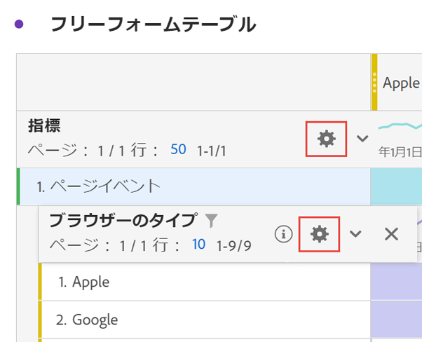
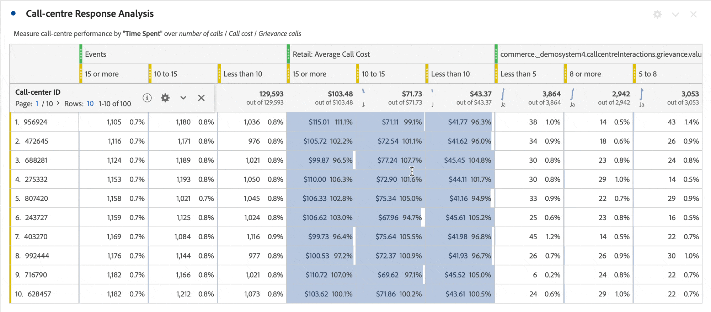

# 行設定

行設定は、テーブルにドラッグしたコンポーネントによって異なります。 テーブルの行の設定にアクセスするには、ディメンション、セグメント、指標、期間、または各オブジェクト内の分類の横にある **[!UICONTROL 設定]**&#x200B;を選択します。

| 設定 | 説明 |
| --- | --- |
| **[!UICONTROL 位置で分類]** | デフォルトでは、この設定は無効で、分類は静的な行項目に固定されます。 例えば、上位 3 つのページディメンション項目（ホームページ、検索結果、チェックアウト）をマーケティングチャネル別に分類するとします。 その後、プロジェクトを終了し、2 週間後に戻ります。 プロジェクトを再度開くと、トップ 3 ページが変更され、ホームページ、検索結果、チェックアウトがトップ 4 ～ 6 ページになりました。 デフォルトでは、マーケティングチャネルの内訳は、4～6行目にあるにもかかわらず、「ホームページ」、「検索結果」、「チェックアウト」の下に表示されます。  対照的に、**職位による分類**&#x200B;は常に上位3つの項目を、それらが何であるかに関係なく分類します。 例に戻って参照すると、プロジェクトを再度開く際、マーケティングチャネルの分類はテーブルの上位 3 ページに関連付けられます。 また、現在、4～6 行になっているホームページ、検索結果、チェックアウトには関連付けられません。 |
| **[!UICONTROL 割合 (%)]** | **割合を列ごとに計算**（デフォルト）：セルに表示される割合は、列の合計に基づいて計算されます。  **割合を行ごとに計算**：セル内の割合は、総計を分母として、列方向ではなく行方向に計算されます。 この計算は、割合のトレンド分析に役立ちます。 |
| **[!UICONTROL 列の合計]** | これらの設定は、[静的な行](/help/analysis-workspace/visualizations/freeform-table/column-row-settings/manual-vs-dynamic-rows.md)に対してのみ使用できます。  「**現在の行の合計として表示**」では、テーブル内の行のクライアントサイドの合計が表示されます。これは、合計で訪問回数やユーザー数などの指標の重複が排除&#x200B;*されない*&#x200B;ことを意味します。  「**総計を表示**」では、サーバーサイドの合計が表示されます。これは、合計で指標の重複が排除されることを意味します。 |

>[!BEGINSHADEBOX]

デモビデオについて詳しくは、 [フリーフォームテーブルの行と列の設定](https://experienceleague.adobe.com/en/docs/analytics-learn/tutorials/analysis-workspace/building-freeform-tables/row-and-column-settings-in-freeform-tables){target="_blank"}を参照してください。

{{videoaa}}

>[!ENDSHADEBOX]

## 行数の変更

表示される行数を変更するには、次の手順に従います。

1. テーブルの最初の列の上部にある&#x200B;**[!UICONTROL 行]**&#x200B;の横の数字をクリックします。

   表示される行数のドロップダウンメニューを表示する

1. ドロップダウンメニューから、表に表示する行数を選択します。

## コンテキストメニュー

ディメンションヘッダーを選択する際に、次のコンテキストメニューオプションを使用できます。

| オプション | 説明 |
| --- | --- |
| **[!UICONTROL クリップボードに選択範囲をコピー]** | ビジュアライゼーションからクリップボードに選択範囲をコピーします。 |
| **[!UICONTROL 項目を CSV（*ディメンション名*）としてダウンロード]** | ビジュアライゼーションのディメンション項目（最大 50,000 個）をローカルデバイスにすぐにダウンロードします。 選択したディメンションの最大ディメンション項目数は 50,000 個です。 |
| **[!UICONTROL 選択内容を CSV としてダウンロード]** | ビジュアライゼーションのディメンション項目をローカルデバイスにすぐにダウンロードします。 |
| **[!UICONTROL すべてのディメンション項目のハイパーリンクを作成]** | すべてのディメンション項目のハイパーリンクを作成します。 [フリーフォームテーブルでのディメンションのハイパーリンク](../freeform-table-hyperlinks.md)を参照してください |
| **[!UICONTROL すべてのディメンション項目のハイパーリンクを編集]** | すべてのディメンション項目のハイパーリンクを編集します。 [フリーフォームテーブルでのディメンションのハイパーリンク](../freeform-table-hyperlinks.md)を参照してください |
| **[!UICONTROL すべてのディメンション項目のハイパーリンクを削除]** | すべてのディメンション項目のハイパーリンクを削除します。 [フリーフォームテーブルでのディメンションのハイパーリンク](../freeform-table-hyperlinks.md)を参照してください |
| **[!UICONTROL 削除]** | テーブルからディメンションを削除します。 |
| **[!UICONTROL 視覚化]** | 使用可能な任意のビジュアライゼーションを使用してディメンションを視覚化します。 |
| **[!UICONTROL 選択した行のみを表示]** | ビジュアライゼーションで選択した項目のみを表示します。 |
| **[!UICONTROL 選択内容から注釈を作成]** | 「**[!UICONTROL 注釈の詳細]**」を開いて、注釈を追加します。 |

次の追加のコンテキストメニューオプションは、フリーフォームテーブルで1つ以上のディメンション項目（最初の列）または1つ以上の個々のセルを選択する場合に使用できます。

| オプション | 説明 |
| --- | --- |
| **[!UICONTROL クリップボードに選択範囲をコピー]** | フリーフォームテーブルの選択したセル内の情報をコピーします。 |
| **[!UICONTROL 項目を CSV（*ディメンション名*）としてダウンロード]** | ビジュアライゼーションのディメンション項目（最大 50,000 個）をローカルデバイスにすぐにダウンロードします。 選択したディメンションの最大ディメンション項目数は 50,000 個です。 |
| **[!UICONTROL ハイパーリンクを作成]** | 項目のハイパーリンクを作成します。 [フリーフォームテーブルでのディメンションのハイパーリンク](../freeform-table-hyperlinks.md)を参照してください |
| **[!UICONTROL ハイパーリンクを編集]** | 項目のハイパーリンクを編集します。 [フリーフォームテーブルでのディメンションのハイパーリンク](../freeform-table-hyperlinks.md)を参照してください |
| **[!UICONTROL ハイパーリンクを削除]** | 項目のハイパーリンクを削除します。 [フリーフォームテーブルでのディメンションのハイパーリンク](../freeform-table-hyperlinks.md)を参照してください |
| **[!UICONTROL 選択内容を CSV としてダウンロード]** | ビジュアライゼーションのディメンション項目をローカルデバイスにすぐにダウンロードします。 |
| **[!UICONTROL 選択した項目を削除]** | 選択した行を削除します。 |
| **[!UICONTROL 選択範囲からアラートを作成]** | [ アラートビルダー](/help/components/c-intelligent-alerts/alert-builder.md)を開いて、選択範囲からアラートを作成します。 |
| **[!UICONTROL 分類]** | ディメンション項目を分類します。 **[!UICONTROL ディメンション]**、**[!UICONTROL 指標]**、**[!UICONTROL セグメント]**&#x200B;または&#x200B;**[!UICONTROL 日付範囲]**&#x200B;のリストから選択します。 *検索*&#x200B;を使用してコンポーネントを代替的に検索します。 |
| **[!UICONTROL 視覚化]** | 使用可能な任意のビジュアライゼーションを使用して、選択範囲を視覚化します。 |
| **[!UICONTROL トレンド選択]** | 選択内容のトレンド折れ線グラフビジュアライゼーションを作成します。 |
| **[!UICONTROL 選択した行のみを表示]** | ビジュアライゼーションで選択した行のみを表示します。 |
| **[!UICONTROL すべての行を表示]** | ビジュアライゼーションのすべての行を表示します。 |
| **[!UICONTROL 選択した行の名前を変更]** | 選択した行の名前を変更します。 選択した行&#x200B;]**の名前を変更ダイアログに**[!UICONTROL &#x200B;名前&#x200B;]**を入力します。**[!UICONTROL &#x200B;確認するには&#x200B;**[!UICONTROL OK]**&#x200B;を選択し、キャンセルするには&#x200B;**[!UICONTROL キャンセル]**&#x200B;を選択します。 フリーフォームテーブルの行の名前を変更すると、ヘッダー列のディメンション名に&#x200B;**[!UICONTROL （変更）]**&#x200B;が追加され、ディメンション ヘッダー列の変更された行をリセットするために アイコンを使用できるようになります。 [ インライン分類](#inline-classifications)を参照してください。 |
| **[!UICONTROL 選択した行を結合]** | 選択した行を結合します。 **[!UICONTROL 選択した行を結合]** ダイアログに&#x200B;**[!UICONTROL 名前]**&#x200B;を入力します。 確認するには&#x200B;**[!UICONTROL OK]**&#x200B;を選択し、キャンセルするには&#x200B;**[!UICONTROL キャンセル]**&#x200B;を選択します。 フリーフォームテーブルの行を結合すると、ヘッダー列のディメンション名に&#x200B;**[!UICONTROL （変更）]**&#x200B;が追加され、ディメンション ヘッダー列の変更された行をリセットするために アイコンを使用できるようになります。 [ インライン分類](#inline-classifications)を参照してください。 |
| **[!UICONTROL 変更された行を派生フィールドとして作成]** | *このコンテキスト メニューオプションを表示するには、Customer Journey Analytics製品の管理者である必要があります。* &#x200B;行の名前の変更または結合の結果として変更された、フリーフォームテーブルの選択した行で使用できます。 選択すると、[派生フィールドインターフェイス ](/help/data-views/derived-fields/derived-fields.md#create-a-derived-field)が開き、フリーフォームテーブルに対して行った変更が既に事前入力されています。 [ インライン分類](#inline-classifications)を参照してください。 |
| **[!UICONTROL 選択内容から注釈を作成]** | [注釈ビルダー](/help/components/annotations/create-annotations.md#annotation-builder)を開いて、選択範囲の注釈を作成します。 |
| **[!UICONTROL 選択範囲からセグメントを作成]** | [ セグメントビルダー](/help/components/segments/seg-builder.md)を開いて、選択範囲からセグメントを作成します。 |
| **[!UICONTROL 選択内容からオーディエンスを作成]** | [ オーディエンスビルダー](/help/components/audiences/publish.md#audience-builder)を開いて、選択範囲からオーディエンスを構築します。 |

指標列ヘッダーを選択する際に、次の追加のコンテキストメニューオプションを使用できます。

| オプション | 説明 |
|---|---|
| **[!UICONTROL 選択内容から指標を作成]** | 選択した指標から新しい指標を作成します。 指標には、平均値、中央値、列の最大値、列の最小値、列の合計値を使用できます。 また、計算指標ビルダーで「開く」を選択して、計算指標を作成することもできます。 |
| **[!UICONTROL 期間列を追加]** | 期間列を追加します。 パネルのカレンダー範囲によって次の&#x200B;*日付範囲*&#x200B;が決まる、複数のオプションが用意されています。 <ul><li>**[!UICONTROL この日付範囲より前の&#x200B;*日付範囲*]**</li><li>**[!UICONTROL この日付範囲のこれらの&#x200B;*日付範囲*]**。</li><li>**[!UICONTROL この日付範囲のカスタム日付範囲]**。 「**[!UICONTROL 日付範囲ビルダー]**」を開いて、日付範囲を指定します。</li></ul>詳しくは、[日付の比較](/help/components/date-ranges/time-comparison.md)を参照してください。 |
| **[!UICONTROL 期間を比較]** | 比較期間列を追加します。 ディメンションが時間に基づいていない場合にのみ使用できます。 次の&#x200B;*日付範囲*&#x200B;が決まる、複数のオプションが用意されています。 <ul><li>**[!UICONTROL この日付範囲より前の&#x200B;*日付範囲*]**</li><li>**[!UICONTROL この日付範囲のカスタム日付範囲]**。 「**[!UICONTROL 日付範囲ビルダー]**」を開いて、日付範囲を指定します。</li></ul>詳しくは、[日付の比較](/help/components/date-ranges/time-comparison.md)を参照してください。 |
| **[!UICONTROL アトリビューションモデルを変更]** | 列のアトリビューションモデルを変更します。 |
| **[!UICONTROL アトリビューションモデルを比較]** | 新しいアトリビューションモデルを指定し、選択した列のアトリビューションモデルと比較します。 新しいアトリビューションモデル指標を含む新しい列が追加されます。 また、比較用に変化率の列が追加されます。 |
| **[!UICONTROL 列の幅をリセット]** | 列の幅をデフォルトの幅にリセットします。 |
| **[!UICONTROL 選択内容から注釈を作成]** | 「**[!UICONTROL 注釈の詳細]**」を開いて、注釈を追加します。 |
| **[!UICONTROL 選択範囲からセグメントを作成]** | **[!UICONTROL セグメントビルダー]**&#x200B;を開いて、選択範囲からセグメントを作成します。 |
| **[!UICONTROL 選択内容からオーディエンスを作成]** | **[!UICONTROL オーディエンスを作成]**&#x200B;ダイアログを開いて、選択内容からオーディエンスを作成します。 |

## 行の高さの変更

プロジェクトの[表示密度](https://experienceleague.adobe.com/en/docs/analytics-platform/using/cja-workspace/build-workspace-project/view-density)を&#x200B;**[!UICONTROL コンパクト]**、**[!UICONTROL 快適]**、**[!UICONTROL 拡張]**&#x200B;に設定できます。

## インライン分類

インライン分類を使用すると、フリーフォームテーブル内の行の名前を変更したり、行を結合したりできます。 テーブル内の変更された行から派生フィールドを作成します。

次の例は、**[!UICONTROL 選択行の名前変更]**、**[!UICONTROL 選択行の結合]**、**[!UICONTROL 変更された行を派生フィールドとして作成]** コンテキストメニューオプションを使用する方法を示しています。 変更したフリーフォームテーブルをリセットする方法を説明します。

* **[!UICONTROL No value]**&#x200B;行の名前を&#x200B;**[!UICONTROL Other]**&#x200B;に変更します。

  1. 選択した&#x200B;**[!UICONTROL 値なし]**&#x200B;行のコンテキストメニューから「**[!UICONTROL 選択した行の名前を変更]**」を選択します。

     

  1. **[!UICONTROL 選択行の名前を変更]** ダイアログで、次の操作を行います。

     

     1. <code>その他を入力</code> **[!UICONTROL Name]**&#x200B;の。
     1. **[!UICONTROL OK]**&#x200B;を選択します。

* **[!UICONTROL 男性]**&#x200B;行と&#x200B;**[!UICONTROL 女性]**&#x200B;行を1つの&#x200B;**[!UICONTROL 大人]**&#x200B;行に結合します。

  1. **[!UICONTROL 男性]**&#x200B;および&#x200B;**[!UICONTROL 女性]**&#x200B;行を選択します。
  1. 選択した行のコンテキストメニューから「**[!UICONTROL 選択した行を結合]**」を選択します。

     

  1. **[!UICONTROL 選択した行を結合]** ダイアログで、次の操作を行います。

     

     1. <code>Adultsを入力</code> **[!UICONTROL Name]**&#x200B;の。
     1. **[!UICONTROL OK]**&#x200B;を選択します。

* フリーフォームテーブルの変更から派生フィールドを作成します。

  1. 変更されたテーブル内の選択した行のコンテキストメニューから「**[!UICONTROL 変更された行を派生フィールドとして作成]**」を選択します。

     を選択

  1. テーブルで行われたすべての変更に基づいて、派生フィールドの定義を検査、オプションで変更、保存します。

     

* 変更する前に、フリーフォームテーブルを状態にリセットします。

  1. **[!UICONTROL _ディメンション名&#x200B;_（変更）]**の横にあるを選択します。
  1. **[!UICONTROL 行の名前が変更された]** ポップアップから&#x200B;**[!UICONTROL 変更行をリセット]**&#x200B;を選択します。

     
