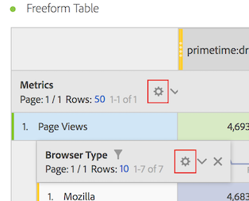

# 行設定

>[!NOTE]
>
>Customer Journey Analytics 内の Analysis Workspace に関するドキュメントを表示しています。この機能セットは、[従来の Adobe Analytics の Analysis Workspace](https://experienceleague.adobe.com/docs/analytics/analyze/analysis-workspace/home.html?lang=ja) とは少し異なります。[詳細情報...](/help/getting-started/cja-aa.md)

行と列の設定に関するビデオをこちらでご覧ください。

>[!VIDEO](https://video.tv.adobe.com/v/40382/?quality=12)

行設定は、テーブルにドラッグしたコンポーネントによって異なります。テーブルの行の設定にアクセスするには、ディメンション、フィルター、指標、期間、またはそれぞれの分類の横にある[!UICONTROL 設定]アイコンをクリックします。

| 設定 | 説明 |
| --- | --- |
| 日付の整列 | これは、各列の日付を同じ行のすべての開始に揃えるテーブルレベルの設定です。日付の整列は、デフォルトで有効になっています。これは、テーブルの行で時間ディメンションが使用され、列に異なる日付範囲が適用される場合です。例えば、10 月と 9 月が列に適用された日別テーブルの場合、左の列開始は 10 月 1 日、右の列開始は 9 月 1 日に設定されます。 |
| 位置で分類 | デフォルトでは、この設定は無効で、分類は静的な行項目に固定されます。例えば、上位 3 つのページディメンション項目（ホームページ、検索結果、チェックアウト）をマーケティングチャネル別に分類するとします。その後、プロジェクトを終了し、2 週間後に戻ります。プロジェクトを再度開くと、トップ 3 ページが変更され、ホームページ、検索結果、チェックアウトがトップ 4 ～ 6 ページになりました。デフォルトでは、マーケティングチャネルの分類は、現在は行 4 ～ 6 になっているにもかかわらず、「ホームページ」、「検索結果」、「チェックアウト」の下に表示されます。  対照的に、「**位置で分類**」を使用すると、上位 3 つのアイテムを内容に関係なく常に分類します。この例を参考にして、プロジェクトを再度開くと、マーケティングチャネルの分類は、表の上位 3 ページに結び付けられ、ホームページ、検索結果、チェックアウトは 4 ～ 6 行になります。 |
| 割合（％） | 「**列別に割合を計算**」はデフォルト設定です。列に表示される割合は、列の合計に基づいて計算されます。 **列別に割合を計算行ごとに割合を計算**&#x200B;は、フリーフォームテーブルが列ではなく行全体のセルの割合が表示されるようにします。これは、割合のトレンド分析に特に役立ちます。この設定は、視覚化アイコンを使用する場合にデフォルトで有効になります。 |
| 列の合計 | これらの設定は、[静的な行](/help/analysis-workspace/visualizations/freeform-table/column-row-settings/manual-vs-dynamic-rows.md)に対してのみ使用できます。  **現在の行の合計として表示**&#x200B;は、テーブル内の行のクライアントサイドの合計を表示します。これは、合計で訪問回数や訪問者数などの指標の重複が排除&#x200B;*されない*&#x200B;ことを意味します。  **総合計を表示**&#x200B;では、サーバーサイドの合計が表示されます。合計は指標の重複を排除します。 |

## 行数の変更

表示される行数を変更するには、次の手順に従います。

1. テーブルの一番上にある[!UICONTROL 行]の横の数字をクリックします。

   

1. ドロップダウンリストから、テーブルに表示する行数を選択します。