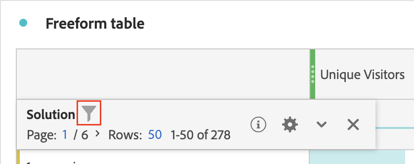
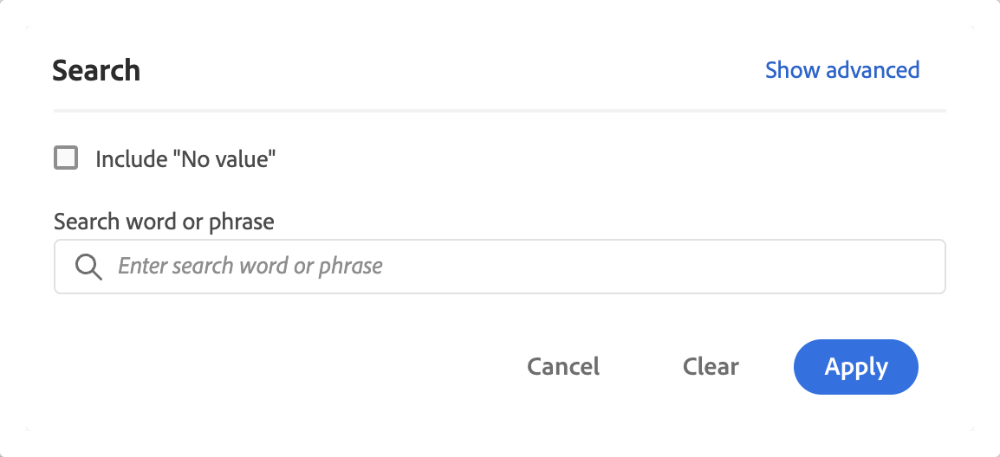
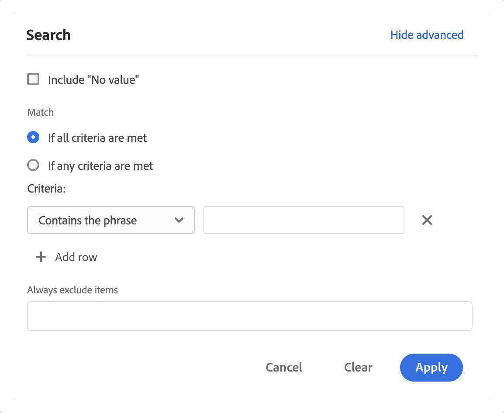
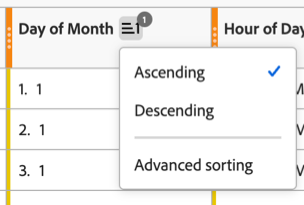
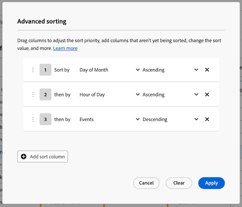
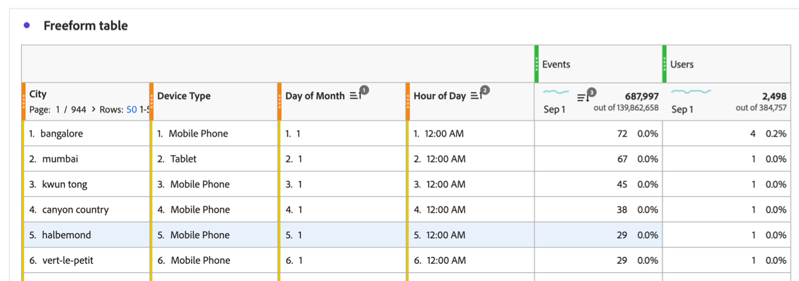

# フリーフォームテーブルのフィルタリングと並べ替え

Analysis Workspace のフリーフォームテーブルは、インタラクティブなデータ分析の基盤となります。そのため、何千行もの情報を含めることができます。データのフィルタリングと並べ替えは、最も重要な情報を効率的に表示するための重要な要素になる可能性があります。

## テーブルのフィルタリング

Analysis Workspace のフィルターは、最も重要な情報を表示するのに役立ちます。

>[!NOTE]
>
> この節で説明するように、フィルタリングできるのは動的ディメンション項目のみです。静的ディメンション項目はフィルタリングできません。詳しくは、[フリーフォームテーブルの動的ディメンション項目と静的ディメンション項目](/help/analysis-workspace/visualizations/freeform-table/column-row-settings/manual-vs-dynamic-rows.md)を参照してください。

フリーフォームテーブルから行をフィルタリングするには、いくつかの方法を使用できます。

* テーブルから特定の行を除外
* テーブルにフィルターを適用
* オーディエンスセグメントの使用

各メソッドが[ フリーフォームテーブル合計](/help/analysis-workspace/visualizations/freeform-table/workspace-totals.md)にどのような影響を与えるかを必ず確認してください。

### テーブルから特定の行を除外

 **[!UICONTROL フィルター]**&#x200B;を使用しなくても、テーブルから特定の行をすばやく除外できます。

>[!NOTE]
>
>この節の説明に従って行を除外する際、[!UICONTROL 詳細]フィルターダイアログに[!UICONTROL 常に項目を除外]ルールが自動的に追加されます。 フィルターアイコン、「[**[!UICONTROL 詳細を表示]**](#apply-a-simple-or-advanced-filter-to-a-table)」の順に選択すると、適用されたルールを表示できます。

フリーフォームテーブルから特定の行を除外するには：

1. 除外する行にポインタを合わせて、 を選択します。

   ***Shift*** キーを押しながら行の範囲を選択するか、***Command*** キー（Mac）または&#x200B;***Ctrl*** キー（Windows）を押しながら複数の行を選択します。

<!--
### Right-click > Delete selected rows

Note: this option does not seem to work. AN-338422

1. Select 1 or more rows. 
1. Right-click and select **[!UICONTROL Delete Selected Rows]**. 

   This action will remove the rows from the table and apply a table filter
 
-->

### 単純または高度なフィルタリングをテーブルに適用する

フリーフォームテーブルのデータをフィルタリングするには：

1. フィルタリング対象のデータを含んだ列の上にポインタを合わせます。<!--only some types of columns show the filter... Which? Just Dimensions?-->

1.  **フィルター**&#x200B;が表示されたら選択します。

   

   **[!UICONTROL 検索]**&#x200B;ダイアログでは、次のオプションを使用できます。

   {width="500"}

   | オプション | 関数 |
   |---------|----------|
   | [!UICONTROL **「値なし」を含める**] | このオプションを選択すると、選択したディメンションに値がないデータに対して、テーブルに&#x200B;**[!UICONTROL 値なし]**&#x200B;の行が表示されます。**[!UICONTROL 値なし]**&#x200B;行を非表示にするには、このオプションの選択を解除します。<!-- Add at multi dim GA: When tables include multiple dimension columns, you can deselect this option to show data only when it applies to each dimension column in the table.--> |
   | [!UICONTROL **検索語句**] | フィルタリングに使用する単語または語句を指定します。 指定した単語または指定したとおりの語句を含んだ行のみが表示されます。 |

1. （オプション）異なる条件または複数の条件でフィルタリングする場合は、「[!UICONTROL **詳細を表示**]」を選択します。

   次の高度なフィルターオプションを使用できます。

   {width=500}

   | オプション | 関数 |
   |---------|----------|
   | [!UICONTROL **「値なし」を含める**] | このオプションを選択すると、選択したディメンションに値がないデータに対して、テーブルに&#x200B;**[!UICONTROL 値なし]**&#x200B;の行が表示されます。このオプションの選択を解除すると、**[!UICONTROL 値なし]**&#x200B;行が非表示になります。 |
   | [!UICONTROL **次に一致**] | 指定したすべての条件を満たすデータのみを表示するには、「[!UICONTROL **すべての条件を満たしている場合**]」を選択します。通常、このオプションを使用すると、データの精度が上がります。  指定したいずれかのフィルター条件を満たすデータを表示するには、「[!UICONTROL **いずれかの条件を満たしている場合**]」を選択します。通常、このオプションを選択すると、データの精度が下がります。 |
   | [!UICONTROL **条件**] | 次のフィルターオプションから選択します。 <ul><li>[!UICONTROL **語句を含む**]（デフォルト）：指定したとおりの語句を含んだデータのみが、フィルタリング結果に含まれます。単語は、「[!UICONTROL **検索語句**]」フィールドで指定した順序になっている必要があります。</li><li>[!UICONTROL **いずれかの用語を含む**]：指定した語句の 1 つ以上の単語を含んだデータのみが、フィルタリング結果に含まれます。 </li><li>[!UICONTROL **すべての用語を含む**]：指定した語句のすべての単語を含んだデータのみが、フィルタリング結果に含まれます。単語は、「[!UICONTROL **検索語句**]」フィールドで指定した順序である必要はありません。</li><li>[!UICONTROL **いずれの用語も含まない**]：指定した語句の単語をまったく含まないデータのみが、フィルタリング結果に含まれます。 </li><li>[!UICONTROL **語句を含まない**]：指定したとおりの語句を含まないデータのみが、フィルタリング結果に含まれます。単語は、「[!UICONTROL **検索語句**]」フィールドで指定した順序になっている必要があります。</li><li>[!UICONTROL **次に等しい**]：指定した語句と完全に一致するデータのみが、フィルタリング結果に含まれます。 </li><li>[!UICONTROL **次に等しくない**]：指定した語句と完全には一致しないデータのみが、フィルタリング結果に含まれます。 </li><li>[!UICONTROL **次で始まる**]：指定した単語または指定したとおりの語句で始まるデータのみが、フィルタリング結果に含まれます。 </li><li>[!UICONTROL **次で終わる**]：指定した単語または指定したとおりの語句で終わるデータのみが、フィルタリング結果に含まれます。 </li></ul>複数のフィルター条件を追加するには、「[!UICONTROL **行を追加**]」を選択します。「[!UICONTROL **次に一致**]」で選択するオプションによって、**[!UICONTROL すべての条件を満たしている場合]**&#x200B;または&#x200B;**[!UICONTROL いずれかの条件を満たしている場合]**&#x200B;が決まります。 |
   | [!UICONTROL **常に項目を除外**] | フィルタリングされたデータから除外する項目の名前を指定します。 |

1. 「**[!UICONTROL 適用]**」を選択して、データをフィルタリングします。すべての入力を消去するには、「**[!UICONTROL 消去]**」を選択します。キャンセルしてダイアログを閉じるには、「**[!UICONTROL キャンセル]**」を選択します。 色付きの  **フィルター**&#x200B;アイコンは、フィルターがテーブルに適用される際の詳細を示し、表示します。

### トレンド データのフィルター条件をスパークラインと線のビジュアライゼーションに含める {#include-filter-criteria}

フリーフォームテーブルに対するテーブルディメンションに適用される検索フィルター条件は、常にスパークラインに含まれます。

スパークラインに加えて、接続されたラインのビジュアライゼーションに含めるフィルター条件を設定できます。 （デフォルトでは、フィルター条件は行のビジュアライゼーションに含まれません。 折れ線グラフは、接続されたテーブルで選択された行のデータを表示します。 行が選択されていない場合は、接続されたテーブルの最初のディメンションのデータのみが表示されます）。

スパークラインと折れ線グラフの視覚化について詳しくは、[ フリーフォームテーブルのトレンド データの表示](/help/analysis-workspace/visualizations/freeform-table/freeform-table-trended-data.md)を参照してください。

#### フィルター条件を含める行のビジュアライゼーションの設定

1. メトリック列ヘッダーでスパークラインを選択します。

   スパークラインセルを選択すると、濃いグレーで表示されます。 これは、フィルター条件が接続された行のビジュアライゼーションに含まれていることを示します。 フィルター条件は、列のセグメントとして適用されます。<!--show how to see it? Show what the segment looks like when it's applied? -->

   

#### 列の合計が不正確になるタイミングを把握する

列の合計は、次のシナリオでは正確ではない場合があります。

* 静的コンポーネントが左側の列で使用され、[列の合計が行の合計として計算される場合](/help/analysis-workspace/visualizations/freeform-table/column-row-settings/table-settings.md)

  このシナリオで行アイテムに重複データが含まれる場合、列の合計は不正確になります。

  例えば、左側の列に静的セグメントを追加し、右側の列に指標としてユーザーを追加した場合、これらのユーザーの一部が複数の静的セグメントに属している可能性があります。 この場合、Workspaceは静的セグメントごとにユーザーを重複排除しません。 一部のユーザーが複数回カウントされる場合があるため、合計ユーザー数が多くなる可能性があります。

* 複数値ディメンションを使用する場合

>[!NOTE]
>
>スパークラインと折れ線グラフは、これらのシナリオの正確な合計を引き続き反映します。

### オーディエンスセグメントの使用

詳しくは、[ セグメント化の概要](/help/components/segments/seg-overview.md)を参照してください。

## テーブルの並べ替え

Analysis Workspaceでは、自由形式テーブルのデータを、ディメンションや指標を問わず、任意の列で並べ替えることができます。 複数の列で同時にソートすることもできます。

デフォルトでは、ディメンションは昇順で並べ替えられ、指標は降順で並べ替えられます。

### 1つの列で表を並べ替える

この節の説明に従って1つの列のデータを並べ替えると、テーブルに適用されている[高度な並べ替え](#sort-tables-by-multiple-columns-advanced-sorting)がすべて削除されます。

テーブル内のデータを1列で並べ替えるには：

1. 並べ替える列のヘッダーにマウスを合わせ、表示されたら&#x200B;**並べ替え** アイコン を選択します。

   

1. **[!UICONTROL 昇順]**&#x200B;または&#x200B;**[!UICONTROL 降順]**&#x200B;を選択します。

   並べ替えが列に適用される場合、並べ替えアイコンは表示されたままになります。 矢印は、データの並べ替え方法を示します（、降順の場合は）。

### 複数の列でテーブルを並べ替える（高度な並べ替え）

#### 複数の列に並べ替えを適用する

テーブル内のデータを複数の列で並べ替えるには：

1. 並べ替える列のヘッダーにマウスを合わせ、表示されたら&#x200B;**並べ替え** アイコン を選択します。

   

1. 「**[!UICONTROL 高度な並べ替え]**」を選択します。

   

1. 詳細な並べ替えダイアログで、次のいずれかの操作を行います。

   * 「**[!UICONTROL 並べ替え列を追加]**」ボタンを選択して、まだ並べ替えられていない列を追加します。

   * **削除** アイコン を選択して、並べ替えたくない列を削除します。

   * リスト内の列を上下にドラッグして、並べ替えの優先順位を調整します。

     詳しくは、[優先順位の並べ替え](#sort-priority)を参照してください。

   * ドロップダウンメニューで「**[!UICONTROL 昇順]**」または「**[!UICONTROL 降順]**」を選択して、並べ替え値を変更します。

   * 列名ドロップダウンメニューを選択して、別の列を選択します。

1. 「**[!UICONTROL 適用]**」を選択します。

並べ替えが列に適用される場合、並べ替えアイコンは表示されたままになります。 矢印は、データの並べ替え方法を示します（、降順の場合は）。

#### 並べ替えの優先順位

複数の列でデータを並べ替える際、各列に割り当てた優先度に従ってデータが並べ替えられます。優先度の番号付けは、並べ替えアイコン ➊の横に表示されます。

プライマリ優先順位付きの列がメインの順序を決定し、セカンダリ優先順位付きの列がプライマリ列とセカンダリ列で同じ値を持つ行の順序を決定します。プライマリ優先順位付きの列がプライマリ列とセカンダリ列で同じ値を持つ行の順序を決定します。

例えば、次の列を持つテーブルを考えてみましょう。

* 月の日（ディメンション）

* 時間単位（ディメンション）

* イベント（指標）

次のように、各列にソートの優先順位を割り当てることができます。

| 列（コンポーネント）名 | コンポーネントの種類 | 並べ替えの優先順位 |
|---------|----------|---------|
| 日付 | ディメンション | 1 |
| 時刻 | ディメンション | 2 |
| イベント | 指標 | 3 |

各列に並べ替え優先順位を割り当てることで、テーブルでのデータの表示方法を正確に制御できます。 この例では、情報は最初に月の日別、次に時間の日別、最後にイベント別に並べ替えられます。

