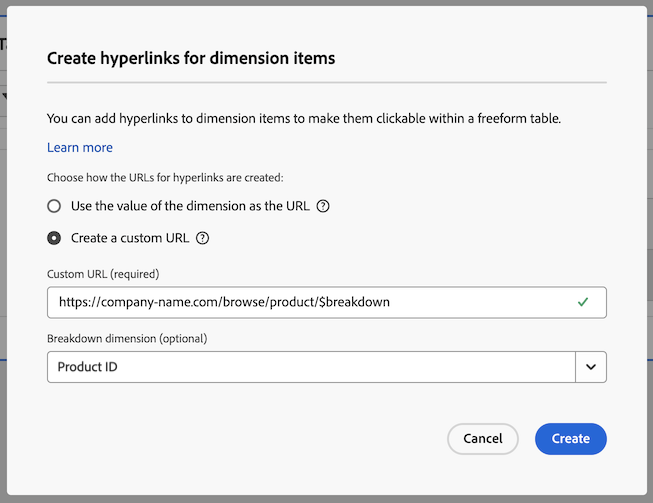

# フリーフォームテーブルでのハイパーリンクの作成

ディメンション項目のハイパーリンクを作成して、Analysis Workspaceのフリーフォームテーブル内でクリックできるようにします。

この機能は、次のタイプのディメンション項目のハイパーリンクを作成する場合に特に便利です。

* URL 値を持つDimension項目（例えば、ページ URL ディメンション）

* URL 値を持つ分類を含むDimension項目（例えば、ページ URL ディメンションの分類を持つページ名ディメンション）

* 値が URL の一部であるDimension項目または分類（URL の一部であるページ名ディメンションなど）

+++ この機能のビデオデモをご覧ください。

>[!VIDEO](https://video.tv.adobe.com/v/3430411/?learn=on)

{{videoaa}}

+++

## ハイパーリンクの作成

1 つ以上のディメンション項目のハイパーリンクを作成する場合は、次の点に注意してください。

* 作成したハイパーリンクは、Analysis Workspace プロジェクト内のフリーフォームテーブルに保存されます。 別のテーブルまたは別のプロジェクトで同じディメンションまたはディメンション項目を使用する場合、ハイパーリンクが保持されません。

* フリーフォームテーブルのデータビューを変更した場合でも、テーブル内のディメンションまたはディメンション項目に対して作成されたハイパーリンクを使用できます。 この機能では、ディメンションがデータビューにまだ存在することを前提としています。

* ハイパーリンクを作成しても、URL の有効性はチェックされません。 また、

   * 無効な URL を含むハイパーリンクを作成する
   * url 値を持たないディメンション項目を参照するハイパーリンクを作成します（ディメンション項目を直接参照するか、`$value` 変数または `$breakdown` 変数を使用する）。

  次に、ハイパーリンクをクリックすると、URL が無効であることを示すエラーメッセージが表示されます。

* 単一のディメンション項目に対して作成されたハイパーリンクは、そのディメンションに対して作成されたハイパーリンクより優先されます。

* [ ダウンロードしたPDFファイル ](/help/analysis-workspace/export/download-send.md) でハイパーリンクが機能しない。

1 つ以上のディメンション項目のハイパーリンクを作成するには：

1. Analysis Workspaceのフリーフォームテーブルで、次のいずれかの操作を行います。

   * **単一のディメンション項目のハイパーリンクを作成：** ハイパーリンクを作成するテーブル内のディメンション項目を右クリックし、「[!UICONTROL **ハイパーリンクを作成**]」を選択します。

      1. ディメンション項目のコンテキストメニューを開きます。
      1. コンテキストメニューから「[!UICONTROL **ハイパーリンクを作成**]」を選択します。

         [!UICONTROL **ハイパーリンクを作成**] ダイアログが表示されます。 ハイパーリンクを作成するディメンション項目の名前がダイアログに表示されます。

         

   * **ディメンション列内のすべてのディメンション項目のハイパーリンクを作成：** ディメンション列ヘッダーのディメンション名を右クリックし、「[!UICONTROL **すべてのディメンション項目のハイパーリンクを作成**]」を選択します。

      1. ディメンション列ヘッダーからコンテキストメニューを開きます。
      1. コンテキストメニューから「[!UICONTROL **すべてのディメンション項目のハイパーリンクを作成**]」を選択します。

         <!-- Do we really need a screenshot  -->

         [!UICONTROL **すべてのディメンション項目のハイパーリンクを作成**] ダイアログが表示されます。 ハイパーリンクを作成するディメンションの名前がダイアログに表示されます。

         

1. 次のオプションから選択します。

   * [!UICONTROL **ディメンション項目の値を URL として使用**]: ページ URL ディメンションなど、URL 値を持つディメンション項目の場合は、このオプションを選択します。

     例えば、各ディメンション項目の値が URL であるページ URL ディメンションを使用している場合、このオプションを選択すると URL へのハイパーリンクが作成されます。

   * [!UICONTROL **カスタム URL の作成**]：静的または動的なカスタム URL を指定します。 URL 値を持たないディメンション項目のハイパーリンクを作成するには、このオプションを選択します。

     例：各ディメンション項目の値がページの名前（完全な URL ではない）であるページ名ディメンションを使用しているとします。 次に、このオプションを選択して、ディメンション項目のリンクとして使用するハイパーリンクを指定します。

     複数のディメンション項目の動的 URL を作成する場合は、カスタム URL 内で `$value` 変数と `$breakdown` 変数を使用できます。 詳しくは、次の表を参照してください。

     カスタム URL を作成するには、次の情報を指定します。

     | フィールド | 説明 |
     |---------|----------|
     | [!UICONTROL **カスタム URL**] | ハイパーリンクに使用するカスタム URL を指定します。 URL は完全修飾 URL として入力する必要があります。 例：<https://www.example.com>
作成するカスタム URL は、静的または動的にすることができます。
 <ul><li>**静的 URL:** 静的 URL は、単一のディメンション項目に対して、またはすべてのディメンション項目に対して、すべての項目を同じ URL にリンクさせる場合に指定できます。 例：`https://wiki.internal.company_name/page_name#item_definition`
</li><li>**動的 URL:** 動的 URL は、複数のディメンション項目に対して、またはディメンション列内のすべてのディメンション項目に対して、一意のハイパーリンクを作成する場合に作成できます。
カスタム URL を動的にするには、URL に変数を含め、ディメンションの値または分類ディメンションの値に基づいて URL を変更します。

変数を使用する場合、URL で無効な文字（スペースなど）を含んだディメンション項目は URL エンコードされます。

次の変数を使用できます。（**メモ**：これらの変数は同じ URL で使用できますが、別々に使用する方が一般的です。）
 <ul><li>**`$value`:** 指定した URL にディメンション項目の値を挿入できます。 
例えば、フリーフォームテーブルのすべてのページ名ディメンション項目にハイパーリンクを作成し、各ディメンション項目の値が web ページの URL の一部であるとします。 その場合、各ディメンション項目に対して動的に調整される単一のカスタム URL を作成できます。  例：`https://company-name.com/browse/product#\$value`

このカスタム URL がページ名ディメンション項目に適用され、その値が「ProductY」および「ProductZ」の場合、生成されたハイパーリンクは次のようになります。 `https://company-name.com/browse/product#ProductY` および  `https://company-name.com/browse/product#ProductZ` 

**ヒント**：カスタム URL フィールドに `$value` 変数のみを追加するのは、URL の作成時に「[!UICONTROL **ディメンション項目の値を使用**]」オプションを選択するのと同じです。
</li><li>**`$breakdown`:** 分類ディメンション項目の値を、指定した URL に挿入できます。 `$breakdown` を使用すると、レポートでわかりやすい名前のディメンション（製品名ディメンションなど）を使用できます。 そして、使いやすさが低下する可能性のある分類ディメンション（製品 ID やページ URL ディメンションなど）に基づいてハイパーリンクを生成します。
分類ディメンションを参照する場合、特定のディメンションアイテムに対して分類アイテムを 1 つだけ持つことが最も一般的です。 特定のディメンション項目に対して複数の分類項目がある場合、最初の分類項目の値が URL で使用されます。 分類項目が一覧表示されない場合、その URL は無効です。 分類項目には、テーブルと同じ並べ替え順が適用されます。

分類ディメンションは、以下の [!UICONTROL **分類ディメンション**] フィールドで指定します。
 
以下の「分類ディメンション [!UICONTROL **フィールドで説明するシナリオ例につ**] て考えてみます。
</li></ul> |
     | [!UICONTROL **分類ディメンション （オプション）**] | 使用する分類ディメンションの名前の入力を開始し、ドロップダウンリストから選択します。 
このフィールドで分類ディメンションを選択する場合は、「[!UICONTROL **カスタム URL**]」フィールドに指定する URL の `$breakdown` 変数を使用して、そのディメンションを参照する必要があります。

フリーフォームテーブル内のすべての製品名ディメンション項目にハイパーリンクを作成するとします。 各製品名ディメンション項目には、製品 ID ディメンションの分類が含まれます。

この場合、「製品 ID の分類」ディメンションの値を使用して、製品ページにユーザーを誘導するハイパーリンクを各製品名ディメンションに作成できます。 

[!UICONTROL **カスタム URL**] フィールドに指定するカスタム URL の末尾に `$breakdown` 変数を追加します。 次に例を示します。

`https://company-name.com/browse/product/$breakdown`
このカスタム URL が製品名ディメンション項目（値が「ProductY」と「ProductZ」の分類ディメンション項目を持つ）に適用されると、生成されたハイパーリンクは  `https://company-name.com/browse/product/ProductY` および  `https://company-name.com/browse/product/ProductZ` のようになります。

次に、「分類ディメンション [!UICONTROL **フィールドで製品 ID ディメンション**] を選択します 

 |

1. 「[!UICONTROL **作成**]」を選択します。

   フリーフォームテーブルを表示するユーザーには、ハイパーリンクされたディメンション項目が表示されます。 ディメンション項目をクリックすると、ハイパーリンクされたページが別のブラウザータブに表示されます。

   <!-- add screenshot of a table with hyperlinks.-->

1. [ プロジェクトを保存 ](/help/analysis-workspace/build-workspace-project/save-projects.md) して、変更を保存します。

## ハイパーリンクの編集

フリーフォームテーブルのディメンションまたはディメンション項目に対して作成されたハイパーリンクを編集できます。

1. Analysis Workspaceのフリーフォームテーブルで、次のいずれかの操作を行います。

   * **単一のディメンション項目のハイパーリンクを編集：**

      1. ディメンション項目のコンテキストメニューを開きます。
      1. コンテキストメニューから [!UICONTROL **ハイパーリンクを編集**] を選択します。

     <!-- Do we really need a screenshot? -->

   * **ディメンション列内のすべてのディメンション項目のハイパーリンクを編集：**

      1. ディメンション列ヘッダーからコンテキストメニューを開きます。
      1. コンテキストメニューから「**[!UICONTROL すべてのディメンション項目のハイパーリンクを編集]**」を選択します。

     <!-- Do we really need a screenshot? -->

1. 右クリックメニューから [!UICONTROL **すべてのディメンション項目のハイパーリンクを編集**] を選択します。

   [!UICONTROL **ディメンション項目のハイパーリンクを編集**] ダイアログが表示されます。

1. ハイパーリンクを編集するための構成オプションについては、上記の「[1 つ以上のディメンション項目のハイパーリンクを作成する ](#create-hyperlinks-for-one-or-more-dimension-items)」セクションの手順 3 を参照し、更新が完了したら「[!UICONTROL **適用**]」を選択します。

1. [ プロジェクトを保存 ](/help/analysis-workspace/build-workspace-project/save-projects.md) して、変更を保存します。

## ハイパーリンクの削除

フリーフォームテーブルのディメンション項目に対して作成したハイパーリンクを削除できます。

>[!NOTE]
>
>フリーフォームテーブルで、ハイパーリンクを含むディメンションを削除した場合、同じディメンションをフリーフォームテーブルに再度追加しても、ハイパーリンクが保持されません。

ディメンション項目からハイパーリンクを削除するには：

1. Analysis Workspaceのフリーフォームテーブルで、次のいずれかの操作を行います。

   * **単一のディメンション項目からハイパーリンクを削除：**

      1. ディメンション項目のコンテキストメニューを開きます。
      1. コンテキストメニューから「[!UICONTROL **ハイパーリンクを削除**]」を選択します。
         <!-- Do we really need a screenshot? -->

   * **ディメンション列のすべてのディメンション項目からハイパーリンクを削除：**

      1. ディメンション列ヘッダーからコンテキストメニューを開きます。
      1. コンテキストメニューから「**[!UICONTROL すべてのディメンション項目のハイパーリンクを削除]**」を選択します。

     <!-- Do we really need a screenshot? [Remove hyperlink from a dimension](assets/hyperlink-dimension-remove.png)-->

   単一のディメンション項目を選択した場合、ハイパーリンクは単一のディメンション項目から削除されます。 または、ディメンション列ヘッダーでディメンション名を選択した場合は、すべてのディメンション項目から。

1. [ プロジェクトを保存 ](/help/analysis-workspace/build-workspace-project/save-projects.md) して、変更を保存します。
