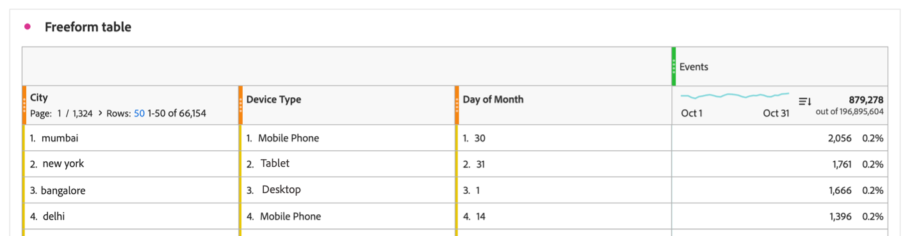
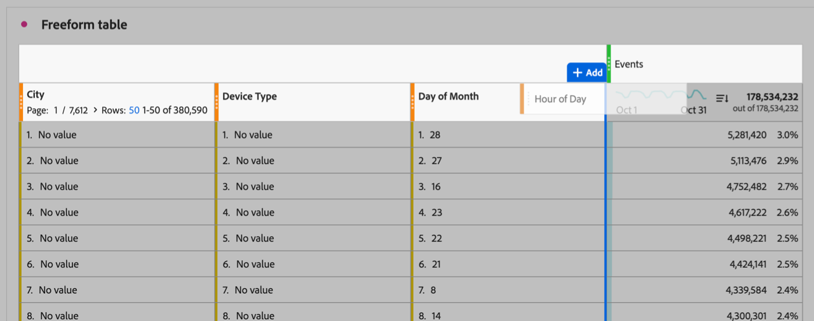
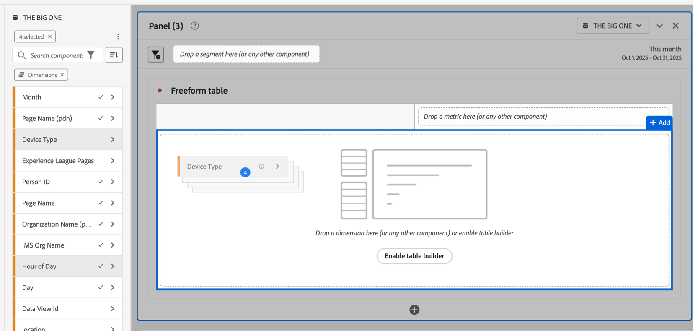
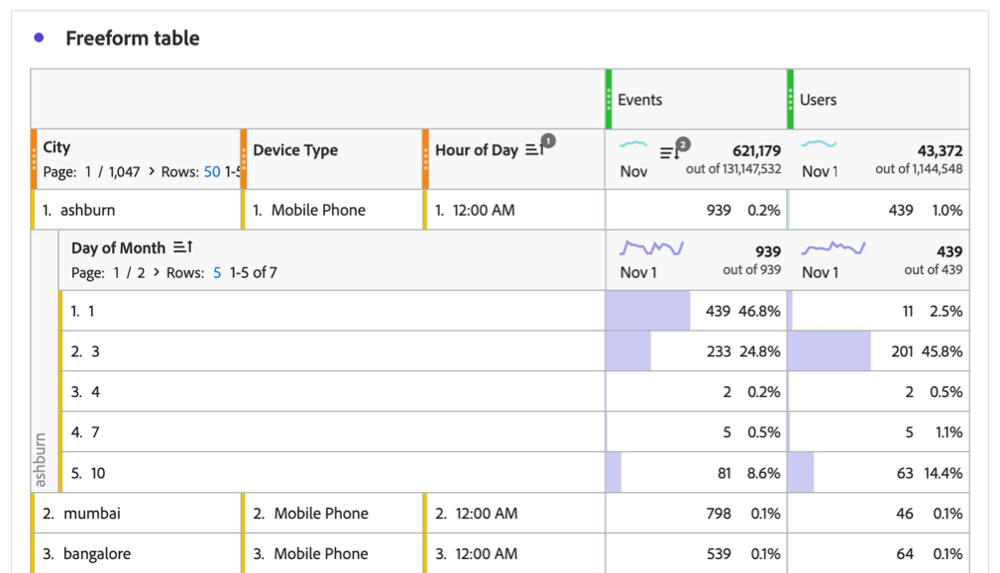

# フリーフォームテーブルに複数のディメンション列を含める

フリーフォームテーブルには最大5つのディメンション列を含めることができるため、複数のディメンション項目を並べて表示できます。 ディメンション項目の各行は、連結された単一のディメンション項目のように動作します。

複数のディメンション列を持つフリーフォームテーブルにフィルター、並べ替え、分類などを適用して、より詳細で詳細なカスタム分析を作成できます。

## 連結ディメンション項目

[複数のディメンション列をフリーフォームテーブル ](#add-multiple-dimension-columns)に追加すると、ディメンション項目の各行は、連結された単一のディメンション項目のように動作します。 この機能を使用すると、ディメンションの特定の組み合わせの指標データを表示できます。

例えば、ディメンション列が&#x200B;_City_、_Device Type_、_Day of Month_、指標が&#x200B;_Events_&#x200B;のフリーフォームテーブルがあるとします。 この表の最初の行の3つのディメンション項目は、月の30日に携帯電話から2,056件のイベントがムンバイで発生したことを示す1つの連結ディメンション項目になります。

| Dimension：市 | Dimension：デバイスタイプ | Dimension：月の日 | 指標：イベント |
|---------|----------|---------|---------|
| ムンバイ | 携帯電話 | 30 | 2,056 |
| ニューヨーク | タブレット | 31 | 1,761 |
| バンガロール | デスクトップ | 1 | 1,666 |
| デリー | 携帯電話 | 14 | 1,396 |

次の表は、Analysis Workspaceでの表示方法です。

## 複数のディメンション列を追加

複数のディメンション列を1つずつ、または一括で追加できます。

1. Analysis Workspaceで、フリーフォームテーブルを作成します。

   詳しくは、[ ビジュアライゼーションの概要](/help/analysis-workspace/visualizations/freeform-analysis-visualizations.md)の「[ パネルにビジュアライゼーションを追加](/help/analysis-workspace/visualizations/freeform-analysis-visualizations.md#add-visualizations-to-a-panel)」を参照してください。

1. フリーフォームテーブルにディメンションを追加します。 ディメンションは1つずつ追加することも、複数のディメンションを一度に追加することもできます。

   * 寸法を1つずつフリーフォームテーブルにドラッグします。 テーブル内の既存のディメンション列の左または右に追加のディメンション列を配置します。 新しい列が作成される場所に、青い縦の&#x200B;**[!UICONTROL 追加]**&#x200B;行が表示されます。

     

   * コンポーネントメニューで最大5つの寸法を選択し、フリーフォームテーブルにドラッグします。 ディメンションは、選択した順序で左から右に表に追加されます。

     複数のディメンションを選択するには、***Command*** キー（Mac）または&#x200B;***Ctrl*** キー（Windows）を押します。

     

1. テーブルの各行を1つのディメンション項目として表示します。 詳しくは、[連結ディメンション項目](#concatenated-dimension-items)を参照してください。

## テーブルのフィルタリングと並べ替え

フリーフォームテーブルの列にフィルタリングと並べ替えを適用できます。 自由形式テーブルのデータは、ディメンションでも指標でも、任意の列で並べ替えることができます。 複数の列で同時にソートすることもできます。

詳しくは、[自由形式テーブルのフィルタリングと並べ替えを参照してください](/help/analysis-workspace/visualizations/freeform-table/filter-and-sort.md)。

## 複数のディメンション列と分類

Analysis Workspaceでは、フリーフォームテーブル内に複数のディメンションを追加する次の方法を用意しています。

* 複数のディメンション列を含める（この記事で説明します）

* [分類を追加](/help/components/dimensions/t-breakdown-fa.md)

これらの方法はどちらも、他の次元に対して次元を分析できます。 しかし、重要な違いがあり、両方の方法を同じテーブルで使用して、さらに深い分析を行うことができます。

### ディメンション列と分類の違い

複数のディメンション列を使用すると、次のことが可能になります。

* ディメンション項目を、複数のディメンションをまたいで個別のデータ行に連結できます。

* ディメンション項目がテーブルの各ディメンション列に適用される場合にのみ、ディメンション項目を連結された行に含めます。 これを実現するには、列フィルターを使用して、各ディメンション列の&#x200B;**[!UICONTROL 値を含まない]**&#x200B;設定の選択を解除します。

  詳細については、[複数の列によるテーブルの並べ替え（高度な並べ替え） ](#sort-tables-by-multiple-columns-advanced-sorting)を参照してください。

* 複数のディメンションと指標の列でデータを並べ替えて、よりカスタマイズされたデータを表示できます。

  詳細については、[複数の列によるテーブルの並べ替え（高度な並べ替え）を参照してください](#sort-tables-by-multiple-columns-advanced-sorting)

分類により、次のことが可能になります。

* フリーフォームテーブルのディメンション項目をセカンダリディメンションで分割します。 2番目のディメンションには、最大400個のディメンション項目を表示できます。

### 複数のディメンション列を持つテーブルに分類を追加する

複数のディメンション列を持つテーブルに分類を追加すると、分類は、追加する行の（すべてのディメンション列にわたって）連結されたディメンション項目に適用されます。

さらに、ブレークダウン内に複数のディメンション列を追加できます。 ディメンションの各行のディメンション項目は、連結された単一のディメンション項目のように動作します。

<!-- Add a screenshot of a breakdown with multiple cllumns, then add this sentence: "For example, you can break down the first dimension item in this table by a new concatenated dimension item that shows..." -->

分類の追加方法について詳しくは、[ ディメンションの分類](/help/components/dimensions/t-breakdown-fa.md)を参照してください。

## 複数のディメンション列にまたがるディメンション項目に基づいてセグメントを作成します

複数のディメンション列にまたがるディメンション項目に基づいてセグメントを作成する場合、各ディメンション項目はセグメント定義に含まれ、And演算子が結合されます。

セグメントの作成について詳しくは、[ セグメントの作成](/help/components/segments/seg-create.md)を参照してください。

## サポートされていない寸法と機能 {#unsupported}

次のディメンションの組み合わせと機能は、複数のディメンション列を使用する場合はサポートされません。Analysis Workspaceでは、これらの使用が禁止されるか、エラーメッセージが表示されます。

* 同じフリーフォームテーブルで一緒に使用される、異なる[ オブジェクトの配列](/help/use-cases/object-arrays.md)を参照するフィールドからの複数のディメンション。

  複数のディメンションが同じオブジェクト配列を参照する場合、同じフリーフォームテーブル内で同時に使用できます。

* [静的ディメンション項目](/help/analysis-workspace/visualizations/freeform-table/column-row-settings/manual-vs-dynamic-rows.md#static-dimension-items)。
