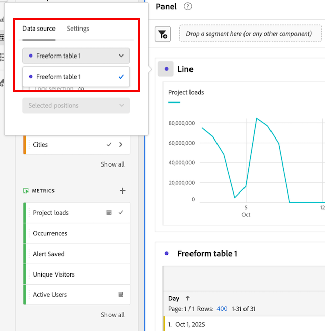

# フリーフォームテーブルのトレンドデータの表示

フリーフォームテーブルに含まれるデータの傾向を表示できます。 このトレンドデータは、Analysis Workspaceの次の領域に表示されます。

* [スパークライン](#use-sparklines-to-view-trended-data)

* [折れ線グラフ](#use-line-visualizations-to-view-trended-data)

## トレンド データを表示するには、スパークラインを使用します

スパークラインは、フリーフォームテーブルの指標列ヘッダーに表示されます。

フリーフォームテーブルの

スパークラインには、次のものが含まれます。

* 列内のすべてのデータの傾向データ

* 表ディメンションに適用された検索フィルター条件

  詳しくは、[&#x200B; フィルターと並べ替え](/help/analysis-workspace/visualizations/freeform-table/filter-and-sort.md)を参照してください。

## トレンドデータを表示するために行のビジュアライゼーションを使用する

[行](/help/analysis-workspace/visualizations/line.md)のビジュアライゼーションには、接続されているフリーフォームテーブルのデータが表示されます。

### 折れ線グラフのビジュアライゼーションをフリーフォームテーブルに接続

行のビジュアライゼーションがプロジェクトに追加された方法とタイミングによっては、目的のフリーフォームテーブルに既に接続されている場合があります。 次の手順を使用して、確認するか手動で接続します。

1. Analysis Workspace プロジェクトに線のビジュアライゼーションを追加します。

1. ビジュアライゼーション名の横にあるドットを選択し、「**[!UICONTROL データソース]**」タブを選択してから、折れ線ビジュアライゼーションに接続するフリーフォームテーブルの名前を選択します。

   フリーフォームテーブルに接続された

### 行の可視化に含まれるデータを選択します

フリーフォームテーブルで選択されているセルによって、接続された行のビジュアライゼーションに含まれるデータが異なります。

フリーフォームテーブル内のすべてのデータの傾向を表示するには、フリーフォームテーブル内のスパークラインセルを選択します。

スパークラインセルを選択すると、セルが濃いグレーで表示されます。

接続されたテーブルのスパークライン セルを選択すると、次の行が視覚化されます。

* 列内のすべてのデータの傾向データ

* 表ディメンションに適用された検索フィルター条件

  詳しくは、[&#x200B; フィルターと並べ替え](/help/analysis-workspace/visualizations/freeform-table/filter-and-sort.md)を参照してください。

接続されたテーブルのスパークラインが選択されていない場合、行のビジュアライゼーションには次のものが含まれます。

* 接続されたテーブルで選択されている行のデータ。 行が選択されていない場合は、接続されたテーブルの最初のディメンションのデータのみが表示されます。

* テーブル ディメンションに適用された検索フィルター条件は無視されます

  詳しくは、[&#x200B; フィルターと並べ替え](/help/analysis-workspace/visualizations/freeform-table/filter-and-sort.md)を参照してください。

## 連結行のビジュアライゼーションにフィルター条件を含める

フィルター条件が接続された行のビジュアライゼーションに含まれる場合について詳しくは、[散光線と行のビジュアライゼーションのトレンド データにフィルター条件を含める](/help/analysis-workspace/visualizations/freeform-table/filter-and-sort.md#include-filter-criteria-in-trended-data-in-sparklines-and-line-visualizations)を参照してください
