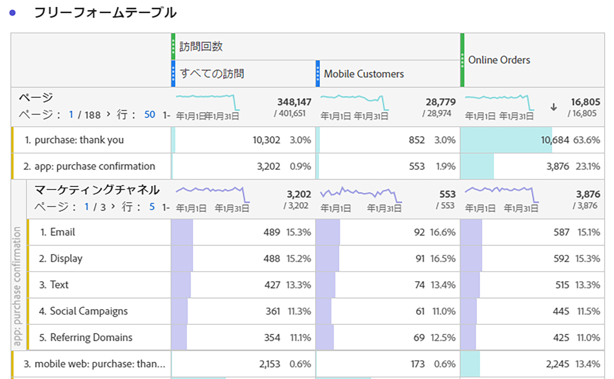
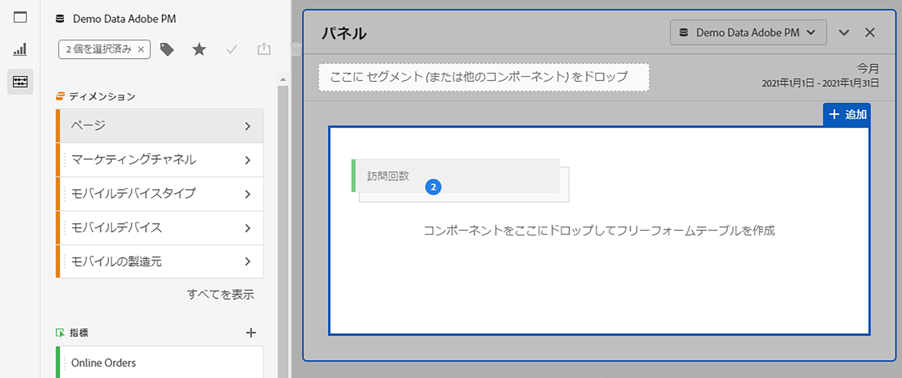
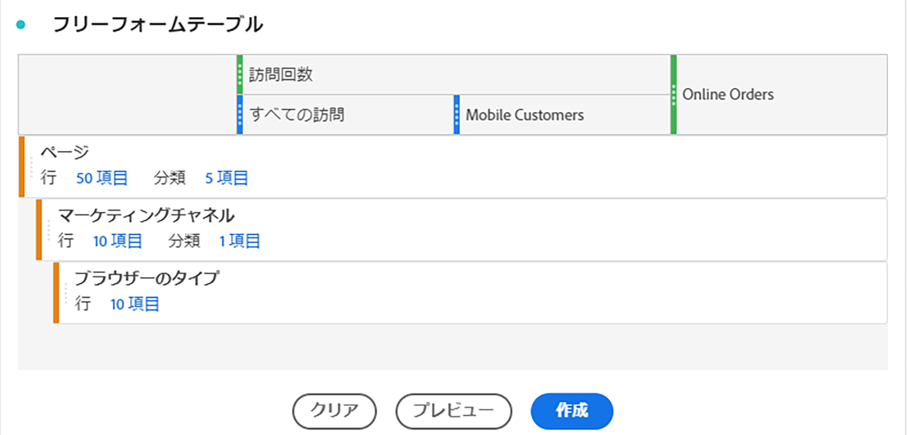
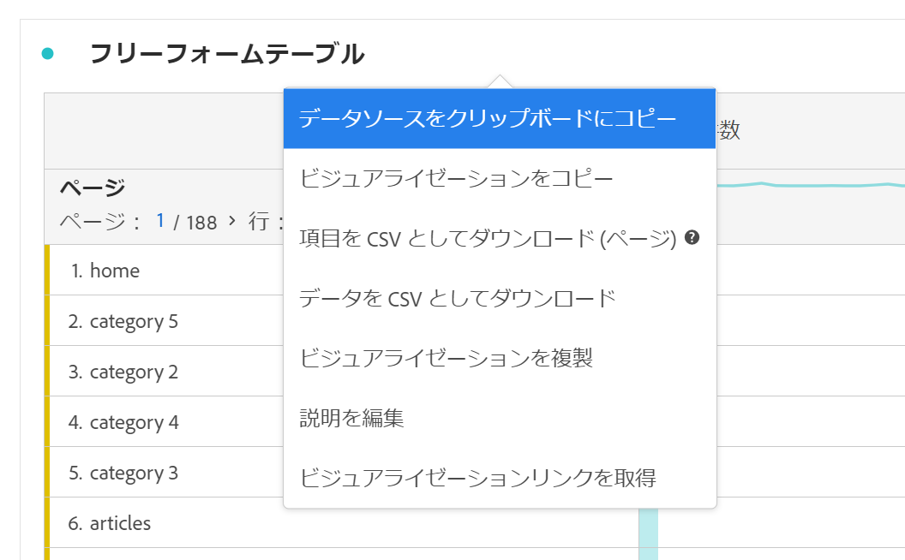

# フリーフォームテーブル

Analysis Workspaceでは、フリーフォームテーブルはインタラクティブなデータ分析の基盤となっています。 [コンポーネント](https://docs.adobe.com/content/help/ja-JP/analytics/analyze/analysis-workspace/components/analysis-workspace-components.html)の組み合わせを行と列にドラッグ&amp;ドロップして、分析のカスタムテーブルを作成できます。 各コンポーネントが削除されると、テーブルは直ちに更新されるので、分析や掘り下げを迅速に行うことができます。

## 自動化されたテーブル

テーブルを最もすばやく作成するには、空のプロジェクト、パネルまたはフリーフォームテーブルにコンポーネントを直接ドロップします。 推奨の形式で自動的にフリーフォームテーブルが作成されます。 [チュートリアルを見る](https://experienceleague.adobe.com/docs/analytics-learn/tutorials/analysis-workspace/building-freeform-tables/auto-build-freeform-tables-in-analysis-workspace.html)。

## フリーフォームテーブルビルダー

最初に複数のコンポーネントをテーブルに追加し、次にデータをレンダリングすると、フリーフォームテーブルビルダーを有効にできます。ビルダーを有効にすれば、多くのディメンション、分類、指標およびセグメントをドラッグ＆ドロップして、より複雑な質問に回答するテーブルを作成できます。データはその場では更新されず、「**[!UICONTROL ビルド]**」をクリックすると更新されます。

## テーブルの操作

フリーフォームテーブルは、様々な方法で操作およびカスタマイズできます。

* **行**
   * プロジェクトの[表示密度](https://docs.adobe.com/content/help/ja-JP/analytics/analyze/analysis-workspace/build-workspace-project/view-density.html)を調整すると、1 つの画面に表示する行を増やすことができます。
   * 各ディメンション行は、ページネーションの前に最大 400 行を表示できます。「行」の横の数字をクリックして、ページにさらに行を表示します。 ヘッダーのページ矢印を使用して、別のページに移動します。
   * 行は、追加のコンポーネントで分類できます。複数の行を一度に分類するには、複数の行を選択し、次のコンポーネントを選択した行の上にドラッグします。[分類](https://docs.adobe.com/content/help/ja-JP/analytics/analyze/analysis-workspace/components/dimensions/t-breakdown-fa.html)について説明します。
   * 行を[フィルタリング](https://experienceleague.adobe.com/docs/analytics/analyze/analysis-workspace/visualizations/freeform-table/pagination-filtering-sorting.html?lang=ja-JP)して、表示する項目数を減らすここができます。[行設定](https://docs.adobe.com/content/help/en/analytics/analyze/analysis-workspace/visualizations/freeform-table/column-row-settings/table-settings.html)で追加の設定を使用できます。

* **列**
   * 列内にコンポーネントを積み重ねて、セグメント化された指標やクロスタブ分析などを作成できます。
   * 各列の表示は、[列設定](https://docs.adobe.com/content/help/ja-JP/analytics/analyze/analysis-workspace/build-workspace-project/column-row-settings/column-settings.html)で調整できます。
   * [右クリックメニュー](https://docs.adobe.com/content/help/en/analytics-learn/tutorials/analysis-workspace/building-freeform-tables/using-the-right-click-menu.html)からは、いくつかの操作を実行できます。テーブルのヘッダー、行または列をクリックしたかどうかに応じて、このメニューに表示されるアクションが変わります。

## フリーフォームテーブルデータの書き出し

Analysis Workspaceのすべてのデータ[エクスポートオプション](https://experienceleague.adobe.com/docs/analytics/analyze/analysis-workspace/curate-share/download-send.html)の詳細を表示します。

* 右クリック/**[!UICONTROL データをクリップボードにコピー]**：表示されたテーブルデータをエクスポートします。 テーブルを選択した場合、このオプションは&#x200B;**[!UICONTROL Copy selection to clipboard]**&#x200B;と表示します。 **Ctrl+C**&#x200B;ホットキーは、選択したデータもコピーします。
* 右クリック/**[!UICONTROL データをCSVとしてダウンロード]**：表示された表データをCSVとしてダウンロードします。 テーブルを選択した場合、このオプションでは「**[!UICONTROL Download selection as CSV]**」と表示されます。
* 右クリック/**[!UICONTROL プロジェクト/項目をCSVとしてダウンロード]**&#x200B;でエクスポートできます。選択したディメンションは、最大50,000個のディメンション項目をエクスポートできます。

Analysis Workspaceのすべてのデータ[エクスポートオプション](https://experienceleague.adobe.com/docs/analytics/analyze/analysis-workspace/curate-share/download-send.html)の詳細を表示します。

