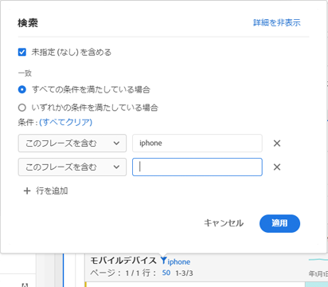
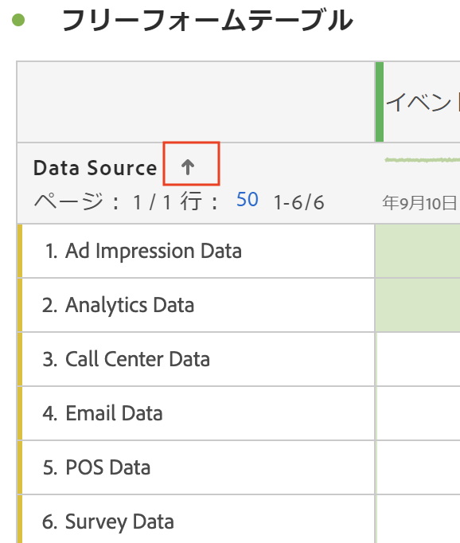

# テーブルのページネーション、フィルタリングおよび並べ替え

>[!NOTE]
>
>Customer Journey Analytics 内の Analysis Workspace に関するドキュメントを表示しています。この機能セットは、[従来の Adobe Analytics の Analysis Workspace](https://experienceleague.adobe.com/docs/analytics/analyze/analysis-workspace/home.html?lang=ja) とは少し異なります。[詳細情報...](/help/getting-started/cja-aa.md)

Analysis Workspace のテーブルのページネーション、フィルタリング、並べ替えの概要については、次のビデオチュートリアルを参照してください。

>[!VIDEO](https://video.tv.adobe.com/v/23968)

## アドバンスフィルターオプション {#section_36E92E31442B4EBCB052073590C1F025}

フリーフォームテーブルのディメンションの隣にあるフィルターアイコンをクリックし、「**[!UICONTROL 詳細を表示]**」をクリックすると、次の条件を使用してフィルタリングできます。複数のフィルタールールを適用できます。

* 次を含む
* 含まない
* すべての語句を含む
* いずれかの語句を含む
* フレーズを含む
* いずれの語句も含まない
* このフレーズを含まない
* 次と等しい
* 次と等しくない
* 次の語句で始まる
* 次の語句で終わる

## フリーフォームテーブルでのディメンションの並べ替え

>[!NOTE]
>
>ディメンションの並べ替えは、Customer Journey Analytics のフリーフォームテーブルにのみ適用され、従来の Adobe Analytics には適用されません。 指標の並べ替えは、Analytics の両方のバージョンで実行できます。

1. プロジェクト内の任意のフリーフォームテーブルで、ディメンション名の横にある矢印をクリックします。

* 下向き矢印は降順、上向き矢印（デフォルト）は昇順で並べ替えられます。
* ディメンションは、アルファベット順または数字順に並べ替えることができます。 例えば、ワークフローに番号付きの手順があり、その手順番号で並べ替えたい場合があります。 日付関連のディメンションを日付順に並べ替えることができます。 または、上のスクリーンショットのように、データソースをアルファベット順に並べ替えることもできます。
