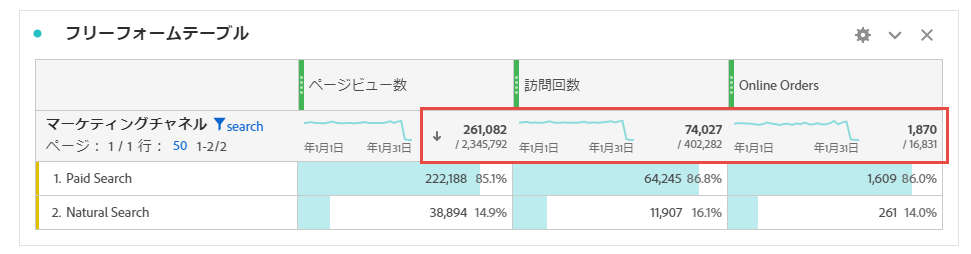

# Workspace の合計 {#workspace-totals}

<!-- markdownlint-disable MD034 -->

>[!CONTEXTUALHELP]
>id="cja_workspace_freeformtable_grandtotal"
>title="総計"
>abstract="静的な行を含むテーブルや分類では、総計はサポートされません。"

<!-- markdownlint-enable MD034 -->

フリーフォームテーブルでは、合計行が各分類レベルに表示され、2 つの合計を示すことができます。

* **[!UICONTROL テーブル合計]** ➊ – この合計は、通常、[!UICONTROL  総計 ] と等しいか、またはそのサブセットです。 この合計には、「なし [!UICONTROL  オプションを含む、フリーフォームテーブル内で適用されたすべてのテーブルフィルターが反映さ ] ます。
* **[!UICONTROL 総計]** （**[!UICONTROL 範囲外]** *数値*）➋ – この合計は、収集されたすべてのイベントを表します。 フィルターがパネルレベルまたはフリーフォームテーブル内で適用されると、この合計は、フィルター条件に一致するすべてのイベントを反映するように調整されます。

## 合計を表示

**[!UICONTROL 列設定]** には、**[!UICONTROL 合計を表示]** および **[!UICONTROL 総計を表示]** するオプションがあります。 これらの設定をオフにすると、合計がテーブルから削除されますが、合計が意味を持たない場合に望ましい場合があります。 例えば、特定の [ 計算指標のシナリオ ](https://experienceleague.adobe.com/en/docs/analytics/components/calculated-metrics/calcmetrics-reference/cm-totals) では次のようになります。

[ 静的行 ](/help/analysis-workspace/visualizations/freeform-table/column-row-settings/manual-vs-dynamic-rows.md) 合計の動作は異なり、 **[!UICONTROL 行設定]** を使用して制御されます。

| オプション | 説明 |
|---|---|
| **[!UICONTROL 現在の行の合計を合計として表示]** | クライアント側のテーブルの行の合計を表示します。 この合計によって **セッションやユーザーなどの指標の重複が排除される** ことはありません）。 |
| **[!UICONTROL 総計を表示]** | サーバーサイドの合計値を表示します。 この合計によって、セッションやユーザーなどの重複除外指標が合計されます。 |

[ フリーフォームテーブルの動的ディメンション項目と静的ディメンション項目 ](column-row-settings/manual-vs-dynamic-rows.md) を参照してください。

## よくある質問

| 質問 | 回答 |
|---|---|
| グレーの列のパーセンテージは、どの *合計* に基づいていますか？ | この *合計* は、**[!UICONTROL 行設定]** の **[!UICONTROL 割合]** 設定の選択によって異なります。<ul><li>列別に割合を計算 – この設定がデフォルトです。 割合は、テーブルの合計に基づきます。</li><li>行ごとにパーセンテージを計算する – パーセンテージは、総計に基づいています。</li></ul> |
| 「値を含まない **[!UICONTROL 設定の影響の合計はどのよう]** なりますか？ | 「**[!UICONTROL 値を含めない]**」設定がオフの場合、**[!UICONTROL 値なし]** 行はテーブル、テーブルの合計から削除され、[*合計* 指標タイプを使用する計算指標に繰り返され ](https://experienceleague.adobe.com/en/docs/analytics/components/calculated-metrics/calcmetric-workflow/m-metric-type-alloc) す。 |
| フリーフォームテーブルにカスタムテーブルフィルターを適用する場合、そのフィルターに対してすべての計算指標と条件付き書式設定を利用できますか。 | 現在は利用できません。**[!UICONTROL 「値なし」を含める]** は考慮されますが、カスタムテーブルフィルターは次の項目には影響しません。<ul><li>条件付き書式で使用される列の最大/最小範囲は、すべてのデータで見られます。</li><li>**[!UICONTROL 総計]** 指標タイプを活用する計算指標。</li><li>フリーフォームテーブルの行をまたいで計算する関数を含む計算指標：列合計、列の最大、列の最小、数、平均、中央値、パーセンタイル、四分位数、行数、標準偏差、平方偏差、累積、累積平均、回帰バリアント、T スコア、T テスト、Z スコアおよび Z テスト。</li></ul> |
| 計算指標の **[!UICONTROL 総計]** 指標タイプには何が反映されますか？ | **[!UICONTROL 総計]** は引き続き **[!UICONTROL 総計]** を参照し、テーブルまたは **[!UICONTROL テーブル合計]** に適用されたフィルターを反映しません。 |
| フリーフォームテーブルからデータをコピーして貼り付けるか、CSV でデータをダウンロードすると、合計はどのように表示されますか。 | 集計行には、**[!UICONTROL テーブルの合計]** のみが反映され、列 **[!UICONTROL 合計を表示]** の設定に従います。 |
