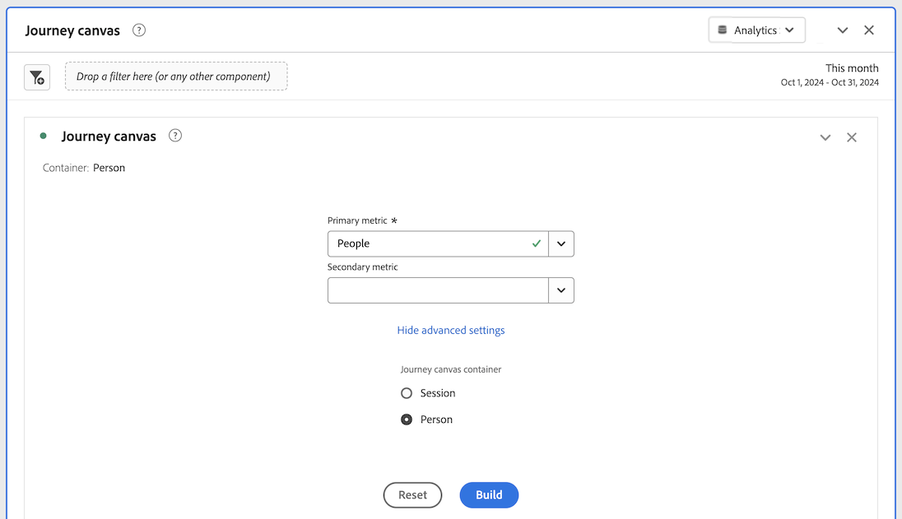

# ジャーニーキャンバスビジュアライゼーションの設定

ジャーニーキャンバスのビジュアライゼーションを使用すると、ユーザーや顧客に提供するジャーニーを分析し、深いインサイトを得ることができます。

## ジャーニーキャンバスの概要

ジャーニーキャンバスについて詳しくは ](/help/analysis-workspace/visualizations/journey-canvas/journey-canvas.md)[ジャーニーキャンバスの概要を参照してください。

* 主な特長

* 潜在的なインサイト

* ジャーニーキャンバスとフォールアウトの違い

* Journey Optimizer ジャーニー分析の詳細

* さらに件

## ジャーニーキャンバスビジュアライゼーションの作成を開始

1. プロジェクトに空のパネルを追加し、左側のパネルで「[!UICONTROL **ビジュアライゼーション**]」アイコンを選択して、「 [!UICONTROL **ジャーニーキャンバス**] ビジュアライゼーションをパネルにドラッグします。

   または

   「[ ビジュアライゼーションの概要 ](/help/analysis-workspace/visualizations/freeform-analysis-visualizations.md) の [ パネルへのビジュアライゼーションの追加 ](/help/analysis-workspace/visualizations/freeform-analysis-visualizations.md#add-visualizations-to-a-panel) の節で説明されている任意の方法で、ジャーニーのキャンバスビジュアライゼーションを追加します。

   

1. ジャーニーキャンバスを設定するための基本的な情報を以下に示します。

   | フィールド | 関数 |
   |---------|----------|
   | [!UICONTROL **プライマリ指標**] | ジャーニーの各ノードの割合と数値を計算する際に使用する指標を決定します。
**メモ**：各パーセンテージと数値に含まれるデータの範囲は、「**[!UICONTROL ジャーニーキャンバスコンテナ]**」フィールドで選択した指標によって決定されます。 例えば、**[!UICONTROL ユーザー]** がコンテナとして設定されている場合、ジャーニーに表示される統計は特定のユーザーに対して複数のセッションにまたがります。 **[!UICONTROL セッション]** がコンテナとして設定されている場合、ジャーニーに表示される統計は、特定のユーザーに対して定義された単一のセッションに制限されます。

プライマリ指標が各ノードのパーセンテージと数値に与える影響について、次の例で考えてみます。
<ul><li>_人物_ が主な指標で、_人物_ がコンテナの場合、ジャーニーの後続の各ノードの条件に一致するイベントを持つユーザーのみがジャーニーに移動します。 フォールアウトは、あるユーザーがジャーニーの直近の次のノードのいずれにも到達しなかった場合にノードで発生します。 サイト上で他のアクションを実行した可能性がありますが、その直後のノードで定義された条件を満たしていません。</li><li>_人物_ が主な指標で、_セッション_ がコンテナである場合、1 つのセッション内にジャーニーの各ノードの条件に一致するイベントを持つ人物のみがジャーニーを通じて移動します。 フォールアウトは、あるユーザーが 1 つのセッション内にジャーニーの直近の次のノードのいずれにも到達しなかった場合にノードで発生します。 セッション内でサイトに対して他のアクションを実行したが、その直後のノードで定義された条件を満たしていない可能性があります。</li></ul> 
主要指標は、ジャーニーキャンバスビジュアライゼーションの次の側面に影響します。
<ul><li>各ノードに表示される合計数。  
例えば、イベントが主な指標の場合、各ノードは、そのノード（およびジャーニーでそのノードに至る前のノード）の条件に一致するイベントを持ったユーザーの数を表示します。
</li><li>各ノードに表示されるパーセンテージ。 （ビジュアライゼーションが作成されたら、**[!UICONTROL パーセンテージ値]** ドロップダウンメニューを使用して、合計のパーセンテージ、前のノードのパーセンテージ、開始ノードのパーセンテージのいずれかを選択して表示できます）。
例えば、イベントが主な指標の場合、各ノードは、そのノード（およびジャーニーでそのノードに至る前のノード）の条件に一致するイベントを持つユーザーの割合を示します。
</li><li>ディメンションがビジュアライゼーションに追加されると、プライマリ指標に基づいて、ビジュアライゼーションの上位 3 ノードが追加されます。</li></ul> |
   | [!UICONTROL **セカンダリ指標**] | ジャーニーの各ノードの割合と数値を計算する際に使用するセカンダリ指標を決定します。 セカンダリ指標はオプションです。 
**メモ**：各パーセンテージと数値に含まれるデータの範囲は、「**[!UICONTROL ジャーニーキャンバスコンテナ]**」フィールドで選択した指標によって決定されます。 例えば、**[!UICONTROL ユーザー]** がコンテナとして設定されている場合、ジャーニーに表示される統計は特定のユーザーに対して複数のセッションにまたがります。 **[!UICONTROL セッション]** がコンテナとして設定されている場合、ジャーニーに表示される統計は、特定のユーザーに対して定義された単一のセッションに制限されます。

セカンダリ指標が設定されると、ジャーニーキャンバスビジュアライゼーションの次の側面に影響します。
<ul><li>プライマリ指標の下の各ノードに表示される合計数。 
例えば、アカウントがセカンダリ指標の場合、アカウント数は、ジャーニーでそのノードに到達したすべての人について、ノードに表示されます。
</li><li>プライマリ指標の下の各ノードに表示されるパーセンテージ。 （ビジュアライゼーションが構築されたら、合計に対する割合または開始ノードに対する割合を選択できます）。</li>
例えば、セッションがセカンダリ指標の場合、各ノードは、ジャーニーでそのノードに到達したセッションの割合（合計の割合または開始ノードの割合）を示します。
</li></ul> |
   | [!UICONTROL **Journey Optimizer ジャーニー**]<!-- name? --> | ジャーニーキャンバスでの分析の基礎として使用するJourney Optimizer ジャーニーを選択します。 使用可能なジャーニーのステータスは、ライブ、停止、完了です 
または、Analysis Workspace内で分析を構築する空白のキャンバスが必要な場合は、このオプションを空白のままにします。
 
ジャーニーキャンバスでJourney Optimizer ジャーニーを分析すると、ジャーニーは、Journey Optimizerの場合と同じ順序、順序、構造で表示されます。 詳しくは、[ジャーニーキャンバスの概要 [ の ](/help/analysis-workspace/visualizations/journey-canvas/journey-canvas.md#analyze-journey-optimizer-journeys)Journey Optimizer ジャーニーの分析 ](/help/analysis-workspace/visualizations/journey-canvas/journey-canvas.md) を参照してください。

**メモ**：このオプションは、ビジュアライゼーションを追加しているJourney Optimizer パネルで選択したのと同じデータビューでAnalysis Workspace データが検出された場合にのみ表示されます。 Analysis Workspaceのパネル上のデータビューの変更について詳しくは、[Analysis Workspaceの概要 ](/help/analysis-workspace/home.md) を参照してください。
 |

1. （オプション）「[!UICONTROL **詳細設定を表示**]」を選択して、次の情報を指定します。

   | フィールド | 関数 |
   |---------|----------|
   | [!UICONTROL **ジャーニー キャンバス コンテナー**] | ジャーニー全体を通してフォーカスするコンテナを選択します。 選択するコンテナによって、ジャーニーで取得されるデータの範囲が決まります。 これは、ビジュアライゼーションに表示される統計に影響します。 （コンテナ名が以下に示すデフォルト名と異なる場合は、データビューでカスタマイズされています）。<ul><li>**セッション：** ビジュアライゼーションの統計が、特定のユーザーに対して定義された単一のセッション内に収まるように制限します。 つまり、各ノードに表示される数値と割合（プライマリ指標とセカンダリ指標に基づく）は、各ユーザーに対して単一のセッション内で発生する必要があります。 つまり、1 人の人物を 1 つのジャーニーで複数回表現できます。
このコンテナは、セッション数指標を使用します。
</li><li>**ユーザー：** （デフォルト）特定のユーザーに対して複数のセッションにわたるビジュアライゼーションの統計を許可します。 つまり、各ノードに表示される数値と割合（プライマリ指標とセカンダリ指標に基づく）は、セッションが同じ人物に属している限り、任意の数のセッションで発生する可能性があります。 つまり、1 つのジャーニーで 1 人の人物を 1 回だけ表すことができます。
このコンテナは、人物指標を使用します。
</li></ul> |

1. 「[!UICONTROL **作成**]」を選択します。

   Journey Optimizer ジャーニーを選択した場合、ジャーニーは、Journey Optimizerと同じ順序、順序、構造で表示されます。 （Journey Optimizer ジャーニーを選択できるのは、ジャーニーオプティマイザーへのアクセス権を持つユーザーのみです。）

   <!-- add screen shot -->

   Journey Optimizer ジャーニーを選択しなかった場合は、空のキャンバスが表示され、そこからジャーニーへのノードの追加を開始できます。 （Journey Optimizer ジャーニーを選択できるのは、ジャーニーオプティマイザーへのアクセス権を持つユーザーのみです。）

   <!-- add screen shot -->

1. 空のキャンバスから新しい分析を作成している場合でも、Journey Optimizer ジャーニーを分析している場合でも、[ ビジュアライゼーション設定の指定 ](#configure-visualization-settings) に記載されている方法でジャーニーを設定できます。

## ビジュアライゼーション設定を指定

ジャーニーキャンバスヘッダーでは、様々な設定オプションを使用できます。

ジャーニーキャンバスビジュアライゼーションの設定を指定するには：

1. Analysis Workspaceで、既存のジャーニーキャンバスビジュアライゼーションを開くか、[ 新しいビジュアライゼーションの作成を開始 ](#begin-building-a-journey-canvas-visualization) します。

   ジャーニーキャンバスのビジュアライゼーションを設定できるオプションは、ヘッダーで利用できます。

   

1. ビジュアライゼーションの上部に表示される次の設定を行います。

   | 設定 | 関数 |
   |---------|----------|
   | [!UICONTROL **パーセンテージ値**] | ジャーニーの各ノードに表示されるパーセンテージ値。

 
ジャーニーのノードに表示されるパーセンテージ値を設定する際は、次の点を考慮してください。
<ul><li>プライマリ指標の各ノードにパーセンテージが表示されます。 セカンダリ指標の割合も表示されます（設定されている場合）。 （プライマリおよびセカンダリ指標の設定について詳しくは、[ジャーニーキャンバスビジュアライゼーションの作成を開始 ](#begin-building-a-journey-canvas-visualization) を参照してください。）</li><li>割合には、パネルの日付範囲内でデータビューに含まれるすべての人物またはセッションが含まれます。 _people_ または _sessions_ のどちらを使用するかは、コンテナ設定によって異なります。 （コンテナ設定について詳しくは、[ジャーニーキャンバスビジュアライゼーションの作成を開始 ](#begin-building-a-journey-canvas-visualization) を参照してください。</li></ul> 
次のオプションから選択します。
 <ul><li>[!UICONTROL **開始ノードの割合**]：開始ノードに対して各ノードに表示される割合を計算します。 割合は、選択したプライマリ指標とセカンダリ指標に基づきます。 
_開始ノード_ とは、その前に接続されたノードがないノードです。

1 つのジャーニーに複数の開始ノードを含めることができます。 ただし、共通のノードにつながる開始ノードがジャーニーに 2 つ以上含まれている場合は [!UICONTROL **合計の割合**] が使用されます。 [!UICONTROL **開始ノードの割合**] を使用する場合は、ジャーニーを更新して、ジャーニー内の各ノードが 1 つの開始ノードまで遡れるようにします。
</li><li>[!UICONTROL **前のノードの割合**]：前のノードに対して各ノードに表示される割合を計算します。 割合は、選択したプライマリ指標とセカンダリ指標に基づきます。</li><li>[!UICONTROL **合計の割合**]：データビューのすべてのデータに関して、各ノードに表示される割合を計算します。 割合は、選択したプライマリ指標とセカンダリ指標に基づきます。</li></ul> |
   | [!UICONTROL **矢印の設定**] | ジャーニーキャンバスのノード間に表示される矢印は、カスタムラベルと値を表示するように設定できます。 

_ラベル_ は、矢印に表示されるカスタム名です。 特定の矢印には、1 つのラベルのみが表示されます。 ラベルは次のいずれかになります。優先順に表示されます。
<ol><li>ジャーニーキャンバスから追加されたカスタム名（「矢印のラベルの追加または更新 [ で説明しているように ](#add-or-update-a-label-on-an-arrow)）</li><li>Journey Optimizer ラベル</li><li>Journey Optimizerの条件</li></ol>
_値_ は、矢印に表示される数値と割合で、ジャーニーのあるノードから次のノードに移動した人物またはセッションを示します。 （つまり、特定のステップでジャーニーから離脱しなかったユーザー）。 

Journey Optimizerから生成されなかったジャーニー、およびジャーニーキャンバスで大幅に変更されていないJourney Optimizer ジャーニーでは、次のオプションを使用できます（大幅な変更には、ノードの追加や削除、矢印の追加や削除、ノードのコンポーネントの変更などが含まれます）。
<ul><li>[!UICONTROL **ラベルなし**]：ジャーニーの矢印にラベルが表示されません。   このオプションは、ジャーニーがで変更されている場合にのみ使用できます </li><li>[!UICONTROL **ラベルのみ**]：ラベルはジャーニーの矢印に表示されます。</li></ul>
ジャーニーキャンバスで大幅に変更されたJourney Optimizer ジャーニーには、次のオプションを使用できます。（重要な変更には、ノードの追加または削除、矢印の追加または削除、ノードのコンポーネントの変更などが含まれます。）（**メモ**：これらのオプションは、ビジュアライゼーションを追加しているJourney Optimizer パネルで選択したのと同じデータビューでAnalysis Workspace データが検出された場合にのみ表示されます。 Analysis Workspaceのパネル上のデータビューの変更について詳しくは、[Analysis Workspaceの概要 ](/help/analysis-workspace/home.md) を参照してください。
<ul><li>[!UICONTROL **ラベルや値なし**]：ジャーニーの矢印にラベルや値が表示されません。</li><li>[!UICONTROL **ラベルのみ**]：ジャーニーの矢印にラベルのみが表示されます。 値は表示されません。</li><li>[!UICONTROL **値のみ**]：ジャーニーの矢印に値のみが表示されます。 ラベルは表示されません。</li><li>[!UICONTROL **値とラベル**]：ラベルと値の両方がジャーニーの矢印に表示されます。</li></ul> |
   | [!UICONTROL **フォールアウトを表示**] | フォールアウトデータは、ジャーニーの各ノードから脱落した割合と数を示します。 フォールアウトデータは、ジャーニーのコンテナ設定に関連付けられている指標に基づいています。プライマリまたはセカンダリ指標には基づいていません。 

デフォルトでは、コンテナは _人物_ なので、フォールアウトデータに使用される指標は _人物_ です。 コンテナが _セッション_ に変更された場合、フォールアウトデータに使用される指標は _セッション_ などです。

例えば、コンテナ設定として _Person_ を使用すると、フォールアウトは、どの直近の次のノードにも到達しなかったジャーニーの各ノードのユーザーの割合と数を表示します。 サイト上で他のアクションを実行した可能性がありますが、その直後のノードで定義された条件を満たしていません。
 
ジャーニーキャンバスコンテナの設定について詳しくは、[ジャーニーキャンバスビジュアライゼーションの作成を開始 ](#begin-building-a-journey-canvas-visualization) を参照してください。 |
   | **ズームコントロール** | キャンバスの右上隅には、次のズームコントロールが用意されています。<ul><li>**ズームイン**：ビジュアライゼーションの特定の領域を拡大します。
トラックパッドをつまむなどのマウスコントロールを使用することもできます。
</li><li>**ズームアウト**：キャンバスに広い領域ができるようにビジュアライゼーションを縮小します。
トラックパッドをつまむなどのマウスコントロールを使用することもできます。
</li><li>**画面に合わせる**：現在のズームとパンの設定を調整して、画面を完全にビジュアライゼーションで埋めます。</li></ul>
ズームインまたはズームアウトした後にキャンバス上でパンするには、マウスをクリックして目的の場所にドラッグします。
 |

1. [ ノードを追加 ](#add-nodes) を続行します。

## ノードを追加

ジャーニーキャンバスビジュアライゼーションのノードは、ユーザージャーニーのイベントまたはアクションを表します。

ノードを作成するには、左側のパネルからWorkspace コンポーネントをキャンバスにドラッグするか、既存のノードに基づいてジャーニーキャンバスが上位の次または前のノードを選択できるようにします。または、既存のノードを複製します。

### 左パネルからコンポーネントをドラッグします

1. Analysis Workspaceで、既存のジャーニーキャンバスビジュアライゼーションを開くか、[ 新しいビジュアライゼーションの作成を開始 ](#begin-building-a-journey-canvas-visualization) します。

1. 左パネルから指標、ディメンション、ディメンション項目、セグメントまたは日付範囲をキャンバスにドラッグします。 [ 派生フィールド ](/help/data-views/derived-fields/derived-fields.md) に基づく指標がサポートされます。 ただし、計算指標や、[ 概要データセット ](/help/data-views/summary-data.md) に基づく指標またはディメンションはサポートされていません。

   左側のパネルで複数のコンポーネントを選択するには、Shift キーを押すか、Command キー（Macの場合）または Ctrl キー（Windows の場合）を押します。

   主要指標に基づいて、ビジュアライゼーションが次のように更新されます（コンポーネントタイプと配置したキャンバスの領域に応じて異なります）。

   | コンポーネントの種類 | コンポーネントの配置 | ノードの追加後にビジュアライゼーションが更新される |
   |---------|----------|----------|
   | 指標 | キャンバスの空白領域 | ノードには、コンポーネントがドロップされ、既存のノードとの接続が解除された場所が表示されます。 |
   | 指標 | 既存のノード | コンポーネントは、既存のノードと自動的に組み合わされます。 （詳しくは、[ ノードの組み合わせ ](#combine-nodes) を参照してください）。
 |
   | 指標 | 2 つの既存のノード間の矢印 | ノードは、コンポーネントがドロップされ、既存の両方のノードに接続されている 2 つの既存のノード間に表示されます。 （詳しくは、[ ノードの接続 ](#connect-nodes) を参照してください）。
 |
   | ディメンション | キャンバスの空白領域 | コンポーネントがドロップされ、既存のノードと接続されていない上位 3 つのディメンション項目に対して、3 つのノードが作成されます。 （**メモ：** ノードが 1 個または 2 個しか表示されない場合は、データを使用できるのはディメンション項目の 1 個または 2 個のみであることを意味します。 ノードが表示されない場合は、どのディメンション項目でもデータを使用できないことを意味します。 この場合は、ジャーニーの別のポイントに追加してみるか、ビジュアライゼーションの日付範囲を調整するか、別のディメンションを選択します）。
ディメンションをキャンバスにドロップして、3 つのディメンション項目を持つ単一のノードとして追加するには、Shift キーを押したままにします。

 |
   | ディメンション | 既存のノード | 分類は、上位 5 つのディメンション項目が表示されたノードに自動的に適用されます。<!--what happens if you hold Shift?-->
新しいフリーフォームテーブルビジュアライゼーションで分類を表示するには、ノードの [!UICONTROL **フリーフォームテーブルで開く**] リンクを選択します。
 |
   | ディメンション | 2 つの既存のノードを接続する矢印 | 最初のノードの後の最初のイベントに続く上位 3 つのディメンション項目（最終的に 2 番目のノードに到達する人物/セッションの）に対して、3 つのノードが作成されます。 ノードは、コンポーネントがドロップされた 2 つの既存のノードの間に表示され、各ノードは両方の既存のノードに接続されています。 （**メモ：** ノードが 1 個または 2 個しか表示されない場合は、データを使用できるのはディメンション項目の 1 個または 2 個のみであることを意味します。 ノードが表示されない場合は、どのディメンション項目でもデータを使用できないことを意味します。 この場合は、ジャーニーの別のポイントに追加してみるか、ビジュアライゼーションの日付範囲を調整するか、別のディメンションを選択します）。
ディメンションをキャンバスにドロップして、3 つのディメンション項目を持つ単一のノードとして追加するには、Shift キーを押したままにします。 （詳しくは、[ ノードの接続 ](#connect-nodes) を参照してください）。
 |
   | ディメンション項目 | キャンバスの空白領域 | ノードには、コンポーネントがドロップされ、既存のノードとの接続が解除された場所が表示されます。 |
   | ディメンション項目 | 既存のノード | コンポーネントは、既存のノードと自動的に組み合わされます。 |
   | ディメンション項目 | 2 つの既存のノードを接続する矢印 | ノードは、コンポーネントがドロップされ、既存の両方のノードに接続されている 2 つの既存のノード間に表示されます。 （詳しくは、[ ノードの接続 ](#connect-nodes) を参照してください）。
 |
   | セグメント | キャンバスの空白領域 | ノードには、コンポーネントがドロップされ、他のノードと接続されていなかった場所が表示されます。
ノードに表示される数と割合には、プライマリ指標の合計が含まれ、選択したセグメントによってセグメント化されます。
 
例えば、ジャーニーのプライマリ指標として「人物」を選択した場合、キャンバスの空白の領域に「今日」のセグメントを追加すると、今日イベントを受け取ったすべての人物が表示されます。
 |
   | セグメント | 既存のノード | セグメントを既存のノードに適用します。 |
   | セグメント | 2 つのノードを接続する矢印 | ノードは、コンポーネントがドロップされ、既存の両方のノードに接続されている 2 つの既存のノード間に表示されます。 （詳しくは、[ ノードの接続 ](#connect-nodes) を参照してください）。

コンポーネントがドロップされたパス上の点にセグメントを適用します。
 |
   | 日付範囲 | キャンバスの空白領域 | ノードには、コンポーネントがドロップされ、他のノードとの接続が解除された場所が表示されます。
ノードに表示される数と割合には、プライマリ指標の合計が含まれ、選択した日付範囲でセグメント化されます。
 
例えば、ジャーニーのプライマリ指標として「人物」を選択した場合は、キャンバスの空白の領域に「今月」の日付範囲を追加すると、当月中にイベントを発生したすべての人物が表示されます。
 |
   | 日付範囲 | 既存のノード | 既存のノードに日付範囲を適用します。 |
   | 日付範囲 | 2 つのノードを接続する矢印 | ノードは、コンポーネントがドロップされ、既存の両方のノードに接続されている 2 つの既存のノード間に表示されます。 （詳しくは、[ ノードの接続 ](#connect-nodes) を参照してください）。

コンポーネントがドロップされたパス上のポイントに日付範囲を適用します。
 |
   | 複数のコンポーネント | キャンバスの空白領域 | **どのコンポーネントも寸法でない場合：**
各コンポーネントは、コンポーネントがドロップされ、既存のノードと接続されていない個別のノードとして表示されます。

コンポーネントをキャンバスにドロップして、1 つの結合ノードとして追加するには、Shift キーを押しながらコンポーネントをドラッグします。 

**追加するコンポーネントのいずれかが寸法の場合：**

各コンポーネントは、コンポーネントがドロップされ、既存のノードと接続されていない個別のノードとして表示されます。

一度に追加できるディメンションは 1 つだけです。 ディメンションが追加されると、コンポーネントがドロップされた上位 3 つのディメンション項目に対して 3 つのノードが作成されます。

コンポーネントをキャンバスにドロップして、1 つの結合ノードとして追加するには、Shift キーを押しながらコンポーネントをドラッグします。 上位 3 つのディメンション項目が各ノードで組み合わされます。 （詳しくは、[ ノードの組み合わせ ](#combine-nodes) を参照してください）。
 |
   | 複数のコンポーネント | 既存のノード | すべてのコンポーネントが既存のノードと組み合わされます。
追加するコンポーネントのいずれかがディメンションの場合、上位 3 つのディメンション項目がノードと組み合わされます。
 
一度に追加できるディメンションは 1 つだけです。
 |
   | 複数のコンポーネント | 2 つの既存のノードを接続する矢印 | **どのコンポーネントも寸法でない場合：**
各コンポーネントは、コンポーネントがドロップされ、各ノードが両方の既存のノードに接続されている個別のノードとして表示されます。 （詳しくは、[ ノードの接続 ](#connect-nodes) を参照してください）。

コンポーネントをキャンバスにドロップして、1 つの結合ノードとして追加するには、Shift キーを押しながらコンポーネントをドラッグします。 （コンポーネントを 1 つのノードに組み合わせるには、コンポーネントが同じタイプである必要があります）（詳しくは [ ノードの組み合わせ ](#combine-nodes) を参照してください）。

**追加するコンポーネントのいずれかが寸法の場合：**

各コンポーネントは、コンポーネントがドロップされ、各ノードが両方の既存のノードに接続されている個別のノードとして表示されます。

一度に追加できるディメンションは 1 つだけです。 ディメンションが追加されると、最初のノードの後の最初のイベントの後に続くディメンションの上位 3 つの項目（最終的に 2 番目のノードに到達する人物またはセッションの）に対して、3 つのノードが作成されます。 各ノードは、両方の既存のノードに接続されます。 （詳しくは、[ ノードの接続 ](#connect-nodes) を参照してください）。

コンポーネントをキャンバスにドロップして、1 つの結合ノードとして追加するには、Shift キーを押しながらコンポーネントをドラッグします。 上位 3 つのディメンション項目が各ノードと組み合わされ、各ノードは両方の既存のノードに接続されます。 （詳しくは、[ ノードの組み合わせ ](#combine-nodes) を参照してください）。
 |

   ノードは、次の情報を持つ長方形のボックスとして表示されます。

   * コンポーネント名

   * コンポーネントのタイプ（指標、ディメンションなど）

   * プライマリ指標の統計（合計およびパーセント）

   * セカンダリ指標統計（合計およびパーセント）

   ノードがパルス状または光輝している場合は、そのノードのデータが読み込まれていることを示します。

1. このプロセスを繰り返して、引き続きノードを追加し、ジャーニーを構築します。

1. 以下の節で説明するように、ジャーニーのカスタマイズを続行します。 ノードの接続、ノードの名前の変更、分類の適用、オーディエンスの作成、時間の制約の追加などを行うことができます。

### 既存のノードに基づいて上位のノードを表示

既にキャンバス上にあるノードに基づいて、上位の即時ノードを自動的に表示できます。 上部ノードをジャーニーキャンバスに追加したり、フリーフォームテーブルで表示したりできます。

ジャーニーキャンバスは、表示するノードを決定する際に、主要指標を使用します。

このオプションは、キャンバス上の次のオブジェクトで使用できます。

* 個々のノード

* ノード間の矢印

#### 既存ノードの後の上位ノードを表示

ノードを選択し、ジャーニー内でそのノードの直後に来る上位のディメンション項目を表示できます。 上位 3 つのディメンション項目を個別のノードとしてジャーニーキャンバスに追加したり、フリーフォームテーブルで上位のすべてのディメンション項目を表示したりできます。

1. ジャーニー内でその後に続く上位のディメンション項目を表示するノードを右クリックします。

   ノードは、ジャーニー内で既存のノードを送信することはできません。

1. [!UICONTROL **このノードの後の上位のノードを表示**] を選択します。

1. ディメンション項目を表示する場所を選択：

   * [!UICONTROL **ジャーニーキャンバス内**]：ジャーニーでこのノードの後に来る上位 3 つのノードをキャンバスに追加します。 各ノードは、キャンバス上で個別のブランチとして選択したノードに接続されます。

   * [!UICONTROL **フリーフォームテーブルで**]：ジャーニーのこのノードの後に来るすべての上位ディメンション項目を示すフリーフォームテーブルビジュアライゼーションを作成します。

1. ディメンションのリストから目的のディメンションを選択します。

   前の手順で選択した内容に応じて、上位 3 つのディメンション項目が 3 つの個別のノードとしてキャンバスに追加されるか、すべての上位ディメンション項目がフリーフォームテーブルに表示されます。

#### 既存ノードの前の上位ノードを表示

ノードを選択し、ジャーニー内でそのノードの直前に来る上位のディメンション項目を表示できます。 上位 3 つのディメンション項目を個別のノードとしてジャーニーキャンバスに追加したり、フリーフォームテーブルで上位のすべてのディメンション項目を表示したりできます。

1. ジャーニーの上位のディメンション項目を表示するノードを右クリックします。

   このノードには、ジャーニーで受け入れられる既存のノードを含めることはできません。

1. [!UICONTROL **このノードの前に上位のノードを表示**] を選択します。

1. ディメンション項目を表示する場所を選択：

   * [!UICONTROL **ジャーニーキャンバス内**]：ジャーニーのこのノードの前にある上位 3 つのノードをキャンバスに追加します。 各ノードは、キャンバス上で個別のブランチとして選択したノードに接続されます。

   * [!UICONTROL **フリーフォームテーブルで**]：ジャーニーのこのノードより前のすべての上位ディメンション項目を示すフリーフォームテーブルビジュアライゼーションを作成します。

1. ディメンションのリストから目的のディメンションを選択します。

   前の手順で選択した内容に応じて、上位 3 つのディメンション項目が 3 つの個別のノードとしてキャンバスに追加されるか、すべての上位ディメンション項目がフリーフォームテーブルに表示されます。

#### 既存のノード間の上位のノードを表示

矢印を選択し、ジャーニーの既存の 2 つのノードの間にある上位のディメンション項目を表示できます。 上位 3 つのディメンション項目を個別のノードとしてジャーニーキャンバスに追加したり、フリーフォームテーブルで上位のすべてのディメンション項目を表示したりできます。

1. 上位のディメンション項目を表示する 2 つのノード間の矢印を右クリックします。

1. 「[!UICONTROL **これらのノード間の上位のノードを表示**]」を選択します。

1. ディメンション項目を表示する場所を選択：

   * [!UICONTROL **ジャーニーキャンバス内**]:2 つの既存のノードの間にある上位 3 つのノードをキャンバスに追加します。 各ノードは、キャンバス上の別のブランチとして周囲のノードに接続されます。

   * [!UICONTROL **フリーフォームテーブルで**]:2 つの既存のノードの間にある上位のディメンション項目をすべて表示するフリーフォームテーブルビジュアライゼーションを作成します。

1. ディメンションのリストから目的のディメンションを選択します。

   前の手順で選択した内容に応じて、上位 3 つのディメンション項目が 3 つの個別のノードとしてキャンバスに追加されるか、すべての上位ディメンション項目がフリーフォームテーブルに表示されます。

### 重複ノード

複製するオプションは、キャンバス上の次のオブジェクトで使用できます。

* 個々のノード

* 複数のノード

ノードを複製するには：

1. 複製するノードを 1 つ以上選択します。

   複数のノードを選択するには、Command （Macの場合）または Ctrl （Windows の場合）を押します。

1. 選択したノードの 1 つを右クリックし、「[!UICONTROL **複製**]」を選択します。

## ジャーニーのデザイン

ノードの順序とノード間のコネクションは、ジャーニーキャンバスデータに影響を与えます。 ジャーニーには、レポート対象のイベントのシーケンスを視覚的かつ正確に反映する必要があります。

ノードをキャンバスに追加した後は、ノードの並べ替え、結合、接続、およびノード間の時間制約の追加を行うことができます。

### ノードの並べ替え

ジャーニーキャンバスのジャーニーは、イベント、ディメンション項目およびセグメントの任意の組み合わせを表すノードと矢印の柔軟なグラフで構成されています。

キャンバス上でノードをドラッグして、ジャーニーのイベントや条件を並べ替えることができます。

ジャーニー内のノードの順序を並べ替えると、それに応じてデータが更新されます。

### ノードの結合

ジャーニーキャンバスの結合ノードは、ロジックによって結合された 2 つ以上のコンポーネントを含むユーザージャーニー（ノード）のシングルポイントです。

#### 組み合わせノードの作成

ジャーニーキャンバスでノードを組み合わせるには、次のいずれかの操作を行います。

* 左側のパネルから、1 つのコンポーネントをキャンバスのノードにドラッグします。

* 左パネルから、複数のコンポーネントをキャンバス上のノードに同時にドラッグします。

* 左側のパネルから、Shift キーを押しながら複数のコンポーネントをキャンバスの空白の領域に同時にドラッグします。

<!-- * On the canvas, select the nodes that you want to combine, right-click one of the selected nodes, then select **Combine**. Is there a limit on how many you can combine? -->

#### ノードを組み合わせる際のロジック

ノードを組み合わせる際にノードに適用されるロジックは、組み合わせるコンポーネントタイプによって次のように異なります。

>[!TIP]
>
>結合ノードのロジックを表示するには、ノードを右クリックして [!UICONTROL **ノードからセグメントを作成**] を選択します。 ロジックは、「[!UICONTROL **定義**] セクションに表示されます。

| 結合するコンポーネントタイプ | 使用されたロジック （演算子） |
|---------|----------|
| 指標+指標 | OR で結合 |
| Dimension項目+ Dimension項目（同じ親ディメンションから） | OR で結合 |
| Dimension項目+ Dimension項目（異なる親次元から） | AND で結合 |
| セグメント + セグメント | AND で結合 |
| Dimension +指標、日付範囲またはセグメント | AND で結合 |
| 日付範囲+指標、セグメントまたはDimension | AND で結合 |
| セグメント +指標、日付範囲またはDimension | AND で結合 |

### ノードの接続

既にキャンバス上にあるノードを接続するか、キャンバスに追加するときにノードを接続できます。

ノードを接続して、ジャーニーのイベントのシーケンスを定義します。

#### ノード間の矢印

ノードは矢印で接続されています。 矢印の方向と幅の両方に重要性があります。

* **方向**：ジャーニーのイベントのシーケンスを示します

* **幅**：ノード間の体積の割合を示します。

  

#### ノードを接続する際のロジック

ジャーニーキャンバスでノードをコネクトする場合、THEN 演算子を使用してノードがコネクトされます。 これは、[ 順次セグメント化 ](/help/components/segments/seg-sequential-build.md) とも呼ばれます。

ノードは「最終的なパス」として接続されます。つまり、2 つのノード間で発生したイベントに関係なく、最終的にノード間で移動する限り、訪問者はカウントされます。 ユーザーがパスに沿って移動するために割り当てられた時間は、コンテナ設定によって決定されます。<!-- It can also be controlled by [adding a time constraint](#add-a-time-constraint-between-nodes). -->

ノードを右クリックして「[!UICONTROL **ノードからセグメントを作成**]」を選択すると、接続されたノードのロジックを確認できます。 ロジックは、「[!UICONTROL **定義**] セクションに表示されます。

#### 既存のノードの接続

ジャーニーを循環させることはできません。以前に接続したノードにループ バックします。

ジャーニー キャンバスでノードをコネクトするには：

1. ジャーニーキャンバスのビジュアライゼーションで、別のノードに接続するジャーニーシーケンスの最初のノードの上にマウスポインターを置きます。

   選択したノードの両側に 4 つの青いドットが表示されます。

1. 4 つの青いドットのいずれかを、接続先のノードの 4 つの側面のいずれかにドラッグします。

   矢印が表示され、2 つのノードが接続されます。 詳しくは、[ ノード間の矢印 ](#arrows-between-nodes) を参照してください。

#### ノード追加時のノードの接続

キャンバスにノードを追加する場合、接続された 2 つのノードの間にノードを配置できます。 ノードは、2 つの既存のノード間のジャーニーのフローに追加されます。

詳しくは、[ ノードの追加 ](#add-nodes) を参照してください。

<!--

### Add a time constraint between nodes

>[!AVAILABILITY]
>
>This feature is not yet available.

You can set a time constraint between nodes. When a time constraint is in place, people are considered to have fallen out of the journey if they follow the defined journey but take longer than the allotted time period to move between the nodes.

The option to add a time constraint is available for the following objects on the canvas:

* The arrow between nodes

To add a time constraint:

1. In a Journey canvas visualization, right-click the arrow between 2 nodes, then select [!UICONTROL **Add time constraint**].

from Travis: You can set time to be within X amount of time or after X amount of time (those are the only two options I think, but we can check with Brandon). 
1. Choose from the following options: 

-->

## ノードまたは矢印を管理

<!--

### Change the color of a node or arrow

>[!AVAILABILITY]
>
>This feature is not yet available.

You can visually customize a journey by changing the color of any node or arrow on the canvas. For example, you could adjust colors to indicate a desirable or undesirable event.

The option to change the color is available for the following objects on the canvas:

* Individual nodes

* The arrow between nodes

To change the color of a node or arrow:

1. In a Journey canvas visualization, right-click the node or arrow whose color you want to change.

1. Select [!UICONTROL **Change color**]. 

1. Select the desired color. 

   The following colors are available: 

-->

### ノードの名前を変更

コンポーネントをジャーニーカンバスビジュアライゼーションにドラッグすると、コンポーネント名と同じ名前のノードが作成されます。 ノードが表すジャーニーのステップに合うように、ノードの名前を変更できます。

名前を変更するオプションは、キャンバス上の次のオブジェクトで使用できます。

* 個々のノード

ノードの名前を変更するには：

1. ジャーニーキャンバスビジュアライゼーションで、名前を変更するノードを右クリックします。

1. 「[!UICONTROL **名前を変更**]」を選択します。

1. 新しい名前を指定し、Enter キーを押します。<!--is that right?-->

### 矢印のラベルを追加または更新

ジャーニーキャンバスのノード間に表示される矢印は、カスタムラベルと値を表示するように設定できます。

ラベルは、矢印に表示されるカスタム名です。 特定の矢印には、1 つのラベルのみが表示されます。

矢印に表示されるラベルと値について詳しくは、[ ビジュアライゼーション設定の指定 ](#configure-visualization-settings) の「矢印設定」を参照してください。

ラベルを追加または更新するオプションは、キャンバス上の次のオブジェクトで使用できます。

* ノード間の矢印

矢印にラベルを追加するには：

1. ジャーニーキャンバスビジュアライゼーションで、ラベルを追加する矢印を右クリックします。

1. **[!UICONTROL ラベルを追加]** を選択します。

1. ラベルの名前を指定し、[Enter] を押します。

   現在、矢印の設定でラベルを非表示にするように設定されている場合は、メッセージが表示され、ラベルを表示するように求められます。

矢印上の既存のラベルを更新するには：

1. ジャーニーキャンバスビジュアライゼーションで、ラベルを追加する矢印を右クリックします。

1. **[!UICONTROL ラベルを更新]** を選択します。

1. ラベルの名前を指定し、[Enter] を押します。

   現在、矢印の設定でラベルを非表示にするように設定されている場合は、メッセージが表示され、ラベルを表示するように求められます。

### 分類を適用

データに分類を適用するオプションは、キャンバス上の次のオブジェクトで使用できます。

* 個々のノード

* 複数のノード

* ノード間の矢印

* ノード間の複数の矢印

分類を適用する際は、次の点を考慮してください。

* 分類はプライマリ指標に適用されます。 セカンダリ指標は影響を受けません。

* 分類を適用しても、ジャーニーは変更されません。 代わりに、単に、適用先のノードのデータの分類を表示します。

* ノードに既に分類がある場合、新しい分類を適用すると、既存の分類が置き換えられます。

* ジャーニーの以前のポイントで変更が行われると、分類データが更新されます。

#### 1 つ以上のノードまたは矢印への分類の適用

1. ジャーニーキャンバスビジュアライゼーションで、分類を適用する 1 つ以上のノードを選択し、選択したノードのいずれかを右クリックします。

   または

   ジャーニーキャンバスビジュアライゼーションで、分類を適用する 2 つのノード間の 1 つ以上の矢印を選択し、選択した矢印のいずれかを右クリックします。

   複数のノードまたは矢印を選択するには、Command （Macの場合）または Ctrl （Windows の場合）を押します。

1. 「[!UICONTROL **分類**]」を選択します。

1. 分類を表示する場所を選択：

   * [!UICONTROL **ジャーニーーキャンバス内**]

   * [!UICONTROL **フリーフォームテーブル内**]

1. 分類に使用するディメンションを選択します。

   ジャーニーキャンバスで分類を表示することを選択した場合、上位 5 つのディメンション項目がノードに表示されます。 ノードのオプションを使用して、フリーフォームテーブルで分類を開くことができます。

   フリーフォームテーブルで分類を表示することを選択した場合、上位のディメンション項目は、新しいフリーフォームテーブルの、ジャーニーキャンバスビジュアライゼーションのすぐ上に表示されます。

#### 個々のノードへの分類の適用

左側のパネルから、分類を適用するキャンバス上のノードにディメンションをドラッグできます。

詳しくは、[ ノードの追加 ](#add-nodes) を参照してください。

#### 分類を削除

適用された分類を削除するには：

1. 分類が適用されているノードを右クリックします。

1. **[!UICONTROL 分類を削除]** を選択します。

### オーディエンスの作成

オーディエンスを作成するオプションは、キャンバス上の次のオブジェクトで使用できます。

* 個々のノード

* 複数のノード

* ノード間の矢印

* ノード間の複数の矢印

複数のノードや矢印からオーディエンスを作成する場合、それらのノードや矢印は OR 演算子で結合されます。

オーディエンスを作成するには：

1. ジャーニーキャンバスビジュアライゼーションで、オーディエンスを作成する 1 つ以上のノードを選択し、選択したノードの 1 つを右クリックします。

   または

   ジャーニーキャンバスビジュアライゼーションで、オーディエンスを作成する 2 つのノード間の 1 つ以上の矢印を選択し、選択した矢印のいずれかを右クリックします。

   複数のノードまたは矢印を選択するには、Command （Macの場合）または Ctrl （Windows の場合）を押します。

   >[!NOTE]
   >
   >オーディエンスには、（概要データセット [ に基づく計算指標や指標は含めることができません ](/help/data-views/summary-data.md)。 計算指標または概要データセットに基づく指標を含むジャーニーキャンバスの任意の領域からオーディエンスを作成しようとすると、計算指標はオーディエンスの定義に含まれません。

1. [!UICONTROL **ノードからオーディエンスを作成**] または [!UICONTROL **矢印からオーディエンスを作成**] を選択します。

1. [ オーディエンスの作成と公開 ](/help/components/audiences/publish.md) の説明に従って、オーディエンスの作成と公開を続行します。

### トレンドデータの表示

トレンドデータは、ジャーニーキャンバスのオブジェクトの折れ線グラフで表示できます。<!--, with some prebuilt anomaly detection data (this is the definition in Fallout) -->

キャンバス上の次のオブジェクトに対して、トレンドのオプションを使用できます。

* 個々のノード

* 複数のノード

* ノード間の矢印

* ノード間の複数の矢印

トレンド・データを表示するには、次の手順に従います。

1. ジャーニーキャンバスビジュアライゼーションで、トレンドデータを表示する 1 つ以上のノードを選択し、選択したノードの 1 つを右クリックします。

   または

   ジャーニーキャンバスビジュアライゼーションで、トレンドデータを表示する 2 つのノード間の 1 つ以上の矢印を選択し、選択した矢印の 1 つを右クリックします。

   複数のノードまたは矢印を選択するには、Command （Macの場合）または Ctrl （Windows の場合）を押します。

1. [!UICONTROL **トレンド**] を選択します。

### ノードまたは矢印に基づいてセグメントを作成

ジャーニー内のノードまたは矢印に基づいて、新しいセグメントを作成できます。 セグメントを作成したら、Analysis Workspaceの任意の場所で使用できます。

ジャーニーキャンバスから作成されたセグメントは、[ 順次セグメント化 ](/help/components/segments/seg-sequential-build.md) を使用します。 つまり、セグメントは THEN 演算子を使用して、ユーザーが流れ込んだイベントのシーケンス（ジャーニー）をリンクし、選択されたノードまたは矢印に誘導します。 選択したノードまたは矢印に一致するすべてのイベントがセグメントに含まれます。

複数のパスが流入するノードに基づいてセグメントを作成すると、すべてのパスがセグメントに含まれます。 個別のパスは、OR 演算子で結合されます。

セグメントを作成するには：

1. ジャーニーキャンバスビジュアライゼーションで、セグメントの作成に使用するノードまたは矢印を右クリックします。

1. [!UICONTROL **ノードからセグメントを作成**] または [!UICONTROL **矢印からセグメントを作成**] を選択します。

   セグメントビルダーが表示されます。 「[!UICONTROL **定義**]」セクションでは、選択したノードまたは矢印とジャーニー内のコンテキストに基づいてセグメント定義が作成されます。

1. セグメントのタイトルを指定し、その他の変更を行います。 セグメントの作成について詳しくは、[ セグメントビルダー ](/help/components/segments/seg-builder.md) を参照してください。

1. 「[!UICONTROL **保存**]」を選択して、セグメントを保存します。

### ノードを削除

ジャーニー内では、一度に 1 つ以上のノードを削除できます。 ジャーニー内の 2 つのノード間に接続されているノードを削除すると、残りの 2 つのノードが直接接続されます。

ジャーニーキャンバスでノードを削除するには：

1. ジャーニーキャンバスビジュアライゼーションで、削除する 1 つ以上のノードを選択し、選択したノードの 1 つを右クリックします。

1. 「[!UICONTROL **削除**]」を選択します。

### ノード間の矢印を削除

ジャーニー内では、一度に 1 つ以上の矢印を削除できます。 2 つのノード間の矢印を削除すると、そのノードは接続されなくなります。 矢印が長いパスの一部であった場合、そのパスは切断されます。

ジャーニー キャンバスでノード間の矢印を削除するには：

1. ジャーニーキャンバスビジュアライゼーションで、削除する 2 つのノード間の 1 つ以上の矢印を選択し、選択した矢印のいずれかを右クリックします。

1. 「[!UICONTROL **削除**]」を選択します。

## Journey Optimizerからジャーニーを開く

Journey Optimizerでジャーニーを表示する際に、ジャーニーキャンバスで表示するように選択できます。

1. Journey Optimizerで、ジャーニーキャンバスで分析するジャーニーを開きます。

1. [!UICONTROL **CJAで分析**] を選択します。<!-- ?? -->
