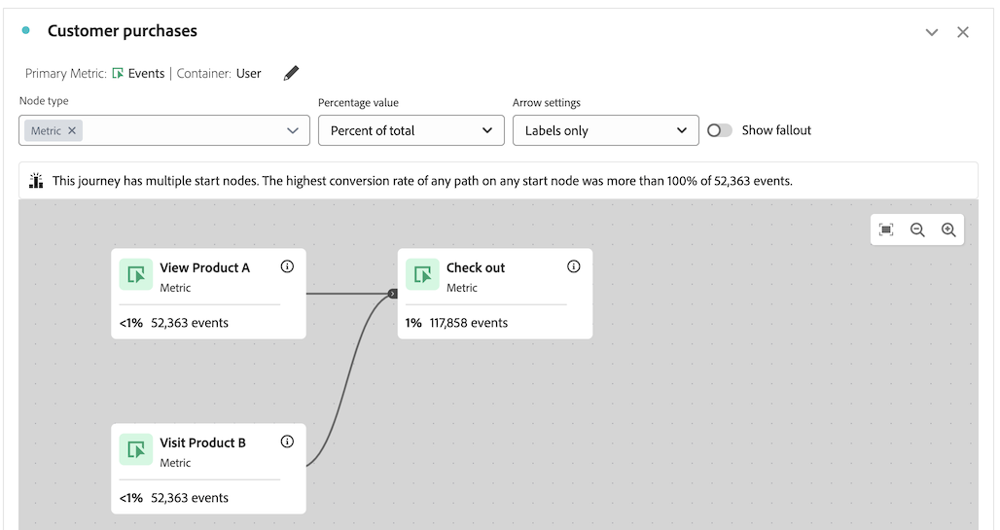

# ジャーニーキャンバスのトラブルシューティング

ジャーニーキャンバスのビジュアライゼーションを使用すると、ユーザーや顧客に提供するジャーニーを分析し、深いインサイトを得ることができます。

ジャーニー キャンバスについて詳しくは、[ジャーニー キャンバスの概要 ](/help/analysis-workspace/visualizations/journey-canvas/journey-canvas.md) および [ジャーニー キャンバス ビジュアライゼーションの設定 ](/help/analysis-workspace/visualizations/journey-canvas/configure-journey-canvas.md) を参照してください。

次の情報は、ジャーニーの後半に発生するノードで、ジャーニーの前半に発生するノードよりも高い割合や数が表示されるなど、予期しない結果が発生する場合のトラブルシューティングに役立ちます。

## 以前のノードよりも割合または値が高いノード

ジャーニーキャンバスでは、ジャーニーの後半に到達するノードに対して、ジャーニーの前半に到達するノードよりも高い割合または数が表示される可能性があります。

つまり、常にファネル型（ステップごとにパーティシペーションが減少する）のフォールアウトビジュアライゼーションとは異なり、ジャーニーキャンバスビジュアライゼーションは、ジャーニーの後のステップでのパーティシペーションが、前のステップよりも高くなる可能性があります。

この問題は、次のシナリオで発生する可能性があります。

* 人物またはセッション以外のプライマリ指標を使用する場合

* 複数のパスが 1 つのノードに収束する場合

### ジャーニーが「人物」または「セッション」以外のプライマリ指標を使用している

ジャーニーキャンバスでは任意の指標を主要指標として使用できるので、ジャーニーの後半のノードで、ジャーニーの前半のノードより高い割合や数が表示される場合があります。

次のシナリオで使用するジャーニーは、次の設定で設定されます。

* **[!UICONTROL Person]** がコンテナとして設定されている

* **[!UICONTROL イベント]** がプライマリ指標として設定される

#### シナリオ 1：ユーザー A は、最初のセッションでジャーニーパスに従います。 後続のセッションでは、ユーザーには、後のノードにのみ一致するイベントがあります。

例えば、ユーザー A がサイトを訪問し、ジャーニーを完了したとします（ノード 1:「サイトに訪問」/ノード 2:「製品 A を表示」/ノード 3:「チェックアウト」）。 ユーザー A には、ジャーニーの各ノードに順番に一致するイベントがあるので、イベントはジャーニーの各ノードでカウントされます。

ここで、ユーザー A が後のセッションで再度サイトを訪問するとします。 ユーザー A は、ジャーニーパスを追跡することで前のセッションで既にジャーニーを完了しているので、ユーザー A がジャーニー内の任意のノードに一致するイベントを持つすべての場合（ユーザー A が現在のセッションでジャーニーのパスを追跡していない場合でも）、イベントは、ジャーニー内の関連ノードにカウントされます。 例えば、ユーザー A がチェックアウトすると、イベントは「チェックアウト」ノードでカウントされます。 その結果、「チェックアウト」ノードの割合と数が、前の「製品 A を表示」ノードよりも多くなる場合があります。

この例では、ジャーニーのコンテナ設定である「ユーザー」が、後続のセッションで 3 番目のノードのイベント（「チェックアウト」）がカウントされることを決定する際に重要な役割を果たします。

また、コンテナ設定が「セッション」に設定されている場合、後続の訪問の 3 番目のノードでのみ発生したイベントはジャーニーでカウントされません。ジャーニーに表示される統計は、特定のユーザーの単一の定義済みセッションに制限されるからです。 コンテナ設定について詳しくは、「ジャーニーキャンバスビジュアライゼーションの設定 [&#128279;](/help/analysis-workspace/visualizations/journey-canvas/configure-journey-canvas.md) の [ジャーニーキャンバスビジュアライゼーションの作成を開始 ](/help/analysis-workspace/visualizations/journey-canvas/configure-journey-canvas.md#begin-building-a-journey-canvas-visualization) を参照してください 

<!-- The time allotted for users to move along the path is determined by the container setting. Because "Person" is selected as the container setting in this example, people who followed the journey's path in one session (moving from Node 1 to Node 2 and to Node 3) met the criteria of the journey. On any subsequent visits to the site, any event they have that matches any node on the journey is counted on that node. -->

#### シナリオ 2：ユーザー B がジャーニーから外れる

例えば、ユーザー B がサイトを訪問してもジャーニーが完了せず（サイトを訪問し、製品 B を表示してからチェックアウトする）、ユーザー B がサイトを訪問したとします。 この場合、ジャーニーの開始ノード「サイトを訪問」のイベントはカウントされますが、残りのノードのイベントはカウントされず、ユーザー B はジャーニーからフォールアウトします。 ユーザー B はチェックアウト中であっても、チェックアウト前に製品 A を表示してジャーニーを完了していないため、イベントは 3 番目のノード（「チェックアウト」）でカウントされません。

これは、ユーザーがジャーニーの「最終的なパス」をたどる場合にのみ、イベントが各ノードに対してカウントされるからです。 つまり、2 つのノード間で発生したイベントに関係なく、最終的に 1 つのノードから別のノードに移動した場合にのみ、イベントがカウントされます。

### ジャーニーには、1 つのノードに収束する複数のパスがあります

ジャーニーキャンバスを使用すると、1 つのジャーニーに複数の開始ノードを含めて、複数のパスを作成できます。 これらのパスは共通のノードに収束する可能性があり、ジャーニーの後半に来るノードは、ジャーニーの前半に来るノードよりも高い割合または数を示します。

<!--

The journey used in the following scenarios is configured with the following settings:

* **[!UICONTROL Person]** is set as the container

* **[!UICONTROL Event]** is set as the primary metric

#### Scenario 

When a journey contains multiple paths that converge into a single node, the two paths are combined into the single node using the OR operator. This can result in the

-->

### ジャーニーの割合

ジャーニーの各ノードに表示される数値は、「**[!UICONTROL パーセンテージ値]**」フィールドで選択されたものに関係なく一定ですが、パーセンテージ自体は変化する場合があります。

以下の節では、同じジャーニーで割合がどのように変化するかを示します。これは、「**[!UICONTROL 割合の値]**」フィールドで次のどのオプションが選択されているかによって異なります。

+++開始ノードの割合

このジャーニーのノードには、「**[!UICONTROL パーセンテージ値]**」フィールドが「**[!UICONTROL 開始ノードのパーセント]** に設定されている場合、次の統計が含まれます。

| ノード | 統計 |
|---------|----------|
| ノード 1 - 「サイトにアクセス」 | このジャーニーでは、ジャーニーの開始ノード「サイトを訪問」に示すように、レポートの日付範囲内で 354,147 件のイベントがサイトに発生しました。 |
| ノード 2:「製品 A を表示」 | 開始ノードに表示されるイベントの合計数の 14% （48,394）は、ジャーニーの 2 番目のノード「製品 A を表示」の条件に一致しました。 |
| ノード 3 – 「チェックアウト」 | 開始ノードに表示されるイベントの合計数の 32% （113,782）は、ジャーニーの 3 番目のノード「チェックアウト」の条件に一致しました。 |

+++

+++前のノードの割合

このジャーニーのノードには、「**[!UICONTROL パーセンテージ値]**」フィールドが「**[!UICONTROL 前のノードのパーセント]** に設定されている場合、次の統計が含まれます。

| ノード | 統計 |
|---------|----------|
| ノード 1 - 「サイトにアクセス」 | このジャーニーでは、ジャーニーの開始ノード「サイトを訪問」に示すように、レポートの日付範囲内で 354,147 件のイベントがサイトに発生しました。 |
| ノード 2:「製品 A を表示」 | 前のノードで表示されたイベントの合計数の 14% （48,394）は、ジャーニーの 2 番目のノード「製品 A を表示」の条件に一致しました。 |
| ノード 3 – 「チェックアウト」 | 前のノードで表示されたイベントの合計数のうち、100% （113,782）を超えるイベントが、ジャーニーの 3 番目のノード「チェックアウト」の条件に一致しました。 |

+++

+++全体の割合

このジャーニーのノードには、「**[!UICONTROL パーセンテージ値]**」フィールドが **[!UICONTROL 合計パーセント]** に設定されている場合、次の統計が含まれます。

| ノード | 統計 |
|---------|----------|
| ノード 1 - 「サイトにアクセス」 | このジャーニーでは、ジャーニーの開始ノード「サイトを訪問」に示すように、レポートの日付範囲内で 354,147 件のイベントがサイトに発生しました。 |
| ノード 2:「製品 A を表示」 | イベントの合計数のうち、ジャーニーの 2 番目のノード「製品 A を表示」の条件に一致したのは 1% （48,394）未満です。 |
| ノード 3 – 「チェックアウト」 | イベントの合計数の 1% （113,782）が、ジャーニーの 3 番目のノード「チェックアウト」の条件に一致しました。 |

+++

## コンテナ指標とプライマリ指標の互換性

ジャーニーキャンバスコンテナは、ユーザー（人物指標を使用）またはセッション（セッション指標を使用）に設定できます。

現在選択されているコンテナ指標と互換性のあるプライマリ指標を選択してください。 ほとんどの指標は、使用可能なコンテナ指標と互換性があります。 ただし、コンテナ指標と主要指標の組み合わせは避ける必要があります。

例えば、ユーザーをコンテナとして使用し、セッションをプライマリ指標として使用すると、意図しない結果が生じる可能性があります。

<!--

## Percentages that exceed 100%

The following configurations can result in nodes that show percentages that exceed 100%:

* When the **[!UICONTROL Percentage value]** field is set to **[!UICONTROL Percent of total]** or **[!UICONTROL Percent of start node]**, and a primary metric is selected that results in less data for the start node than on subsequent nodes.

  For example, if Revenue is selected as the primary metric, and no revenue is being realized on the primary metric, then on any node where revenue is being realized will show as exceeding 100%. 

-->
