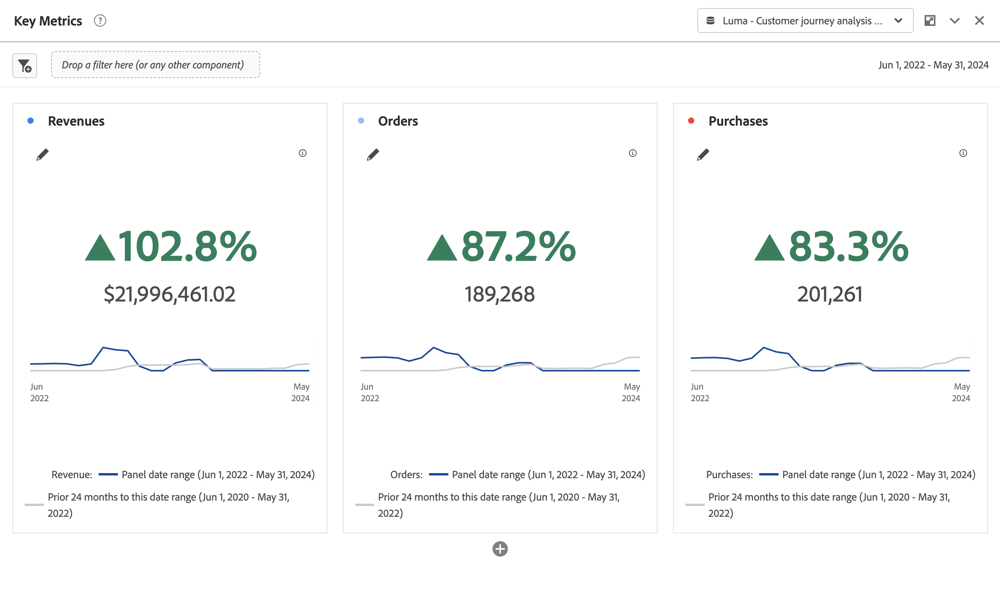

# 主要指標の概要 {#key-metric-summary}

<!-- markdownlint-disable MD034 -->

>[!CONTEXTUALHELP]
>id="cja_workspace_keymetricsummary_button"
>title="主要指標の概要"
>abstract="折れ線グラフ、変更概要グラフ、数値の概要グラフの組み合わせのようなビジュアライゼーションを作成します。 このビジュアライゼーションを使用すると、2 つの期間での重要な指標のトレンドを比較できます。"

<!-- markdownlint-enable MD034 -->

**[!UICONTROL 主要指標の概要]** ビジュアライゼーションを使用すると、1 つの期間内で重要な指標のトレンドを確認できます。 また、2 つの期間にわたる指標のパフォーマンスを比較することもできます。次のような複数のビジュアライゼーションが 1 つのビジュアライゼーションに統合されるメリットがあります。

* **[!UICONTROL 折れ線グラフ]** ビジュアライゼーションは、プライマリ日付範囲と比較日付範囲での指標のトレンドを表示します

* **[!UICONTROL 変化率の概要]** プライマリ日付範囲と比較日付範囲の間の指標の増減を表示します

* 指標の現在の合計値（[!UICONTROL **数値概要**]）

このビジュアライゼーションは、次のような様々な一般的なユースケースに対応しています。

* アナリストは前年の同じ期間と比較して今月の機会創出の様相を把握しようとしています。

* マーケターは特定のリードタイプのリードジェネレーションが今月から先月にかけてどのように変化したかを調べています。

* エグゼクティブは新規予約が今四半期から前四半期にどのように変化したかを理解したいと考えています。

## 用途

1. **[!UICONTROL 主要指標の概要]** ビジュアライゼーションを追加します。 [ パネルへのビジュアライゼーションの追加 ](freeform-analysis-visualizations.md#add-visualizations-to-a-panel) を参照してください。

1. **[!UICONTROL 指標]**、**[!UICONTROL プライマリ日付範囲]** **[!UICONTROL 、{ 比較日付範囲]** （オプション）および **[!UICONTROL フィルター]** （オプション）を選択して、ビジュアライゼーションを設定します。

   

   | オプション | 説明 |
   | --- | --- |
   | **[!UICONTROL 指標]** | 調査の対象となる指標を選択します。すべての指標がサポートされています。 |
   | **[!UICONTROL プライマリ日付範囲]** | フリーフォームテーブルの現在の日付範囲。 |
   | **[!UICONTROL 比較日付範囲]** | プライマリ日付範囲の比較対象となる日付範囲。 |
   | **[!UICONTROL フィルター（オプション）]** | この概要で特に関心のあるフィルター。 |

   {style="table-layout:auto"}

1. 「**[!UICONTROL 作成]**」を選択します。

<!--## How the Key Metric Summary visualization handles the comparison date range

(This will probably release in January. Per Jaden Howell)

* If the primary date range is set to the panel date range, there are 2-6 options that are considered 'relative' to the primary date range. These usually include the previous period (same amount of time immediately proceeding the primary date range), and 52 weeks prior to that date range.

* If the comparison date range is set to one of the 'relative' options, upon updating the primary date range, the comparison date range updates to the period immediate preceding the panel date range.

* If your comparison date range is *not* set to a 'relative' option, then updating the panel date range changes your primary date range, but has no effect on the comparison date range.

**Example 1**

Primary date range is set to the panel's date range: 'Yesterday'
Comparison date range is set to a relative date range, one of: 'Previous day', 'Same day last week', 'Same day 4 weeks prior', 'Same day last month', 'Same day last year', or 'Same day 52 weeks prior'.
When I change the panel's date range to 'This month', the comparison date range will update to 'Previous month'.

**Example 2**
 
Primary date range is set to the panel's date range: 'Yesterday'
Comparison date range is set to a non-relative date range, such as 'Feb 2nd, 2022', 'Highest sales day', 'Last week', etc. 

>[!NOTE]
>
>Last week is relative to the day the project is opened on, but it is not based on the panel's date range of 'Yesterday'. In other cases, such as if the panel's date range was 'This week', it may be relative.

When you change the panel's date range to '4 days ago', the comparison date range remains at the previous selection. -->

主要指標の概要の出力は次のようになります。

* **[!UICONTROL 前の期間]** 折れ線グラフ（常にグレーで表示）は、設定手順の **[!UICONTROL 比較日付範囲]** に対応しています。

* 比較日付範囲が設定時に指定されていない場合やビジュアライゼーション設定で非表示になっている場合は、プライマリ日付範囲の折れ線グラフのみが表示されます。 変更の概要は非表示です。

* ここから、折れ線グラフの上にマウスポインターを置くと、個々の日の統計情報を表示できます。

## 設定する

ビジュアライゼーションを作成したら、元の設定を編集できます。

1. ビジュアライゼーションの上部にある「**[!UICONTROL ビジュアライゼーションを設定]**」を選択します。

   元の設定ダイアログに戻ります。

1. 必要に応じて設定を変更します。 現在の設定をリセットするには、「**[!UICONTROL リセット]**」を選択します。 **[!UICONTROL ビルド]** を選択して、ビジュアライゼーションを再構築します。

## 設定

ビジュアライゼーション設定の一部として、特定の主要指標の概要設定を使用できます。

| 設定 | 説明 |
|---|---|
| **[!UICONTROL 概要表示タイプ]** | **[!UICONTROL 変化率を強調]** または **[!UICONTROL 数値を強調]** のいずれかを選択します。 |
| **[!UICONTROL トレンドラインを表示]** | ビジュアライゼーションにトレンドラインを表示します。 |
| **[!UICONTROL トレンドラインに最大値と最小値を表示]** | トレンドラインに最大値と最小値を表示します。 |
| **[!UICONTROL 比較率とトレンドラインを表示]** | トレンドラインで比較率を表示します。 選択しない場合、両方とも非表示になります。 |
| **[!UICONTROL 数値オプション]** | 数値に **[!UICONTROL 合計数を表示]** または **[!UICONTROL 生の差異を表示]** します。 |
| **[!UICONTROL 値を短縮]** | 数値をインテリジェントに短縮するには、「**[!UICONTROL 値を短縮]**」を選択します。 選択した場合、省略形の量を定義する数字を入力します。 次に例を示します。 <table><tr><td>**元の値**</td><td>**略語**</td><td>**結果**</td></tr><tr><td>$12,011,141.25</td><td>未選択</td><td  align="right">$12,011,141.25</td></tr><tr><td>$12,011,141.25</td><td>選択済み、1 に設定</td><td align="right">12 百万ドル）</td></tr><tr><td>$12,011,141.25</td><td>選択済み、2 に設定</td><td  align="right">1200 万ドル</td></tr><tr><td>$12,011,141.25</td><td>選択済み、2 に設定</td><td align="right">12011 万ドル</td></tr><tr><td>$12,011,141.25</td><td>を選択し、3 に設定します。</td><td align="right">12011 万ドル</td></tr></table> |

>[!MORELIKETHIS]
>
>[ パネルへのビジュアライゼーションの追加 ](/help/analysis-workspace/visualizations/freeform-analysis-visualizations.md#add-visualizations-to-a-panel)
>[ビジュアライゼーション設定 ](/help/analysis-workspace/visualizations/freeform-analysis-visualizations.md#settings)
>[ビジュアライゼーションコンテキストメニュー ](/help/analysis-workspace/visualizations/freeform-analysis-visualizations.md#context-menu)
>
