# マップ {#map}

<!-- markdownlint-disable MD034 -->

>[!CONTEXTUALHELP]
>id="workspace_map_button"
>title="マップ"
>abstract="このビジュアライゼーションでは、指標をマップにオーバーレイして表示します。 これは、様々な地域をまたいだデータを識別する場合に役立ちます。"

<!-- markdownlint-enable MD034 -->

<!-- markdownlint-disable MD034 -->

>[!CONTEXTUALHELP]
>id="workspace_map_bubbles"
>title="バブル"
>abstract="バブルを使用してイベントをプロットします。"

<!-- markdownlint-enable MD034 -->

<!-- markdownlint-disable MD034 -->

>[!CONTEXTUALHELP]
>id="workspace_map_heatmap"
>title="ヒートマップ"
>abstract="ヒートマップを使用してイベントをプロットします。"

<!-- markdownlint-enable MD034 -->

>[!BEGINSHADEBOX]

_この記事では、この記事の_  _&#x200B;**Customer Journey Analytics**._ _この記事の_  _&#x200B;**Adobe Analytics** バージョンの[Map](https://experienceleague.adobe.com/ja/docs/analytics/analyze/analysis-workspace/visualizations/map-visualization)を参照してください。_

>[!ENDSHADEBOX]

Analysis Workspaceの **[!UICONTROL Map]** ビジュアライゼーションを使用すると、任意の指標（計算指標を含む）の視覚的なマップを作成できます。 様々な地域にまたがる指標データを識別および比較する場合に役立ちます。

>[!BEGINSHADEBOX]

デモ動画については、 [&#x200B; マップのビジュアライゼーション &#x200B;](https://experienceleague.adobe.com/ja/docs/customer-journey-analytics-learn/tutorials/analysis-workspace/visualizations/configure-and-use-the-map-visualization){target="_blank"}を参照してください。

>[!ENDSHADEBOX]

## 前提条件

### データビューでのコンテキストラベルの追加

Customer Journey Analytics データビュー設定では、管理者は[&#x200B; コンテキストラベル &#x200B;](/help/data-views/component-settings/overview.md)をディメンションまたは指標に追加でき、[!UICONTROL map] ビジュアライゼーションなどのCustomer Journey Analytics サービスは、これらのラベルを目的に使用できます。

#### マップビジュアライゼーションの緯度と経度に必要なコンテキストラベル

コンテキストラベルは、マップのビジュアライゼーションが機能するために必要です。 次のコンテキストラベルが存在しない場合、使用する緯度と経度データがないので、マップビジュアライゼーションは機能しません。

* [!UICONTROL 地域：緯度]
* [!UICONTROL 地域：経度]

これらのコンテキストラベルを追加するには：

1. Customer Journey Analytics で、**[!UICONTROL データ管理]**／**[!UICONTROL データビュー]**&#x200B;を選択します。

1. データビューページで、マップビジュアライゼーションで分析するデータを含むデータビューを選択します。

1. 「**[!UICONTROL コンポーネント]**」タブを選択します。

1. （条件付き） Web SDKを使用しており、データストリームに緯度と経度を入力するように設定している場合、またはAnalytics Source コネクタを使用してイベントデータを入力している場合は、既にスキーマで緯度と経度のフィールドを使用し、正しいコンテキストラベルを入力する必要があります。

   これらの&#x200B;**[!UICONTROL Latitude]**&#x200B;および&#x200B;**[!UICONTROL Longitude]** スキーマフィールド（**[!UICONTROL イベントデータセット]** > **[!UICONTROL placeContext]** > **[!UICONTROL geo]** > **[!UICONTROL _schema]**&#x200B;内）を見つけ、まだ存在しない場合は、それらをデータビューにディメンションとしてドラッグします。

   これらのスキーマフィールドがデータビューにディメンションとして存在する場合、コンテキストラベルは自動的に適用され、マップビジュアライゼーションは追加の設定なしで使用します。

   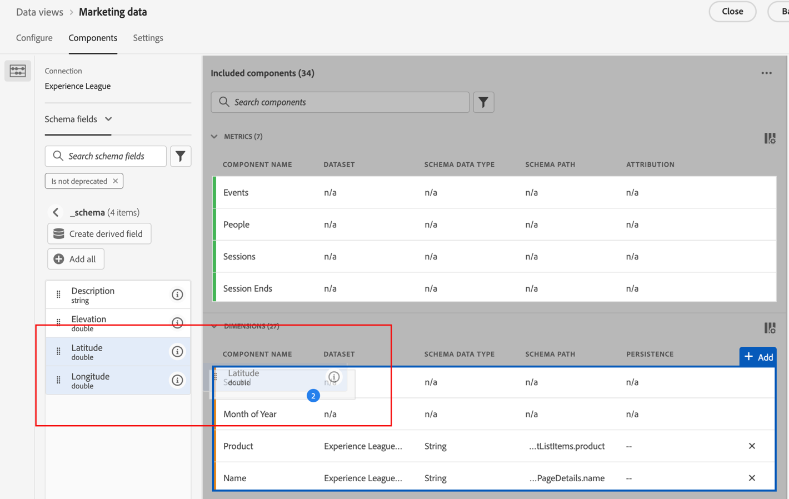

1. （条件付き）緯度と経度データに使用するカスタムディメンションがある場合は、カスタムフィールドにコンテキストラベルを設定できます。

   1. 「**[!UICONTROL ディメンション]**」セクションで、経度データを含むディメンションを選択します。

   1. 右側のパネルの&#x200B;**[!UICONTROL コンポーネント設定]** セクションの&#x200B;**[!UICONTROL コンテキストラベル]** フィールドで、`Longitude`と入力し、ドロップダウンメニューから選択します。

      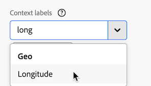

   1. このプロセスを繰り返して、緯度データを含むディメンションに&#x200B;**[!UICONTROL Latitude]** コンテキストラベルを追加します。

   1. （オプション）デフォルトでは、これらのディメンションはマップのビジュアライゼーションで町または郵便番号レベルに正確であり、Workspace レポートには2つの小数点以下桁が表示されます。 マップのビジュアライゼーションで1 メートル以内に正確に調整し、Workspace レポートで5つの小数点以下桁を表示できます。 精度レベルの調整方法について詳しくは、[&#x200B; ディメンションの正確な場所の設定](#configure-precise-locations-for-dimensions)を参照してください。

1. **[!UICONTROL 保存して続行]** > **[!UICONTROL 保存して終了]**&#x200B;を選択します。

#### 地域テンプレートに必要なコンテキストラベル

Adobeには、マップ ビジュアライゼーションを使用する[事前定義済みテンプレート &#x200B;](/help/analysis-workspace/templates/use-templates.md#web-audience)がいくつか用意されています。 各テンプレートを使用するには、対応するコンテキストラベルをデータビューのディメンションに追加する必要があります。

以下は、テンプレートと必要なコンテキストラベルです。 これらのラベルが存在しない場合、使用する地域データがないため、テンプレートは機能しません。

| テンプレート名 | 必須コンテキストラベル |
|---------|----------|
| 地域 - 国 | [!UICONTROL 地域：地域の国] |
| 地域 - 地域 | [!UICONTROL 地域：地域] |
| 地域 - 都市 | [!UICONTROL 地域：地域シティ &#x200B;] |
| 地域 - 米国の州 | [!UICONTROL 地域：地域の状態] |
| 地域 - 米国 DMA | [!UICONTROL 地域：地域Dma] |

これらのコンテキストラベルを追加するには：

1. Customer Journey Analytics で、**[!UICONTROL データ管理]**／**[!UICONTROL データビュー]**&#x200B;を選択します。

1. データビューページで、マップビジュアライゼーションを使用する事前定義済みのテンプレートを使用して分析するデータを含むデータビューを選択します。 このデータビューで、5つのディメンションを選択します。1つは国データ、1つは地域データ、1つは都市データ、1つは州データ、1つはDMA データです。 次に、これらのディメンションに対応するコンテキストラベルを付けます。

1. 「**[!UICONTROL コンポーネント]**」タブを選択します。

1. （条件付き） Web SDKを使用しており、データストリームに入力するように地域フィールドを設定している場合、またはAnalytics Source コネクタを使用してイベントデータを入力している場合は、地域フィールドが既にスキーマで使用でき、正しいコンテキストラベルが入力されている必要があります。

   **[!UICONTROL City]**、**[!UICONTROL 郵便番号]**、**[!UICONTROL 都道府県]** （**[!UICONTROL イベントデータセット]** > **[!UICONTROL placeContext]** > **[!UICONTROL geo]**）などの適切なスキーマフィールドを見つけ、まだ存在しない場合は、それらをデータビューにディメンションとしてドラッグします。

   これらのスキーマフィールドがデータビューにディメンションとして存在する場合、コンテキストラベルは自動的に適用され、地域テンプレートは追加の設定なしで使用されます。

   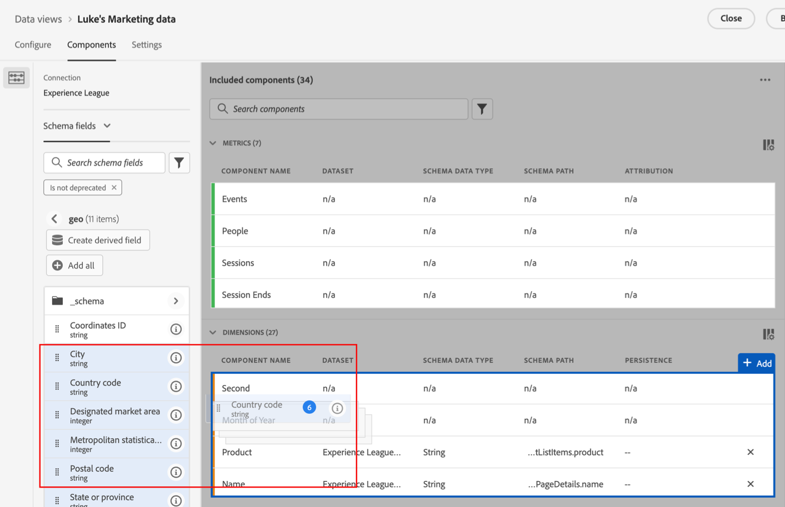

1. （条件付き）地域データに使用するカスタムディメンションがある場合は、カスタムフィールドにコンテキストラベルを設定できます。

   1. 国データを含むディメンションを選択します。

   1. 右側のパネルの&#x200B;**[!UICONTROL コンポーネント設定]** セクションの&#x200B;**[!UICONTROL コンテキストラベル]** フィールドで、`Geo Country`と入力し、ドロップダウンメニューから選択します。

      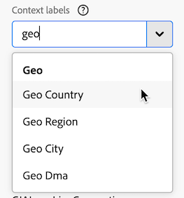

   1. このプロセスを繰り返して、対応するデータを含む各ディメンションに&#x200B;**[!UICONTROL 地域：地域]**、**[!UICONTROL 地域：地域City]**、**[!UICONTROL 地域：地域State]**、**[!UICONTROL 地域：Dma]** コンテキストラベルを追加します。

1. **[!UICONTROL 保存して続行]** > **[!UICONTROL 保存して終了]**&#x200B;を選択します。

### グラフィックドライバーはWebGL レンダリングをサポートする必要があります

マップのビジュアライゼーションでは、グラフィック表示にWebGLを使用します。 グラフィックドライバーがWebGL レンダリングをサポートしていない場合は、ドライバーを更新する必要がある場合があります。

## Customer Journey AnalyticsとAdobe Analyticsのマップビジュアライゼーション

Customer Journey Analyticsのマップビジュアライゼーションは、次の点でAdobe Analyticsのマップビジュアライゼーションとは異なります。

| 機能 | Customer Journey Analytics | Adobe Analytics |
|---------|----------|---------|
| データソース | データソースとして、データビューで利用可能なあらゆるセグメントを使用できます。 | 次のオプションが用意されています。 <ul><li>モバイル緯度経度</li><li>地理的Dimension 訪問者のIP アドレスに基づく訪問者の場所に関する地理的セグメンテーションデータを表します。 </li></ul> |
| 精度 | 精度の高いデータセットの場合、データビューのディメンションを設定して、最大5つの小数点以下桁を表示できます。 これにより、マップの視覚化が1 メートル以内で正確になります。 
詳しくは、[&#x200B; ディメンションの正確な場所の設定](#configure-precise-locations-for-dimensions)を参照してください。
 | データは、[!UICONTROL 国]、[!UICONTROL 地域]、[!UICONTROL 都市] レベルに正確です。 （DMAまたはZip コードレベルには適用されません）。 |
| 選択範囲からセグメントを作成する | マップビジュアライゼーションで選択した特定の領域に基づいてセグメントを作成します。 
詳しくは、[&#x200B; マップのビジュアライゼーションからセグメントを作成](#create-a-segment-from-the-map-visualization)を参照してください。
 | 一般的に、マップビジュアライゼーションでレポートされるデータに基づいてセグメントを作成します。 |
| 選択範囲からオーディエンスを作成 | マップビジュアライゼーションで選択した特定の領域に基づいて、オーディエンスを作成します。 
詳しくは、[&#x200B; マップのビジュアライゼーションからのオーディエンスの作成](#create-an-audience-from-the-map-visualization)を参照してください。 | マップ ビジュアライゼーションからオーディエンスを作成できません。 |
| 選択範囲からトレンドを作成 | マップのビジュアライゼーションで選択した特定の領域に基づいて、トレンド折れ線グラフのビジュアライゼーションを作成します。 
詳しくは、[&#x200B; マップのビジュアライゼーションからトレンドラインチャートを作成](#create-a-trended-line-chart-from-the-map-visualization)を参照してください。<!-- is this correct? --> | マップ ビジュアライゼーションからトレンドを作成できません。 |
| 選択範囲から分類を追加 | マップビジュアライゼーションで選択した特定の領域内の特定のディメンション項目、指標、セグメント、日付範囲を分割します。 
詳しくは、[&#x200B; マップの視覚化から分類を追加する](#add-a-breakdown-from-the-map-visualization)を参照してください。 | マップ ビジュアライゼーションから分類を追加できません。 |

## マップのビジュアライゼーションの作成 {#begin-building-map}

<!-- markdownlint-disable MD034 -->

>[!CONTEXTUALHELP]
>id="workspace_map_panel"
>title="マップビジュアライゼーションを設定"
>abstract="マップビジュアライゼーションの基礎として使用する指標または計算指標を選択します。 データの特定のサブセットにフォーカスする場合は、セグメントを追加することもできます。
この情報は、ビジュアライゼーションのレンダリング後にいつでも更新できます。
"

<!-- markdownlint-enable MD034 -->

1. 左側のパネルで&#x200B;[!UICONTROL **ビジュアライゼーション**] アイコンを選択し、**[!UICONTROL マップ]** ビジュアライゼーション をフリーフォームテーブルを含むパネルにドラッグします。

   または

   [&#x200B; ビジュアライゼーションの概要](/help/analysis-workspace/visualizations/freeform-analysis-visualizations.md)の「[&#x200B; ビジュアライゼーションをパネルに追加](/help/analysis-workspace/visualizations/freeform-analysis-visualizations.md#add-visualizations-to-a-panel)」セクションで説明されているいずれかの方法で、マップビジュアライゼーションを追加します。

   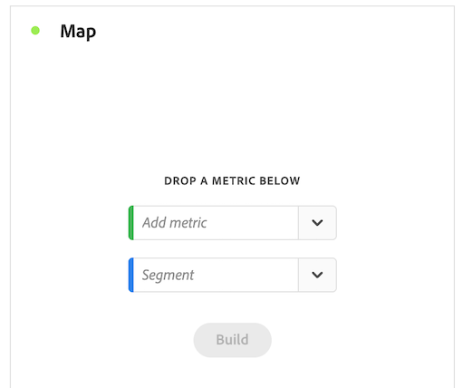{width="50%"}

1. マップビジュアライゼーションを設定するには、次の基本情報を指定します。

   * **[!UICONTROL 指標を追加]**：指標ドロップダウンリストで、指標または計算指標を選択します。 （左側のパネルから指標をドラッグすることもできます）。

     >[!IMPORTANT]
     >
     >[属性が適用された指標を選択した場合](/help/data-views/component-settings/attribution.md#attribution-models)、同じ属性がマップビジュアライゼーションの現在のビューポート内の緯度と経度のペアに適用されます。
     >

     <!-- Only choose metrics that use Last Touch as the [attribution model](/help/data-views/component-settings/attribution.md#attribution-models) (this is the default attribution model for all metrics). Choosing a metric that has an attribution model other than Last Touch results in inaccurate map data, because attribution is applied to the latitude and longitude pairs. -->

   * **[!UICONTROL セグメントを追加]**: （オプション） セグメント ドロップダウンリストで、セグメントを選択します。 または、セグメントのリストからセグメント内にドラッグします。

   ビジュアライゼーションヘッダーの編集アイコン を選択すると、ビジュアライゼーションの構築後にこの情報を更新できます。

1. 「**[!UICONTROL 作成]**」を選択します。

   バブルを使用した世界マップビジュアライゼーションが生成されます。

   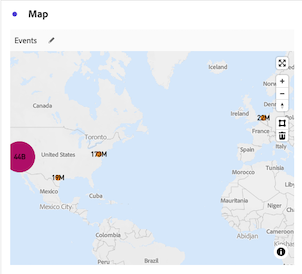

1. [&#x200B; マップの可視化を表示](#view-a-map-visualization)および[可視化の設定](#configure-visualization-settings)を続行します。

## マップのビジュアライゼーションの表示

1. まだ使用していない場合は、[&#x200B; マップ ビジュアライゼーションの作成](#begin-building-a-map-visualization)の説明に従ってマップ ビジュアライゼーションを作成します。

1. Analysis Workspaceのマップビジュアライゼーションで、次のいずれかの操作を行います。

   * **ズームイン**：マップ上でズームインすると、次のいずれかの方法で特定の領域を拡大できます。

      * マウスでマップをダブルクリックします。

      * マウスのスクロールホイールまたはトラックパッド上の同様のアクションを使用します。

      * マップビジュアライゼーションのプラスアイコン 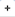を選択します。

     マップはそれに応じてズームします。 必要なディメンション（国/都道府県/市区町村）は、ズームレベルに基づいて自動的に更新されます。

   * **ズームアウト**：マップをズームアウトすると、次のいずれかの方法で大きな領域を表示できます。

      * Shift キーを押しながら、マップをマウスでダブルクリックします。

      * マウスのスクロールホイールまたはトラックパッド上の同様のアクションを使用します。

      * マップ ビジュアライゼーションのマイナス アイコン 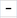を選択します。

     マップはそれに応じてズームします。 必要なディメンション（国/都道府県/市区町村）は、ズームレベルに基づいて自動的に更新されます。

   * **回転**: マップをマウスでドラッグしながら[!UICONTROL Ctrl] キーを押すと、マップを2Dまたは3Dで回転できます。

     マップを元の北向きにリセットするには、コンパスアイコン 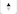を選択します。

   * **選択ツール**: マップの領域を選択して、[&#x200B; セグメントを作成](#create-a-segment-from-the-map-visualization)、[&#x200B; トレンドを作成](#create-a-trended-line-chart-from-the-map-visualization)、または[分類を追加](#add-a-breakdown-from-the-map-visualization)できます。

     選択ツール 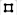をクリックし、マウスをドラッグして目的の領域を選択します。

   * **比較**：同じプロジェクト内の2つ以上のマップビジュアライゼーションを並べて配置して比較できます。

   * **期間ごとの比較を表示（前年比など）**:

      * 負の数を表示します。

        例えば、前年比指標のグラフを表示するときに、ニューヨークの上に「-33％」と表示することができます。

      * *パーセント*&#x200B;タイプの指標では、クラスタリングでパーセンテージがまとめて平均化されます。

      * 緑と赤の配色は、正と負を示します。

   * **追加のビジュアライゼーション設定**: ビジュアライゼーションヘッダーの設定アイコン を選択して、マップビジュアライゼーションの追加の設定を表示します。 詳しくは、[&#x200B; ビジュアライゼーション設定の設定](#configure-visualization-settings)を参照してください。

1. **すべてのマップ設定（座標、ズーム、回転）を保存するプロジェクトを**&#x200B;保存します。
1. （オプション）ビジュアライゼーションの下にあるフリーフォームテーブルは、左側のパネルから場所の寸法と指標をドラッグして入力できます。

## ビジュアライゼーション設定の指定

マップビジュアライゼーションの設定を行うには：

1. Analysis Workspaceで、既存のマップ ビジュアライゼーションを開くか、[新しいマップ ビジュアライゼーションを作成します](#begin-building-a-map-visualization)。

1. マップ ビジュアライゼーションにカーソルを合わせ、ビジュアライゼーションヘッダーの設定アイコン を選択します。

   次のオプションがあります。

   | セクション | 設定 | 説明 |
   | --- |--- |--- |
   | **[!UICONTROL マップタイプ]** | | |
   | | **[!UICONTROL バブル]** | バブルを使用してイベントをプロットします。 バブルチャートとは、散布図とプロポーショナルエリアチャートの間のクロス図である多変数グラフです。 この表示はデフォルトです。 |
   | | **[!UICONTROL ヒートマップ]** | ヒートマップを使用してイベントをプロットします。 ヒートマップとは、マトリックスに含まれる個々の値が色で表されるデータのグラフィック表現です。 |
   | **[!UICONTROL スタイル]** | | |
   | | **[!UICONTROL カラーテーマ]** | ヒートマップと泡のカラースキームを表示します。 Coral、Reds、Greens、Bluesから選択できます。 デフォルトはコーラルです。 |
   | | **[!UICONTROL マップスタイル]** | 「ベーシック」、「ストリート」、「ブライト」、「ライト」、「ダーク」、「サテライト」から選択できます。 |
   | | **[!UICONTROL クラスター半径]** | 指定したピクセル数内にあるデータポイントをグループ化します。 デフォルトは 50 です。
このオプションは、**[!UICONTROL バブル]**&#x200B;が&#x200B;**[!UICONTROL マップタイプ]**&#x200B;として選択されている場合にのみ使用できます。
 |
   | | **[!UICONTROL カスタム最大値]** | マップの最大値のしきい値を変更できます。 この値を調整すると、設定したカスタムの最大値に対して、バブルまたはヒートマップの値（色とサイズ）のスケールが調整されます。 |
   | | **[!UICONTROL 注釈を表示]** | このビジュアライゼーションに対して行われた注釈を表示します。 |
   | | **[!UICONTROL タイトルを非表示]** | ビジュアライゼーションのタイトルを非表示にします。 |

## 寸法の正確な位置の設定

精度の高いカスタムデータセットがある場合は、1 メートル以内の位置精度を達成するようにマップのビジュアライゼーションを設定できます。

1. Customer Journey Analytics で、**[!UICONTROL データ管理]**／**[!UICONTROL データビュー]**&#x200B;を選択します。

1. より正確な位置を使用するように設定するディメンションを含むデータビューを選択します。

1. データビューで、「**[!UICONTROL コンポーネント]**」タブを選択します。

1. 設定する緯度と経度に使用する寸法を選択します。 使用しているディメンションについて詳しくは、[&#x200B; マップの可視化で緯度と経度に必要なコンテキストラベル &#x200B;](#required-context-labels-for-latitude-and-longitude-in-the-map-visualization)を参照してください。

1. ディメンションの精度レベルを設定します。

   1. 設定するディメンションを選択したまま、右側のパネルで「**[!UICONTROL 形式]**」セクションを展開します。

      書式セクションが展開された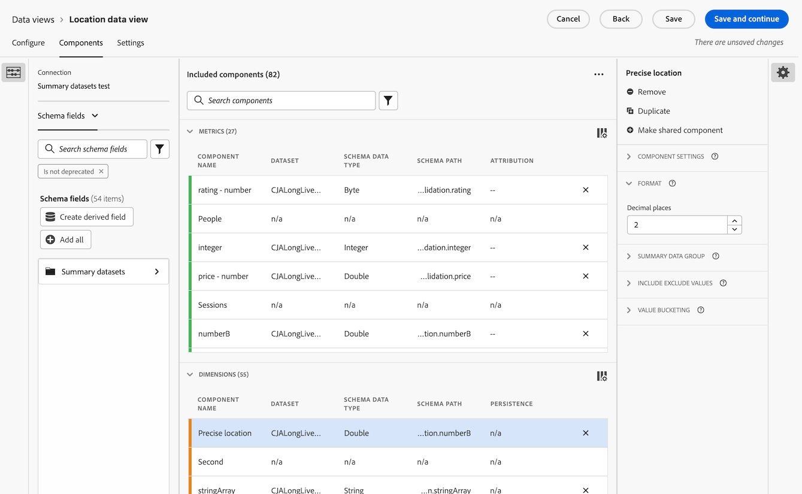

   1. **[!UICONTROL 小数点以下桁]** フィールドで、目的の精度レベルを反映するように小数点以下桁の数を変更します。

      * **0:**&#x200B;地図のビジュアライゼーションで、大きな地域または国レベルを正確に示します。 Workspace レポートに小数点以下桁を0個表示します。

      * **1:**&#x200B;地図のビジュアライゼーションで、地域または大都市レベルを正確に示します。  Workspace レポートに小数点以下桁を1つ表示します。

      * **2:**&#x200B;地図のビジュアライゼーションで、町または郵便番号レベルを正確に示します。 Workspace レポートに2つの小数点以下桁を表示します。

        これがデフォルトの選択範囲です。

      * **3:**&#x200B;地図のビジュアライゼーションでは、非常に小さな町または近隣レベルに正確です。 Workspace レポートに3つの小数点以下桁を表示します。

      * **4:**&#x200B;地図のビジュアライゼーションで、特定の土地または建物レベルの区画を正確に示します。 Workspace レポートに4つの小数点以下桁を表示します。

      * **5:**&#x200B;正確な値をマップのビジュアライゼーションで1 メートルに指定します。 Workspace レポートに5つの小数点以下桁を表示します。

1. **[!UICONTROL 保存して続行]** > **[!UICONTROL 保存して終了]**&#x200B;を選択します。

## マップのビジュアライゼーションからセグメントを作成 {#map-create-segment}

マップのビジュアライゼーションで選択した特定の領域に基づいてセグメントを作成できます。 選択した領域に基づいてセグメントを作成すると、選択範囲の緯度と経度の範囲内にあるすべてのデータがセグメントに含まれます。

マップのビジュアライゼーションからセグメントを作成するには：

1. セグメントに使用するデータを含むマップの領域をズームまたはパンします。

1. 次のいずれかの操作を行います。

   * **マップに現在表示されているすべての要素からセグメントを作成するには：** マップ上の任意の場所を右クリックし、**[!UICONTROL 現在のビューからセグメントを作成]**&#x200B;を選択します。

   * **マップのより特定の領域のセグメントを作成するには：**&#x200B;選択ツール をクリックし、マウスをドラッグして目的の領域を選択してから、**[!UICONTROL 選択範囲からセグメントを作成]**&#x200B;を選択します。

1. セグメントビルダーを使用して、新しいセグメントを定義します。 詳しくは、[&#x200B; セグメントビルダー](/help/components/segments/seg-builder.md)を参照してください。

## マップのビジュアライゼーションからオーディエンスを作成する

マップビジュアライゼーションで選択した特定の領域に基づいてオーディエンスを作成できます。

マップビジュアライゼーションからオーディエンスを作成するには：

1. オーディエンスに使用するデータを含むマップの領域をズームまたはパンします。

1. 次のいずれかの操作を行います。

   * **現在マップに表示されているすべての要素からオーディエンスを作成するには：** マップ上の任意の場所を右クリックし、**[!UICONTROL 現在のビューからオーディエンスを作成]**&#x200B;を選択します。

   * **マップのより特定の領域のオーディエンスを作成するには：**&#x200B;選択ツール をクリックし、マウスをドラッグして目的の領域を選択し、**[!UICONTROL 選択範囲からオーディエンスを作成]**&#x200B;を選択します。

1. オーディエンスビルダーを使用して、新しいオーディエンスを定義します。 詳しくは、[&#x200B; オーディエンスの作成と公開](/help/components/audiences/publish.md)の[&#x200B; オーディエンスビルダー](/help/components/audiences/publish.md#audience-builder)を参照してください

## マップのビジュアライゼーションからトレンド折れ線グラフを作成

マップ ビジュアライゼーションで選択した特定の領域内のデータに対して、トレンド折れ線グラフ ビジュアライゼーションを作成できます。

マップのビジュアライゼーションからトレンドラインチャートを作成するには：

1. トレンド折れ線グラフに使用するデータを含むマップの領域をズームまたはパンします。

1. 次のいずれかの操作を行います。

   * **現在マップに表示されているすべてのものからトレンドラインチャートを作成するには：** マップ上の任意の場所を右クリックし、現在のビューから&#x200B;**[!UICONTROL トレンド]**&#x200B;を選択します。

   * **マップのより特定の領域のトレンドラインチャートを作成するには：**&#x200B;選択ツール をクリックし、マウスをドラッグして目的の領域を選択し、**[!UICONTROL トレンド]**&#x200B;を選択します。

   トレンドラインを含む折れ線グラフのビジュアライゼーションが作成されます。 このビジュアライゼーションについて詳しくは、[行](/help/analysis-workspace/visualizations/line.md)を参照してください。

<!--

Can you do this?

## Add a breakdown from the map visualization

You can break down a specific dimension item, metric, segment, or date range for the data within a designated area that you select in the map visualization.

To add a breakdown from the map visualization:

1. (Optional) Zoom in on the specific area of the map that contains the data where you want to add the breakdown.

1. Click the selection tool , then drag your mouse to select the desired area.

1. Select **[!UICONTROL Add breakdown]**. 

-->

<!--

Can you do this?

## Export the map visualization as a PDF

To export the map visualization in PDF format:

1. how...

-->

