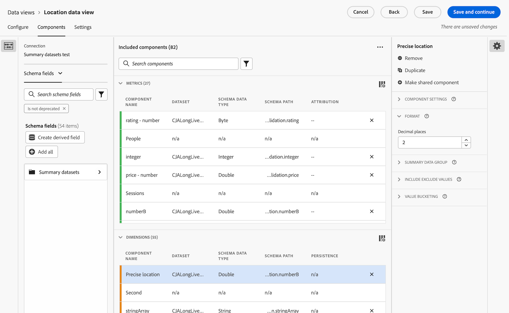

# マップ {#map}

<!-- markdownlint-disable MD034 -->

>[!CONTEXTUALHELP]
>id="workspace_map_button"
>title="マップ"
>abstract="このビジュアライゼーションでは、指標をマップにオーバーレイして表示します。これは、様々な地域をまたいだデータを識別する場合に役立ちます。"

<!-- markdownlint-enable MD034 -->

<!-- markdownlint-disable MD034 -->

>[!CONTEXTUALHELP]
>id="workspace_map_bubbles"
>title="バブル"
>abstract="バブルを使用してイベントをプロットします。"

<!-- markdownlint-enable MD034 -->

<!-- markdownlint-disable MD034 -->

>[!CONTEXTUALHELP]
>id="workspace_map_heatmap"
>title="ヒートマップ"
>abstract="ヒートマップを使用してイベントをプロットします。"

<!-- markdownlint-enable MD034 -->

>[!BEGINSHADEBOX]

_この記事では、_ CustomerJourneyAnalyticsCustomer Journey Analytics _**のマップビジュアライゼーション** ついて説明します。この記事の _ _[AdobeAnalytics](https://experienceleague.adobe.com/ja/docs/analytics/analyze/analysis-workspace/visualizations/map-visualization)_ Adobe Analytics_**Map** を参照してください。_

>[!ENDSHADEBOX]

Analysis Workspaceの  **[!UICONTROL マップ]** ビジュアライゼーションを使用すると、任意の指標（計算指標を含む）の視覚的なマップを作成できます。 様々な地域をまたいだ指標データを識別および比較する際に役立ちます。

## 前提条件

### データビューでのコンテキストラベルの追加

Customer Journey Analytics データビューの設定では、管理者はディメンションや指標に [ コンテキストラベル ](/help/data-views/component-settings/overview.md) を追加し、目的に合わせて [!UICONTROL  マップ ] ビジュアライゼーションなどのCustomer Journey Analytics サービスでこれらのラベルを使用できます。

#### マップビジュアライゼーションの緯度と経度に必須のコンテキストラベル

マップのビジュアライゼーションが機能するには、コンテキストラベルが必要です。 次のコンテキストラベルが存在しない場合、操作する緯度と経度のデータがないため、マップビジュアライゼーションは機能しません。

* [!UICONTROL  地域：緯度 ]
* [!UICONTROL  位置情報：経度 ]

これらのコンテキストラベルを追加するには：

1. Customer Journey Analyticsで、**[!UICONTROL データ管理]**/**[!UICONTROL データビュー]** を選択します。

1. データビューページで、マップビジュアライゼーションで分析するデータを含むデータビューを選択します。

1. 「**[!UICONTROL コンポーネント]**」タブを選択します。

1. （条件付き） Web SDKを使用していて、緯度と経度をデータストリームに入力するように設定している場合、または Analytics Source コネクタを使用してイベントデータを入力している場合は、緯度と経度のフィールドが既にスキーマで使用でき、正しいコンテキストラベルが入力されている必要があります。

   これらの **[!UICONTROL 緯度]** および **[!UICONTROL 経度]** スキーマフィールド（**[!UICONTROL イベントデータセット]**/**[!UICONTROL placeContext]**/**[!UICONTROL geo]**/**[!UICONTROL _schema]**）を見つけて、まだ存在しない場合はディメンションとしてデータビューにドラッグします。

   これらのスキーマフィールドがデータビュー内にディメンションとして存在する場合、そのコンテキストラベルは自動的に適用され、追加の設定を行わなくてもマップビジュアライゼーションでこれらのフィールドが使用されます。

   

1. （条件付き）緯度と経度のデータに使用するカスタムディメンションがある場合、カスタムフィールドのコンテキストラベルを設定できます。

   1. 「**[!UICONTROL ディメンション]**」セクションで、経度データを含むディメンションを選択します。

   1. 右側のパネルの **[!UICONTROL コンポーネント設定]** セクションの **[!UICONTROL コンテキストラベル]** フィールドで、`Longitude` と入力し始め、ドロップダウンメニューから選択します。

      

   1. この手順を繰り返して、緯度データを含む寸法に **[!UICONTROL Latitude]** コンテキスト ラベルを追加します。

   1. （オプション）デフォルトでは、これらの寸法はマップビジュアライゼーションの町または郵便番号レベルに対して正確で、Workspace レポートでは小数点以下 2 桁で表示されます。 マップビジュアライゼーションでは 1 メートル内で正確になるように、またWorkspace レポートでは小数点以下 5 桁まで表示されるように調整できます。 精度レベルの調整方法の詳細は、「[ 寸法の正確な位置を設定する ](#configure-precise-locations-for-dimensions)」を参照してください。

1. **[!UICONTROL 保存して続行]**/**[!UICONTROL 保存して終了]** を選択します。

#### 地域テンプレートには必須のコンテキストラベル

Adobeには、マップビジュアライゼーションを使用する [ 事前定義済みのテンプレート ](/help/analysis-workspace/templates/use-templates.md#web-audience) がいくつか用意されています。 各テンプレートを使用するには、対応するコンテキストラベルをデータビューのディメンションに追加する必要があります。

テンプレートと必須のコンテキストラベルを以下に示します。 これらのラベルが存在しない場合、操作するジオデータがないので、テンプレートは機能しません。

| テンプレート名 | 必須のコンテキストラベル |
|---------|----------|
| 地域 - 国 | [!UICONTROL  地域：地域 – 国 ] |
| 地域 - 地域 | [!UICONTROL Geo: Geo リージョン ] |
| 地域 - 都市 | [!UICONTROL Geo：地域 – 市区町村 ] |
| 地域 - 米国の州 | [!UICONTROL Geo：地域 – の状態 ] |
| 地域 – 米国 DMA | [!UICONTROL  地域：地域 Dma] |

これらのコンテキストラベルを追加するには：

1. Customer Journey Analyticsで、**[!UICONTROL データ管理]**/**[!UICONTROL データビュー]** を選択します。

1. データビューページで、マップビジュアライゼーションを使用する事前定義済みテンプレートを使用して分析するデータを含むデータビューを選択します。 このデータビューで、5 つのディメンションを選択します。1 つは国データ、1 つは地域データ、1 つは市区町村データ、1 つは州データ、1 つは DMA データです。 次に、これらのディメンションに対応するコンテキストラベルを付けます。

1. 「**[!UICONTROL コンポーネント]**」タブを選択します。

1. （条件付き） Web SDKを使用していて、データストリームに入力するようにジオフィールドを設定している場合、または Analytics Source コネクタを使用してイベントデータを入力している場合は、ジオフィールドはスキーマで既に使用可能で、正しいコンテキストラベルが入力されている必要があります。

   **[!UICONTROL 市区町村]**、**[!UICONTROL 郵便番号]**、**[!UICONTROL 都道府県]** （**[!UICONTROL イベントデータセット]**/**[!UICONTROL placeContext]**/**[!UICONTROL 地域]**）など、適切なスキーマフィールドを見つけ、まだ存在しない場合はディメンションとしてデータビューにドラッグします。

   これらのスキーマフィールドがデータビュー内にディメンションとして存在する場合、そのコンテキストラベルは自動的に適用され、地域テンプレートでは追加の設定なしでこれらのフィールドが使用されます。

   

1. （条件付き）地域データに使用するカスタムディメンションがある場合は、カスタムフィールドにコンテキストラベルを設定できます。

   1. 国データを含むディメンションを選択します。

   1. 右側のパネルの **[!UICONTROL コンポーネント設定]** セクションの **[!UICONTROL コンテキストラベル]** フィールドで、`Geo Country` と入力し始め、ドロップダウンメニューから選択します。

      

   1. この手順を繰り返して、対応するデータを含む各ディメンションに **[!UICONTROL Geo：地域（Region）]**、**[!UICONTROL Geo：地域の市区町村]**、**[!UICONTROL Geo：地域の状態]**、および **[!UICONTROL Geo：地域（Dma）]** コンテキストラベルを追加します。

1. **[!UICONTROL 保存して続行]**/**[!UICONTROL 保存して終了]** を選択します。

### グラフィックス ドライバーは WebGL レンダリングをサポートする必要があります

マップビジュアライゼーションは、グラフィック表示に WebGL を使用します。 グラフィックス・ドライバーが WebGL レンダリングをサポートしていない場合、ドライバーの更新が必要になる場合があります。

## Customer Journey AnalyticsとAdobe Analyticsのマップビジュアライゼーションの比較

Customer Journey Analyticsのマップビジュアライゼーションは、Adobe Analyticsのマップビジュアライゼーションとは次の点が異なります。

| 機能 | Customer Journey Analytics | Adobe Analytics |
|---------|----------|---------|
| データソース | データビューで使用可能な任意のセグメントをデータソースとして使用します。 | 次のオプションがあります。 <ul><li>モバイルの緯度/経度</li><li>地理的Dimension  訪問者の IP アドレスに基づいた訪問者の場所に関する地理セグメントデータを表します。 </li></ul> |
| 精度 | 精度の高いデータセットの場合、データビューでディメンションを設定して、小数点以下 5 桁まで表示できます。 これにより、1 メートル以内でマップのビジュアライゼーションが正確になります。 
詳しくは、[ ディメンションの正確な場所の設定 ](#configure-precise-locations-for-dimensions) を参照してください。
 | データは、[!UICONTROL  国 ]、[!UICONTROL  地域 ]、および [!UICONTROL  市区町村 ] レベルに対して正確です。 （DMA または郵便番号レベルには変換されません。） |
| 選択範囲からのセグメントの作成 | マップビジュアライゼーションで選択した特定の領域に基づいてセグメントを作成します。 
詳しくは、[ マップビジュアライゼーションからセグメントを作成する ](#create-a-segment-from-the-map-visualization) を参照してください。
 | 一般にマップビジュアライゼーションでレポートされるデータに基づいてセグメントを作成します。 |
| 選択範囲からオーディエンスを作成 | マップビジュアライゼーションで選択した特定の領域に基づいてオーディエンスを作成します。 
詳しくは、[ マップビジュアライゼーションからオーディエンスを作成する ](#create-an-audience-from-the-map-visualization) を参照してください。 | マップビジュアライゼーションからオーディエンスを作成できません。 |
| 選択範囲からトレンドを作成する | マップビジュアライゼーションで選択した特定の領域に基づいて、トレンド折れ線グラフビジュアライゼーションを作成します。 
詳しくは、[ マップビジュアライゼーションからトレンド折れ線グラフを作成 ](#create-a-trended-line-chart-from-the-map-visualization) を参照してください。<!-- is this correct? --> | マップ ビジュアライゼーションからトレンドを作成できません。 |
| 選択から分類を追加 | マップビジュアライゼーションで選択した特定の領域内で、特定のディメンション項目、指標、セグメントまたは日付範囲を分類します。 
詳しくは、[ マップビジュアライゼーションから分類を追加する ](#add-a-breakdown-from-the-map-visualization) を参照してください。 | マップビジュアライゼーションから分類を追加できません。 |

## マップのビジュアライゼーションの作成 {#begin-building-map}

<!-- markdownlint-disable MD034 -->

>[!CONTEXTUALHELP]
>id="workspace_map_panel"
>title="マップビジュアライゼーションを設定"
>abstract="マップビジュアライゼーションの基礎として使用する指標または計算指標を選択します。 データの特定のサブセットにフォーカスする場合は、セグメントを追加することもできます。
この情報は、ビジュアライゼーションのレンダリング後にいつでも更新できます。
"

<!-- markdownlint-enable MD034 -->

1. 左側のパネルで「[!UICONTROL **ビジュアライゼーション**]」アイコンを選択し、**[!UICONTROL マップ]** ビジュアライゼーション  をフリーフォームテーブルを含むパネルにドラッグします。

   または

   「[ ビジュアライゼーションの概要 ](/help/analysis-workspace/visualizations/freeform-analysis-visualizations.md#add-visualizations-to-a-panel) の [ パネルへのビジュアライゼーションの追加 ](/help/analysis-workspace/visualizations/freeform-analysis-visualizations.md) の節で説明されている任意の方法でマップビジュアライゼーションを追加します。

   {width="50%"}

1. 次の基本情報を指定して、マップビジュアライゼーションを設定します。

   * **[!UICONTROL 指標の追加]**：指標ドロップダウンリストから、指標または計算指標を選択します。 （指標は左パネルからドラッグすることもできます。）

     >[!IMPORTANT]
     >
     >[ アトリビューションが適用 ](/help/data-views/component-settings/attribution.md#attribution-models) された指標を選択すると、マップビジュアライゼーションの現在のビューポート内の緯度と経度のペアに同じアトリビューションが適用されます。
     >

     <!-- Only choose metrics that use Last Touch as the [attribution model](/help/data-views/component-settings/attribution.md#attribution-models) (this is the default attribution model for all metrics). Choosing a metric that has an attribution model other than Last Touch results in inaccurate map data, because attribution is applied to the latitude and longitude pairs. -->

   * **[!UICONTROL セグメントを追加]**:（任意）「セグメント」ドロップダウンリストで、セグメントを選択します。 または、セグメントのリストからセグメントをドラッグします。

   この情報は、ビジュアライゼーションが作成された後で、ビジュアライゼーションヘッダーの編集アイコン  を選択して更新できます。

1. 「**[!UICONTROL 作成]**」を選択します。

   バブルを使用した世界マップビジュアライゼーションが生成されます。

   

1. [ マップビジュアライゼーションを表示 ](#view-a-map-visualization) および [ ビジュアライゼーション設定を指定 ](#configure-visualization-settings) をクリックして続行します。

## マップのビジュアライゼーションの表示

1. まだ作成していない場合は、[ マップビジュアライゼーションの作成 ](#begin-building-a-map-visualization) の説明に従って、マップビジュアライゼーションを作成します。

1. Analysis Workspaceのマップビジュアライゼーションで、次のいずれかの操作を行います。

   * **ズームイン**：マップをズームインして、次のいずれかの方法で特定の領域を拡大できます。

      * マウスでマップをダブルクリックします。

      * マウスのスクロールホイールまたはトラックパッド上の同様のアクションを使用します。

      * マップビジュアライゼーションのプラスアイコン  を選択します。

     それに応じてマップがズームされます。 必要なディメンション（国/都道府県/市区町村）が、ズームレベルに基づいて自動的に更新されます。

   * **ズームアウト**：次のいずれかの方法で、マップをズームアウトして、より大きな領域を表示できます。

      * Shift キーを押したまま、マウスでマップをダブルクリックします。

      * マウスのスクロールホイールまたはトラックパッド上の同様のアクションを使用します。

      * マップビジュアライゼーションのマイナスアイコン  を選択します。

     それに応じてマップがズームされます。 必要なディメンション（国/都道府県/市区町村）が、ズームレベルに基づいて自動的に更新されます。

   * **回転**: [!UICONTROL Ctrl] キーを押しながらマウスでマップをドラッグすることで、マップを 2D または 3D で回転できます。

     マップを元の北方向の位置合わせにリセットするには、コンパス アイコン  を選択します。

   * **選択ツール**：マップの領域を選択して、[ セグメントの作成 ](#create-a-segment-from-the-map-visualization)、[ トレンドの作成 ](#create-a-trended-line-chart-from-the-map-visualization)、または [ 分類の追加 ](#add-a-breakdown-from-the-map-visualization) を行うことができます。

     選択ツール  をクリックし、マウスをドラッグして目的の領域を選択します。

   * **比較**：同じプロジェクトの 2 つ以上のマップのビジュアライゼーションを横に並べて比較できます。

   * **期間と期間の比較（前年比など）を表示**:

      * 負の数を表示します。

        例えば、前年比指標のグラフを表示するときに、ニューヨークの上に「-33％」と表示することができます。

      * *パーセント*&#x200B;タイプの指標では、クラスタリングでパーセンテージがまとめて平均化されます。

      * 緑と赤のカラースキームは、正と負を示します。

   * **追加のビジュアライゼーション設定**：ビジュアライゼーションヘッダーの設定アイコン  を選択して、マップビジュアライゼーションの追加設定を表示します。 詳しくは、[ ビジュアライゼーション設定の指定 ](#configure-visualization-settings) を参照してください。

1. プロジェクトを&#x200B;**保存**&#x200B;して、すべてのマップ設定（座標、ズーム、回転）を保存します。
1. （オプション）左側のパネルから場所のディメンションと指標をドラッグして、ビジュアライゼーションの下にあるフリーフォームテーブルに入力できます。

## ビジュアライゼーション設定を指定

マップビジュアライゼーションの設定を指定するには：

1. Analysis Workspaceで、既存のマップビジュアライゼーションを開くか、[ 新しく作成 ](#begin-building-a-map-visualization) します。

1. マップビジュアライゼーションにポインタを合わせ、ビジュアライゼーションヘッダーの設定アイコン  を選択します。

   次のオプションがあります。

   | セクション | 設定 | 説明 |
   | --- |--- |--- |
   | **[!UICONTROL マップタイプ]** | | |
   | | **[!UICONTROL バブル]** | バブルを使用してイベントのグラフを描画します。バブルチャートは、散布図と比例する面グラフの中間の複数変数のグラフです。この表示はデフォルトです。 |
   | | **[!UICONTROL ヒートマップ]** | ヒートマップを使用してイベントのグラフを描画します。ヒートマップは、データのグラフィカル表示で、マトリックスに含まれる個々の値が色で表されます。 |
   | **[!UICONTROL スタイル]** | | |
   | | **[!UICONTROL カラーテーマ]** | ヒートマップおよびバブルのカラースキームを表します。コーラル、赤、緑または青から選択できます。デフォルトはコーラルです。 |
   | | **[!UICONTROL マップスタイル]** | 「ベーシック」、「ストリート」、「ブライト」、「ライト」、「ダーク」、「サテライト」から選択できます。 |
   | | **[!UICONTROL クラスタ半径]** | 指定したピクセル数内にあるデータポイントをグループ化します。デフォルトは 50 です。
このオプションは、**[!UICONTROL マップ タイプ]** として **[!UICONTROL バブル]** が選択されている場合にのみ使用できます。
 |
   | | **[!UICONTROL カスタムの最大値]** | マップの最大値のしきい値を変更できます。 この値を調整すると、設定したカスタムの最大値を基準として、バブルまたはヒートマップの値（色とサイズ）のスケールが調整されます。 |
   | | **[!UICONTROL 注釈を表示]** | このビジュアライゼーション用に作成された注釈を表示します。 |
   | | **[!UICONTROL タイトルを非表示]** | ビジュアライゼーションのタイトルを非表示にします。 |

## 寸法の正確な位置を設定する

精度の高いカスタムデータセットがある場合は、マップビジュアライゼーションを設定して、1 メートル内での位置精度を実現できます。

1. Customer Journey Analyticsで、**[!UICONTROL データ管理]**/**[!UICONTROL データビュー]** を選択します。

1. より正確な場所を使用するために設定するディメンションを含むデータビューを選択します。

1. データビューで、「**[!UICONTROL コンポーネント]**」タブを選択します。

1. 設定する緯度と経度に使用するディメンションを選択します。 使用しているディメンションについて詳しくは、[ マップビジュアライゼーションの緯度と経度に必須のコンテキストラベル ](#required-context-labels-for-latitude-and-longitude-in-the-map-visualization) を参照してください。

1. 寸法の精度レベルを設定します。

   1. 設定するディメンションを選択したまま、右側のパネルで「**[!UICONTROL 形式]**」セクションを展開します。

      

   1. **[!UICONTROL 小数点以下の桁数]** フィールドで、目的の精度レベルを反映した小数点以下の桁数を変更します。

      * **0:** マップビジュアライゼーションの大きな地域または国レベルに対する正確さ。 Workspace レポートで小数点以下 0 桁を表示します。

      * **1:** マップビジュアライゼーション内の地域または大都市レベルに対して正確。  Workspace レポートで小数点第 1 位を表示します。

      * **2:** 地図ビジュアライゼーションの市区町村または郵便番号レベルに対する正確な情報。 Workspace レポートで小数点以下 2 桁を表示します。

        これはデフォルトの選択です。

      * **3:** マップ ビジュアライゼーション内の非常に小さな町または近隣のレベルに正確です。 Workspace レポートで小数点以下 3 桁を表示します。

      * **4:** 地図ビジュアライゼーションの特定の土地または建物レベルの区画に対して正確です。 Workspace レポートで小数点以下 4 桁を表示します。

      * **5:** マップビジュアライゼーションの 1 メートルに対する精度。 Workspace レポートで小数点以下 5 桁を表示します。

1. **[!UICONTROL 保存して続行]**/**[!UICONTROL 保存して終了]** を選択します。

## マップビジュアライゼーションからのセグメントの作成 {#map-create-segment}

マップビジュアライゼーションで選択した特定の領域に基づいてセグメントを作成できます。 選択した領域に基づいてセグメントを作成すると、選択した緯度と経度内のデータがセグメントに含まれます。

マップビジュアライゼーションからセグメントを作成するには：

1. セグメントに使用するデータを含むマップの領域にズームまたは画面移動します。

1. 次のいずれかの操作を行います。

   * **マップに現在表示されているすべてのものからセグメントを作成するには：** マップ上の任意の場所を右クリックし、[**[!UICONTROL 現在のビューからセグメントを作成]**] を選択します。

   * **マップのより特定の領域に対してセグメントを作成するには：** 選択ツール  をクリックし、マウスをドラッグして目的の領域を選択してから、「**[!UICONTROL 選択からセグメントを作成]**」を選択します。

1. セグメントビルダーを使用して新しいセグメントを定義します。 詳しくは、[ セグメントビルダー ](/help/components/segments/seg-builder.md) を参照してください。

## マップビジュアライゼーションからのオーディエンスの作成

マップビジュアライゼーションで選択した特定の領域に基づいてオーディエンスを作成できます。

マップのビジュアライゼーションからオーディエンスを作成するには：

1. オーディエンスに使用するデータを含むマップの領域にズームまたはパンします。

1. 次のいずれかの操作を行います。

   * **マップに現在表示されているすべての項目からオーディエンスを作成するには：** マップ上の任意の場所を右クリックし、「**[!UICONTROL 現在のビューからオーディエンスを作成]**」を選択します。

   * **マップのより具体的な領域に対するオーディエンスを作成するには：** 選択ツール  をクリックし、マウスをドラッグして目的の領域を選択してから、「**[!UICONTROL 選択からオーディエンスを作成]**」を選択します。

1. オーディエンスビルダーを使用して、新しいオーディエンスを定義します。 詳しくは、[ オーディエンスの作成と公開 ](/help/components/audiences/publish.md#audience-builder) の [Audience Builder](/help/components/audiences/publish.md) を参照してください

## マップビジュアライゼーションからのトレンド折れ線グラフの作成

マップビジュアライゼーションで選択した特定の領域内のデータに対して、トレンド折れ線グラフビジュアライゼーションを作成できます。

マップビジュアライゼーションからトレンド折れ線グラフを作成するには：

1. トレンド折れ線グラフに使用するデータを含むマップ領域にズームまたはパンします。

1. 次のいずれかの操作を行います。

   * **マップに現在表示されているすべてのものからトレンド折れ線グラフを作成するには：** マップ上の任意の場所を右クリックし、[**[!UICONTROL 現在のビューからトレンド]**] を選択します。

   * **マップのより特定の領域に対してトレンド折れ線グラフを作成するには：** 選択ツール  をクリックし、マウスをドラッグして目的の領域を選択し、「**[!UICONTROL トレンド]**」を選択します。

   トレンドラインを含む折れ線グラフ ビジュアライゼーションが作成されます。 このビジュアライゼーションについて詳しくは、[ 折れ線グラフ ](/help/analysis-workspace/visualizations/line.md) を参照してください。

<!--

Can you do this?

## Add a breakdown from the map visualization

You can break down a specific dimension item, metric, segment, or date range for the data within a designated area that you select in the map visualization.

To add a breakdown from the map visualization:

1. (Optional) Zoom in on the specific area of the map that contains the data where you want to add the breakdown.

1. Click the selection tool , then drag your mouse to select the desired area.

1. Select **[!UICONTROL Add breakdown]**. 

-->

<!--

Can you do this?

## Export the map visualization as a PDF

To export the map visualization in PDF format:

1. how...

-->

