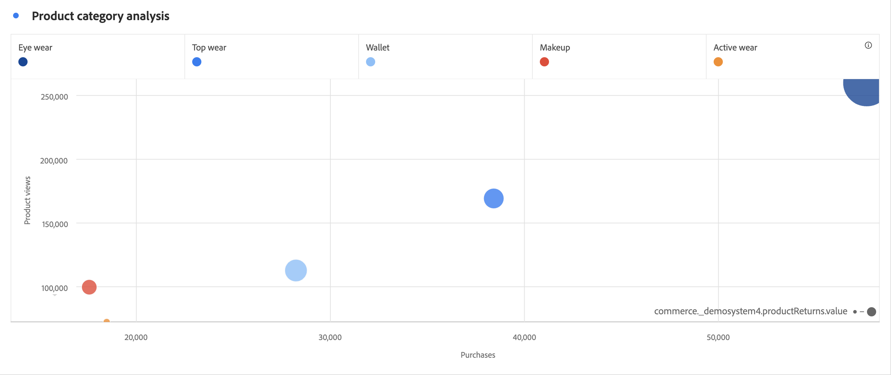

# 散布図

>[!NOTE]
>
>Customer Journey Analytics 内の Analysis Workspace に関するドキュメントを表示しています。この機能セットは、[従来の Adobe Analytics の Analysis Workspace](https://experienceleague.adobe.com/docs/analytics/analyze/analysis-workspace/home.html) とは少し異なります。[詳細情報...](/help/getting-started/cja-aa.md)

散布図ビジュアライゼーションは、ディメンション項目と最大 3 つの指標の関係を表示します。3 つのコンポーネントが必要で、最大 4 つのコンポーネントの視覚化をサポートします。

* 行コンポーネント（通常はディメンション）は、グラフ上の各ポイントを表します。それぞれの行が、異なる色のドットで表示されます。
* 一番左の列（通常は指標）には、Y 軸（垂直方向）上の点の位置が描画されます。
* 2 番目の列には、X 軸（水平方向）上の点の位置が描画されます。
* 3 番目の列は、ドットの半径を決定します。
* フリーフォームテーブルの後続の列は、散布図のビジュアライゼーションでは無視されます。

