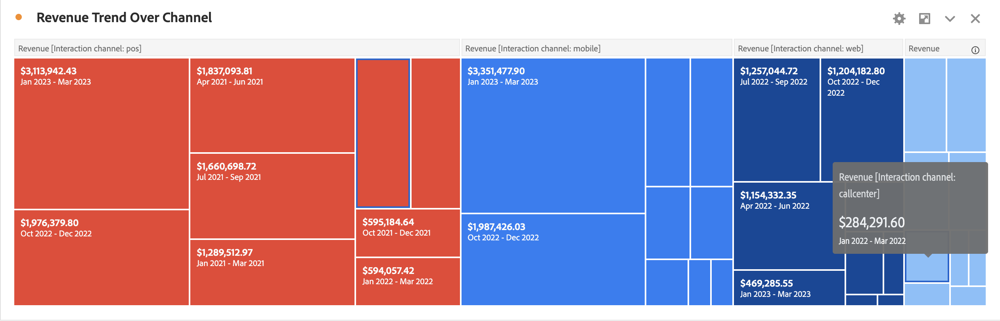

# ツリーマップ

ネストされた長方形の集まりとして、（ツリー構造の）階層データが表示されます。

ツリーの各分岐が長方形で示され、これに、下位レベルの分岐を示す小さな長方形がタイル状に並べられています。

何らかの方法でツリー構造にカラーとサイズディメンションを関連付けると、特定のカラーが特に重要な場合など、他の方法では特定困難なパターンを容易に確認することが可能です。ツリーマップの 2 つ目のメリットは、構造上、スペースを有効活用できるようになるという点です。
