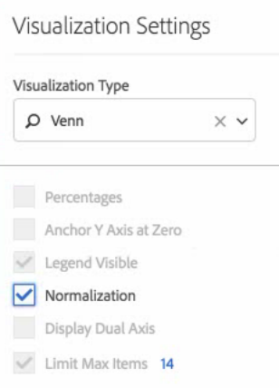

# ベン

>[!NOTE]
>
>Customer Journey Analytics 内の Analysis Workspace に関するドキュメントを表示しています。この機能セットは、[従来の Adobe Analytics の Analysis Workspace](https://docs.adobe.com/content/help/ja-JP/analytics/analyze/analysis-workspace/home.html) とは少し異なります。[詳細情報...](/help/getting-started/cja-aa.md)

ベン図のビジュアライゼーションを使用すると、（コンポーネントから）最大 3 セグメントおよび 1 つの指標をドラッグして、ベン図を作成できます。

セグメント上にマウスポインターを置くと、割合などのインサイトが得られます。

ベン図をフリーフォームテーブルに変換するには、**[!UICONTROL ベン]**&#x200B;のヘッダーの隣にある色付きの点をクリックして、**[!UICONTROL データソースを管理]**／**[!UICONTROL 使用可能なデータソース]**／**[!UICONTROL フリーフォームテーブル]**&#x200B;を選択します。

ベン図を正規化する（サイズを測る）には、ビジュアライゼーション設定アイコンに移動し、「**[!UICONTROL 正規化]**」を選択します。

