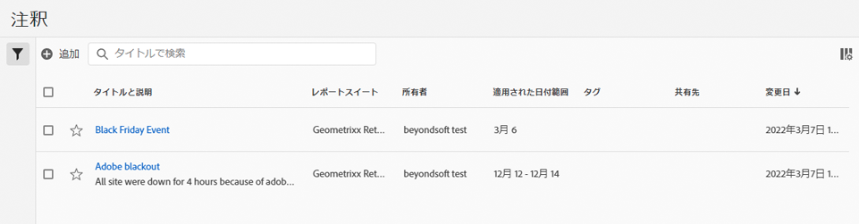

# 注釈を管理

[!UICONTROL コンポーネント]／[!UICONTROL 注釈]マネージャーは、共有、フィルタリング、タグ付け、承認、コピー、削除、お気に入りとしてマークするなど、注釈を管理する様々な方法を提供します。

[!UICONTROL 注釈]マネージャーには、すべてのプロジェクトを対象し、自身と共有されている、すべての注釈が表示されます。

>[!NOTE]
>
>特定のプロジェクトに対してのみ作成した[!UICONTROL 注釈]は、マネージャーに表示されません。

## 注釈マネージャーのユーザーインターフェイス

| UI 要素 | 説明 |
| --- | --- | 
| [!UICONTROL タイトルと説明] | 注釈ビルダーで提供されます。タイトルと説明を編集するには、タイトルリンクをクリックします。タイトルリンクをクリックすると、注釈ビルダーに戻ります。 |
| [!UICONTROL データビュー] | この注釈が適用されるデータビュー。 |
| [!UICONTROL 所有者] | 注釈の所有者を示します。管理者以外のユーザーには、自分が所有している注釈または自分と共有されていた注釈のみが表示されます。 |
| [!UICONTROL 適用された日付範囲] | この注釈が適用される日付または日付範囲。 |
| [!UICONTROL 共有先] | 注釈を共有した個人またはグループの数を一覧表示します。詳しくは、ここをクリックしてください。 |
| [!UICONTROL 修正日] | 注釈が最後に変更された日時を表示します。 |

{style="table-layout:auto"}

## 注釈を編集

注釈を編集すると、日付範囲、色、範囲、またはすべてのデータビューやプロジェクトに適用するかどうかを調整できます。 注釈は次の 2 つの方法で編集できます。

* 折れ線グラフで、注釈にカーソルを合わせ、ポップオーバー内の鉛筆アイコンをクリックします。

* [!UICONTROL 注釈マネージャー]で、注釈のタイトルをクリックします。

これらのオプションは両方とも、注釈ビルダーに戻ります。そこで、必要な調整を行い、新しいバージョンを保存できます。

## 注釈の共有

注釈を共有する場合や共有された注釈で作業する場合は、次の点に留意してください。

* 例えば、プロジェクトのみの注釈を含むプロジェクトを作成し、そのプロジェクトを他のユーザーと共有するとします。プロジェクトを共有しているユーザーには、これらの注釈は表示されますが、編集や削除はできません。

* 注釈を保存してユーザーと直接共有する場合、そのユーザーは、管理者権限を持っている場合にのみ、注釈を編集／削除できます。

* まとめると、プロジェクトが共有されている場合、そのプロジェクト内でのみ表示されます。注釈が直接共有されている場合、その注釈を表示できるすべてのプロジェクトに表示されます。

## 注釈とタイムゾーン

すべての注釈は、タイムスタンプと共に作成されますが、「時間」や「タイムゾーン」の情報は持ちません。レポート時には、パネルのデータビューのタイムゾーンが常に適用されます。 したがって、クリスマスデー用に作成された注釈は、現在のデータビュータイムゾーンに関係なく、12 月 25 日に発生します。

もうひとつの例は、元旦です。1 時間ごとに異なるタイムゾーンで、新しい年の始まりにふさわしい花火が打ち上げられます。米国山地標準時の午後 10:00 には、米国東海岸では既に東部標準時の午前 12:00 なので、花火が打ち上がっています。

## その他の注釈タスク

注釈マネージャーでは、管理者が注釈の編集、追加、タグ付け、削除、名前の変更、承認、コピー、書き出しおよびフィルタリングできます。管理者以外のユーザーには表示されません。

1 つ以上の注釈を選択すると、タスクバーが表示されます。

| タスク | 説明 |
| --- | --- |
| 追加 | 新しい注釈を作成できる注釈ビルダーに移動します。 |
| タグ | すべてのユーザーが注釈にタグを付けることができます。注釈には 1 つ以上のタグを適用できます。ただし、自分が所有しているフィルターのタグのみを表示できます。 どのような種類のタグを作成する必要がありますか。次に、便利なタグのいくつかを示します。<ul><li>ソーシャルマーケティング、モバイルマーケティングなど、チーム名に基づくタグ</li><li>プロジェクトタグ（分析タグ）：入口ページ分析など</li><li>カテゴリタグ：メンズ、地域</li><li>ワークフロータグ：（特定の事業単位用に）キュレーション済み、承認済み</li></ul> |
| 削除 | 注釈を削除すると、組織内のすべてのプロジェクトから注釈が削除されます。 |
| 名前変更 | 注釈の名前を変更すると、その注釈が適用されているすべてのプロジェクトで名前が変更されます。 |
| コピー | 独自の注釈 ID を使用して、同じ名前と定義を持つ別個のコピーを作成します。 |
| CSV に書き出し | 注釈の定義を .csv ファイルに書き出します。 |
| フィルター（左パネル） | タグ、データビュー、所有者およびその他のフィルター（自分が所有、承認済み、お気に入り、自分と共有、すべてを表示）でフィルタリングします。 |

{style="table-layout:auto"}
