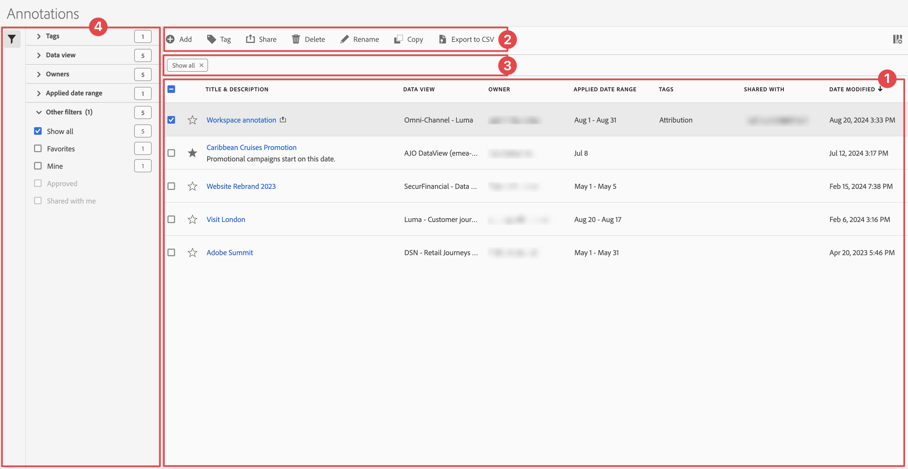

# 注釈を管理

一元的な[!UICONTROL 注釈]管理インターフェイスから、共有、フィルター、タグ付け、承認、コピー、削除および注釈をお気に入りとしてマークできます。 注釈を管理するには、以下の手順に従います。

* メインインターフェイスで「**[!UICONTROL コンポーネント]**」を選択し、「**[!UICONTROL 注釈]**」を選択します。

>[!NOTE]
>
>特定の Workspace プロジェクト内で作成した注釈は、すべてのプロジェクトで注釈を使用できるように設定していない限り、[!UICONTROL 注釈]マネージャーに表示されません。
>

## 注釈マネージャー

注釈マネージャーには、次のインターフェイス要素があります。

### 注釈リスト

注釈リスト ➊には、所有しているすべての注釈、すべてのプロジェクトに対してスコープが設定されている注釈、および共有されている注釈が表示されます。 リストには、次の列があります。

| 列 | 説明 |
| --- | --- |
|  | 注釈「」を優先するか、「」を優先しないかを選択します。 |
| **[!UICONTROL タイトルと説明]** | 注釈ビルダーで提供されます。 タイトルと説明を編集するには、タイトルリンクを選択して[注釈ビルダー](/help/components/annotations/create-annotations.md#annotation-builder)を開きます。 共有注釈には、「」と表示されます。 |
| **[!UICONTROL データビュー]** | この注釈が適用されるデータビュー。 |
| **[!UICONTROL 所有者]** | 注釈の所有者。 ユーザーには、自分が所有している注釈または自分と共有されている注釈のみが表示されます。 |
| **[!UICONTROL 適用された日付範囲]** | この注釈が適用される日付または日付範囲。 |
| **[!UICONTROL タグ]** | この注釈のタグ。 |
| **[!UICONTROL 共有先]** | 注釈を共有した個人またはグループ。 選択して、**[!UICONTROL コンポーネントを共有]**&#x200B;ダイアログを開きます。 |
| **[!UICONTROL 変更日時]** | 注釈が最後に変更された日時を表示します。 |

{style="table-layout:auto"}

 を使用して、表示する列を指定します。

### アクションバー

アクション バー➋を使用して注釈に対してアクションを実行できます。 アクションバーには、次のアクションが含まれます。

| アイコン | アクション | 説明 |
|:--:|---|---|
|  | **[!UICONTROL 追加]** | [注釈ビルダー](create-annotations.md#annotation-builder)を使用して、別の注釈を追加します。 |
|  | [!UICONTROL *タイトルで検索*] | リストで注釈が選択されていない場合は、この検索フィールドを使用して注釈を検索します。 |
|  | **[!UICONTROL タグ]** | 選択した注釈にタグを付けます。 **[!UICONTROL タグコンポーネント]**&#x200B;ダイアログで、選択した注釈のタグを選択または選択解除します。 「**[!UICONTROL 保存]**」を選択して、選択した注釈のタグを保存します。 |
|  | **[!UICONTROL 共有]** | 選択した注釈を共有します。 **[!UICONTROL コンポーネントを共有]**&#x200B;ダイアログでは、「「」、「*個人またはグループを検索*」、または「**[!UICONTROL 組織]**」または「**[!UICONTROL グループ]**」を選択できます。 「**[!UICONTROL 保存]**」を選択して、選択した注釈の共有の詳細を保存します。 詳しくは、[注釈の共有](#share-annotations)を参照してください。 |
|  | **[!UICONTROL 削除]** | 選択した注釈を削除します。 確認メッセージが表示されます。 |
|  | **[!UICONTROL 名前変更]** | 選択した 1 つの注釈の名前を変更します。 選択すると、注釈の名前をインラインで変更できます。 |
|  | **[!UICONTROL コピー]** | 選択した注釈をコピーします。 同じ名前とサフィックスを持つ新しい注釈が作成されます（コピー） |
|  | **[!UICONTROL CSV に書き出し]** | 注釈を `Annotations List.csv` ファイルに書き出します。 |

### アクティブなフィルターバー

フィルターバー➌には、アクティブなフィルター（ある場合）が表示されます。  を使用すると、フィルターをすばやく削除できます。 複数のフィルターを指定した場合は、「**[!UICONTROL すべて削除]**」を使用すると、すべてのフィルターを削除できます。

### フィルターパネル

注釈は、**[!UICONTROL フィルター]**&#x200B;左側のパネル ➍を使用してフィルターできます。 フィルターパネルには、フィルターのタイプと、フィルタリングを行う注釈の数が表示されます。 「」を選択して、フィルターパネルの表示を切り替えます。

フィルターリストをフィルタリングするには、次の手順に従います。

1. 「」を選択して、フィルターパネルを開きます。 フィルターリストにスペースが必要な場合は、もう一度「」を選択してパネルを閉じることができます。
1. 使用可能な任意の[フィルターセクション](#filter-sections)を使用して、注釈をフィルタリングできます。

   >[!INFO]
   >
   >*項目*&#x200B;とは、[注釈リスト](manage-annotations.md#annotations-list)に表示される注釈項目を指します。
   > 

#### フィルターセクション

{{tagfiltersection}}
{{dataviewfiltersection}}
{{ownerfiltersection}}
{{daterangefiltersection}}
{{otherfiltersfiltersection}}

[注釈リスト](manage-annotations.md#annotations-list)は、フィルター設定に基づいて自動的に更新されます。 設定済みのフィルターは、[アクティブなフィルターバー](manage-annotations.md#active-filter-bar)で確認できます。

## 注釈を編集

次の 2 つの方法で注釈を編集できます。

* Workspace プロジェクトでは、[コンポーネント情報](/help/components/use-components-in-workspace.md#component-info)アイコンを使用します。

* [[!UICONTROL 注釈]リスト](#annotations-list)で、注釈のタイトルを選択します。

注釈を編集するには、[注釈ビルダー](/help/components/annotations/create-annotations.md#annotation-builder)を使用します。

## 注釈の共有

注釈を共有する場合や、自分と共有されている注釈を操作する場合は、次が適用されます。

* 他のユーザーと共有するプロジェクト内のプロジェクト専用の注釈は、それらのユーザーに対して表示されます。 ユーザーは、これらのプロジェクト専用の注釈を編集または削除できません。
* 注釈を保存してその注釈をユーザーと直接共有する場合、そのユーザーは、管理者権限を持っている場合にのみ、注釈を編集および削除できます。

* プロジェクトが共有されている場合、そのプロジェクトで作成された注釈は、そのプロジェクトでのみ表示されます。 注釈が直接共有されている場合、その注釈は、その注釈を表示できるすべてのプロジェクトに表示されます。

## 注釈とタイムゾーン

すべての注釈は、タイムスタンプと共に作成されますが、「時間」や「タイムゾーン」の情報は含まれません。 レポート時には、パネルに設定されたデータビューのタイムゾーンが使用されます。
