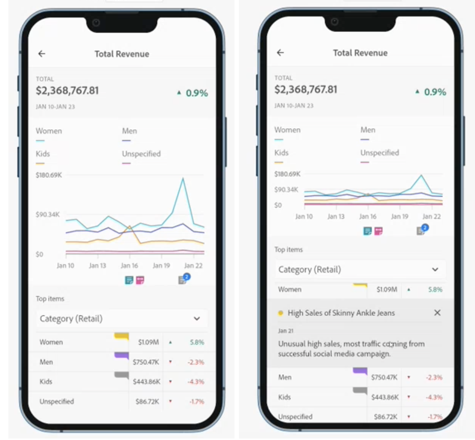

# モバイルスコアカードでの注釈の共有

Workspace で作成された注釈をモバイルスコアカードに表示できます。 これにより、組織やキャンペーンに対して、スコアカード内で直接、コンテキストデータのニュアンスやインサイトを共有できます。

モバイルスコアカードの注釈は、いくつかの追加機能を持つ Workspace 注釈と同様に機能します。 例えば、Workspace では、日付範囲に対してテーブルレベルの注釈を作成できます。 モバイルスコアカードで、カテゴリレベルの注釈を表示します。 これにより、モバイルスコアカードユーザーに対する追加のコンテキストが提供されます。
__例を追加 — または違いを説明する詳細情報

??Mobile にはどのような追加機能がありますか？

## モバイルスコアカードへの注釈の追加

モバイルスコアカードに表示される注釈は、Workspace 注釈作成方法を使用して Workspace で作成されます。 注釈の作成について詳しくは、 [注釈の作成](create-annotations.md).

1. 注釈をオンにする。 注釈をオンにするには、 [注釈のオン/オフの切り替え](https://experienceleague.adobe.com/docs/analytics-platform/using/cja-components/annotations/overview.html?lang=en#turn-annotations-on-or-off).

1. 注釈を作成して_global プロジェクトに割り当てます。 Workspace で注釈を作成するには、 [注釈の作成](create-annotations.md).

1. 選択 **注釈を表示** 「モバイルスコアカード」に注釈を表示するには

注釈の表示が選択されていることを確認するには、に移動します。 **プロジェクト** > **プロジェクト情報と設定**.

## モバイルスコアカードでの注釈の表示

Workspace では、ビルダーで注釈を検証できます。 プレビューモードを使用して、注釈の付いたモバイルスコアカードを表示することもできます。

モバイルデバイスで注釈を表示するには、「モバイルスコアカード」で注釈アイコンをタップします。 左右にスワイプして、追加の注釈を表示します。 これにより、すべての注釈をすばやく表示できます。

ドーナツグラフを表__すると、指標に適用された注釈の概要が右下隅に表示されます。

## モバイルスコアカードの注釈に関する考慮事項

* 注釈がカテゴリに適用され、ユーザがそのカテゴリ表示から切り替えると、注釈は消えます。 注釈は、関連付けられたカテゴリにのみ表示されます。

* 注釈はデフォルトでオフになっています。

## 注釈の色

注釈を作成する際に、スコアカードに表示される注釈に特定の色を割り当てます。 グレーで表示される注釈は、同じカテゴリに複数の注釈が割り当てられていることを示します。 それ以外の場合は、注釈は Workspace で設定された色で表示されます。
