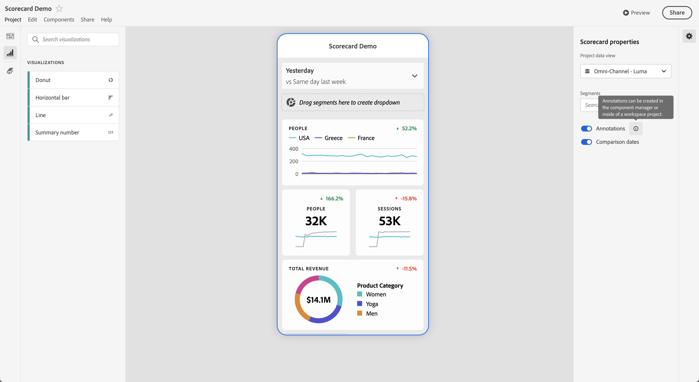

# モバイルスコアカードで注釈を共有

Workspaceで作成される注釈をモバイルスコアカードに表示できます。 モバイルスコアカードの注釈を使用すると、組織とキャンペーンに関するコンテキストデータのニュアンスやインサイトを共有できます。

## モバイルスコアカードで注釈を表示

モバイルスコアカードに注釈を表示するには、まずワークスペースプロジェクトまたはコンポーネントメニューから注釈を作成します。

注釈の作成について詳しくは、[ 注釈を作成 ](create-annotations.md) を参照してください。 モバイルスコアカードでは、注釈はデフォルトで無効になっており、モバイルスコアカードで表示する各スコアカードに対して有効にする必要があります。

1. 注釈を有効にします。注釈を有効にするには、[注釈の有効／無効の切り替え](overview.md#turn-annotations-on-or-off)を参照してください。

1. 注釈を作成し、すべてのプロジェクトで共有されていることを確認します。詳しくは、[ 注釈を作成 ](create-annotations.md) を参照してください。

1. **[!UICONTROL 注釈を表示]**&#x200B;を選択し、モバイルスコアカードに注釈を表示します。

   

   必要に応じて、「**[!UICONTROL プロジェクト]**」/「**[!UICONTROL プロジェクト情報と設定]** で「**[!UICONTROL 注釈を表示]**」が選択されていることを確認できます

## モバイルスコアカードで注釈を表示

注釈を有効にすると、スコアカードビルダーに注釈アイコンが表示されます。 注釈は、詳細ビューのグラフとテーブルにのみ表示されます。注釈は、スコアカードのメインタイル表示には表示されません。

注釈アイコンが表示されている場合、ビルダーキャンバスで注釈を完全に表示したり操作したりすることはできません。 **[!UICONTROL Preview]** を使用して、アプリに表示される注釈を表示し、操作します。

注釈の色は、Workspaceで注釈を作成する際に選択します。 グレーの注釈は、複数の注釈が存在することを示しています。

## 注釈をプレビュー

 プレビューを使用して注釈をプレビューできます。 注釈を選択して、注釈の詳細を開きます。

さらに多くの注釈を利用できる場合、注釈の下部に複数のドット（●）が表示されます。 左または右にスワイプして、注釈を切り替えます。
