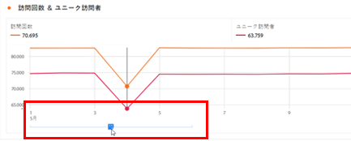
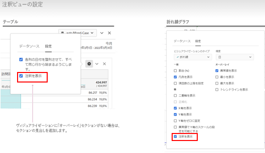
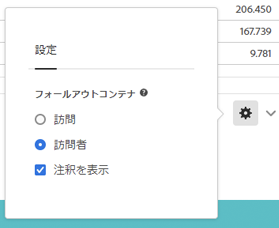

# 注釈の概要

注釈を使用すると、コンテキストデータのニュアンスとインサイトを組織に効果的に伝えることができます。カレンダーイベントを特定のディメンションや指標に関連付けることができます。日付や日付範囲に、既知のデータ問題、祝日、キャンペーン開始などの注釈を付けることができます。次に、イベントをグラフィカルに表示し、キャンペーンやその他のイベントがサイトトラフィックや売上高、その他の指標に影響を与えたかどうかを確認できます。

例えば、プロジェクトを組織と共有しているとします。マーケティングキャンペーンによりトラフィックが大きく急増した場合は、「キャンペーンの開始日」注釈を作成して、データビュー全体に対してスコーピングを設定できます。 ユーザーがその日付を含むデータセットを表示すると、データと共に、プロジェクト内の注釈が表示されます。

次の点に注意してください。

* 注釈は、単一の日付または日付範囲に関連付けることができます。

* データセット全体に適用することも、指定した指標、ディメンション、セグメントに適用することもできます。

* 作成されたプロジェクト（デフォルト）またはすべてのプロジェクトに適用できます。

* 作成されたデータビュー（デフォルト）またはすべてのデータビューに適用できます。

## 権限

デフォルトでは、管理者のみが注釈を作成できます。ユーザーは、他の Analytics コンポーネント（セグメント、計算指標など）と同様に、注釈を表示する権限を持ちます。

ただし、管理者は、[Adobe Admin Console](https://experienceleague.adobe.com/docs/analytics/admin/admin-console/permissions/analytics-tools.html?lang=ja) を介してユーザーに[!UICONTROL 注釈の作成]権限（Analytics ツール）を付与できます。

## 注釈のオンまたはオフ {#annotations-on-off}

注釈は、複数のレベルでオンまたはオフにできます。

* ビジュアライゼーションレベル： [!UICONTROL ビジュアライゼーション]設定／[!UICONTROL 注釈を表示]

* プロジェクトレベル：[!UICONTROL プロジェクト情報と設定]／[!UICONTROL 注釈を表示]

* ユーザーレベル：[!UICONTROL コンポーネント]／[!UICONTROL ユーザー環境設定]／[!UICONTROL データ]／[!UICONTROL 注釈を表示]

