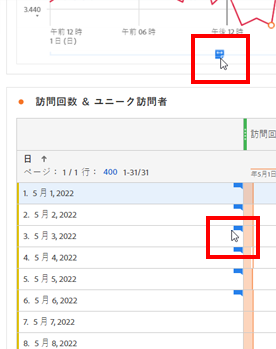
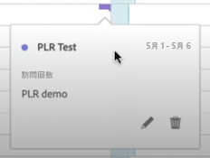
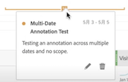
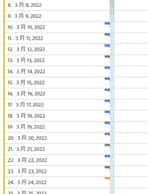
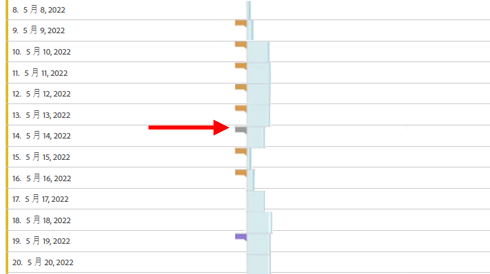
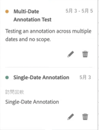
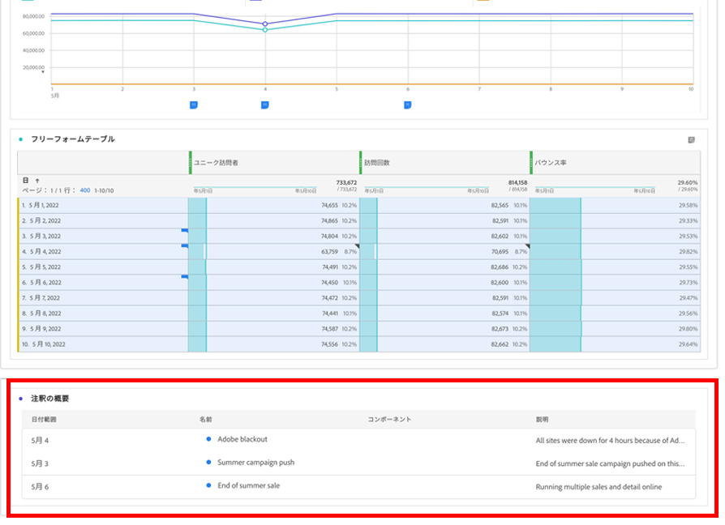
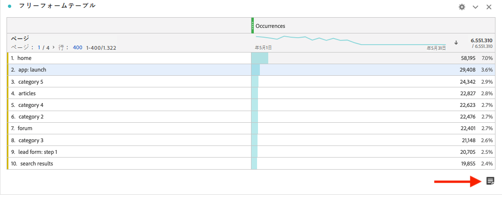
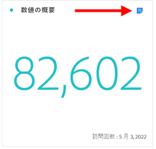

# 注釈を表示

注釈の表示方法は、1 日単位か日付範囲かによって若干異なります。

## 折れ線グラフまたは表で注釈を表示

| 日付 | 外観 |
| --- | --- |
| **1 日** | 
注釈の上にマウスポインターを置くと、その詳細が表示されます。また、ペンアイコンを選択して注釈を編集することも、注釈を削除することもできます。
  |
| **日付範囲** | アイコンが変わり、その上にマウスポインターを置くと、日付範囲が表示されます。

折れ線グラフで選択すると、注釈のメタデータが表示され、それを編集または削除できます。            
テーブルでは、日付範囲のすべての日付にアイコンが表示されます。
 |
| **重複する注釈** | 複数の注釈が関連付けられている日のアイコンはグレーになります。

グレーのアイコンの上にマウスポインターを置くと、重複するすべての注釈が表示されます。
 |

{style="table-layout:auto"}

## .pdf ファイルで注釈を表示

.pdf ファイルのアイコンにカーソルを合わせることができないため、このファイル（エクスポート後）では、パネルの下部に説明のメモが表示されます。次に例を示します。

## トレンドのないデータを含む注釈の表示

トレンドのないデータで、特定のディメンションに関連付けられた注釈が表示されることがあります。その場合は、右下隅の概要注釈にのみ表示されます。次に例を示します。

概要グラフは、トレンドのないフリーフォームテーブルおよび要約数値だけでなく、すべてのビジュアライゼーションのタイプの隅に表示されます。また、[!UICONTROL ドーナツ]、[!UICONTROL フロー]、[!UICONTROL フォールアウト]、[!UICONTROL コホート]などのビジュアライゼーションにも表示されます。

