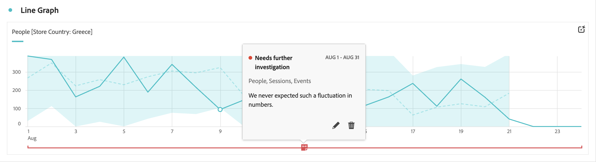

# 注釈を表示

注釈の表示場所と、1日または日付範囲のどちらに表示されるかによって、注釈の表示が少し異なります。

## 折れ線グラフまたは表で注釈を表示

| ビジュアライゼーションの タイプ | 説明 |
| --- | --- |
| **折れ線グラフの&#x200B;** **1 日** | 折れ線グラフのビジュアライゼーションで「」を選択すると、注釈の詳細を含むポップアップが表示されます。  ：[注釈ビルダー](create-annotations.md#annotation-builder)で注釈を編集するには、「」を選択します。 注釈を削除するには、「」を選択します。 |
| **折れ線グラフの&#x200B;** **日付範囲** | 「」を選択すると、注釈の詳細を含むポップアップと、日付範囲を示す折れ線グラフが下部に表示されます。 ：[注釈ビルダー](create-annotations.md#annotation-builder)で注釈を編集するには、「」を選択します。 注釈を削除するには、「」を選択します。 |
| **フリーフォームテーブル** | フリーフォームテーブルでは、ビジュアライゼーションの右上にある注釈ボタンからすべての注釈にアクセスできます。 「」を選択して、すべての注釈の（スクロールリスト）を表示します。  ：注釈ごとに、「」を選択して[注釈ビルダー](create-annotations.md#annotation-builder)で注釈を編集し、「」を選択して注釈を削除できます。 |

{style="table-layout:auto"}

## PDF での注釈の表示

プロジェクトを PDF としてダウンロードするか、プロジェクトを PDF として送信すると、注釈は「注釈の概要」セクションに PDF で要約されます。

