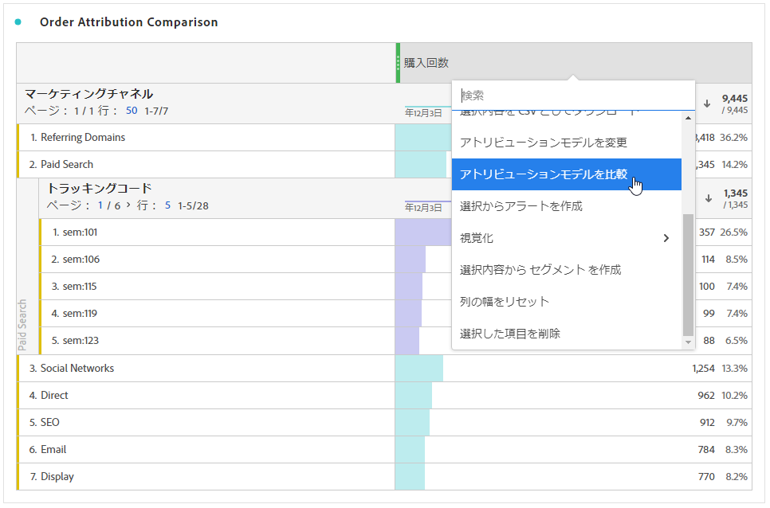

# 指標

指標を使用すると、Analysis Workspaceでデータポイントを定量化できます。 最も一般的に、ビジュアライゼーションの列として使用され、ディメンションに結び付けられます。

## 指標のタイプ

Adobeは、Analysis Workspaceで使用する複数のタイプの指標を提供します。

* **標準指標**:標準指標の例としては、人、セッション、イベントがあります。

* **計算指標** :標準指標、静的数値、アルゴリズム関数に基づくユーザー定義の指標。

* **計算指標テンプレート**   :Adobe定義の指標で、計算指標と同じ動作をします。 これらは、Workspace プロジェクト内でそのまま使用することも、コピーを保存してロジックをカスタマイズすることもできます。

指標が承認されているかどうかを確認できます   またはそうでない。 指標の詳細を表示するには、指標の上にマウスポインターを置いて、「 .

指標は、Analysis Workspace内で柔軟に使用できます。 空のフリーフォームテーブルに指標をドラッグして、その指標がプロジェクトの日付期間にトレンド表示されていることを確認します。 また、ディメンションが存在する場合に指標をドラッグして、各ディメンション項目と比較した指標を確認できます。 既存の指標ヘッダーの上にある指標をドラッグすると、その指標が置き換えられます。ヘッダーの横にある指標をドラッグすると、両方の指標が並べて表示されます。

## 計算指標 

計算指標を使用すると、単純な演算子や統計関数を使用して、指標が相互にどのように関連しているかを簡単に確認できます。 計算指標を作成する方法はいくつかあります。

次を選択できます。 **[!UICONTROL コンポーネント]** > **[!UICONTROL 計算指標]**. これにより、 [計算指標ビルダー](/help/components/calc-metrics/calc-metr-overview.md)：既存の指標からカスタム指標を作成できます。

計算指標をすばやく簡単に作成できるように、フリーフォームテーブルの列の右クリックメニューに「**[!UICONTROL 選択から指標を作成]**」が追加されました。このオプションは、ヘッダー列のセルが 1 つ以上選択されると表示されます。

[計算指標： 実装なしの指標](https://experienceleague.adobe.com/docs/analytics-learn/tutorials/components/calculated-metrics/calculated-metrics-implementationless-metrics.html?lang=ja)（3:42）

## 様々なアトリビューションモデルとの指標の比較

アトリビューションモデル同士をすばやく簡単に比較したい場合は、指標を右クリックし、「 **[!UICONTROL アトリビューションモデルの比較]**:

これにより、指標にドラッグして設定を 2 回おこなわなくても、アトリビューションモデルをすばやく簡単に相互比較できます。
