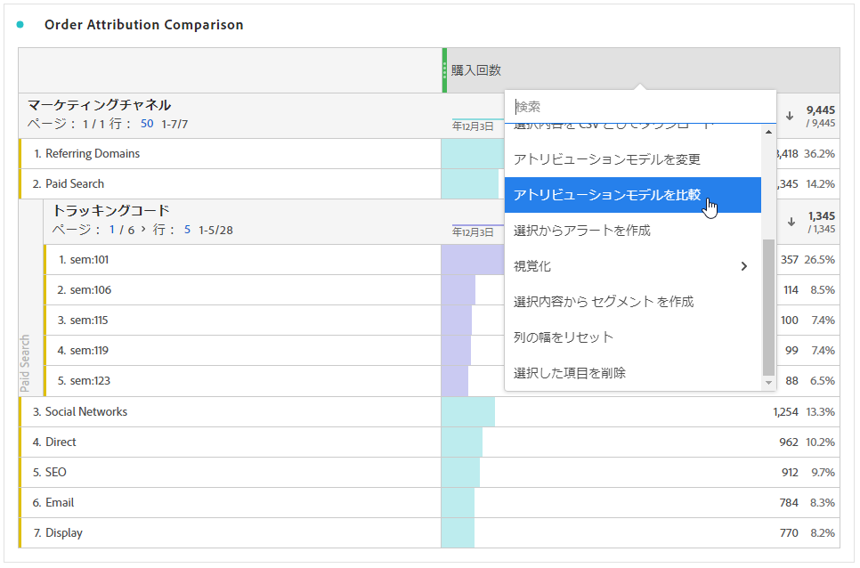

# 指標

指標を使用すると、Analysis Workspace でデータポイントを数量化できます。 これらは、ビジュアライゼーション内の列として最も一般的に使用され、ディメンションに関連付けられます。

## Analysis Workspace での指標の使用

Analysis Workspaceでは、指標を柔軟に使用できます。 指標を空のフリーフォームテーブルにドラッグすると、指標がプロジェクトの日付期間にわたってトレンド表示されます。 ディメンションが存在する場合は、指標をドラッグして、各ディメンション項目と比較した指標を表示することもできます。 既存の指標ヘッダーの上に指標をドラッグすると、その指標に置き換わり、ヘッダーの横にある指標をドラッグすると、両方の指標を並べて表示できます。

Analysis Workspaceに指標やその他の種類のコンポーネントを追加する方法について詳しくは、[Analysis Workspaceでのコンポーネントの使用](/help/components/use-components-in-workspace.md)を参照してください。

## 指標のタイプ

アドビでは、Analysis Workspace で使用するためのいくつかのタイプの指標を提供しています。

* **標準指標**：標準指標の例は、ユーザー、セッション、イベントです。

  Adobe Analyticsとは異なり、Customer Journey Analyticsでは、接続とデータビューの範囲内で、標準の指標を柔軟に定義できます。

   * **人物**: Customer Journey Analyticsの人物メトリックは、人物IDの異なるカウントです。 接続でデータセットを設定する際に人物IDとして選択した内容に応じて、人物の指標は異なる意味を持つことができます。
   * **セッション**: Customer Journey Analyticsのセッション指標は、データビューのセッション設定の一部として定義されるものです。 [&#x200B; セッション設定](/help/data-views/session-settings.md)を参照してください。
   * **イベント**: Customer Journey Analyticsのイベント指標は、接続の一部として設定したイベントデータセットの一部であるイベントで構成されます。

  標準指標の完全なリストについては、[標準指標](#standard-metrics)を参照してください。

* **計算指標** ：標準指標、静的数値、またはアルゴリズム関数に基づくユーザー定義の指標。

* **計算指標テンプレート** ：計算指標と同様に動作するAdobe定義の指標。 Workspace プロジェクトでそのまま使用することも、コピーを保存してロジックをカスタマイズすることもできます。 [既定の計算指標](calc-metrics/cm-workflow/../default-calcmetrics.md)を参照してください。

指標が承認されているかどうかを確認できます。 指標の詳細が必要な場合は、指標にカーソルを合わせて、を選択します。 詳しくは、[&#x200B; コンポーネント情報](use-components-in-workspace.md#component-info)を参照してください。

## 標準指標

Customer Journey Analyticsの標準指標の完全なリスト：
{{standard-metrics}}

## 計算指標の作成

計算指標を使用すると、簡単な演算子や統計関数を使用して、指標の相互関係を簡単に設定できます。 詳しくは、[計算指標の概要](/help/components/calc-metrics/calc-metr-overview.md)を参照してください。

計算指標を作成するには、いくつかの方法があります。 選択した方法によって、計算指標がすべてのプロジェクトでコンポーネントリストから使用できるか、または計算指標が作成されたプロジェクトでのみ使用できるかが決まります。

### すべてのプロジェクトの計算指標の作成

[計算指標ビルダー](/help/components/calc-metrics/cm-workflow/cm-build-metrics.md)を使用して、[計算指標を作成](/help/components/calc-metrics/cm-workflow/cm-workflow.md)できます。 この方法で作成すると、コンポーネントリストで計算指標を使用できるようになります。このリストは、組織全体のプロジェクトで使用できます。

### 単一プロジェクトの計算指標の作成

計算指標は、作成されたプロジェクトでのみ使用できる計算指標をすばやく作成できます。

単一プロジェクトの計算指標を作成するには：

1. Analysis Workspaceで、計算指標を作成するプロジェクトを開きます。

1. フリーフォームテーブルで、1つの列の列ヘッダーを右クリックします。

   または

   Shift キーを押しながら2つの列を選択し、選択した列のいずれかを右クリックします。

1. **[!UICONTROL 選択範囲から指標を作成]**&#x200B;を選択

   選択範囲から作成を強調表示する

1. このプロジェクトのみの計算指標を作成するには、使用可能なオプションから選択します。

   1つの列を選択すると、次のオプションを使用できます。

   * [!UICONTROL **平均**]：列のディメンション要素セットの平均値を示す新しい列を作成します。 これは[Mean](/help/components/calc-metrics/cm-functions.md#mean)関数を使用します。

   * [!UICONTROL **中央値**]：列のディメンション要素セットの中央値を示す新しい列を作成します。 これは[Median](/help/components/calc-metrics/cm-functions.md#median)関数を使用します。

   * [!UICONTROL **列の最大値**]：列のディメンション要素セットの最大値を示す新しい列を作成します。 これには、[列最大値](/help/components/calc-metrics/cm-functions.md#column-maximum)関数が使用されます。

   * [!UICONTROL **列の最小**]：列のディメンション要素のセットの最小値を示す新しい列を作成します。 これは、[列最小値](/help/components/calc-metrics/cm-functions.md#column-minimum)関数を使用します。

   * [!UICONTROL **列の合計**]:Creates&#x200B;列（ディメンションの要素をまたいで）列内の指標のすべての数値を追加する新しい列。 これは、[列合計](/help/components/calc-metrics/cm-functions.md#column-sum)関数を使用します。

   2つの列を選択すると、次のオプションを使用できます。

   * [!UICONTROL **除算**]：選択した2つの列の値を除算する新しい列を作成します。

   * [!UICONTROL **減算**]：選択した2列の値を減算する新しい列を作成します。

   * [!UICONTROL **追加**]：選択した2列の値を追加する新しい列を作成します。

   * [!UICONTROL **乗算**]：選択した2つの列の値を乗算する新しい列を作成します。

   * [!UICONTROL **変化率**]：選択した2つの列の変化率を示す新しい列を作成します。

## 様々なアトリビューションモデルとの指標の比較

指標の1つのアトリビューションモデルを別のアトリビューションモデルにすばやく比較するには、指標のコンテキストメニューから「**[!UICONTROL アトリビューションモデルを比較]**」を選択します。

このショートカットを使用すると、指標をドラッグして2回設定することなく、あるアトリビューションモデルを別のアトリビューションモデルと比較できます。

