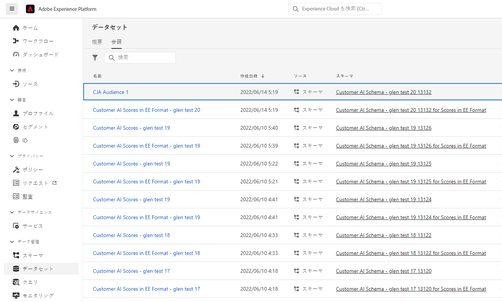

# Customer Journey Analytics

以前に作成したオーディエンスを管理することで、

* **スケジュール設定またはスケジュール解除** オーディエンスの自動更新/更新 スケジュールの最大有効期限は 1 年です。
* **オーディエンスの更新スケジュールを更新** それが期限切れになろうとしている時 有効期限が切れるオーディエンスは、予定レポートの有効期限の切れと同様に扱われます。管理者は、スケジュールの期限が切れる 1 ヶ月前に電子メールを受け取ります。
* **オーディエンスが最後に更新された日時を表示**
* 次の項目に関するインサイトを得る **オーディエンスの作成に要した時間** Customer Journey Analytics(CJA) から。また、オーディエンスがアクティブ化のためにリアルタイム顧客プロファイルに表示されるまでに要した時間です。
* CJA のオーディエンスが **リアルタイム顧客プロファイルでアクティブに使用されている** または（理想的に）CJA で作成されたオーディエンスを使用するExperience Platformアプリケーション。

## 管理 UI

スクリーンショット

| UI 設定 | 定義 |
| --- | --- |
| フィルターを表示/非表示 | 左側のパネルで以下のフィルターの表示/非表示を切り替えることができます。 <ul><li>データビュー</li><li>所有者</li><li>更新頻度</li><li>タグ</li></ul> |
| タイトルと説明 |  |
| データビュー |
| オーディエンスサイズ |  |
| 所有者 |  |
| 更新頻度 |  |
| タグ |  |
| 最終更新日 |  |
| 最終変更日 |  |

{style=&quot;table-layout:auto&quot;}

## Experience Platformでの CJA オーディエンスの表示と使用

Platform で CJA オーディエンスを表示するには、次に進みます。 [!UICONTROL セグメント] > [!UICONTROL セグメントの作成] > [!UICONTROL オーディエンス] タブ/ [!UICONTROL CJA オーディエンス].

このオーディエンスを AEP データレイクに書き出す場合は、XDM 個別プロファイルスキーマクラスに準拠するデータセットとして表示されます。

