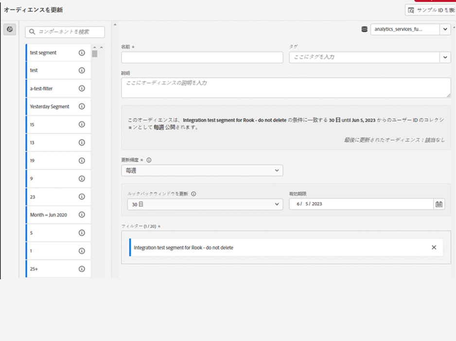
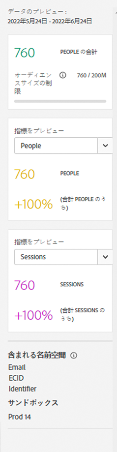
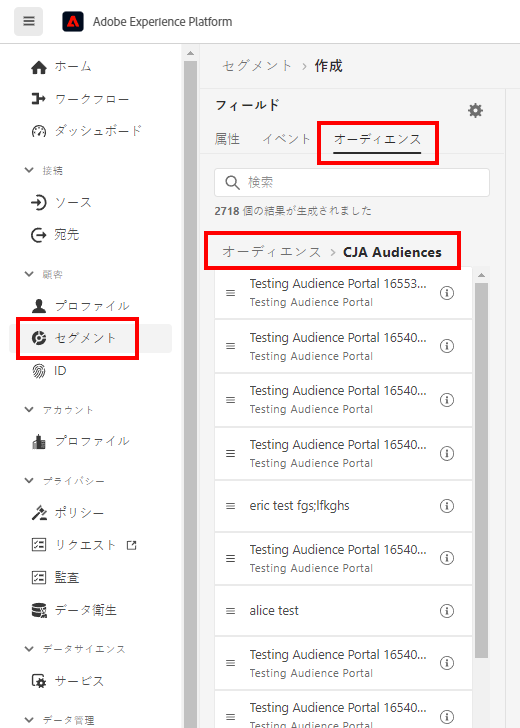

# オーディエンスの作成と公開

このトピックでは、Customer Journey Analytics（CJA）で検出されたオーディエンスを作成して Adobe Experience Platform の[リアルタイム顧客プロファイル](https://experienceleague.adobe.com/docs/experience-platform/profile/home.html?lang=ja)（RTCP）に公開し、顧客のターゲティングやパーソナライゼーションに使用する方法について説明します。

この[概要](/help/components/audiences/audiences-overview.md)を参照して、CJA オーディエンスの概念を理解してください。

## オーディエンスを作成 {#create}

1. オーディエンスを作成する際には、3 つの方法で開始できます。

   | 作成方法 | 詳細 |
   | --- | --- |
   | メイン&#x200B;**[!UICONTROL コンポーネント]／[!UICONTROL オーディエンス]**&#x200B;メニューから | Audiences Manager ページが開きます。「**[!UICONTROL オーディエンスを作成]**」をクリックすると、[!UICONTROL オーディエンスビルダー]が開きます。 |
   | フリーフォームテーブル内から | フリーフォームテーブルの項目を右クリックし、「**[!UICONTROL 選択範囲からオーディエンスを作成]**」を選択します。この方法を使用すると、フィルターに、テーブルで選択したディメンションまたはディメンション項目があらかじめ入力されます。 |
   | フィルターの作成／編集 UI から | 「**[!UICONTROL このフィルターからオーディエンスを作成]**」ボックスをオンにします。この方法を使用すると、フィルターが事前に設定されます。 |

   {style=&quot;table-layout:auto&quot;}

1. オーディエンスを構築します。

   オーディエンスを公開する前に、これらの設定を行います。

   

   | 設定 | 説明 |
   | --- | --- |
   | [!UICONTROL 名前] | オーディエンスの名前。 |
   | [!UICONTROL タグ] | 組織的な目的でオーディエンスに割り当てるタグ。既存のタグを使用するか、新しいタグを入力できます。 |
   | [!UICONTROL 説明] | 他のオーディエンスと区別するために、オーディエンスに関する適切な説明を追加します。 |
   | [!UICONTROL 更新頻度] | オーディエンスを更新する頻度。<ul><li>更新を必要としない 1 回限りのオーディエンス（デフォルト）の作成を選択できます。これは、特定の 1 回限りのキャンペーンなどに役立ちます。</li><li>その他の更新間隔を選択できます。4 時間の更新頻度の場合、CJA 使用権限に応じて、75～150 個のオーディエンスの更新という制限があります。</li></ul> |
   | 有効期限 | オーディエンスが更新を停止したとき。デフォルトは作成日の 1 年後です。有効期限が近づいたオーディエンスは、予定レポートの有効期限が近づいた場合と同様に扱われます。管理者は、オーディエンスの期限が切れる 1 か月前にメールを受け取ります。 |
   | ルックバックウィンドウを更新 | このオーディエンスの作成時にデータウィンドウ内でどのくらい遡るかを指定します。最大 90 日です。 |
   | [!UICONTROL 1 回限りの日付範囲] | 1 回限りのオーディエンスを公開する日付範囲。 |
   | [!UICONTROL フィルター] | フィルターは、オーディエンスに対する主な入力です。最大 20 のフィルターを追加できます。これらのフィルターは、`And` または `Or` 演算子と結合させることができます。 |
   | [!UICONTROL サンプル ID を表示] | このオーディエンスの ID の例。サンプル ID を検索するには、検索バーを使用します。 |

   {style=&quot;table-layout:auto&quot;}

1. データのプレビューを解釈します。

   オーディエンスのプレビューが右側のパネルに表示されます。作成したオーディエンスの要約分析が可能になります。

   

   | プレビュー設定 | 説明 |
   | --- | --- |
   | [!UICONTROL データのプレビュー]ウィンドウ | オーディエンスの日付範囲。 |
   | [!UICONTROL 人物合計] | このオーディエンスの合計人数の概要。人数は 2,000 万人になることもあります。オーディエンスが 2,000 万人を超える場合は、オーディエンスを公開する前にサイズを小さくする必要があります。 |
   | [!UICONTROL オーディエンスサイズの制限] | このオーディエンスが 2,000 万の上限からどの程度離れているかを示します。 |
   | [!UICONTROL オーディエンス再来訪の見込み] | この設定は、このオーディエンスでサイトを再来訪した顧客をリターゲティングする場合に役立ちます。（つまり、このデータセットに再び表示されます。） 
ここでは、再来訪の可能性がある顧客の推定数に対して期間（7 日間、次の 2 週間、次の月）を選択できます。 |
   | [!UICONTROL 再来訪する見込み] | この数により、ドロップダウンリストから選択した期間内の再訪問者の推定数が表示されます。このオーディエンスの過去のチャーンレートを調べて、この数を予測します。 |
   | [!UICONTROL 指標をプレビュー] | この設定を使用すると、特定の指標を調べて、このオーディエンスがこの指標（「[!UICONTROL 売上高]または「[!UICONTROL サイトでの平均時間]」など）に対して不相応な貢献を行っているかどうかを確認できます。指標の集計数と、指標が表す合計のパーセンテージが表示されます。データビューで使用できる任意の指標を選択できます。 |
   | [!UICONTROL 含まれる名前空間] | オーディエンス内のユーザーに関連付けられている特定の名前空間。例としては、ECID、CRM ID、メールアドレスなどがあります。 |
   | [!UICONTROL サンドボックス] | このオーディエンスが格納されている [Experience Platform サンドボックス](https://experienceleague.adobe.com/docs/experience-platform/sandbox/home.html?lang=ja)。このオーディエンスを Platform に公開すると、このサンドボックスの範囲内でのみ操作できます。 |

   {style=&quot;table-layout:auto&quot;}

1. オーディエンスの設定を再度確認し、「**[!UICONTROL 公開]**」をクリックします。

   すべてが正常に動作した場合は、オーディエンスが公開されたことを示す確認メッセージが表示されます。このオーディエンスは、1 ～ 2 分で Experience Platform に表示されます。（何百万人ものメンバーを持つオーディエンスの場合でも、所要時間は 5 分未満です。）

1. 同じメッセージ内で「**[!UICONTROL AEP でのオーディエンスの表示]**」をクリックすると、Adobe Experience Platform の [セグメント UI](https://experienceleague.adobe.com/docs/experience-platform/segmentation/ui/overview.html?lang=ja) に移動します。詳しくは、次を参照してください。

## オーディエンスの作成後の動作 {#after-audience-created}

オーディエンスを作成した後、Adobeは新しい CJA オーディエンスごとにExperience Platformストリーミングセグメントを作成します。

* AEP セグメントは、CJA オーディエンスと同じ名前/説明を共有しますが、一意であることを確認するために、名前に CJA オーディエンス ID が追加されます。

* CJA オーディエンスの名前/説明が変更されると、AEP セグメントの名前/説明にもその変更が反映されます。

* CJA オーディエンスがユーザーによって削除された場合、AEP セグメントは削除されません。 理由は、CJA オーディエンスが後で削除解除される可能性があるからです。

## Experience Platform での CJA オーディエンスの使用 {#audiences-aep}

CJA は、公開済みのオーディエンスからすべての名前空間と ID の組み合わせを取得し、それらをリアルタイム顧客プロファイル (RTCP) にストリーミングします。 CJA は、プライマリ ID セットとして選択した内容に従って、オーディエンスをExperience Platformに送信します。 [!UICONTROL 人物 ID] 接続が設定された時点で。

次に、RTCP は、各名前空間／ID の組み合わせを調べ、その組み合わせが含まれている可能性のあるプロファイルを探します。プロファイルは、基本的に、リンクされた名前空間、ID およびデバイスのクラスターです。プロファイルが見つかると、名前空間と ID がこのプロファイル内の他の ID にセグメントメンバーシップ属性として追加されます。現在は、例えば、「user@adobe.com」をすべてのデバイスおよびチャネルにわたってターゲットに設定できます。プロファイルが見つからない場合は、新しく作成されます。

Platform で CJA オーディエンスを表示するには、**[!UICONTROL セグメント]**／**[!UICONTROL セグメントの作成]**／「**[!UICONTROL オーディエンス]**」タブ／**[!UICONTROL CJA オーディエンス]**&#x200B;に移動します。

CJA オーディエンスを AEP セグメントのセグメント定義にドラッグできます。

## よくある質問（FAQ） {#faq}

オーディエンスの投稿に関するよくある質問です。

+++**CJA でユーザーがオーディエンスのメンバーでなくなった場合**

この場合、exit イベントが CJA から Experience Platform に送信されます。

+++

+++**CJA でオーディエンスを削除するとどうなりますか。**

CJA オーディエンスが削除されると、そのオーディエンスは Experience Platform UI に表示されなくなります。 ただし、そのオーディエンスに関連付けられたプロファイルは、実際には Platform では削除されません。

+++

+++**対応するプロファイルが RTCDP に存在しない場合、新しいプロファイルが作成されますか。**

はい、そうします。

+++

+++**CJA は、オーディエンスデータをパイプラインイベントとして送信しますか、それともデータレイクに送られるフラットファイルですか。**

CJA は、パイプラインを介してデータを RTCP にストリーミングし、このデータもデータレイクのシステムデータセットに収集されます。

+++

+++**CJA はどの ID を送信しますか。**

で使用された ID/名前空間のペア [接続の設定](https://experienceleague.adobe.com/docs/analytics-platform/using/cja-connections/create-connection.html?lang=ja#create-connection). 特に、ユーザーが「ユーザー ID」として使用するフィールドを選択する手順です。

+++

+++**プライマリ ID として選択されるのは、どの ID ですか？**

上記を参照してください。CJA の「ユーザー」ごとに 1 つの ID のみを送信します。

+++

+++**RTCP は CJA メッセージも処理しますか。 CJA は、オーディエンス共有を通じて ID をプロファイル ID グラフに追加できますか？**

いいえ。「人」ごとに 1 つの ID しか送信しないので、RTCP が使用するグラフエッジは存在しません。

+++

## 次の手順

* このオーディエンスを管理するには、[管理 UI](/help/components/audiences/manage.md) に移動します。
