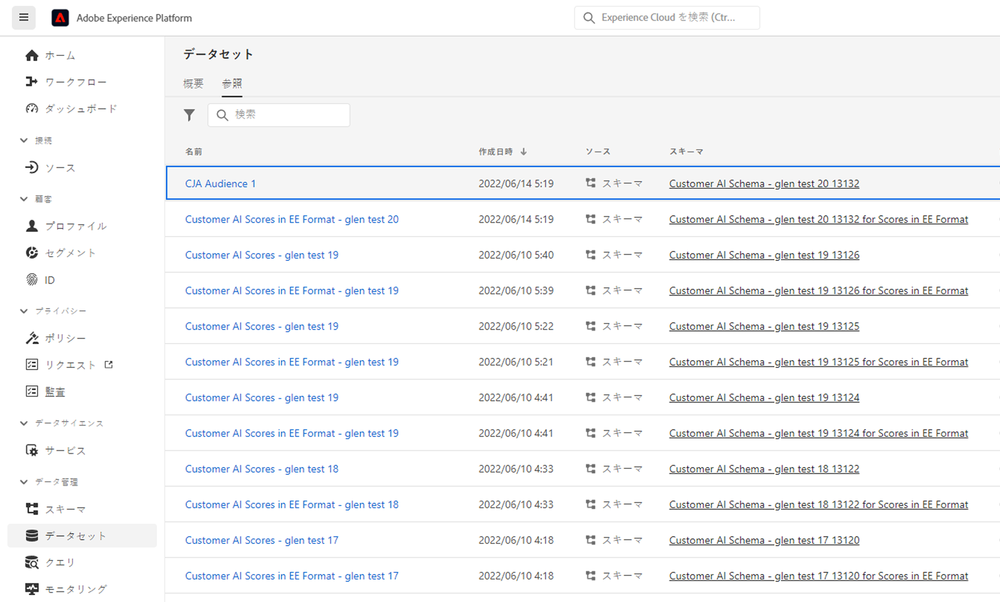

# オーディエンスの作成と公開

>[!NOTE]
>
>この機能は、現在、 [限られたテスト](/help/release-notes/releases.md).

このトピックでは、Customer Journey Analytics(CJA) で検出されたオーディエンスを作成し、に公開する方法について説明します。 [リアルタイム顧客プロファイル](https://experienceleague.adobe.com/docs/experience-platform/profile/home.html?lang=ja) Adobe Experience Platformの（顧客のターゲティングとパーソナライゼーションのため）

こちらを読む [概要](/help/components/audiences/audiences-overview.md) を参照して、CJA オーディエンスの概念を理解してください。

## オーディエンスを作成

1. オーディエンスを作成するには、次の 3 つの方法で開始できます。

   | 作成方法 | 詳細 |
   | --- | --- |
   | メインから **[!UICONTROL コンポーネント] > [!UICONTROL オーディエンス]** メニュー | Audiences Manager ページが開きます。 クリック **[!UICONTROL オーディエンスを作成]** そして [!UICONTROL Audience builder] が開きます。 |
   | フリーフォームテーブル内から | フリーフォームテーブルの項目を右クリックし、「 」を選択します。 **[!UICONTROL 選択からオーディエンスを作成]**. この方法を使用すると、テーブルで選択したディメンションまたはディメンション項目でフィルターが事前設定されます。 |
   | フィルターの作成/編集 UI から | 次の項目をチェックします。 **[!UICONTROL このフィルターからオーディエンスを作成]**. この方法を使用すると、フィルターが事前に設定されます。 |

   {style=&quot;table-layout:auto&quot;}

1. オーディエンスを構築します。

   オーディエンスを公開する前に、これらの設定を行います。

   

   | 設定 | 説明 |
   | --- | --- |
   | [!UICONTROL 名前] | オーディエンスの名前。 |
   | [!UICONTROL タグ] | 組織的な目的でオーディエンスに割り当てるタグ。 既存のタグを使用するか、新しいタグを入力できます。 |
   | [!UICONTROL 説明] | 他のオーディエンスと区別するために、オーディエンスに関する適切な説明を追加します。 |
   | [!UICONTROL 更新頻度] | オーディエンスを更新する頻度。<ul><li>更新を必要としない 1 回限りのオーディエンス（デフォルト）を作成するように選択できます。これは、特定の 1 回限りのキャンペーンなどに役立ちます。</li><li>その他のリフレッシュ間隔を選択できます。 4 時間の頻度では、150 オーディエンスの制限があります。これは、この更新率が処理に大きく影響するからです。 その他の間隔では、オーディエンスの最大数はありません。</li></ul> |
   | 有効期限 | オーディエンスが更新を停止したとき。 デフォルトは作成日から 1 年先です。 有効期限が切れるオーディエンスは、予定レポートの有効期限の切れるのと同様に扱われます。管理者は、オーディエンスの期限が切れる 1 ヶ月前に E メールを受け取ります。 |
   | ルックバックウィンドウを更新 | このオーディエンスの作成時にデータウィンドウ内でどのくらい遡るかを指定します。 最大 は 90 日です。 |
   | [!UICONTROL 1 回限りの日付範囲] | 1 回限りのオーディエンスを公開する日付範囲。 |
   | [!UICONTROL フィルター] | フィルターは、オーディエンスに対する主な入力です。 最大 20 個のフィルターを追加できます。 これらのフィルターは、 `And` または `Or` 演算子 |
   | [!UICONTROL サンプル ID を表示] | このオーディエンスの ID の例。 サンプル ID を検索するには、検索バーを使用します。 |

   {style=&quot;table-layout:auto&quot;}

1. データのプレビューを解釈します。

   オーディエンスのプレビューが右側のパネルに表示されます。 これにより、作成したオーディエンスの高度な分析が可能になります。

   

   | プレビュー設定 | 説明 |
   | --- | --- |
   | [!UICONTROL データのプレビュー] window | オーディエンスの日付範囲。 |
   | [!UICONTROL 担当者合計] | このオーディエンスの合計ユーザー数の概要。 1 億人もの人々が集まります オーディエンスが 1 億人を超える場合、オーディエンスを公開する前にオーディエンスのサイズを小さくする必要があります。 |
   | [!UICONTROL オーディエンスサイズの制限] | このオーディエンスが 1 億件の制限からどの程度離れているかを表示します。 |
   | [!UICONTROL オーディエンス再来訪の見込み] | この設定は、このオーディエンスでサイトに戻った顧客をリターゲティングする場合に役立ちます。 （つまり、このデータセットに再び表示されます）。 
ここでは、再来訪するお客様の推定数の期間（7 日間、次の 2 週間、次の月）を選択できます。 |
   | [!UICONTROL 再来訪する見込み] | この数により、ドロップダウンリストから選択した期間内の再訪問者の推定数が表示されます。 このオーディエンスの過去のチャーンレートを調べて、この数を予測します。 |
   | [!UICONTROL 指標をプレビュー] | この設定を使用すると、特定の指標を調べて、このオーディエンスがこの指標に対して不均衡な貢献をしているかどうかを確認できます (「[!UICONTROL 売上高]&#39;または&#39;[!UICONTROL サイトでの平均時間]&#39;. 指標の集計数と、指標が表す合計の割合が表示されます。 データビューで使用できる任意の指標を選択できます。 |
   | 含まれる名前空間 | オーディエンス内のユーザーに関連付けられている特定の名前空間。 例としては、ECID、CRM ID、電子メールアドレスなどがあります。 |
   | サンドボックス | このオーディエンスが存在するExperience Platformサンドボックス。 このオーディエンスを Platform に公開する場合、このサンドボックスの範囲内でのみ操作できます。 |

   {style=&quot;table-layout:auto&quot;}

1. 問題がない場合は、 **[!UICONTROL 公開]**.

   すべてが正常に動作した場合は、オーディエンスが公開されたことを示す確認メッセージが表示されます。

1. クリック **[!UICONTROL AEP でのオーディエンスの表示]** 同じメッセージ内に表示されると、Adobe Experience Platformのセグメント UI に移動します。 詳しくは、以下を参照してください。

## Experience Platformでの CJA オーディエンスの使用

Platform で CJA オーディエンスを表示するには、次に進みます。 **[!UICONTROL セグメント]** > **[!UICONTROL セグメントの作成]** > **[!UICONTROL オーディエンス]** タブ/ **[!UICONTROL CJA オーディエンス]**.

CJA オーディエンスを AEP セグメントのセグメント定義にドラッグできます。

このオーディエンスを AEP データレイクに書き出す場合は、XDM 個別プロファイルスキーマクラスに準拠するデータセットとして表示されます。

## 次の手順

* このオーディエンスを管理するには、 [管理 UI](/help/components/audiences/manage.md).
