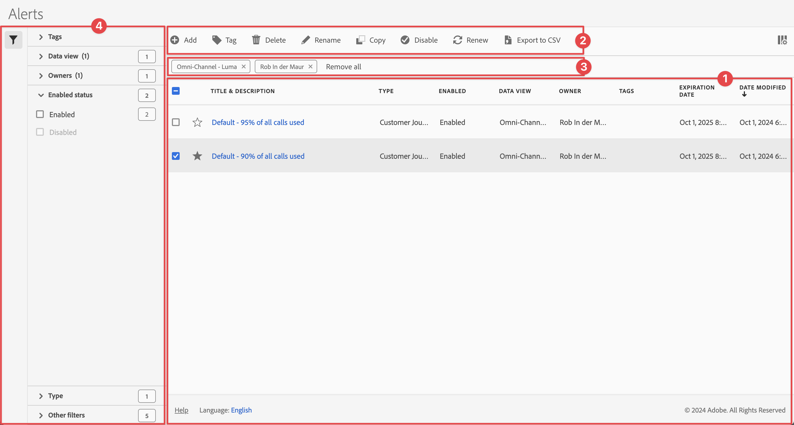

# アラートの管理

中央の[!UICONTROL  アラート ]管理インターフェイスから、アラートのフィルタリング、タグ付け、削除、名前の変更、コピー、有効化、更新の無効化、エクスポートを行うことができます。 アラートを管理するには：

* メインインターフェイスで「**[!UICONTROL コンポーネント]**」を選択し、「**[!UICONTROL アラート]**」を選択します。

アラートマネージャーは、[ セグメントマネージャー](/help/components/segments/seg-manage.md)と[計算指標マネージャー](/help/components/calc-metrics/cm-workflow/cm-manager.md)のような構造になっています。

## アラートマネージャー

アラートマネージャーには、次のインターフェイス要素があります。

### アラートリスト

アラート リスト ➊には、作成したアラートが表示されます。 管理者の場合は、すべてのアラートが表示されます。

リストには、次の列があります。

| 列 | 説明 |
|---|---|
|  | を優先するか、をアラートから除外するかを選択します。 |
| **[!UICONTROL タイトルと説明]** | アラートを編集するには、タイトルリンクを選択します。これにより、[ アラートビルダー](alert-builder.md#alert-builder)が開きます。 |
| **[!UICONTROL タイプ]** | このアラートがCustomer Journey Analytics データ アラートかServer Call usage アラートかを示します。 |
| **[!UICONTROL 有効]** | アラートが有効か無効かを示します。 |
| **[!UICONTROL データビュー]** | このアラートが適用されるデータビュー。 |
| **[!UICONTROL 所有者]** | アラートの所有者。 管理者以外の場合は、自分が所有するアラートのみが表示されます。 管理者はすべてのアラートを確認できます。 |
| **[!UICONTROL タグ]** | このアラートのタグ。 |
| **[!UICONTROL 有効期限]** | アラートの有効期限が切れるように設定されている日時。 |
| **[!UICONTROL 変更日時]** | アラートが最後に変更された日時。 |

<!-- When "Last used" column is added, add this information as the description: Shows the date when the alert was last used. 
This information can help you determine whether a component is valuable to users in your organization, where it is used, and if it needs to be deleted or modified.

Consider the following when viewing this column:
<ul><li>This information does not include usage from the API, Report Builder, or Data Warehouse.</li><li>For some components, this column might not contain data if the component was last used prior to September 2023.</li></ul> -->

 を使用して、表示する列を指定します。

### アクションバー

アクション バー➋を使用して、アラートに対してアクションを実行できます。 アクションバーには、次のアクションが含まれます。

| アイコン | アクション | 説明 |
|:---:|---|---|
|  | **[!UICONTROL 追加]** | [ アラートビルダー](alert-builder.md#alert-builder)を使用して、別のアラートを追加します。 |
|  | [!UICONTROL *タイトルで検索*] | リストでアラートが選択されていない場合は、この検索フィールドを使用してアラートを検索します。 |
|  | **[!UICONTROL タグ]** | 選択したアラートにタグを付けます。 **[!UICONTROL タグのアラート]** ダイアログで、選択したアラートのタグを選択または選択解除します。 選択したアラートのタグを保存するには、**[!UICONTROL 保存]**&#x200B;を選択します。 |
|  | **[!UICONTROL 削除]** | 選択したアラートを削除します。 確認メッセージが表示されます。 |
|  | **[!UICONTROL 名前変更]** | 選択した1つのアラートの名前を変更します。 選択すると、アラートの名前をインラインで変更できます。 |
|  | **[!UICONTROL コピー]** | 選択したアラートをコピーします。 新しいアラートが、同じ名前とサフィックス `(Copy)`で作成されます。 |
|  | **[!UICONTROL 有効]**&#x200B;または&#x200B;**[!UICONTROL 無効]** | 選択したアラートを有効または無効にします。 |
|  | **[!UICONTROL 更新]** | アラートの有効期限日を更新します。 有効期限は、元の有効期限に関係なく、このオプションを選択した日から1年間延長されます。 |
|  | **[!UICONTROL CSV に書き出し]** | アラートを`Alerts List.csv` ファイルにエクスポートします。 |

### アクティブなフィルターバー

フィルターバー➌には、フィルターパネルからアラートのリスト（存在する場合）に適用されたアクティブなフィルターが表示されます。  を使用すると、フィルターをすばやく削除できます。 複数のフィルターを指定した場合は、「**[!UICONTROL すべて削除]**」を使用すると、すべてのフィルターを削除できます。

### フィルターパネル

 **[!UICONTROL フィルター]**&#x200B;左側のパネル ➍を使用して、アラートのリストをフィルターできます。 フィルターパネルには、フィルターのタイプと、特定のフィルターを適用するアラートの数が表示されます。

1. 「」を選択して、フィルターパネルを開きます。 アラートリストの空き容量が必要な場合は、をもう一度選択してパネルを閉じることができます。
1. 使用可能なフィルターセクションからフィルターを選択します。

#### タグフィルターセクション

{{tagfiltersection}}

#### データビューのフィルターセクション

{{dataviewfiltersection}}

#### 所有者フィルターセクション

{{ownerfiltersection}}

#### 有効ステータスのフィルターセクション

{{enabledstatusfiltersection}}

#### タイプのフィルターセクション

{{typefiltersection}}

#### その他のフィルターのフィルターセクション

{{otherfiltersfiltersection}}

## アラートを編集

アラートは

* [[!UICONTROL  アラート ] リスト ](#alerts-list)で、アラートのタイトルを選択します。

[ アラートビルダー](alert-builder.md#alert-builder)を使用して、アラートを編集します。

## アラートのトラブルシューティング

アラートに関する問題のトラブルシューティングを行う場合は、JID （Job Instance ID）番号をAdobe サポートに提供します。 JID番号は、受信したアラートメール通知の下部にあります。

