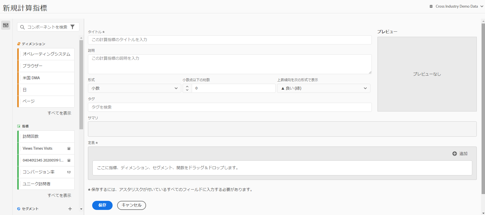

# 指標の作成

計算指標ビルダーのキャンバスにDimension、指標、フィルターおよび関数をドラッグ&amp;ドロップすると、コンテナ階層のロジック、ルールおよび演算子に基づいてカスタム指標を作成できます。 この統合開発ツールでは、シンプルな計算指標または複雑で高度な計算指標を作成および保存できます。

計算指標ビルダーにアクセスする方法はいくつかあります。

* Analysis Workspace で、プロジェクトを開いて、**[!UICONTROL + 新規作成]**／**[!UICONTROL 指標を作成]**&#x200B;をクリックします。
* [!DNL Analytics] で、**[!UICONTROL コンポーネント]**／**[!UICONTROL 計算指標]**&#x200B;を選択します。

* **[!UICONTROL 計算指標マネージャ]**&#x200B;の上部にある「[追加](/help/components/calc-metrics/cm-workflow/cm-manager.md)」をクリックします。または、

* **[!UICONTROL Analytics]**／**[!UICONTROL レポート]**&#x200B;を選択し、任意のレポートを開きます。次に、指標アイコン  をクリックして指標レールを表示し、「**[!UICONTROL 追加]**」をクリックします。

## UI コンポーネント {#ui-components}

| フィールド | 説明 |
| --- | --- |
| タイトル | 指標には必ず名前を付ける必要があります。名前を付けていない指標は保存できません。 |
| 説明 | 指標の用途を示し、類似した指標と区別するための、ユーザーにわかりやすい説明を入力します。この説明はレポート内にも表示されます。説明には数式を記述しないことをお勧めします。その代わりに、この指標を使うべき状況と使ってはいけない状況について記述してください（数式は、指標の作成時に「概要」という見出しの下に生成されます。そのため、この説明に数式を追加する必要はありません）。 |
| 形式 | 小数、時間、割合、通貨から選択できます。 |
| 小数点以下の桁数 | レポートに表示する小数点以下の桁数を示します。指定可能な小数点以下の桁数の最大値は 10 です。 |
| 上昇傾向を次の形式で表示 | この指標の両極性の設定は、Analytics が指標の上昇傾向を良い（緑）または悪い（赤）のどちらと見なすべきかを示します。そのため、レポートのグラフは、上昇傾向の場合に緑または赤で表示されます。 |
| 通貨 | このデータビューの基本通貨。 |
| タグ | タグ付けは、指標を管理するための便利な方法です。すべてのユーザーがタグを付けることができます。指標には 1 つ以上のタグを適用できます。ただし、自分が所有しているまたは自分が共有していたセグメントに対するタグのみを表示できます。どのような種類のタグを作成する必要がありますか。次に、便利なタグのいくつかを示します。<ul><li>ソーシャルマーケティング、モバイルマーケティングなど、チーム名に基づくタグ。</li><li>プロジェクトタグ（分析タグ）：入口ページ分析など。</li><li>カテゴリタグ：メンズ、地域。</li><li>ワークフロータグ：承認済み、（特定のビジネスユニット向けの）キュレーション。</li></ul> |
| 概要 | 「[!UICONTROL 概要]」の数式は、指標の定義を変更すると更新されます。この数式は、左側の指標レールで、指標の上にカーソルを移動して  アイコンをクリックした場合にも表示されます。 |
| 定義 | ここで、指標/計算指標、フィルター、関数をドラッグして、計算指標を作成します。 計算指標をドラッグすると、指標の定義が自動的に展開します。コンテナを使用して定義をネストできます。ただし、セグメントコンテナとは異なり、これらのコンテナは数式のように機能し、演算の順序を指定します。 |
| 演算子 | [!UICONTROL 除算] はデフォルトの演算子です。他にも、+、 — および x があります。 |
| プレビュー | 可能性のあるエラーについて簡単に確認できます。プレビューには過去 90 日の情報が表示されます。これは、指標に適したコンポーネントを選択したかどうかを最初に判断するための手段です。予期しない結果が生じた場合は、指標の定義を見直す必要があります。 |
| 追加 | すべてのタイプの計算指標の場合、コンテナおよび静的な数値を定義に追加できます。高度な計算指標の場合は、フィルターや関数を追加することもできます。<ul><li>コンテナは数式のように機能し、演算の順序を指定します。そのため、コンテナ内の項目は、次の演算の前に処理されます。</li><li>コンテナにセグメントをドラッグすると、そのコンテナ内のすべての項目がセグメント化されます。（高度な計算指標のみ）</li><li>複数のフィルターをコンテナに積み重ねることができます。</li></ul> |
| 歯車アイコン（指標タイプ、アトリビューション） | 指標の横にある歯車アイコンをクリックすると、指標タイプとアトリビューションモデルを指定できます。 |
| + 新規 | 新しいフィルターなどの新しいコンポーネントを作成できます（新しいフィルターを作成する場合は、フィルタービルダーが表示されます）。 |
| コンポーネントを検索 | この検索バーを使用して、ディメンション、指標、セグメント（高度な計算指標のみ）および関数（高度な計算指標のみ）を検索できます。 |
| ディメンションリスト | （フィルタービルダーで）シンプルなフィルターを作成するために、計算指標ビルダーから離れる代わりに、次のようになります。「Page = Homepage」と入力すると、Page にドラッグして、計算指標ビルダーから直接「Homepage」を選択できます。 その結果、フィルターが適用された計算指標を作成する際のワークフローが、より効率的になります。 |
| 指標リスト | 指標は次の 3 つのカテゴリに分かれています。<ul><li>標準指標</li><li>計算指標</li><li>指標テンプレート — リストの下部。</li></ul>指標の上にマウスポインターを置くと、右側に情報アイコンが表示されます。 このアイコンをクリックすると、次の情報が表示されます。<ul><li>指標の計算を行うための数式。</li><li>指標の傾向のプレビュー</li><li>右上の編集（鉛筆）アイコンをクリックすると、計算指標を編集するための計算指標ビルダーが表示されます。</li></ul> |
| フィルターのリスト | （高度な計算指標のみ）管理者は、ログイン会社で作成されたすべてのフィルターを表示します。 管理者以外のユーザーの場合、このリストには、自分が所有しているフィルターと、自分が共有しているフィルターが表示されます。 |
| 関数リスト | （高度な計算指標のみ）関数が 2 つのリストに分けて表示されます。基本的な関数（最も頻繁に使用される関数）と高度な関数。 |
| データビューセレクター | 右上のこのセレクターを使用して、別のデータビューに切り替えることができます。 |

