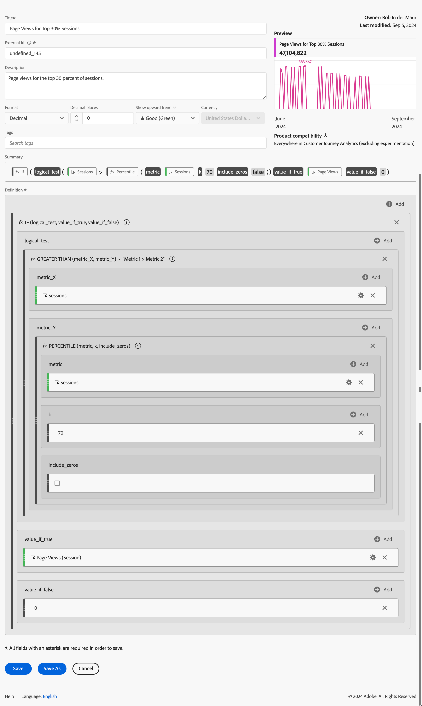

# 計算指標の例

この記事では、より高度な計算指標を定義する方法の例を示します。

## バウンス率

バウンス率を計算することができます。

+++ 詳細

バウンスの定義は別のディスカッションの対象ですが、この例では、Session Startが1に、Session Endsが1に等しいバウンス イベントセグメントを定義します。 このセグメントを使用すると、セッションに対するバウンス率を定義できます。

### セグメント

### 計算指標

### 派生フィールド

または、派生フィールド [&#128279;](/help/data-views/derived-fields/derived-fields.md#bounces)を使用して直帰率を定義することもできます。

派生フィールドは、データビューの一部であり、すべてのユーザーがバウンス率指標の定義を上書きまたは変更できるわけではないという利点があります。 その利点は限界も生み出しました。 データビューにアクセスできないユーザーは、派生フィールドを使用できず、バウンス率を定義するためにセグメントと計算指標に頼る必要があります。

Customer Journey Analyticsでのバウンス率とバウンス率の計算方法について詳しくは、この[&#x200B; ブログ記事](https://experienceleaguecommunities.adobe.com/t5/adobe-analytics-blogs/calculating-bounces-amp-bounce-rate-in-adobe-customer-journey/ba-p/706446?profile.language=ja)を参照してください。

+++

## 条件付きページビュー

100回を超えるセッションで訪問されたページのページビューのみを計算する計算指標を定義します。

+++ 詳細 

+++

## 上位30%のセッションのページビュー

上位30%のセッションのページビューのみを計算する計算指標を定義します。

+++ 詳細

+++
