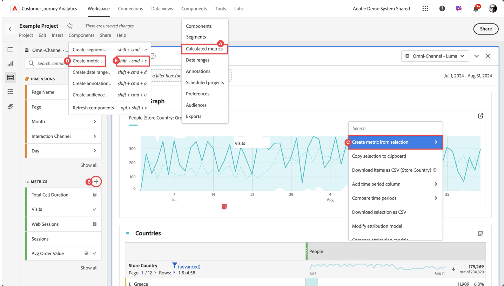

# 計算指標の作成

デフォルトでは、計算指標を作成できるのは管理者のみです。 ユーザーには、他のコンポーネント（セグメント、注釈など）の表示方法と同様に、計算指標を表示する権限があります。

ただし、管理者は、[Admin Console **[!UICONTROL を介して、]** CJA Workspace アクセスの権限の編集 **[!UICONTROL にある**[!UICONTROL  レポートツール ]**の]** 計算指標の作成 ](/help/technotes/access-control.md#user-level-access) 権限をユーザーに付与できます。

計算指標は次の方法で作成できます。

* **A**。 メインインターフェイスで「**[!UICONTROL コンポーネント]**」を選択し、「**[!UICONTROL 計算指標]**」を選択します。  マネージャー ](/help/components/calc-metrics/cm-workflow/cm-manager.md) から「[[!UICONTROL AddCircle][!UICONTROL **[!UICONTROL Add]**]」を選択します。
* **B**. Workspace プロジェクトの左側のコンポーネント パネルで、「 **指標**」の「」を選択します。
* **C**。 Workspace プロジェクトの指標列ヘッダーのコンテキストメニューで、「**[!UICONTROL 選択から指標を作成]**」を選択します。 サブメニューから、関数を選択するか、「**[!UICONTROL 計算指標ビルダーで開く]**」を選択できます。   関数を選択すると、計算指標はプロジェクトのみの指標として定義されます。 後でこの指標を編集する際に、[ コンポーネント情報 ](/help/components/use-components-in-workspace.md#component-info) ポップアップを通じて、[ 計算指標ビルダー ](/help/components/calc-metrics/cm-workflow/cm-build-metrics.md) に通知が表示されます。
* **D**。 Workspace プロジェクトで、メニューから **[!UICONTROL コンポーネント]** を選択し、**[!UICONTROL 指標を作成]** を選択します。
* **E**. Workspace プロジェクトで、ショートカットキー **[!UICONTROL shift+cmd+c]** （macOS）または **[!UICONTROL shift+ctrl+c]** （Windows）を使用します。

新しい計算指標を定義するには、[ 計算指標ビルダー ](/help/components/calc-metrics/cm-workflow/cm-build-metrics.md) を使用します。

<!--

Learn about the steps to take for creating calculated metrics.

| Workflow Task | Description |
| --- | --- |
| Plan Calculated Metrics | Especially for metrics that are going to be officially "approved", it makes sense to outline which calculated metrics will be widely used and how they will be defined. |
| [Build](/help/components/calc-metrics/cm-workflow/cm-build-metrics.md) Calculated Metrics | Build and edit calculated and advanced calculated metrics for use in [!DNL Customer Journey Analytics] components. |
| [Tag](cm-tagging.md) Calculated Metrics | Tag calculated metrics for ease of organization and sharing. See how to plan and assign tags for simple and advanced searches and organization. |
| [Approve](cm-approving.md) Calculated Metrics | Approve calculated metrics to make them canonical. |
| Apply Calculated Metrics | You can apply metrics directly from a report, from the Metric Selector (to access it, click [!UICONTROL Show Metrics]). |
| Filter Calculated Metrics | In the Metric Selector, click [!UICONTROL Advanced Selection] and filter by tags, owners, and other filters (Show All, Mine, Shared With me, Favorites, and Approved.) |
| Mark Calculated Metrics as [Favorites](cm-finding.md) | Marking metrics as favorites is another way to organize them for ease of use.|

-->
