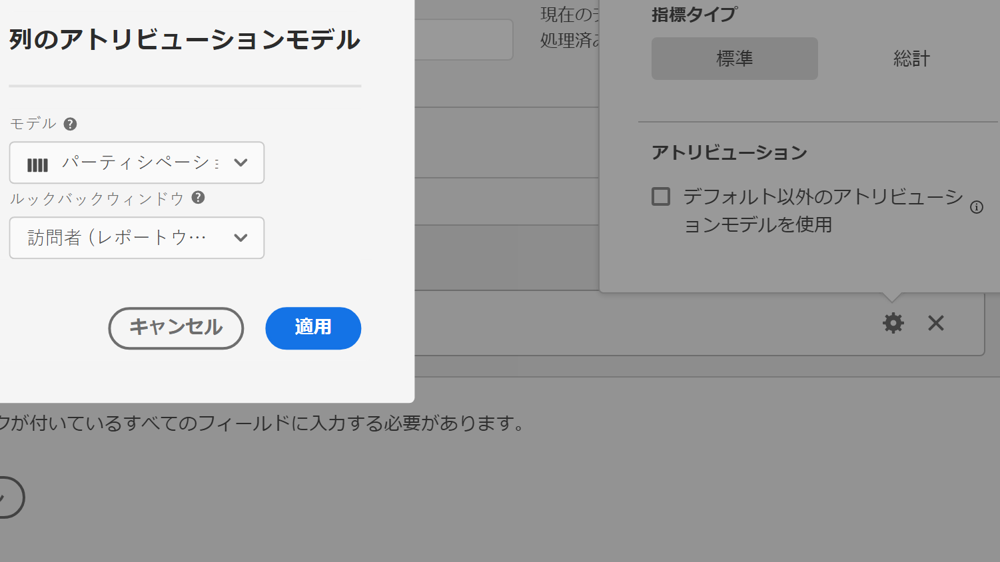

# 指標タイプとアトリビューション

指標の横にある歯車アイコンをクリックすると、指標タイプとアトリビューションモデルを指定できます。

## 指標タイプ

| 指標タイプ | 定義 |
|---|---|
| 標準 | これらの指標は、標準の [!DNL Analytics] レポートで使用される指標と同じです。1 つの標準指標で構成される数式は、その標準指標に対応する計算指標以外の指標と同じデータを表示します。標準指標は、個々の行項目に固有の計算指標を作成する場合に役立ちます。例えば、[購入回数]／[訪問回数]の場合、特定の行項目の購入回数を特定の行項目の訪問回数で割ります。 |
| 合計 | 各行項目のレポート期間の合計を使用します。1 つの合計指標で構成される数式は、各行項目で同じ合計数を表示します。合計指標は、サイト合計データと比較する計算指標を作成する場合に役立ちます。例えば、[購入回数]／[合計訪問回数]は、特定の行項目への訪問回数だけでなく、サイトへのすべての訪問回数に対する購入回数の割合を示します。 |

## アトリビューション

>[!IMPORTANT]
>デフォルト以外のアトリビューションモデルとサポートされるルックバックウィンドウの完全なリストについては、 [アトリビューションモデルとルックバックウィンドウ](/help/analysis-workspace/attribution/models.md) を参照してください。
