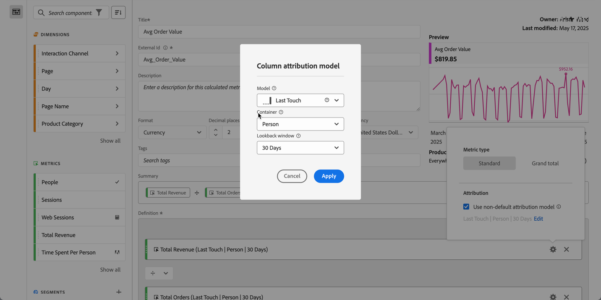

# 指標タイプとアトリビューション

計算指標定義で指標の指標タイプと[アトリビューションモデル](#attribution-models)を設定できます。

1. 指標コンポーネントで「」を選択します。
1. ポップアップダイアログで以下を行います。

   

   * 「**[!UICONTROL 指標タイプ]**」を指定します。

     | 指標タイプ | 定義 |
     |---|---|
     | **[!UICONTROL 標準]** | 1 つの標準指標で構成される数式は、その標準指標に対応する計算指標以外の指標と同じデータを表示します。 標準指標は、個々の行項目に固有の計算指標を作成する場合に役立ちます。 
例えば、 **[!UICONTROL 注文件数]**   **[!UICONTROL セッション]**&#x200B;は、その特定の行項目の注文件数をその特定の行項目のセッション数で除算します。 |
     | **[!UICONTROL 総計]** | 各行項目のレポート期間の&#x200B;**[!UICONTROL 総計]**&#x200B;を使用します。 数式が 1 つの総計指標で構成される場合、計算指標は行項目ごとに同じ総計数を表示します。 総計指標は、合計データと比較する計算指標を作成する場合に役立ちます。 
例えば、 **[!UICONTROL 注文件数]**   **[!UICONTROL 合計セッション数]**&#x200B;は、特定の行項目に対するセッションだけでなく、すべてのセッションに対する注文件数の割合を示します。 この例では、計算指標で **[!UICONTROL イベント]** **[!UICONTROL セッション数]** 総計を指定し、それが自動的に  **[!UICONTROL 合計セッション数]**&#x200B;に変わります。 |

   * 「**[!UICONTROL アトリビューション]**」を指定します。

      1. 以下のいずれかを実行できます。

         * 30 日間のルックバックウィンドウを持つデフォルトの列アトリビューションモデル（ラストタッチ）を使用する場合は、「**[!UICONTROL デフォルト以外のアトリビューションモデルを使用]**」を無効にします。
         * 「**[!UICONTROL デフォルト以外のアトリビューションモデルを使用]**」を有効にします。 **[!UICONTROL 列アトリビューションモデル]**&#x200B;ダイアログで以下を行います。

            * [アトリビューションモデル](#attribution-models)から&#x200B;**[!UICONTROL モデル]**&#x200B;を選択します。
            * 「**[!UICONTROL コンテナ]**」オプションから「[コンテナ](#container)」を選択します。
            * 「**[!UICONTROL ルックバックウィンドウ]**」オプションから「[ルックバックウィンドウ](#lookback-window)」を選択します。 「**[!UICONTROL カスタム時間]**」を選択した場合は、期間を「**[!UICONTROL 分]**」から「**[!UICONTROL 四半期]**」までの単位で定義できます。

      1. デフォルト以外のアトリビューションモデルを適用するには、「**[!UICONTROL 適用]**」を選択します。 キャンセルするには、「キャンセル」を選択します。

     デフォルト以外のアトリビューションモデルを既に定義してある場合は、「**[!UICONTROL 編集]**」を選択して、選択項目を変更します。

アトリビューションモデル、コンテナ、ルックバックウィンドウの使用例については、[例](#example)を参照してください。

## アトリビューションモデル {#attribution-models}

>[!CONTEXTUALHELP]
>id="components_calculatedmetrics_nondefaultattributionmodel"
>title="デフォルト以外のアトリビューションモデルを使用"
>abstract="選択した指標に対してデフォルト以外のアトリビューションモデルを有効にします。"

>[!CONTEXTUALHELP]
>id="components_calculatedmetrics_attributionmodel"
>title="モデル"
>abstract="指標のアトリビューションモデルを選択します。"

>[!CONTEXTUALHELP]
>id="components_calculatedmetrics_attribution_lasttouch"
>title="ラストタッチ"
>abstract="訪問者が閲覧した最後のディメンション値に、クレジットの 100％を割り当てます。"

>[!CONTEXTUALHELP]
>id="components_calculatedmetrics_attribution_firsttouch"
>title="ファーストタッチ"
>abstract="訪問者が閲覧した最初のディメンション値に、クレジットの 100％を割り当てます。"

>[!CONTEXTUALHELP]
>id="components_calculatedmetrics_attribution_linear"
>title="線形"
>abstract="クレジットはすべてのディメンション値に均等に配分されます。"

>[!CONTEXTUALHELP]
>id="components_calculatedmetrics_attribution_participation"
>title="パーティシペーション"
>abstract="訪問者が閲覧したすべてのディメンション値に 100%クレジットされます。 列の合計は誇張されています。"

>[!CONTEXTUALHELP]
>id="components_calculatedmetrics_attribution_sametouch"
>title="同じタッチ"
>abstract="コンバージョンと同じイベントで発生するディメンション値にのみ、クレジットを割り当てます。"

>[!CONTEXTUALHELP]
>id="components_calculatedmetrics_attribution_instance"
>title="同じタッチ"
>abstract="コンバージョンと同じイベントで発生するディメンション値にのみ、クレジットを割り当てます。"

>[!CONTEXTUALHELP]
>id="components_calculatedmetrics_attribution_ushaped"
>title="U 字型"
>abstract="最初のディメンション値に 40%、最後のディメンション値に 40%、中央の値に 20%のクレジットが配分されます。"

>[!CONTEXTUALHELP]
>id="components_calculatedmetrics_attribution_jcurve"
>title="J カーブ"
>abstract="最後のディメンション値に 60%、最初のディメンション値に 20%、中央の値に 20%のクレジットが配分されます。"

>[!CONTEXTUALHELP]
>id="components_calculatedmetrics_attribution_jshaped"
>title="J カーブ"
>abstract="最後のディメンション値に 60%、最初のディメンション値に 20%、中央の値に 20%のクレジットが配分されます。"

>[!CONTEXTUALHELP]
>id="components_calculatedmetrics_attribution_inversej"
>title="逆 J 形"
>abstract="最初のディメンション値に 60%、最後のディメンション値に 20%、中央の値に 20%のクレジットが配分されます。"

>[!CONTEXTUALHELP]
>id="components_calculatedmetrics_attribution_reversejshaped"
>title="逆 J 形"
>abstract="最初のディメンション値に 60%、最後のディメンション値に 20%、中央の値に 20%のクレジットが配分されます。"

>[!CONTEXTUALHELP]
>id="components_calculatedmetrics_attribution_timedecay"
>title="タイムディケイ"
>abstract="コンバージョンに最も近いディメンション値に、最も多くのクレジットを付与します。"

>[!CONTEXTUALHELP]
>id="components_calculatedmetrics_attribution_custom"
>title="カスタム"
>abstract="独自の位置ベースのアトリビューションの重み付けを定義します。"

>[!CONTEXTUALHELP]
>id="components_calculatedmetrics_attribution_positionbased"
>title="カスタム"
>abstract="独自の位置ベースのアトリビューションの重み付けを定義します。"

>[!CONTEXTUALHELP]
>id="components_calculatedmetrics_attribution_algorithmic"
>title="アルゴリズム"
>abstract="クレジットは、統計的アルゴリズムに基づいて動的に決定されます。"

{{attribution-models-details}}

## コンテナ {#container}

>[!CONTEXTUALHELP]
>id="components_calculatedmetrics_attribution_container"
>title="コンテナ"
>abstract="コンテナを選択して、アトリビューションに必要な範囲を設定します。"

{{attribution-container}}

## ルックバックウィンドウ {#lookback-winwow}

>[!CONTEXTUALHELP]
>id="components_calculatedmetrics_attribution_lookbackwindow"
>title="ルックバックウィンドウ"
>abstract="この設定により、各コンバージョンに適用されるデータアトリビューションの期間が決まります。"

{{attribution-lookback-window}}

## 例

{{attribution-example}}

>[!MORELIKETHIS]
>
>[属性コンポーネント設定](/help/data-views/component-settings/attribution.md)
>[パーティシペーション指標](participation-metric.md)
>

