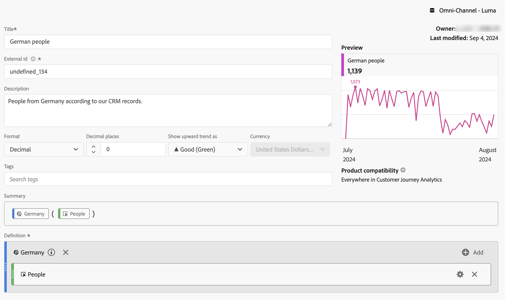
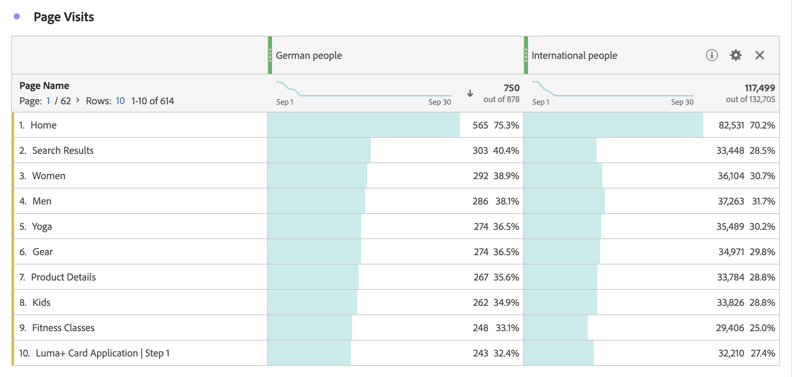

# フィルタリングされた指標

[ 計算指標ビルダー ](cm-build-metrics.md#definition-builder) では、指標の定義内でフィルターを適用できます。 フィルターの適用は、分析でデータのサブセットに指標を使用する場合に役立ちます。

>[!NOTE]
>
>フィルター定義は、[ フィルタービルダー ](/help/components/filters/filter-builder.md) を使用して更新されます。 フィルターを変更すると、フィルターが計算指標の定義に含まれているかどうかも含め、フィルターを使用するすべての場所で、フィルターが自動的に更新されます。
>

ブランドとやり取りするドイツ人の指標とドイツ国外のユーザーの指標を比較します。 次のような質問に答えることができます。

1. 最も人気のある [ 人気の高いページ ](#popular-pages) を訪問しているドイツ人と外国人の数。
1. 今月、ブランドとオンラインでやり取りしたドイツ人と外国人の数 [ 合計 ](#totals)。
1. 人気のあるページを訪問したドイツ人や国際的な人々の [ 割合 ](#percentages) は何ですか？

以下の節を参照して、これらの質問に答えるのに、フィルター適用済み指標がいかに役立つかを説明します。 該当する場合は、より詳細なドキュメントへの参照が行われます。

## 人気のあるページ

1. Workspace プロジェクトから [ 計算指標を作成 ](cm-workflow.md) し、`German people` という名前を付けます。
1. [ 計算指標ビルダー ](cm-build-metrics.md) 内から、`Germany` というタイトルの [ フィルターを作成 ](/help/components/filters/filter-builder.md) します。これは、CRM データの CRM の国フィールドを使用して、ユーザーが来ている場所を判断します。

   >[!TIP]
   >
   >計算指標ビルダーでは、コンポーネントパネルを使用して直接フィルターを作成できます。
   >   

   フィルターは次のようになります。

   

1. 計算指標ビルダーに戻り、フィルターを使用して計算指標を更新します。

   

計算指標の国際バージョンに対して、上記の手順を繰り返します。

1. Workspace プロジェクトから `International people` というタイトルの計算指標を作成します。
1. 計算指標ビルダー内から、`Not Germany` というタイトルのフィルターを作成します。これは、CRM データの CRM の「国」フィールドを使用して、ユーザーが存在する国を特定します。

   フィルターは次のようになります。

   

1. 計算指標ビルダーに戻り、フィルターを使用して計算指標を更新します。

   

1. Analysis Workspaceでプロジェクトを作成します。このプロジェクトでは、ドイツ人や外国人が訪問したページを確認できます。

   

## 合計

1. 総計に基づいて 2 つの新しいフィルターを作成します。 前に作成した各フィルターを開き、フィルターの名前を変更し、**[!UICONTROL 人物]** の **[!UICONTROL 指標タイプ]** を **[!UICONTROL 総計]** に設定して、**[!UICONTROL 名前を付けて保存]** を使用してフィルターを新しい名前で保存します。 次に例を示します。

   

1. 新しいフリーフォームテーブルビジュアライゼーションをWorkspace プロジェクトに追加し、今月の合計ページを表示します。

   

## 割合（％）

1. 前に作成した計算指標からパーセンテージを計算する 2 つの新しい計算指標を作成します。

   

1. Workspace プロジェクトを更新します。

   

+++ 次に、フィルター適用済みの計算指標を実装のない指標として使用する方法を説明するビデオを示します。

>[!VIDEO](https://video.tv.adobe.com/v/25407/?quality=12)

{{videoaa}}

+++
