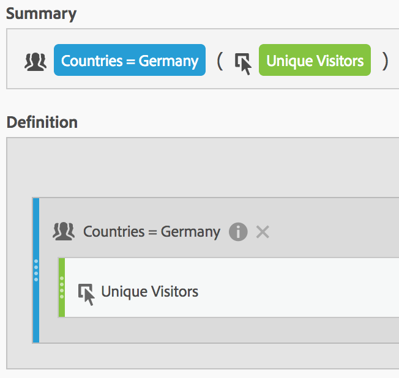

# フィルタリングされた指標

計算指標ビルダーでは、指標の定義内でフィルターを適用できます。 これは、分析で使用する新しい指標を取得する場合に便利です。 フィルター定義は、フィルタービルダーを使用して更新できます。変更が加えられると、フィルターは、計算指標の定義の一部である場合も含め、適用箇所で自動的に更新されます。

## フィルタリングされた指標の作成 {#create}

「ドイツ人の訪問者」フィルターと「海外の訪問者」フィルターの様々な側面を比較するとします。次のようなインサイトを提供する指標を作成できます。

* 2 つのグループ間でコンテンツの閲覧行動をどのように比較しますか？（もう 1 つの例：2 つのフィルター間でコンバージョン率を比較する場合）
* 全閲覧者の割合として、特定のページを閲覧するドイツ人は何人で、それに対して海外の人は何人ですか？
* これらの異なるフィルターでアクセスされたコンテンツに関して、最も大きな違いはどこにありますか？

「ドイツ人の訪問者」という指標と「海外の訪問者」という指標を作成して保存します。

1. 計算指標ビルダーで「ドイツ人の訪問者」というアドホックフィルターを作成します。この場合、「国」は「ドイツ」です。 国ディメンションを「定義」キャンバスにドラッグし、値として [!UICONTROL **Germany**] を選択します。

   

   >[!NOTE]
   >
   >この作業は [ フィルタービルダー ](/help/components/filters/create-filters.md) でも実行できますが、計算指標ビルダーでディメンションを使用できるようにすることで、ワークフローが簡略化されます。 「アドホック」とは、このフィルターが左のパネルの **[!UICONTROL フィルター]** リストに表示されないということを意味します。 ただし、セグメントの横の「i」アイコンにマウスポインターを置き、「**[!UICONTROL 公開する]**」をクリックして、公開することができます。

1. 「ドイツ」フィルターを「定義」キャンバスにドラッグし、その中にユニーク訪問者指標をドラッグします。

   

1. 「[!UICONTROL **保存**]」を選択して、計算指標を保存します。

1. 計算指標ビルダーで「国際訪問者」というアドホックフィルターを作成します。この場合、「国」が「ドイツ」と等しくありません。

   国ディメンションを「定義」キャンバスにドラッグし、値として [!UICONTROL **Germany**] を選択してから、演算子として [!UICONTROL **次と等しくない**] を選択します。

1. ユニーク訪問者指標をドラッグします。

1. 「[!UICONTROL **保存**]」を選択して、計算指標を保存します。

1. Analysis Workspace で、**[!UICONTROL Page]** ディメンションを自由形式の表にドラッグし、2 つの新しい計算指標を一番上に並べてドラッグします。

   

ビデオの概要を次に示します。

>[!VIDEO](https://video.tv.adobe.com/v/25407/?quality=12)

## 合計指標の割合 {#percent-total}

フィルターを母集団の総数と比較することで、上記の例をさらに一歩進めることができます。そのためには、「ドイツ人の合計訪問者数の割合」と「海外の合計訪問者数の割合」という 2 つの新しい指標を作成します。

1. 「ドイツ人 (または海外) の訪問者」フィルターをキャンバスにドロップします。
1. もう 1 つの「ドイツ人 (または海外) の訪問者」フィルターをその下にドロップします。ただし今回は、設定（歯車）アイコンをクリックして、「指標タイプ」として「合計」を選択します。「形式」は「割合」にします。演算子は「除算」にします。この指標の定義は次のようになります。

   

1. この指標をプロジェクトに適用します。

   
