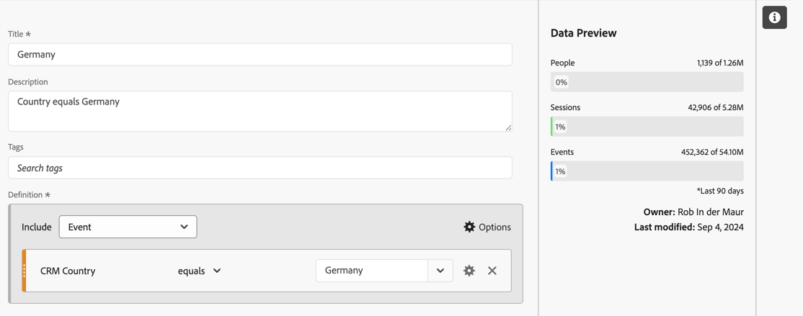
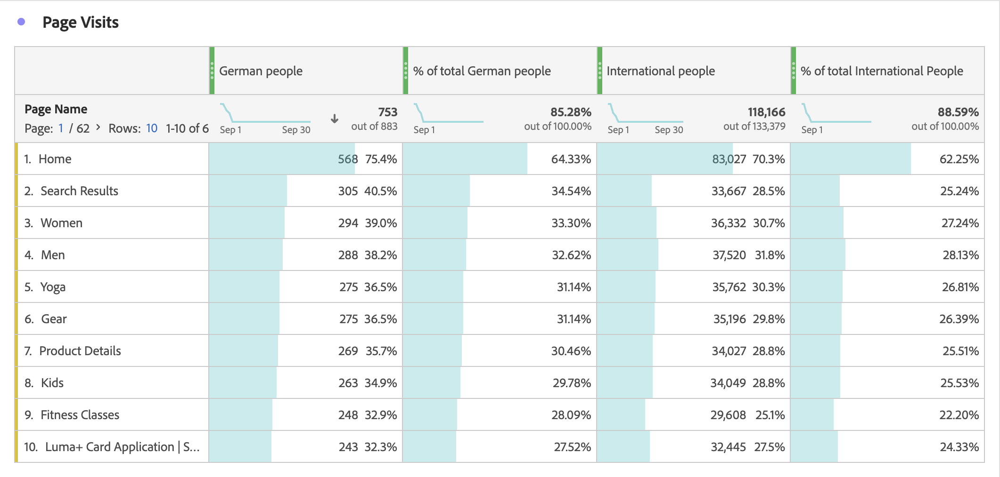

# セグメント化指標

[&#x200B; 計算指標ビルダー &#x200B;](cm-build-metrics.md#definition-builder) では、指標の定義内にセグメントを適用できます。 セグメントの適用は、分析で指標をデータのサブセットに使用する場合に役立ちます。

>[!NOTE]
>
>セグメント定義は、[&#x200B; セグメントビルダー &#x200B;](/help/components/segments/seg-builder.md) を使用して更新されます。 セグメントに変更を加えると、セグメントが計算指標定義の一部であるかどうかを含め、セグメントが使用されているすべての場所でセグメントが自動的に更新されます。
>

ブランドとやり取りするドイツ人の指標とドイツ国外のユーザーの指標を比較します。 次のような質問に答えることができます。

1. 最も人気のある [&#x200B; 人気の高いページ &#x200B;](#popular-pages) を訪問しているドイツ人と外国人の数。
1. 今月、ブランドとオンラインでやり取りしたドイツ人と外国人の数 [&#x200B; 合計 &#x200B;](#totals)。
1. 人気のあるページを訪問したドイツ人や国際的な人々の [&#x200B; 割合 &#x200B;](#percentages) は何ですか？

以下の節を参照して、セグメント化指標がこれらの質問に答える際にどのように役立つかをご確認ください。 該当する場合は、より詳細なドキュメントへの参照が行われます。

## 人気のあるページ

1. Workspace プロジェクトから [&#x200B; 計算指標を作成 &#x200B;](cm-workflow.md) し、`German people` という名前を付けます。
1. [&#x200B; 計算指標ビルダー &#x200B;](cm-build-metrics.md) 内から、[&#x200B; というタイトルの &#x200B;](/help/components/segments/seg-builder.md) セグメントを作成 `Germany` します。これは、CRM データの CRM 国フィールドを使用して、ユーザーが来ている場所を判断します。

   >[!TIP]
   >
   >計算指標ビルダーでは、コンポーネント パネルを使用して直接セグメントを作成できます。
   >   

   セグメントは次のようになります。

   

1. 計算指標ビルダーに戻り、セグメントを使用して計算指標を更新します。

   

計算指標の国際バージョンに対して、上記の手順を繰り返します。

1. Workspace プロジェクトから `International people` というタイトルの計算指標を作成します。
1. 計算指標ビルダー内から、`Not Germany` というタイトルのセグメントを作成します。このセグメントは、CRM データの CRM 国フィールドを使用して、ユーザーが来ている場所を判断します。

   セグメントは次のようになります。

   

1. 計算指標ビルダーに戻り、セグメントを使用して計算指標を更新します。

   

1. Analysis Workspaceでプロジェクトを作成します。このプロジェクトでは、ドイツ人や外国人が訪問したページを確認できます。

   

## 合計

1. 総計に基づいて 2 つの新しい計算指標を作成します。 前に作成した各セグメントを開き、セグメントの名前を変更し、**[!UICONTROL 人物]** の **[!UICONTROL 指標タイプ]** を **[!UICONTROL 総計]** に設定して、**[!UICONTROL 名前を付けて保存]** を使用してセグメントを新しい名前で保存します。 例：

   

1. 新しいフリーフォームテーブルビジュアライゼーションをWorkspace プロジェクトに追加し、今月の合計ページを表示します。

   

## 割合

1. 前に作成した計算指標からパーセンテージを計算する 2 つの新しい計算指標を作成します。

   

1. Workspace プロジェクトを更新します。

   

>[!BEGINSHADEBOX]

デモビデオについては、 [&#x200B; セグメント化された計算指標を実装なしの指標として使用 &#x200B;](https://experienceleague.adobe.com/en/docs/analytics-learn/tutorials/components/calculated-metrics/calculated-metrics-segmented-metrics){target="_blank"} を参照してください。

{{videoaa}}

>[!ENDSHADEBOX]

