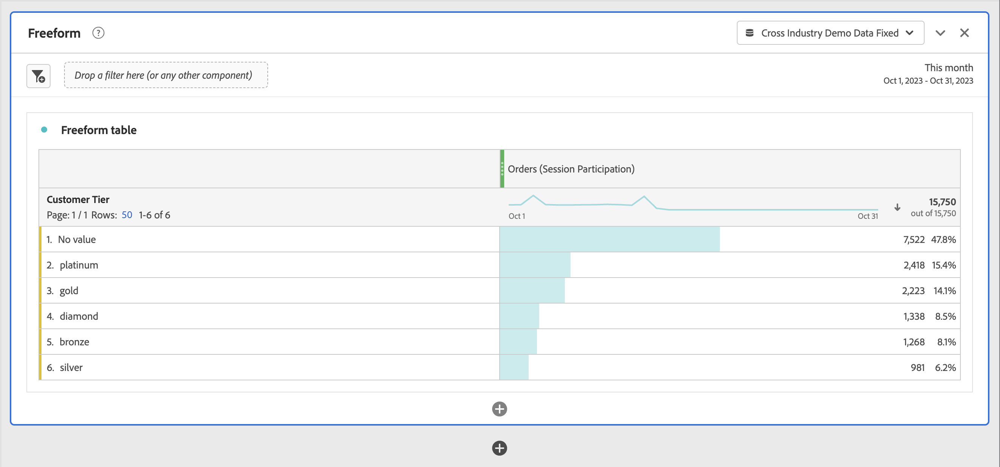

# 「パーティシペーション」指標の作成

この記事では、選択したディメンションの個々の値（ページビュー数、マーケティングチャネル、アプリのバージョンなど）が注文を含むセッションに貢献（または関係）した方法を示す指標の作成方法を説明します。

このタイプの情報は、コンテンツ所有者にとって役立つ場合があります。

>[!NOTE]
>
>パーティシペーションなど、他のアトリビューションモデルを持つ指標は、 [データビュー](https://experienceleague.adobe.com/docs/analytics-platform/using/cja-dataviews/data-views.html?lang=ja). 次の例は、Workspace の計算指標ビルダーへのアクセス権を持つユーザーが作成する方法を示しています。

1. 指標の作成を開始します ( [指標の作成](/help/components/calc-metrics/cm-workflow/cm-build-metrics.md).
1. 計算指標ビルダーで、指標に「パーティシペーション」などの名前を付けます
1. 成功イベント「注文」を「定義」キャンバスにドラッグします。
1. 選択  （の） [!DNL Orders] 指標。
1. 表示されるポップアップで、「 」を選択します。 **[!UICONTROL デフォルト以外のアトリビューションモデルを使用]** を定義するには、 [アトリビューションモデル](/help/components/calc-metrics/cm-workflow/m-metric-type-alloc.md) その出来事が **[!UICONTROL パーティシペーション]** を選択し、 **[!UICONTROL セッション]** （の） [!UICONTROL ルックバックウィンドウ]. 選択 **[!UICONTROL 適用]** をクリックして確定します。

   「定義」ボックスで、  **購入回数** が次の値に更新されました：  **注文（パーティシペーション|セッション）**.

   

1. 選択 [!UICONTROL **保存**] をクリックして指標を保存します。
1. レポートで計算指標を使用します。 以下の計算指標は、注文を含むセッションに貢献した（または関係した）顧客層を示すレポートで使用されます。

   

1. （オプション）指標を組織内の他のユーザーと共有します。詳しくは、 [計算指標の共有](/help/components/calc-metrics/cm-workflow/cm-sharing.md).
