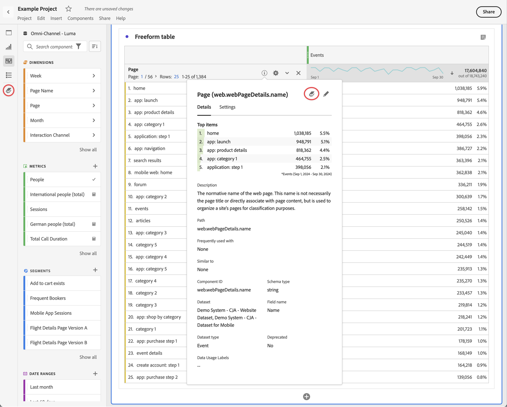

# データ辞書の概要 {#data-dictionary-overview}

<!-- markdownlint-disable MD034 -->

>[!CONTEXTUALHELP]
>id="component_datadictionary"
>title="データディクショナリ"
>abstract="データ辞書はユーザーと管理者の両方にとって、Customer Journey Analytics 環境のコンポーネントを追跡したり理解を深めたりするのに役立ちます。 Customer Journey Analytics 管理者は、データ辞書の各コンポーネントに関する情報を調整する責任があります。"

<!-- markdownlint-enable MD034 -->

Analysis Workspace のデータ辞書は、ユーザーと管理者の両方が Analytics 環境のコンポーネントを追跡し、よりよく理解するのに役立ちます。

Analytics 管理者は、データ辞書の各コンポーネントに関する情報を調整して、ユーザーが利用できるようにする責任があります。

>[!BEGINSHADEBOX]

デモビデオについては、[Analysis Workspace用データディクショナリ ](https://video.tv.adobe.com/v/3418028/?quality=12&learn=on){target="_blank"} を参照してください。

{{videoaa}}

>[!ENDSHADEBOX]

## ユーザーにとってのメリット

データ辞書は、ユーザーが使用可能な各コンポーネントをよりよく理解するのに役立ちます。

データ辞書には、次の情報が含まれます。

* コンポーネントの機能と使用目的

* 表示しているコンポーネントで通常使用されるコンポーネント

* 表示しているコンポーネントに類似するコンポーネント

* コンポーネントがシステム管理者によって承認済みであるかどうか

データ辞書へのアクセス方法と、データ辞書に含まれる情報について詳しくは、[データ辞書でのコンポーネント情報の表示](/help/components/data-dictionary/view-data-dictionary.md)を参照してください。

## 管理者にとってのメリット

データ辞書は、システム管理者が Analytics 環境内のコンポーネントを追跡し、キュレートするのに役立ちます。

Analytics 管理者は、次の目的でデータ要素を使用できます。

* 統合が必要な重複コンポーネントを識別します。

* データを収集していないコンポーネントを識別して、更新または削除できるようにします。

* まだ承認されていないコンポーネントを識別します。

* コンポーネントの説明を Analysis Workspace で直接更新します。データ辞書のコンポーネントの説明に対して行われた更新は、データビューに反映されます。

  同様に、データビューのコンポーネントの説明に対して行われた更新は、Analysis Workspace に反映されます。

  コンポーネントの説明を Analysis Workspace またはデータビューに追加する方法について詳しくは、[コンポーネントの説明の追加](/help/components/add-component-descriptions.md)を参照してください。

## データ辞書へのアクセス

Analysis Workspace 内で、次のいずれかの方法でデータ辞書にアクセスできます。

* ボタンパネルの  から。

* コンポーネントの情報ポップオーバー内の  から。

データ辞書で使用できる様々なオプションについて詳しくは、[データ辞書でのコンポーネント情報の表示](/help/components/data-dictionary/view-data-dictionary.md)を参照してください。

## データ辞書の更新とキュレーション

Customer Journey Analytics 管理者は、[データ辞書の健全性の監視](/help/components/data-dictionary/monitor-data-dictionary-health.md)で説明しているように、組織のデータ辞書を正常に保持する責任があります。

このプロセスの一環として、Customer Journey Analytics 管理者は、[データ辞書でのコンポーネントエントリの編集](/help/components/data-dictionary/edit-entries-data-dictionary.md)で説明しているように、データ辞書内の各コンポーネントに関する情報を編集できます。

## データ辞書を移動、最小化または閉じる

データ辞書を開くと（[データ辞書へのアクセス](#access-the-data-dictionary)で説明しているように）、Analysis Workspace の上にウィンドウとして表示されます。

データ辞書ウィンドウは、次のいずれかの方法で操作できます。

* Analysis Workspace 内の任意の領域にドラッグ

  Analysis Workspace を閉じて再度開いた場合、データ辞書ウィンドウは最後に移動した場所に残ります。<!--True?-->

* ウィンドウを最小化します。

  最小化すると、データ辞書は、Analysis Workspace の右下隅に青いタブとして表示されます。

  青いタブを選択すると、データ辞書が開き、最後に表示していたコンポーネントが表示されます。

* ウィンドウを閉じます。
