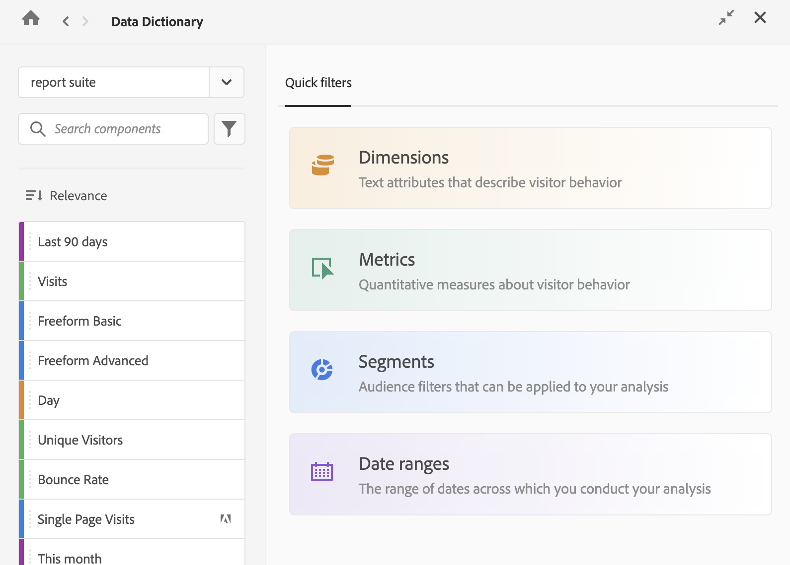

# コンポーネント情報の表示

データディクショナリを使用すると、コンポーネントに関する情報（説明、類似コンポーネント、コンポーネントが頻繁に使用する他のコンポーネントなど）を表示できます。

データ辞書でコンポーネントに関する情報を表示するには：

1. 表示するコンポーネントを含む Analysis Workspace プロジェクトに移動します。

1. Analysis Workspaceの左側のパネルで「[!UICONTROL **Data Dictionary**]」アイコンを選択します。 （データディクショナリへのアクセス方法については、[ データディクショナリの概要](/help/components/data-dictionary/data-dictionary-overview.md#access-the-data-dictionary)の「[ データにアクセスする」で説明しています）。](/help/components/data-dictionary/data-dictionary-overview.md)

   データ辞書ウィンドウが表示されます。

   ディメンション、指標、セグメント、日付範囲のクイックセグメントを表示する

   <!--double-check this screenshot. I mocked the admin view up a bit to get rid of the Dictionary health tab.-->

1. 表示するコンポーネントを含むデータビューがドロップダウンメニューで選択されていることを確認します。 デフォルトでは、既に存在するデータビューが表示されます。

1. （オプション）検索フィールドに、表示するコンポーネントの名前の入力します。

   コンポーネントのタイプは、カラーとアイコンの両方で識別できます。

   * **ディメンション** はオレンジ色です

   * **セグメント** は青です

   * **日付範囲** は紫色です

   * **指標** は緑色です

   * **Adobe アイコン** は、計算指標テンプレートまたはセグメント テンプレートを示します

   * **電卓アイコン** は、組織内のAnalytics管理者によって作成された計算指標を示します

1. （オプション）**フィルター**&#x200B;アイコン  を選択し、次のフィルターオプションのいずれかを選択して、コンポーネントのリストをフィルタリングします。

   | オプション | 関数 |
   |---------|----------|
   | [!UICONTROL **承認済み**] | 管理者が承認済みとしてマークしたコンポーネントのみを表示します。 |
   | [!UICONTROL **お気に入り**] | お気に入りのリストにあるコンポーネントのみを表示します。お気に入りのリストにコンポーネントを追加する方法については、[コンポーネントの概要](/help/components/overview.md)を参照してください。 |
   | [!UICONTROL **ディメンション**] | ディメンションであるコンポーネントのみを表示します（このオプションは、最初にデータ要素にアクセスしたときに、[!UICONTROL **クイックセグメント**] タブでも使用できます）。 |
   | [!UICONTROL **指標**] | 指標であるコンポーネントのみを表示します（このオプションは、最初にデータ要素にアクセスしたときに、[!UICONTROL **クイックセグメント**] タブでも使用できます）。 |
   | [!UICONTROL **セグメント**] | セグメントであるコンポーネントのみを表示します（このオプションは、最初にデータ要素にアクセスしたときに、[!UICONTROL **クイックセグメント**] タブでも使用できます）。 |
   | [!UICONTROL **日付範囲**] | 日付範囲であるコンポーネントのみを表示します（このオプションは、最初にデータ要素にアクセスしたときに、[!UICONTROL **クイックセグメント**] タブでも使用できます）。 |
   | [!UICONTROL **すべてを表示**] | すべてのコンポーネントの表示。 このオプションは、管理者のみが使用できます。 |
   | [!UICONTROL **未承認**] | 管理者が承認済みとしてまだマークしていないコンポーネントのみを表示します。レビューと承認が必要なコンポーネントを管理者が識別する際に役立ちます。このオプションは、管理者のみが使用できます。 |
   | [!UICONTROL **説明がありません**] | 「説明」フィールドにまだ説明がないコンポーネントのみを表示します。このオプションは、管理者のみが使用できます。 |
   | [!UICONTROL **重複の表示**] | 選択したデータビューで、他のコンポーネントと同じ名前または同じ説明を持つコンポーネントのみを表示します。 これには、Adobeで提供されるコンポーネントだけでなく、作成したコンポーネントも含まれます。 重複として表示するには、名前または説明が完全に一致している必要があります。 このオプションは、管理者のみが使用できます。 |
   | [!UICONTROL **最近のデータがありません**] | 過去 90 日間にデータを収集していないコンポーネントのみを表示します。 このオプションは、管理者のみが使用できます。 |
   | [!UICONTROL **作成者：Adobe**] <!-- I don't see this option--> | アドビが作成したコンポーネントのみを表示します。組織内の管理者または別のユーザーが作成したコンポーネントは表示しません。 |

   {style="table-layout:auto"}

1. （オプション）「**並べ替え**」アイコン  を選択し、次のフィルターオプションのいずれかを選択してコンポーネントのリストを並べ替えます。

   | オプション | 関数 |
   |---------|----------|
   | **[!UICONTROL 推奨]** | レコメンデーションに基づいて、コンポーネントをタイプ（ディメンション、指標、セグメントおよび日付範囲）ごとに並べ替えます。自身や組織内の他のメンバーが最も頻繁に最近使用したコンポーネントが各リストの上位に表示されます。 |
   | **[!UICONTROL 最終変更日]** | 最終変更日に基づいて、コンポーネントをタイプ（ディメンション、指標、セグメント、日付範囲）ごとに並べ替えます。最近変更されたコンポーネントは、各リストで上位に表示されます。 |
   | **[!UICONTROL アルファベット順]** | コンポーネントをタイプ（ディメンション、指標、セグメントおよび日付範囲）ごとにアルファベットの昇順で並べ替えます。 |
   | **[!UICONTROL 分類]** | カテゴリに基づいて、コンポーネントをタイプ（ディメンション、指標、セグメント、日付範囲）ごとに並べ替えます。例えば、キュレートされたデータビューコンポーネントとキュレートされていないデータビューコンポーネントがあります。 |

   {style="table-layout:auto"}

1. コンポーネントのリストから、表示するコンポーネントを選択します。

   コンポーネントに関する次の情報が表示されます。

   | オプション | 関数 |
   |---------|----------|
   | [!UICONTROL **承認済み**] | 
コンポーネントが管理者にレビューおよび承認されたことを示します。

管理者には、[!UICONTROL **承認しない**]&#x200B;のオプションが表示されます。 このオプションを選択すると、コンポーネントがユーザーに「未承認」としてマークされます。
 |
   | [!UICONTROL **未承認**] | 
コンポーネントがまだ管理者にレビューおよび承認されていないことを示します。

管理者には、「[!UICONTROL **承認**]」オプションが表示されます。このオプションを選択すると、ユーザーに対してコンポーネントが「承認済み」としてマークされます。
 |
   | [!UICONTROL **コンテキストラベル**] | このフィールドは、コンポーネントのコンテキストラベルがデータビューで更新された場合にのみ表示されます。 
詳しくは、[コンポーネントの設定](/help/data-views/component-settings/overview.md)を参照してください。 
 |
   | [!UICONTROL **説明**] | コンポーネントの意図された機能について説明します（この情報は、[コンポーネントの説明の追加](/help/components/add-component-descriptions.md)で説明しているように、Analytics 管理者が追加します）。 |
   | [!UICONTROL **次でよく使用される**] | 
表示しているコンポーネントと最も一緒に使用されるコンポーネントを表示します。

指標、計算指標、ディメンション、セグメントおよび日付範囲の 5 つの主要なコンポーネントタイプで最大 5 つのコンポーネントを表示します。

このリストは、過去 90 日間のデータに基づいています。表示するアクセス権を持つコンポーネントのみを表示します。

管理者は、「[!UICONTROL **常に含める**]」および「[!UICONTROL **常に除外**]」ドロップダウンフィールドで目的のコンポーネントを選択することにより、このセクションでユーザーに表示されるコンポーネントをキュレートできます。ユーザーに表示されるコンポーネントをキュレートする前に、まず&#x200B;**すべてを表示** セグメントを適用して、他の管理者によって追加された可能性のある、共有されていないコンポーネントが表示されるようにします。<!-- Soon we will make it so any fields that an admin doesn't have access to will be greyed out, and then they can enable the Show all segment to make it editable. -->
 |
   | [!UICONTROL **類似**] | 
表示しているコンポーネントと同様の名前を持つコンポーネントを表示します。

指標、計算指標、ディメンション、セグメントおよび日付範囲の 5 つの主要なコンポーネントタイプで最大 5 つのコンポーネントを表示します。

表示するためのアクセス権を持つコンポーネントのみを表示します。

データビュー内の重複したコンポーネントがここに表示されます。 [データ辞書の正常性の監視](/help/components/data-dictionary/monitor-data-dictionary-health.md)で説明しているように、Analytics 管理者はすべての重複するコンポーネントを特定して削除する必要があります。

管理者は、「[!UICONTROL **常に含める**]」および「[!UICONTROL **常に除外**]」ドロップダウンフィールドで目的のコンポーネントを選択することにより、このセクションでユーザーに表示されるコンポーネントをキュレートできます。ユーザーに表示されるコンポーネントをキュレートする前に、まず&#x200B;**すべてを表示** セグメントを適用して、他の管理者によって追加された可能性のある、共有されていないコンポーネントが表示されるようにします。<!-- Soon we will make it so any fields that an admin doesn't have access to will be greyed out, and then they can enable the Show all segment to make it editable. -->

**メモ：**&#x200B;現在、「**類似**」セクションには、ユーザー作成のコンポーネントのみが含まれており、アドビ提供のコンポーネントは含まれていません。アドビ提供のコンポーネントは、今後のリリースで追加される予定です。
 |
   | [!UICONTROL **製品の互換性**] | この計算指標をCustomer Journey Analyticsのどこで使用できるかを示します。 
使用可能な値は次のとおりです。
<ul><li>[!UICONTROL **Customer Journey Analyticsのすべての場所**]：計算された指標は、Analysis WorkspaceやReport Builderなど、Customer Journey Analytics全体で使用できます。</li><li>[!UICONTROL **Customer Journey Analytics のすべての場所 (実験を除く)**]：計算指標は、実験パネルを除く Adobe Customer Journey Analytics 全体で使用できます。</li> 
計算指標を実験で使用できるかどうかを決定する条件について詳しくは、[実験パネル ](/help/analysis-workspace/c-panels/experimentation.md#use-calculated-metrics-in-the-experimentation-panel)実験パネル [の実験パネル ](/help/analysis-workspace/c-panels/experimentation.md)で計算指標を使用するを参照してください。
</ul> |
   | [!UICONTROL **タグ**] | コンポーネントに適用されているすべてのタグを表示します。管理者アクセス権を持つユーザーは、コンポーネントの編集時にタグを追加できます。 |
   | [!UICONTROL **コンポーネントの種類**] | ディメンション、指標、セグメント、または日付範囲のいずれかであるコンポーネントのタイプをリストします。 |
   | [!UICONTROL **作成者**] | コンポーネントを作成したユーザーの名前を表示します。 |
   | [!UICONTROL **プレビュー**] | Analysis Workspace でのコンポーネントの外観のプレビューを表示します。 |
   | [!UICONTROL **最終変更日**] | コンポーネントの最終変更日を表示します。 このセクションは、セグメント、指標、計算指標、日付範囲を表示する場合に表示されます。 |

   {style="table-layout:auto"}

1. （オプション）データ辞書から Analysis Workspace にコンポーネントをドラッグします。
