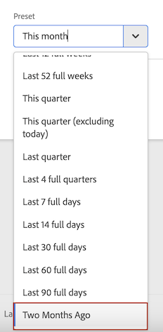

# カスタム日付範囲を作成

Analysis Workspace でカスタム日付範囲を作成し、時間コンポーネントとして保存します。

**[!UICONTROL コンポーネント]**／**[!UICONTROL 新しい日付範囲]**

日付範囲は、パネルレベルで適用します。プロジェクトに日付範囲を追加するには、**パネル**／*`<select panel>`* をクリックして、新しい日付範囲を指定します。

## 「2 ヶ月前」の日付範囲 

次のカスタム日付範囲は、方向の変化を示す変更概要ビジュアライゼーションで、「2 ヶ月前」の日付範囲を示します。

カスタム日付範囲は、プロジェクトの[!UICONTROL 日付範囲]コンポーネントパネルの最上部に表示されます。

比較用に、このカスタム日付範囲を、先月プリセットを使用した、カスタムの、月周期の日付範囲の横の列にドラッグできます。変更概要ビジュアライゼーションを追加して、各列から合計を選択し、方向の変化を示します。

## 7 日周期の日付範囲の使用

日付範囲は、パネルレベルに適用します。プロジェクトに日付範囲を追加するには、**アクション**／**パネルを追加**&#x200B;をクリックして、新しい日付範囲を指定します。

日付範囲ビルダーで、他の日付範囲と共にコンポーネントパネルに表示するカスタム日付範囲を作成できます。

例えば、1 週間前に終了する 7 日周期の時間帯を指定する日付範囲を作成できます。

*`rolling daily`*.を使用します。

* 「開始」設定は、*`current day minus 14 days`* になります。

* 「終了」設定は、*`current day minus 7 days`* になります。

この日付範囲は、コンポーネントとして任意のフリーフォームテーブルにドラッグできます。
