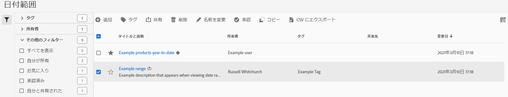

# 日付範囲を管理

>[!NOTE] Customer Journey Analytics内のAnalysis Workspaceに関するドキュメントを表示している。 この機能セットは、従来のAdobeAnalyticsの [Analysis Workspaceとは少し異なります](https://docs.adobe.com/content/help/ja-JP/analytics/analyze/analysis-workspace/home.html)。 [詳細情報...](/help/getting-started/cja-aa.md)

日付範囲マネージャーを使用して、日付範囲の共有、名前の変更または削除を行います。 日付マネージャーにアクセスするには：

1. Log in to [analytics.adobe.com](https://analytics.adobe.com) using your AdobeID credentials.
1. 「 [!UICONTROL コンポーネント] / [!UICONTROL 日付範囲」に移動します]。

## インターフェイス

日付範囲マネージャーには、次のオプションが含まれます。

* **追加**: 新しい日付範囲を作成します。 詳しくは、「日付範囲の [作成](create.md) 」を参照してください。
* **タイトルで検索**: タイトルで日付範囲を検索します。 結果は、ここに入力したテキストに基づいてフィルタされます。
* **フィルタ**: 左の列を使用して日付範囲をフィルターします。 自分が作成したカスタムタグ、所有者、お気に入り、承認済み、または自分と共有しているユーザーをフィルターできます。 また、目的のフィルターを検索することもできます。
* **お気に入り**: 日付範囲の横にある  ()アイコンをクリックして、お気に入りに追加します。
* **列のカスタマイズ**: 日付範囲マネージャーで  列アイコンをクリックします。

1つ以上の日付範囲の横にあるチェックボックスをクリックすると、その他のオプションが表示されます。

* **タグ**: 選択したすべての日付範囲にタグを適用します。 タグを使用すると、日付範囲を整理し、左の列を使用して日付範囲をフィルターできます。
* **共有**: 日付範囲を他のExperience Cloudユーザーと共有します。 製品管理者は、組織全体またはグループ全体にも共有できます。 組織内の他のユーザーが共有する日付範囲には、タイトルの横に  アイコンが表示されます。
* **削除**: 選択した日付範囲を完全に削除します。
* **名前の変更**: 1つの日付範囲を選択した場合は、そのタイトルを変更できます。
* **承認**: 製品管理者は、日付範囲に承認スタンプを追加できます。 承認された日付範囲は、組織内のユーザーに対して、そのユーザーが「公式」であることを通知し、組織内の他のユーザーが作成した日付範囲と区別します。 承認された日付範囲では、タイトルの横に  アイコンが表示されます。
* **未承認**: 製品管理者が既に承認済みの日付範囲を選択している場合は、承認を取り消すことができます。
* **コピー**: 選択した日付範囲のコピーを作成します。 日付範囲をコピーす `(Copy)` ると、新しくコピーされた日付範囲のタイトルの末尾に追加されます。
* **CSVにエクスポート**: 選択したすべての日付範囲をCSVファイルにエクスポートします。 結果のCSVファイル内の列には、日付範囲マネージャー内の表示可能な列がすべて含まれます。
