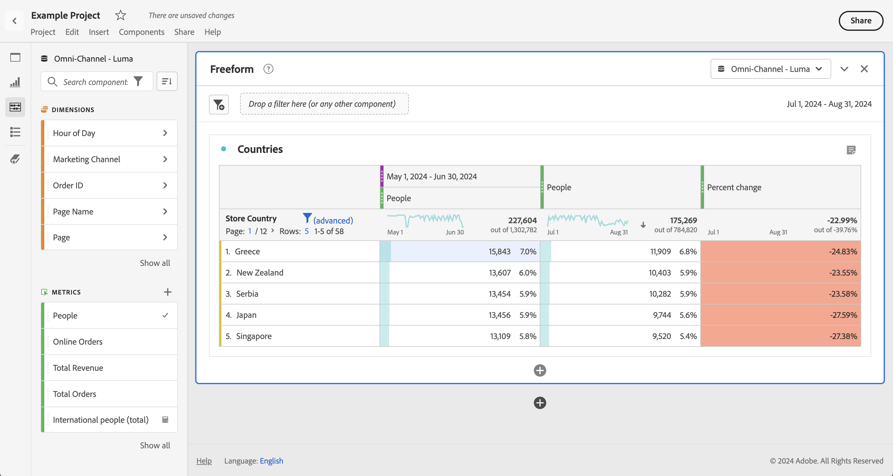

# 日付の比較

Analysis Workspace の日付比較を使用すると、日付範囲を含む任意の列を使用して、前年比、前四半期比、前月比などの一般的な日付比較を作成できます。

## 期間を比較

分析にはコンテキストが必要ですが、多くの場合、そのコンテキストは前の期間から得られます。例えば、*昨年の今の時期と比較して、今やっていることはどれくらい良い、または悪いですか？* れは、ビジネスを理解するための基本です。 日付比較には、指定した期間に対する変更率を示す *差分* 列が自動的に含まれます。

1. 一定期間にわたって比較するディメンションと指標を含んだ [ フリーフォームテーブル ](/help/analysis-workspace/visualizations/freeform-table/freeform-table.md) を作成します。
1. テーブルの行のコンテキストメニューを開き、「**[!UICONTROL 期間を比較]**」を選択します。

   

   >[!NOTE]
   >
   >このコンテキスト・メニュー・オプションは、メトリック行、日付範囲行および時間ディメンション行では無効です。

1. テーブルの日付範囲をどのように設定したかに応じて、次のオプションを比較に使用できます。

   | オプション | 説明 |
   |---|---|
   | **[!UICONTROL この日付範囲の前 *x* 週/月/四半期/年]** | 選択した日付範囲の直前の日付範囲と比較します。 |
   | **[!UICONTROL この日付範囲への過去 x 週間/月/四半期/年]** | 1 年前の同じ日付範囲と比較します。 |
   | **[!UICONTROL この日付範囲に対するカスタム日付範囲]** | カスタムの日付範囲を定義できます。 |

   >[!NOTE]
   >
   >例えば、10 月 7 日から 10 月 20 日（14 日の範囲）までのカスタム日数を選択した場合は、**[!UICONTROL この日付範囲の 14 日前]** と **[!UICONTROL この日付範囲のカスタム日付範囲]** の 2 つのオプションしか表示されません。

1. 結果として次のような比較が表示されます。

   

   変更率の列の行は、負の値の場合は赤、正の値の場合は緑で表示されます。

## 比較のために期間の列を追加

テーブルの各列に期間を追加できるようになりました。これにより、カレンダーを設定した期間とは異なる期間を追加できます。

1. テーブルの列を右クリックし、「**[!UICONTROL 期間列を追加]**」を選択します。

   

1. テーブルの日付範囲をどのように設定したかに応じて、次のオプションを比較に使用できます。

   | オプション | 説明 |
   |---|---|
   | **[!UICONTROL この日付範囲の前 *x* 週/月/四半期/年]** | 週や月などを含んだ列を追加 比較します。 |
   | **[!UICONTROL 昨年の *x* 週/月/四半期/年をこの日付範囲に含める]** | 1 年前に同じ日付範囲を追加します。 |
   | **[!UICONTROL この日付範囲に対するカスタム日付範囲]** | カスタムの日付範囲を作成できます。 |

   >[!NOTE]
   >
   >例えば、10 月 7 日から 10 月 20 日（14 日の範囲）までのカスタム日数を選択した場合は、**[!UICONTROL この日付範囲の 14 日前]** と **[!UICONTROL この日付範囲のカスタム日付範囲]** の 2 つのオプションしか表示されません。

1. 期間は、選択した列の上に挿入されます。

   

1. 期間の列はいくつでも追加でき、異なる日付範囲を組み合わせることもできます。

1. また、各列で並べ替えることもできます。これにより、並べ替える列に応じて日の順序を変更します。

## 列の日付が同じ行で始まるように整列

各列の日付を整列させて、すべて同じ行から始まるようにすることができます。

例えば、先週（2024 年 10 月 5 日まで）と前週の日比比較を行います。 デフォルトでは、左の列は 9 月 22 日（PT）、右の列は 9 月 29 日（PT）から始まります。

[ 設定 ](/help/analysis-workspace/visualizations/freeform-table/freeform-table.md#settings-1) で **[!UICONTROL 各列の日付を同じ行からすべての日付が始まるように整列]** を有効にすると、フリーフォームテーブルビジュアライゼーションは列の日付を同じ行から始まるように整列することができます。

このオプションを使用する場合は、次の点に注意してください。

* この設定は、すべての新しいプロジェクトでデフォルトで有効になっています。

* この設定は、テーブル全体に適用されます。 例えば、テーブル内の分類に対してこの設定を変更すると、テーブル全体に設定が適用されます。

