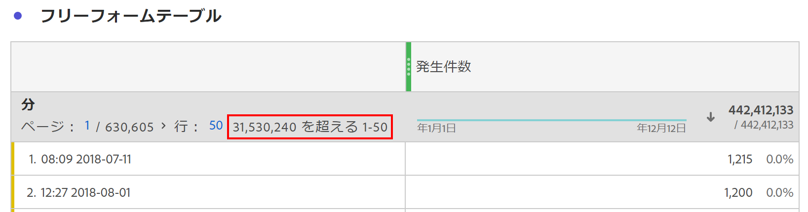

# カーディナリティが非常に高いDimension

Customer Journey Analytics(CJA)では、単一のディメンション内でレポートできる一意の値またはディメンション項目の数に制限はありません。 ただし、状況によっては、非常に多くの個別項目（高カーディナリティディメンションとも呼ばれる）を持つディメンションが、レポート対象に影響する場合があります。

## 制限事項

特定のCJA接続のイベント数に応じて、高カーディナリティディメンションに関して、次の2つの制限が発生する場合があります。

### 1.行数は、正確にレポートできないこと。

カーディナリティの高いディメンションの行数は、正確にレポートできない場合があります。 この場合、フリーフォームテーブルには次のような表示が表示されます。

### 2.計算指標は予測を返す場合がある

高度なカーディナルディメンションと共に使用する場合、計算指標関数は次のような予測を返す場合があります。列の最大値、列の最小値、行の数、平均、中央値、百分位数、四分位数、標準偏差、平方偏差、回帰関数、T関数とZ関数です。

また、計算指標を使用してテーブル列を並べ替える場合、予測に基づいて行うことができ、正確な並べ替え順が反映されない場合があります。 予測が使用された可能性があることを知らせる警告メッセージが表示されます。

計算指標が予測を返すことがある場合でも、列の合計は常に正確で、予測に基づくことはありません。 同様に、標準指標を使用する場合、予測は列の並べ替えに使用されず、常に正確な並べ替え順が反映されます。

## すべての分析コード値が考慮される場所

一部の計算指標およびディメンション行のカウントに制限はありますが、次の機能では常にすべてのディメンションの一意の値を考慮することに注意してください。 彼らは、次元が非常に重要かどうかに関係なく、次のように考えます。

* 指標アトリビューションとディメンションの配分
* フリーフォームテーブルに適用された行項目検索
* ディメンションまたはディメンション項目を使用するフィルター
* 計算指標内のおおよそカウントの明確な関数
* データ表示内の任意の指標またはディメンションに適用される「含む」/「除外」ロジック
* 接続に追加された参照データセット

## 高カーディナルディメンションを使用する場合のベストプラクティス

カーディナリティの高いディメンションを使用する場合に発生する可能性のある警告や予測を排除するために、次のいずれかの方法を使用して、レポートで考慮する行数を絞り込むことをお勧めします。

* 影響を受け追加た列またはパネルのフィルター。
* フリーフォームテーブルに検索を適用します。
* 関心のある行に分類を適用するか、高度なカーディナルディメンションを分類ディメンションとして使用します。
* ディメンションに存在する一意の値の数を追加絞り込むために、ディメンションのデータ表示設定に条件を含める/除外します。

これらのテクニックを使用すると、多くの場合、高基数次元を使用する際に経験する望ましくない評価や警告を排除できます。
