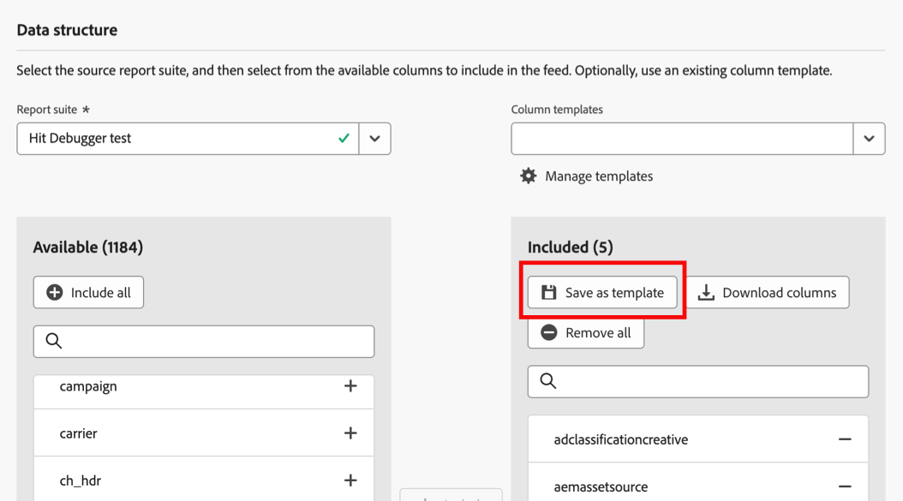
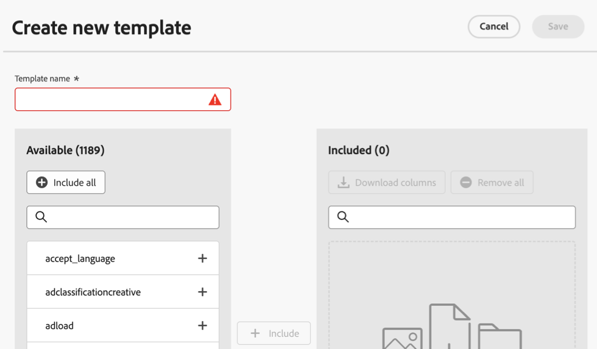

# データフィードの作成

データフィードを作成する際は、アドビに次の情報を提供します。

* 生データファイルを送信する宛先に関する情報

* 各ファイルに含めるデータ

* データフィードを送信する頻度（遅延ヒットを含める場合はルックバックウィンドウを含む）

データフィードを作成する前に、データフィードの基本を理解し、すべての前提条件を満たしていることを確認することが重要です。 詳しくは、[データフィードの概要](data-feed-overview.md)を参照してください。

## データフィードの作成と設定 {#create-and-configure-data-feed}

<!-- markdownlint-disable MD034 -->

>[!CONTEXTUALHELP]
>id="cja_datafeed_export_file"
>title="マニフェスト"
>abstract="各データフィード配信にマニフェストファイルを含めるかどうかを選択します。 マニフェストファイルには、データフィードに含まれる各ファイルの情報が含まれています。 データフィードデータを 1 つのパッケージで送信する際は、終了ファイルを含めることも選択できますが、マニフェストファイルをお勧めします。 "

<!-- markdownlint-enable MD034 -->

<!-- markdownlint-disable MD034 -->

>[!CONTEXTUALHELP]
>id="cja_datafeed_notify"
>title="完了時に通知"
>abstract="データフィードの送信後に通知を配信するメールアドレスを 1 つ以上指定します。 複数のメールアドレスはコンマで区切る必要があります。"

<!-- markdownlint-enable MD034 -->

<!-- markdownlint-disable MD034 -->

>[!CONTEXTUALHELP]
>id="cja_datafeed_lookback_date_range"
>title="ルックバック日付範囲"
>abstract="データフィード配信を処理する際にCustomer Journey Analyticsがどの程度戻って表示されるかを制御します。 この設定では、頻度ウィンドウ （時間または日）は変更されません。 ただし、ルックバック日付範囲は、配信されるデータに影響を与える可能性があります。 セグメントの選定、セッションの計算、ディメンションの永続性はすべて、ルックバック日付範囲の影響を受けます。"

<!-- markdownlint-enable MD034 -->

<!-- added help for Dynamic lookups to this page: help/export/analytics-data-feed/c-df-contents/dynamic-lookups.md -->

1. Adobe ID の資格情報を使用して [experiencecloud.adobe.com](https://experiencecloud.adobe.com) にログインします。

1. 右上の9角形のアイコンを選択し、[!UICONTROL **Customer Journey Analytics**]&#x200B;を選択します。

1. 上部ナビゲーションバーで、[!UICONTROL **管理者**]／[!UICONTROL **データフィード**]&#x200B;に移動します。

1. 「[!UICONTROL **データフィードを作成**]」を選択します。

   ページに次のタブが表示されます：[!UICONTROL **詳細**]、[!UICONTROL **データ構造**]、[!UICONTROL **配信**]。

   

1. 「[!UICONTROL **詳細**]」セクションで、次のフィールドに入力します。

   | フィールド | 関数 |
   |---------|----------|
   | [!UICONTROL **名前**] | データフィードの名前。 名前は、選択したレポートスイート内で一意である必要があり、最大255文字まで指定できます。<!--[Learn more](/help/export/analytics-data-feed/df-faq.md#must-feed-names-be-unique)--> |
   | [!UICONTROL **タグ**] | 任意のタグをデータフィードに適用して分類を容易にします。<!--You can filter on tags as described in [Filter and search the list of data feeds](/help/export/analytics-data-feed/df-manage-feeds.md#filter-and-search-the-list-of-data-feeds) in [Manage data feeds](/help/export/analytics-data-feed/df-manage-feeds.md).--> |
   | [!UICONTROL **説明**] | データフィードの説明を指定します。 追加した説明は、データフィードの編集時に表示されます。 |
   | [!UICONTROL **データビュー**] | 書き出すデータを含むデータビューを選択します。 |

1. 「[!UICONTROL **データ形式**]」セクションで、次の情報を指定します。

   | フィールド | 関数 |
   |---------|----------|
   | [!UICONTROL **圧縮形式**] | 使用する圧縮のタイプ。 **Gzip** はファイルを `.tar.gz` 形式で出力します。 **Zip** はファイルを `.zip` 形式で出力します。 |
   | [!UICONTROL **パッケージタイプ**] | ほとんどのデータフィードでは、「[!UICONTROL **複数のファイル**]」を選択します。 このオプションは、データを非圧縮の 2 GB チャンクにページ分割します。 （[!UICONTROL **複数ファイル**] オプションが選択されていて、レポートウィンドウの非圧縮データが2 GB未満の場合、1つのファイルが送信されます）。 **単一ファイル**&#x200B;を選択すると、`hit_data.tsv` ファイルが1つの巨大ファイルに出力されます。 |
   | [!UICONTROL **マニフェスト**] | 各データフィード配信にマニフェストファイルを含めるかどうかを選択します。 
次のオプションから選択できます。
<ul><li>**[!UICONTROL マニフェストファイル]**: データフィードに含まれる各ファイルの情報が含まれます。</li><li>**[!UICONTROL ファイルを完了（レガシー）]**: データフィードが正常に完了したことを示します。 その他の情報は含まれていません。 このオプションは、このオプションを再処理する必要がある既存のフィードに適しています。 単一のパッケージでデータフィードデータを送信する場合にのみ使用できます。 </li><li>**[!UICONTROL なし]**: ファイルが含まれていません</li></ul> |
   | [!UICONTROL **データがない場合でもマニフェストを送信**] | フィード間隔にデータが収集されない場合に、Adobeがマニフェストファイル <!--[manifest file](/help/export/analytics-data-feed/c-df-contents/datafeeds-contents.md#feed-manifest)-->を宛先に配信するかどうかを指定します。 **マニフェストファイル**&#x200B;を選択すると、データが収集されないときに、次のようなマニフェストファイルが表示されます。
`text`

`Datafeed-Manifest-Version: 1.0`

`Lookup-Files: 0`

`Data-Files: 0`

 `Total-Records: 0`
 |
   | [!UICONTROL **オペレーティングシステム文字列の置換**] | データを収集する際に、一部の文字（新しい行など）が問題を引き起こす可能性があります。 フィード ファイルからこれらの文字を削除するには、このオプションを選択します。
このオプションは、顧客データに埋め込まれた次の文字列シーケンスを検出し、スペースに置き換えます。
 <ul><li>**Windows:** CRLF、CR、またはTAB</li><li>**MacとLinux:** \n、\r、または\t</li></ul> |
   | [!UICONTROL **動的検索を有効にする**] | 動的ルックアップを使用すると、他の方法では利用できないデータフィード内の追加のルックアップファイルを受信できます。 この設定では、各データフィードファイルで次のルックアップテーブルを送信できます。<ul><li> **通信事業者名**</li><li>**モバイル属性**</li><li>**オペレーティング システムの種類**</li></ul><!--
For more information, see [Dynamic lookups](/help/export/analytics-data-feed/c-df-contents/dynamic-lookups.md).
--> |
   | **到着遅延のヒットを許可** | データフィードジョブが指定された時刻に処理を完了した後（タイムスタンプ付きのヒットやデータソースを通してなど）に、履歴データが到着することがあります。
設定したレポート頻度（通常は日単位または時間単位）内でデータフィードジョブがデータ処理を完了した後に到着したデータも含める場合は、このオプションを選択します。 このオプションを有効にすると、データフィードは、データを処理するたびに、到着が遅れたヒットを調べ、送信される次のデータフィードファイルでバッチ処理します。
<!--
For more information, see [Late-arriving hits](/help/export/analytics-data-feed/c-df-contents/late-arriving-hits.md).
--> |
   | **ルックバックウィンドウ** （遅延着弾の場合） | このオプションは、「**[!UICONTROL 遅延ヒットを許可]**」オプションが有効になっている場合に表示されます。 ルックバックウィンドウを選択して、含まれるレイトヒットの時間枠を制限します。 遅延時間にかかわらず、すべての遅延時間を許可する場合は、**[!UICONTROL 無制限]**&#x200B;を選択します。 **[!UICONTROL 1時間]**、**[!UICONTROL 2時間]**、**[!UICONTROL 1週間]**、**[!UICONTROL 2週間]**&#x200B;などのプリセット間隔を選択できます。 または、**[!UICONTROL カスタムルックバックウィンドウ]**&#x200B;を選択し、**[!UICONTROL カスタムルックバック]** フィールドで、最大26,280時間のルックバックウィンドウを指定します。 |

1. 「[!UICONTROL **データ構造**]」セクションで、**[!UICONTROL データビュー]** フィールドで正しいデータビューが選択されていることを確認します。 
データビューを選択する際には、次の点を考慮してください。
 <ul><li>同じデータビューに対して複数のデータフィードを作成する場合、各データフィードには異なる列定義が必要です。</li><li>使用可能な列のリストは、選択したデータビューが属するログイン会社によって異なります。 データビューを変更すると、使用可能な列のリストが変更される可能性があります。 </li></ul>

1. フィードに含めるデータ列を決定するには、次のいずれかの方法または両方を使用します。

   * **列を個別に追加：**&#x200B;左側の&#x200B;**[!UICONTROL 使用可能]** セクションで、含める列を選択し、**[!UICONTROL 含める]**&#x200B;を選択します。 Adobe Analyticsのすべてのデータ列を使用できます。 複数の列を選択するには、**[!UICONTROL Shift]**&#x200B;を押すか、**[!UICONTROL Command]** （macOS）または&#x200B;**[!UICONTROL Ctrl]** （Windows）を押します。 「**[!UICONTROL すべて追加]**」をクリックして、データフィードにすべての列を含めます。

     追加した列は、右側の&#x200B;**[!UICONTROL Included]** セクションに表示されます。

   * **列テンプレートを追加：** **[!UICONTROL 列テンプレート]** フィールドで、追加する列テンプレートを選択します。 列テンプレートは定義済みの列のグループであり、Adobeにはデフォルトで複数の列が用意されています。

     テンプレートに含まれているすべての列は、右側の&#x200B;**[!UICONTROL Included]** セクションに表示されます。

1. （オプション）現在作成しているデータフィードに基づく列テンプレートを作成するには、**[!UICONTROL テンプレートとして保存]**&#x200B;を選択し、テンプレートの名前を指定してから、**[!UICONTROL 保存]**&#x200B;を選択します。 このオプションは、同じ列を含む追加のデータフィードを作成する場合に便利です。

   

1. （オプション）含まれる列のリストを.csv形式でダウンロードするには、**[!UICONTROL 列をダウンロード]**&#x200B;を選択します。 このオプションは、列数が多いデータフィードに便利です。

1. 「[!UICONTROL **配信**]」セクションで、次の情報を指定します。

   | フィールド | 関数 |
   |---------|----------|
   | [!UICONTROL **フィードの種類**] | 作成するフィードのタイプを選択します。<ul><li>[!UICONTROL **ライブフィード**]：現在および将来のデータを書き出します。</li><li>[!UICONTROL **バックフィルフィード**]：過去2日間の履歴データを書き出します。</li></ul> |
   | [!UICONTROL **開始日**] | データフィードを開始する日付を指定します。 履歴データのデータフィードの処理をすぐに開始するには、[!UICONTROL **バックフィルフィード**]&#x200B;が選択されていることを確認し、データが収集されている過去の任意の日付にこの日付を設定します。 開始日は、データビューのタイムゾーンに基づいています。 |
   | [!UICONTROL **終了日**] | データフィードを終了する日付を指定します。 終了日は、データビューのタイムゾーンに基づいています。 |
   | [!UICONTROL **頻度**] | データフィードを送信する頻度を選択します。 タイムスタンプが周波数ウィンドウ内にあるイベントは、データフィード配信に含まれます。 [!UICONTROL **ルックバック日付範囲**]&#x200B;および&#x200B;[!UICONTROL **処理遅延**] フィールドは、選択した配信頻度のデータに含まれるイベントにも影響する可能性があります。
1時間分のデータまたは1日分のデータを含めるように選択します。
<ul><li>**毎日**: フィードには、データビューのタイムゾーンの午前0時から午前0時までの1日分のデータが含まれます。 このオプションは、バックフィルフィードまたはライブフィードに使用します。</li><li>**時間単位**: フィードには、1時間のデータが含まれます。 ライブフィードにこのオプションを使用します。</li></ul> |
   | [!UICONTROL **ルックバック日付範囲**] | データフィード配信を処理する際にCustomer Journey Analyticsがどの程度戻って表示されるかを制御します。 
この設定では、データフィード出力に含めるイベントの時間枠を定義する頻度ウィンドウ（時間または日）は変更されません。 ただし、ルックバック日付範囲は、次の方法で配信されるデータに影響を与える可能性があります。 
<ul><li>**セグメントの選定**: セグメントがデータフィード定義に適用されると、ルックバック日付範囲内のイベントによって、その人物が選定されるかどうかが決まります。 セグメントのコンテナ設定によってスコープが決まります。 （可能なコンテナは、Person、Session、またはEventです。 B2Bには、グローバルアカウント、アカウント、商談、購買グループなどの追加コンテナがあります）。  
例えば、人物コンテナが使用され、その人物がルックバック日付範囲で選定された場合、その人物の頻度ウィンドウ内のすべてのイベントも選定されます。
</li><li>**セッション計算**: セッションの境界は、ルックバック日付範囲内のデータを使用して計算されます。</li><li>**Dimensionの永続性**：個々のディメンションに永続性を設定する場合は、有効期限も選択して、ディメンション項目が設定されているイベントを超えて保持される期間を決定します。 
ルックバック日付範囲は、有効期限がデータビューで次のいずれかのオプションに設定されている場合のディメンションの永続性に影響します。
<ul><li>[!UICONTROL **レポート ウィンドウ**]&#x200B;を有効期限として使用するデータ フィード定義の各ディメンションについて、ルックバック日付範囲が新しいレポート ウィンドウになります。</li><li>有効期限として&#x200B;[!UICONTROL **カスタム時間**]&#x200B;を使用するデータフィード定義の各ディメンションについて、選択されたカスタム時間がルックバック日付範囲を超えている場合、カスタム時間は無視され、ルックバック日付範囲がディメンションの有効期限に使用されます。
データビュー内のディメンションに対する永続性の設定について詳しくは、[永続性コンポーネント設定](/help/data-views/component-settings/persistence.md)を参照してください。
</li></ul> |
   | [!UICONTROL **処理遅延**] | データフィードファイルを処理する前に、一定時間待つかどうかを選択します。 遅延は、モバイル実装に、オフラインデバイスがオンラインになり、データを送信する機会を与えるのに役立ちます。 また、以前に処理されたファイルを管理する際に、組織のサーバー側のプロセスに対応するためにも使用できます。 ほとんどの場合、遅延は必要ありません。 フィードを最大8時間（480分）遅らせることも、カスタム時間（9,999分、約1週間）を選択した場合はさらに長くすることもできます。
遅延が設定されていない場合は、頻度ウィンドウ（最終日または1時間）内のイベントのみがフィードに含まれます。 |

1. 「[!UICONTROL **宛先**]」セクションで、データを送信する宛先を設定します。

   >[!NOTE]
   >
   >レポートの宛先を設定する際には、次の点を考慮してください。
   >
   ><!--* Adobe recommends using a cloud account for your report destination. [Legacy FTP and SFTP accounts](/help/components/locations/configure-import-accounts.md) are available, but are not recommended.-->
   >* 以前に設定したクラウドアカウントはすべて、データフィードに使用できます。 クラウドアカウントは、[&#x200B; コンポーネント/書き出し/場所アカウント &#x200B;](/help/components/exports/cloud-export-accounts.md)の場所マネージャーから設定できます。
   >
   >* Cloud アカウントは、Customer Journey Analytics ユーザーアカウントに関連付けられています。 他のユーザーは、組織内のすべてのユーザーが利用できるようにしない限り、設定したクラウドアカウントを使用または表示できません。
   >
   >* 場所マネージャーから作成した場所は、[&#x200B; コンポーネント/書き出し/場所](/help/components/exports/cloud-export-locations.md)で編集できます。

   以下のフィールドに入力します。

   | フィールド | 関数 |
   |---------|----------|
   | [!UICONTROL **アカウント**] | 次のいずれかの操作を行います。<ul><li>**既存のアカウントを使用：** 「**[!UICONTROL アカウント]**」フィールドの横にあるドロップダウンメニューを選択します。 または、アカウント名の入力を開始し、ドロップダウンメニューから選択します。 
アカウントは、設定した場合、または自分が所属する組織と共有されている場合にのみ利用できます。
</li><li>**新しいアカウントを作成します：** 「**[!UICONTROL アカウント]**」フィールドの下にある「**[!UICONTROL 新しい]**&#x200B;を追加」を選択します。 アカウントの設定方法について詳しくは、[&#x200B; クラウド書き出しアカウントの設定](/help/components/exports/cloud-export-accounts.md)を参照してください。</li></ul> |
   | [!UICONTROL **場所**] | 次のいずれかの操作を行います。<ul><li>**既存の場所を使用：** 「**[!UICONTROL 場所]**」フィールドの横にあるドロップダウンメニューを選択します。 または、場所の名前を入力し、ドロップダウンメニューから選択します。</li><li>**新しい場所を作成：**&#x200B;選択&#x200B;**[!UICONTROL 場所]** フィールドの下に&#x200B;**[!UICONTROL 新しい]**&#x200B;を追加します。 場所の設定方法について詳しくは、[&#x200B; クラウド書き出し場所の設定](/help/components/exports/cloud-export-locations.md)を参照してください。</li></ul> |
   | [!UICONTROL **完了時に通知**] | データフィードが正常に送信されるか、送信に失敗した後に通知を配信する1つ以上のメールアドレスを指定します。 複数のメールアドレスはコンマで区切る必要があります。 |
   | [!UICONTROL **マニフェストを有効にする**] | 各データフィード配信にマニフェストファイルを含めるかどうかを選択します。 
次のオプションから選択できます。
<ul><li>**[!UICONTROL マニフェストファイル]**: データフィードに含まれる各ファイルの情報が含まれます。</li><li>**[!UICONTROL ファイルを完了（レガシー）]**: データフィードが正常に完了したことを示します。 その他の情報は含まれていません。 このオプションは、このオプションを再処理する必要がある既存のフィードに適しています。 単一のパッケージでデータフィードデータを送信する場合にのみ使用できます。 </li><li>**[!UICONTROL なし]**: ファイルが含まれていません</li></ul> |

1. 「**[!UICONTROL 保存]**」を選択します。

## 列テンプレートの管理

テンプレートを使用すると、作成した将来のデータフィードに同じ列を再利用できます。

テンプレートを管理する場合は、新しいテンプレートの作成、作成済みのテンプレートの使用、テンプレートのコピー、テンプレートの編集、テンプレートの削除を行うことができます。

**[!UICONTROL 管理者]** > **[!UICONTROL データフィード]** > **[!UICONTROL テンプレートの管理]**

### 列テンプレートの作成

同じ列を使用する複数のデータフィードを作成する場合、Adobeでは列テンプレートを作成することをお勧めします。 作成した列テンプレートは、組織内の誰でも使用できます。

列テンプレートを作成するには：

1. Adobe Analyticsで、[!UICONTROL **管理者**] > [!UICONTROL **データフィード**] > **[!UICONTROL テンプレートの管理]**&#x200B;に移動します。

1. **[!UICONTROL 新しいテンプレートを作成]**&#x200B;を選択して、新しい列テンプレートを作成します。

   

1. 「**[!UICONTROL テンプレート名]**」フィールドで、テンプレートの名前を指定します。

1. 左側の&#x200B;**[!UICONTROL Available]** セクションで、含める列を選択し、**[!UICONTROL Include]**&#x200B;を選択します。 Adobe Analyticsで使用可能なすべてのデータ列を使用できます。 複数の列を選択するには、**[!UICONTROL Shift]**&#x200B;を押すか、**[!UICONTROL Command]** （macOS）または&#x200B;**[!UICONTROL Ctrl]** （Windows）を押します。 「**[!UICONTROL すべて追加]**」をクリックして、データフィードにすべての列を含めます。

   追加した列は、右側の&#x200B;**[!UICONTROL Included]** セクションに表示されます。

1. 「**[!UICONTROL 保存]**」を選択します。

### 列テンプレートの編集

1. Adobe Analyticsで、[!UICONTROL **管理者**] > [!UICONTROL **データフィード**] > **[!UICONTROL テンプレートの管理]**&#x200B;に移動します。

1. 編集するテンプレートを選択し、**[!UICONTROL 編集]**&#x200B;を選択します。

1. 編集を行い、**[!UICONTROL 保存]**&#x200B;を選択します。

### 列テンプレートのコピー

1. Adobe Analyticsで、[!UICONTROL **管理者**] > [!UICONTROL **データフィード**] > **[!UICONTROL テンプレートの管理]**&#x200B;に移動します。

1. コピーするテンプレートを選択してから、**[!UICONTROL コピー]**&#x200B;を選択します。

1. 「**[!UICONTROL テンプレート名]**」フィールドで、テンプレートの名前を指定します。

1. 追加の変更を加え、**[!UICONTROL 保存]**&#x200B;を選択します。

### 列テンプレートの削除

1. Adobe Analyticsで、[!UICONTROL **管理者**] > [!UICONTROL **データフィード**] > **[!UICONTROL テンプレートの管理]**&#x200B;に移動します。

1. 削除する1つ以上のテンプレートを選択し、**[!UICONTROL 削除]**&#x200B;を選択します。

<!-- why would you want to do this? -->

<!--
I don't think we need anything after this, but saving here just in case:

1. In the [!UICONTROL **Feed Information**] section, complete the following fields:
   
   | Field | Function |
   |---------|----------|
   | [!UICONTROL **Name**] | The name of the data feed. Must be unique within the selected report suite, and can be up to 255 characters in length. [Learn more](/help/export/analytics-data-feed/df-faq.md#must-feed-names-be-unique) |
   | [!UICONTROL **Report suite**] | The report suite that the data feed is based on. If multiple data feeds are created for the same report suite, they must have different column definitions. Only source report suites support data feeds; virtual report suites are not supported. |
   | [!UICONTROL **Email when complete**] | The email address to be notified when a feed finishes processing. The email address must be properly formatted. |
   | [!UICONTROL **Feed interval**] | Select **Daily** for backfill or historical data. Daily feeds contain a full day's worth of data, from midnight to midnight in the report suite's time zone. Select **Hourly** for continuing data (Daily is also available for continuing feeds if you prefer). Hourly feeds contain a single hour's worth of data. |
   | [!UICONTROL **Delay processing**] | Wait a given amount of time before processing a data feed file. A delay can be useful to give mobile implementations an opportunity for offline devices to come online and send data. It can also be used to accommodate your organization's server-side processes in managing previously processed files. In most cases, no delay is needed. A feed can be delayed by up to 120 minutes. |
   | [!UICONTROL **Start & end dates**] | The start date indicates the date when you want the data feed to begin. To immediately begin processing data feeds for historical data, set this date to any date in the past when data is being collected. The start and end dates are based on the report suite's time zone. |
   | [!UICONTROL **Continuous feed**] | This checkbox removes the end date, allowing a feed to run indefinitely. When a feed finishes processing historical data, a feed waits for data to finish collecting for a given hour or day. Once the current hour or day concludes, processing begins after the specified delay. |
   
1. In the [!UICONTROL **Destination**] section, in the [!UICONTROL **Type**] drop-down menu, select the destination where you want the data to be sent. 

   >[!NOTE]
   >
   >Consider the following when configuring a report destination:
   >
   >* We recommend using a cloud account for your report destination. [Legacy FTP and SFTP accounts](#legacy-destinations) are available, but are not recommended.
   >* Any cloud accounts that you previously configured are available to use for Data Feeds. You can configure cloud accounts in any of the following ways:
   >
   >   * When configuring cloud accounts for [Data Warehouse](/help/export/data-warehouse/create-request/dw-request-report-destinations.md) 
   >   
   >   * When [importing Adobe Analytics classification data](/help/components/locations/locations-manager.md) (Any locations that are configured for importing classification data cannot be used.)
   >   
   >   * From the Locations manager, in [Components > Locations](/help/components/locations/configure-import-accounts.md) 
   >
   >* Cloud accounts are associated with your Adobe Analytics user account. Other users cannot use or view cloud accounts that you configure.
   >
   >* You can edit any locations that you create from the Locations manager in [Components > Locations](/help/components/locations/configure-import-accounts.md)

   

   Use any of the following destination types when creating a data feed. For configuration instructions, expand the destination type. (Additional [legacy destinations](#legacy-destinations) are also available, but are not recommended.)

   +++Amazon S3

   You can send feeds directly to Amazon S3 buckets. This destination type requires only your Amazon S3 account and the location (bucket). 

   Adobe Analytics uses cross-account authentication to upload files from Adobe Analytics to the specified location in your Amazon S3 instance.

   When using Amazon S3 with Data Feeds, only SSE-S3 encryption is supported.

   To configure an Amazon S3 bucket as the destination for a data feed:

   1. Begin creating a data feed as described in [Create and configure a data feed](#create-and-configure-a-data-feed).
   
   1. In the [!UICONTROL **Destination**] section, in the [!UICONTROL **Type**] drop-down menu, select [!UICONTROL **Amazon S3**].

      

   1. Select [!UICONTROL **Select location**].

      The Amazon S3 Export Locations page is displayed.

   1. (Conditional) If an Amazon S3 account (and a location on that account) has already been configured in Adobe Analytics, you can use it as your data feed destination: 

      >[!NOTE]
      >
      >Accounts are available to you only if you configured them or if they were shared with an organization you are a part of.
   
      1. Select the account from the [!UICONTROL **Select account**] drop-down menu.

         Any cloud accounts that were configured in any of the following areas of Adobe Analytics are available to use:
      
         * When importing Adobe Analytics classification data, as described in [Schema](/help/components/classifications/sets/manage/schema.md).
      
           However, any locations that are configured for importing classification data cannot be used. Instead, add a new destination as described below.

         * When configuring accounts and locations in the Locations area, as described in [Configure cloud import and export accounts](/help/components/locations/configure-import-accounts.md) and [Configure cloud import and export locations](/help/components/locations/configure-import-locations.md).
   
      1. Select the location from the [!UICONTROL **Select location**] drop-down menu.

      1. Select [!UICONTROL **Save**] > [!UICONTROL **Save**].

      The destination is now configured to send data to the Amazon S3 location that you specified.
   
   1. (Conditional) If you have not previously added an Amazon S3 account:

      1. Select [!UICONTROL **Add account**], then specify the following information:
   
         |Field | Function |
         |---------|----------|
         | [!UICONTROL **Account name**] | A name for the account. This can be any name you choose. |
         | [!UICONTROL **Account description**] | A description for the account. |
         | [!UICONTROL **Role ARN**] | You must provide a Role ARN (Amazon Resource Name) that Adobe can use to gain access to the Amazon S3 account. To do this, you create an IAM permission policy for the source account, attach the policy to a user, and then create a role for the destination account. For specific information, see [this AWS documentation](https://aws.amazon.com/premiumsupport/knowledge-center/cross-account-access-iam/). |
         | [!UICONTROL **User ARN**] | The User ARN (Amazon Resource Name) is provided by Adobe. You must attach this user to the policy you created. |

         {style="table-layout:auto"}

      1. Select [!UICONTROL **Add location**], then specify the following information:
   
         |Field | Function |
         |---------|----------|
         | [!UICONTROL **Name**] | A name for the account.  |
         | [!UICONTROL **Description**] | A description for the account. |
         | [!UICONTROL **Bucket**] | The bucket within your Amazon S3 account where you want Adobe Analytics data to be sent. 
Ensure that the User ARN that was provided by Adobe has the `S3:PutObject` permission in order to upload files to this bucket. This permission allows the User ARN to upload initial files and overwrite files for subsequent uploads.

Bucket names must meet specific naming rules. For example, they must be between 3 to 63 characters long, can consist only of lowercase letters, numbers, dots (.), and hyphens (-), and must begin and end with a letter or number. [A complete list of naming rules are available in the AWS documentation](https://docs.aws.amazon.com/AmazonS3/latest/userguide/bucketnamingrules.html). 
 |
         | [!UICONTROL **Prefix**] | The folder within the bucket where you want to put the data. Specify a folder name, then add a backslash after the name to create the folder. For example, `folder_name/` |

         {style="table-layout:auto"}

      1. Select [!UICONTROL **Create**] > [!UICONTROL **Save**].

         The destination is now configured to send data to the Amazon S3 location that you specified.

      1. (Conditional) If you need to manage the destination (account and location) that you just created, it is available in the [Locations manager](/help/components/locations/locations-manager.md).
   
   +++

   +++Azure RBAC

   You can send feeds directly to an Azure container by using RBAC authentication. This destination type requires an Application ID, Tenant ID, and Secret. 

   To configure an Azure RBAC account as the destination for a data feed:

   1. If you haven't already, create an Azure application that Adobe Analytics can use for authentication, then grant access permissions in access control (IAM). 
   
      For information, refer to the [Microsoft Azure documentation about how to create an Azure Active Directory application](https://learn.microsoft.com/en-us/azure/active-directory/develop/howto-create-service-principal-portal). 
   
   1. In the Adobe Analytics admin console, in the [!UICONTROL **Destination**] section, in the [!UICONTROL **Type**] drop-down menu, select [!UICONTROL **Azure RBAC**].

      

   1. Select [!UICONTROL **Select location**].

      The Azure RBAC Export Locations page is displayed.

   1. (Conditional) If an Azure RBAC account (and a location on that account) has already been configured in Adobe Analytics, you can use it as your data feed destination: 

      >[!NOTE]
      >
      >Accounts are available to you only if you configured them or if they were shared with an organization you are a part of.
   
      1. Select the account from the [!UICONTROL **Select account**] drop-down menu.

      Any cloud accounts that you configured in any of the following areas of Adobe Analytics are available to use:
      
         * When importing Adobe Analytics classification data, as described in [Schema](/help/components/classifications/sets/manage/schema.md).
      
           However, any locations that are configured for importing classification data cannot be used. Instead, add a new destination as described below.

         * When configuring accounts and locations in the Locations area, as described in [Configure cloud import and export accounts](/help/components/locations/configure-import-accounts.md) and [Configure cloud import and export locations](/help/components/locations/configure-import-locations.md).

      1. Select the location from the [!UICONTROL **Select location**] drop-down menu.

      1. Select [!UICONTROL **Save**] > [!UICONTROL **Save**].

         The destination is now configured to send data to the Azure RBAC location that you specified.

   1. (Conditional) If you have not previously added an Azure RBAC account:

      1. Select [!UICONTROL **Add account**], then specify the following information:
   
         |Field | Function |
         |---------|----------|
         | [!UICONTROL **Account name**] | A name for the Azure RBAC account. This name displays in the [!UICONTROL **Select account**] drop-down field and can be any name you choose. |
         | [!UICONTROL **Account description**] | A description for the Azure RBAC account. This description displays in the [!UICONTROL **Select account**] drop-down field and can be any name you choose.  |
         | [!UICONTROL **Application ID**] | Copy this ID from the Azure application that you created. In Microsoft Azure, this information is located on the **Overview** tab within your application. For more information, see the [Microsoft Azure documentation about how to register an application with the Microsoft identity platform](https://learn.microsoft.com/en-us/azure/active-directory/develop/quickstart-register-app). |
         | [!UICONTROL **Tenant ID**] | Copy this ID from the Azure application that you created. In Microsoft Azure, this information is located on the **Overview** tab within your application. For more information, see the [Microsoft Azure documentation about how to register an application with the Microsoft identity platform](https://learn.microsoft.com/en-us/azure/active-directory/develop/quickstart-register-app). |
         | [!UICONTROL **Secret**] | Copy the secret from the Azure application that you created. In Microsoft Azure, this information is located on the **Certificates & secrets** tab within your application. For more information, see the [Microsoft Azure documentation about how to register an application with the Microsoft identity platform](https://learn.microsoft.com/en-us/azure/active-directory/develop/quickstart-register-app). |

         {style="table-layout:auto"}

      1. Select [!UICONTROL **Add location**], then specify the following information: 
   
         |Field | Function |
         |---------|----------|
         | [!UICONTROL **Name**] | A name for the location. This name displays in the [!UICONTROL **Select location**] drop-down field and can be any name you choose. |
         | [!UICONTROL **Description**] | A description for the location. This description displays in the [!UICONTROL **Select location**] drop-down field and can be any name you choose. |
         | [!UICONTROL **Account**] | The Azure storage account. |
         | [!UICONTROL **Container**] | The container within the account you specified where you want Adobe Analytics data to be sent. Ensure that you grant permissions to upload files to the Azure application that you created earlier. |
         | [!UICONTROL **Prefix**] | The folder within the container where you want to put the data. Specify a folder name, then add a backslash after the name to create the folder. For example, `folder_name/`
Make sure the Application ID that you specified when configuring the Azure RBAC account has been granted the `Storage Blob Data Contributor` role in order to access the container (folder).
 
For more information, see [Azure built-in roles](https://learn.microsoft.com/en-us/azure/role-based-access-control/built-in-roles).
 |

         {style="table-layout:auto"}

      1. Select [!UICONTROL **Create**] > [!UICONTROL **Save**].

         The destination is now configured to send data to the Azure RBAC location that you specified.

      1. (Conditional) If you need to manage the destination (account and location) that you just created, it is available in the [Locations manager](/help/components/locations/locations-manager.md).
   
   +++

   +++Azure SAS

   You can send feeds directly to an Azure container by using SAS authentication. This destination type requires an Application ID, Tenant ID, Key vault URI, Key vault secret name, and secret. 

   To configure Azure SAS as the destination for a data feed:

   1. If you haven't already, create an Azure application that Adobe Analytics can use for authentication. 
   
      For information, refer to the [Microsoft Azure documentation about how to create an Azure Active Directory application](https://learn.microsoft.com/en-us/azure/active-directory/develop/howto-create-service-principal-portal). 
   
   1. In the Adobe Analytics admin console, in the [!UICONTROL **Destination**] section, select [!UICONTROL **Azure SAS**].

      

   1. Select [!UICONTROL **Select location**].

      The Azure SAS Export Locations page is displayed.

   1. (Conditional) If an Azure SAS account (and a location on that account) has already been configured in Adobe Analytics, you can use it as your data feed destination: 

      >[!NOTE]
      >
      >Accounts are available to you only if you configured them or if they were shared with an organization you are a part of.
   
      1. Select the account from the [!UICONTROL **Select account**] drop-down menu.

         Any cloud accounts that you configured in any of the following areas of Adobe Analytics are available to use:
      
         * When importing Adobe Analytics classification data, as described in [Schema](/help/components/classifications/sets/manage/schema.md).
      
           However, any locations that are configured for importing classification data cannot be used. Instead, add a new destination as described below.

         * When configuring accounts and locations in the Locations area, as described in [Configure cloud import and export accounts](/help/components/locations/configure-import-accounts.md) and [Configure cloud import and export locations](/help/components/locations/configure-import-locations.md).

      1. Select the location from the [!UICONTROL **Select location**] drop-down menu.

      1. Select [!UICONTROL **Save**] > [!UICONTROL **Save**].

         The destination is now configured to send data to the Azure SAS location that you specified.
   
   1. (Conditional) If you have not previously added an Azure SAS account:

      1. Select [!UICONTROL **Add account**], then specify the following information:
   
         |Field | Function |
         |---------|----------|
         | [!UICONTROL **Account name**] | A name for the Azure SAS account. This name displays in the [!UICONTROL **Select account**] drop-down field and can be any name you choose. |
         | [!UICONTROL **Account description**] | A description for the Azure SAS account. This description displays in the [!UICONTROL **Select account**] drop-down field and can be any name you choose. |
         | [!UICONTROL **Application ID**] | Copy this ID from the Azure application that you created. In Microsoft Azure, this information is located on the **Overview** tab within your application. For more information, see the [Microsoft Azure documentation about how to register an application with the Microsoft identity platform](https://learn.microsoft.com/en-us/azure/active-directory/develop/quickstart-register-app). |
         | [!UICONTROL **Tenant ID**] | Copy this ID from the Azure application that you created. In Microsoft Azure, this information is located on the **Overview** tab within your application. For more information, see the [Microsoft Azure documentation about how to register an application with the Microsoft identity platform](https://learn.microsoft.com/en-us/azure/active-directory/develop/quickstart-register-app). |
         | [!UICONTROL **Key vault URI**] | 
The path to the SAS URI in Azure Key Vault. To configure Azure SAS, you need to store an SAS URI as a secret using Azure Key Vault. For information, see the [Microsoft Azure documentation about how to set and retrieve a secret from Azure Key Vault](https://learn.microsoft.com/en-us/azure/key-vault/secrets/quick-create-portal?source=recommendations).

After the key vault URI is created:<ul><li>Add an access policy on the Key Vault in order to grant permission to the Azure application that you created.
For information, see the [Microsoft Azure documentation about how to assign a Key Vault access policy](https://learn.microsoft.com/en-us/azure/key-vault/general/assign-access-policy?tabs=azure-portal).

Or

If you want to grant an access role directly without creating an access policy, see the [Microsoft Azure documentation about how to assign Azure roles using Azure portal](https://learn.microsoft.com/en-us/azure/role-based-access-control/role-assignments-portal). This adds the role assignment for the application ID to access the key vault URI. 
</li><li>Make sure the Application ID has been granted the `Key Vault Certificate User` built-in role in order to access the key vault URI. 
For more information, see [Azure built-in roles](https://learn.microsoft.com/en-us/azure/role-based-access-control/built-in-roles).
</li></ul> |
         | [!UICONTROL **Key vault secret name**] | The secret name you created when adding the secret to Azure Key Vault. In Microsoft Azure, this information is located in the Key Vault you created, on the **Key Vault** settings pages. For information, see the [Microsoft Azure documentation about how to set and retrieve a secret from Azure Key Vault](https://learn.microsoft.com/en-us/azure/key-vault/secrets/quick-create-portal?source=recommendations). |
         | [!UICONTROL **Secret**] | Copy the secret from the Azure application that you created. In Microsoft Azure, this information is located on the **Certificates & secrets** tab within your application. For more information, see the [Microsoft Azure documentation about how to register an application with the Microsoft identity platform](https://learn.microsoft.com/en-us/azure/active-directory/develop/quickstart-register-app). |

         {style="table-layout:auto"}

      1. Select [!UICONTROL **Add location**], then specify the following information: 
   
         |Field | Function |
         |---------|----------|
         | [!UICONTROL **Name**] | A name for the location. This name displays in the [!UICONTROL **Select location**] drop-down field and can be any name you choose. |
         | [!UICONTROL **Description**] | A description for the location. This description displays in the [!UICONTROL **Select location**] drop-down field and can be any name you choose. |
         | [!UICONTROL **Container**] | The container within the account you specified where you want Adobe Analytics data to be sent. |
         | [!UICONTROL **Prefix**] | The folder within the container where you want to put the data. Specify a folder name, then add a backslash after the name to create the folder. For example, `folder_name/`
Make sure that the SAS URI store that you specified in the Key Vault secret name field when configuring the Azure SAS account has the `Write` permission. This allows the SAS URI to create files in your Azure container. 
If you want the SAS URI to also overwrite files, make sure that the SAS URI store has the `Delete` permission.

For more information, see [Blob storage resources](https://learn.microsoft.com/en-us/azure/storage/blobs/storage-blobs-introduction#blob-storage-resources) in the Azure Blob Storage documentation.
 |

         {style="table-layout:auto"}

      1. Select [!UICONTROL **Create**] > [!UICONTROL **Save**].

         The destination is now configured to send data to the Azure SAS location that you specified.

      1. (Conditional) If you need to manage the destination (account and location) that you just created, it is available in the [Locations manager](/help/components/locations/locations-manager.md).
   
   +++

   +++Google Cloud Platform

   You can send feeds directly to Google Cloud Platform (GCP) buckets. This destination type requires only your GCP account name and the location (bucket) name. 
   
   Adobe Analytics uses cross-account authentication to upload files from Adobe Analytics to the specified location in your GCP instance.

   To configure a GCP bucket as the destination for a data feed:

   1. In the Adobe Analytics admin console, in the [!UICONTROL **Destination**] section, select [!UICONTROL **Google Cloud Platform**].

      

   1. Select [!UICONTROL **Select location**].

      The GCP Export Locations page is displayed.

   1. (Conditional) If a Google Cloud Platform account (and a location on that account) has already been configured in Adobe Analytics, you can use it as your data feed destination: 

      >[!NOTE]
      >
      >Accounts are available to you only if you configured them or if they were shared with an organization you are a part of.
   
      1. Select the account from the [!UICONTROL **Select account**] drop-down menu.

         Any cloud accounts that you configured in any of the following areas of Adobe Analytics are available to use:
      
         * When importing Adobe Analytics classification data, as described in [Schema](/help/components/classifications/sets/manage/schema.md).
      
           However, any locations that are configured for importing classification data cannot be used. Instead, add a new destination as described below.

         * When configuring accounts and locations in the Locations area, as described in [Configure cloud import and export accounts](/help/components/locations/configure-import-accounts.md) and [Configure cloud import and export locations](/help/components/locations/configure-import-locations.md).

      1. Select the location from the [!UICONTROL **Select location**] drop-down menu.

      1. Select [!UICONTROL **Save**] > [!UICONTROL **Save**].

         The destination is now configured to send data to the Google Cloud Platform location that you specified.
   
   1. (Conditional) If you have not previously added a GCP account:

      1. Select [!UICONTROL **Add account**], then specify the following information:
   
         |Field | Function |
         |---------|----------|
         | [!UICONTROL **Account name**] | A name for the account. This can be any name you choose. |
         | [!UICONTROL **Account description**] | A description for the account. |
         | [!UICONTROL **Project ID**] | Your Google Cloud project ID. See the [Google Cloud documentation about getting a project ID](https://cloud.google.com/resource-manager/docs/creating-managing-projects#identifying_projects). |

         {style="table-layout:auto"}

      1. Select [!UICONTROL **Add location**], then specify the following information:
   
         |Field | Function |
         |---------|----------|
         | [!UICONTROL **Principal**] | The Principal is provided by Adobe. You must grant permission to receive feeds to this principal. |
         | [!UICONTROL **Name**] | A name for the account.  |
         | [!UICONTROL **Description**] | A description for the account. |
         | [!UICONTROL **Bucket**] | The bucket within your GCP account where you want Adobe Analytics data to be sent. 
Ensure that you have granted either of the following permissions to the Principal provided by Adobe: (For information about granting permissions, see [Add a principal to a bucket-level policy](https://cloud.google.com/storage/docs/access-control/using-iam-permissions#bucket-add) in the Google Cloud documentation.)<ul><li>`roles/storage.objectCreator`: Use this permission if you  want to limit the Principal to only create files in your GCP account.  **Important:** If you use this permission with scheduled reporting, you must use a unique file name for each new scheduled export. Otherwise, the report generation will fail because the Principal does not have access to overwrite existing files.</li><li>(Recommended) `roles/storage.objectUser`: Use this permission if you want the Principal to have access to view, list, update, and delete files in your GCP account. This permission allows the Principal to overwrite existing files for subsequent uploads, without the need to auto-generate unique file names for each new scheduled export.</li></ul>
If your organization is using [Organization policy constraints](https://cloud.google.com/storage/docs/org-policy-constraints) to allow only the Google Cloud Platform account in your allow list, you need the following Adobe-owned Google Cloud Platform organization ID: <ul><li>`DISPLAY_NAME`: `adobe.com`</li><li>`ID`: `178012854243`</li><li>`DIRECTORY_CUSTOMER_ID`: `C02jo8puj`</li></ul> 
 |
         | [!UICONTROL **Prefix**] | The folder within the bucket where you want to put the data. Specify a folder name, then add a backslash after the name to create the folder. For example, `folder_name/` |

         {style="table-layout:auto"}

      1. Select [!UICONTROL **Create**] > [!UICONTROL **Save**].

         The destination is now configured to send data to the GCP location that you specified.

      1. (Conditional) If you need to manage the destination (account and location) that you just created, it is available in the [Locations manager](/help/components/locations/locations-manager.md).
   
   +++

1. In the  [!UICONTROL **Data Column Definitions**] section, select the latest [!UICONTROL **All Adobe Columns**] template in the drop-down menu, then complete the following fields:
   
   |Field | Function |
   |---------|----------|
   | [!UICONTROL **Remove escaped characters**] | When collecting data, some characters (such as newlines) can cause issues. Check this box if you would like these characters removed from feed files. |
   | [!UICONTROL **Compression format**] | The type of compression used. **Gzip** outputs files in `.tar.gz` format. **Zip** outputs files in `.zip` format. |
   | [!UICONTROL **Packaging type**] | Select [!UICONTROL **Multiple files**] for most data feeds. This option paginates your data into uncompressed 2GB chunks. (If the [!UICONTROL **Multiple files**] option is selected and uncompressed data for the reporting window is less than 2GB, one file is sent.) Selecting **Single file** outputs the `hit_data.tsv` file in a single, potentially massive file. |
   | [!UICONTROL **Manifest**] | Determines whether Adobe should deliver a [manifest file](c-df-contents/datafeeds-contents.md#feed-manifest) to the destination when no data is collected for a feed interval. If you select **Manifest File**, you receive a manifest file similar to the following when no data is collected:
`text`

`Datafeed-Manifest-Version: 1.0`

`Lookup-Files: 0`

`Data-Files: 0`

 `Total-Records: 0`
 |
   | [!UICONTROL **Column templates**] | When creating many data feeds, Adobe recommends creating a column template. Selecting a column template automatically includes the specified columns in the template. Adobe also provides several templates by default. |
   | [!UICONTROL **Available columns**] | All available data columns in Adobe Analytics. Click [!UICONTROL Add all] to include all columns in a data feed. |
   | [!UICONTROL **Included columns**] | The columns to include in a data feed. Click [!UICONTROL Remove all] to remove all columns from a data feed. |
   | [!UICONTROL **Download CSV**] | Downloads a CSV file containing all included columns. |

1. Select [!UICONTROL **Save**] in the top-right.

    Historical data processing begins immediately. When data finishes processing for a day, the file is sent to the destination that you configured.

    For information about how to access the data feed and to get a better understanding of its contents, see [Data feed contents - overview](/help/export/analytics-data-feed/c-df-contents/datafeeds-contents.md).

## Legacy destinations

>[!IMPORTANT]
>
>The destinations described in this section are legacy, and are not recommended. Instead, use one of the following destinations when creating a data feed: Amazon S3, Google Cloud Platform, Azure RBAC, or Azure SAS. See [Create and configure a data feed](#create-and-configure-a-data-feed) for detailed information about each of these recommended destinations. 

The following information provides configuration information for each of the legacy destinations:

### FTP

Data feed data can be delivered to an Adobe or customer-hosted FTP location. Requires an FTP host, username, and password. Use the path field to place feed files in a folder. Folders must already exist; feeds throw an error if the specified path does not exist.

Use the following information when completing the available fields:

* [!UICONTROL **Host**]: Enter the desired FTP destination URL. For example, `ftp://ftp.omniture.com`.
* [!UICONTROL **Path**]: Can be left blank
* [!UICONTROL **Username**]: Enter the username to log in to the FTP site.
* [!UICONTROL **Password and confirm password**]: Enter the password to log in to the FTP site.

### SFTP

SFTP support for data feeds is available. Requires an SFTP host, username, and the destination site to contain a valid RSA or DSA public key. You can download the appropriate public key when creating the feed.

### S3

You can send feeds directly to Amazon S3 buckets. This destination type requires a Bucket name, an Access Key ID, and a Secret Key. See [Amazon S3 bucket naming requirements](https://docs.aws.amazon.com/awscloudtrail/latest/userguide/cloudtrail-s3-bucket-naming-requirements.html) within the Amazon S3 docs for more information.

The user you provide for uploading data feeds must have the following [permissions](https://docs.aws.amazon.com/AmazonS3/latest/API/API_Operations_Amazon_Simple_Storage_Service.html):

* s3:GetObject
* s3:PutObject
* s3:PutObjectAcl

  >[!NOTE]
  >
  >For each upload to an Amazon S3 bucket, [!DNL Analytics] adds the bucket owner to the BucketOwnerFullControl ACL, regardless of whether the bucket has a policy that requires it. For more information, see "[What is the BucketOwnerFullControl setting for Amazon S3 data feeds?](df-faq.md#BucketOwnerFullControl)"

The following 16 standard AWS regions are supported (using the appropriate signature algorithm where necessary):

* us-east-2
* us-east-1
* us-west-1
* us-west-2
* ap-south-1
* ap-northeast-2
* ap-southeast-1
* ap-southeast-2
* ap-northeast-1
* ca-central-1
* eu-central-1
* eu-west-1
* eu-west-2
* eu-west-3
* eu-north-1
* sa-east-1

>[!NOTE]
>
>The cn-north-1 region is not supported.

### Azure Blob

Data feeds support Azure Blob destinations. Requires a container, account, and a key. Amazon automatically encrypts the data at rest. When you download the data, it gets decrypted automatically. See [Create a storage account](https://docs.microsoft.com/en-us/azure/storage/common/storage-quickstart-create-account?tabs=azure-portal#view-and-copy-storage-access-keys) within the Microsoft Azure docs for more information.

>[!NOTE]
>
>You must implement your own process to manage disk space on the feed destination. Adobe does not delete any data from the server.

-->
