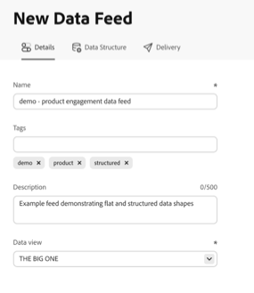

# データフィードの作成

データフィードを作成する際は、アドビに次の情報を提供します。

* 生データファイルを送信する宛先に関する情報

* 各ファイルに含めるデータ

* データが送信される頻度（遅延ヒットを取得するための処理遅延を含む）

データフィードを作成する前に、データフィードの基本を理解し、すべての前提条件を満たしていることを確認することが重要です。 詳しくは、[データフィードの概要](data-feed-overview.md)を参照してください。

## データフィードの作成と設定 {#create-and-configure-data-feed}

<!-- markdownlint-disable MD034 -->

>[!CONTEXTUALHELP]
>id="cja_datafeed_export_file"
>title="マニフェスト"
>abstract="各データフィード配信にマニフェストファイルを含めるかどうかを選択します。 マニフェストファイルには、データフィードに含まれる各ファイルの情報が含まれています。 データフィードデータを 1 つのパッケージで送信する際は、終了ファイルを含めることも選択できますが、マニフェストファイルをお勧めします。 "

<!-- markdownlint-enable MD034 -->

<!-- markdownlint-disable MD034 -->

>[!CONTEXTUALHELP]
>id="cja_datafeed_notify"
>title="完了時に通知"
>abstract="データフィードの送信後に通知を配信するメールアドレスを 1 つ以上指定します。 複数のメールアドレスはコンマで区切る必要があります。"

<!-- markdownlint-enable MD034 -->

<!-- markdownlint-disable MD034 -->

>[!CONTEXTUALHELP]
>id="cja_datafeed_lookback_date_range"
>title="ルックバック日付範囲"
>abstract="データフィード配信を処理する際に、Customer Journey Analytics がルックバックする日付範囲を制御します。 この設定では、頻度ウィンドウ （時間または日）は変更されません。 ただし、ルックバック日付範囲は、配信されるデータに影響を与える場合があります。 セグメントの選定、セッションの計算、一部の派生フィールド変換、ディメンションの永続性はすべて、ルックバック日付範囲の影響を受けます。"

<!-- markdownlint-enable MD034 -->

1. Adobe ID の資格情報を使用して [experiencecloud.adobe.com](https://experiencecloud.adobe.com) にログインします。

1. インターフェイスの右上にあるアプリ切り替えボタンから「[!UICONTROL **Customer Journey Analytics**]」を選択します。

1. 上部のナビゲーションバーで、[!UICONTROL **コンポーネント**] > [!UICONTROL **データフィード**]&#x200B;に移動します。

1. 画面の右上隅にある「[!UICONTROL **作成**]」を選択します。

   または、以前にデータフィードが作成されていない場合は、空のテーブル内で「[!UICONTROL **データフィードを作成**]」を選択します。

   ページに次のタブが表示されます：[!UICONTROL **詳細**]、[!UICONTROL **データ構造**]、[!UICONTROL **配信**]。

   

1. 「[!UICONTROL **詳細**]」タブで、次のフィールドに入力します。

   | フィールド | 関数 |
   |---------|----------|
   | [!UICONTROL **名前**] | データフィードの名前。 名前は、選択したデータビュー内で一意である必要があり、最大255文字まで指定できます。<!--[Learn more](/help/export/analytics-data-feed/df-faq.md#must-feed-names-be-unique)--> |
   | [!UICONTROL **タグ**] | 任意のタグをデータフィードに適用して分類を容易にします。<!--You can filter on tags as described in [Filter and search the list of data feeds](/help/export/analytics-data-feed/df-manage-feeds.md#filter-and-search-the-list-of-data-feeds) in [Manage data feeds](/help/export/analytics-data-feed/df-manage-feeds.md).--> |
   | [!UICONTROL **説明**] | データフィードの説明を指定します。 追加した説明は、データフィードの編集時に表示されます。 |
   | [!UICONTROL **データビュー**] | 書き出すデータを含むデータビューを選択します。
データビューを選択する際には、次の点を考慮してください。
 <ul><li>同じデータビューに対して複数のデータフィードを作成する場合、各データフィードには異なる列定義が必要です。</li><li>使用可能な列のリストは、選択したデータビューが属するログイン会社によって異なります。 データビューを変更すると、使用可能な列のリストが変更される可能性があります。 </li></ul> |

1. 「[!UICONTROL **次へ**]」を選択します。

1. 「[!UICONTROL **データ構造**]」タブで、**[!UICONTROL データビュー]** フィールドで正しいデータビューが選択されていることを確認します。

1. [!UICONTROL **セグメント**] ドロップダウンメニューで、フィードに含まれるデータをフィルタリングするセグメントを検索して選択します。

   複数のセグメントを適用する場合は、AND演算子と一緒に結合されます。 （OR演算子を使用してセグメントを結合するには、まずセグメントビルダーで新しいセグメントを作成してから、新しいセグメントをデータフィードに適用する必要があります）。

1. データフィード設定にコンポーネントを追加します。 左側のパネルで、含めるコンポーネントを見つけ、キャンバスにドラッグしてデータ構造を構築します。 複数のコンポーネントを選択するには、**[!UICONTROL Shift]** キーを押すか、**[!UICONTROL Command]** キー（macOS の場合）または **[!UICONTROL Ctrl]** キー（Windows の場合）を押します。

   次の情報を使用して、常に含まれるディメンション、含めないディメンション、および置換する必要のある指標を把握します。

   +++ データフィードに必ず含まれるディメンション

   次のディメンションは、すべてのデータフィードにデフォルトで含まれており、削除できません。

   | ディメンション名 | メモ | データフィード | その他のレポート |
   |---|---|---|---|
   | タイムスタンプ | イベント期間のタイムスタンプ。 マイクロ秒粒度。 UTCで表されます。 | 必須 | 使用不可 |
   | 行ID | 一意の行識別子 | 必須 | 使用不可 |
   | セッション ID | 各セッションの一意のID | 必須 | 使用不可 |
   | ユーザー ID | データビューと接続の人物ID | 必須 | オプションの標準 |
   | アカウント ID [!BADGE B2B edition]{type=Informative url="https://experienceleague.adobe.com/ja/docs/analytics-platform/using/cja-overview/cja-b2b/cja-b2b-edition" newtab=true tooltip="Customer Journey Analytics B2B Edition"} | アカウントコンテナを使用する際のアカウント ID | 必須 | オプションの標準 |

   +++

   +++ データフィードに含めることができないディメンション

   Customer Journey Analytics標準ディメンションは、データフィードに含めることはできません。 次の表に、これらのディメンションを示します。

   | ディメンション名 | メモ | データフィード |
   |---|---|---|
   | 5 分 | イベント発生時の5分間隔（切り捨て） | 使用不可 |
   | 15 分 | イベント発生時の15分間隔（切り捨て） | 使用不可 |
   | 30 分 | イベント発生時の30分間隔（切り捨て） | 使用不可 |
   | 日 | イベント発生日 | 使用不可 |
   | 曜日 | イベントが発生した曜日 | 使用不可 |
   | 日付 | イベントが発生した月の日 | 使用不可 |
   | 時間 | イベントが発生した時間（切り捨て） | 使用不可 |
   | 時刻 | イベントが発生した日の時間（切り捨て） | 使用不可 |
   | 分 | イベント発生分（切り捨て） | 使用不可 |
   | 分 (時間) | イベントが発生した時間の分（切り捨て） | 使用不可 |
   | 月 | イベントが発生した月 | 使用不可 |
   | 月 | イベントが発生した年の月 | 使用不可 |
   | 四半期 | イベントが発生した四半期 | 使用不可 |
   | 四半期 | イベントが発生した年の四半期 | 使用不可 |
   | Second | 2番目のイベントが発生しました（切り捨て） | 使用不可 |
   | 週 | イベントが発生した週 | 使用不可 |
   | 年間通算週 | イベントが発生した年の週 | 使用不可 |
   | 年 | イベントが発生した年 | 使用不可 |

   +++

   +++ データフィードで置換する必要がある指標

   次のCustomer Journey Analytics メトリクスを置き換える必要があります。

   | Metric name | メモ | データフィード |
   |---|---|---|
   | アカウント [!BADGE B2B Edition]{type=Informative url="https://experienceleague.adobe.com/ja/docs/analytics-platform/using/cja-overview/cja-b2b/cja-b2b-edition" newtab=true tooltip="Customer Journey Analytics B2B Edition"} | 接続で指定されたアカウント IDに基づく | 使用不可。 アカウント IDで異なるカウントを使用します。 |
   | 購買グループ [!BADGE B2B edition]{type=Informative url="https://experienceleague.adobe.com/ja/docs/analytics-platform/using/cja-overview/cja-b2b/cja-b2b-edition" newtab=true tooltip="Customer Journey Analytics B2B Edition"} | 接続の購買グループ IDに基づく購買グループ | 使用不可。 購買グループ IDとは異なるカウントを使用します。 |
   | イベント | 接続内のすべてのイベントデータセットからの行数 | 使用不可。 行IDとは異なるカウントを使用します。 |
   | グローバルアカウント [!BADGE B2B Edition]{type=Informative url="https://experienceleague.adobe.com/ja/docs/analytics-platform/using/cja-overview/cja-b2b/cja-b2b-edition" newtab=true tooltip="Customer Journey Analytics B2B Edition"} | 接続のグローバルアカウント IDに基づく | 使用不可。 グローバルアカウント IDで異なるカウントを使用します。 |
   | 商談 [!BADGE B2B Edition]{type=Informative url="https://experienceleague.adobe.com/ja/docs/analytics-platform/using/cja-overview/cja-b2b/cja-b2b-edition" newtab=true tooltip="Customer Journey Analytics B2B Edition"} | 接続の商談IDに基づく商談 | 使用不可。 商談IDとは異なるカウントを使用します。 |
   | People | 接続で指定された人物IDに基づく | 使用不可。 人物IDとは異なるカウントを使用します。 |
   | 会話数 | 会話数 | 使用不可。 会話IDで異なるカウントを使用します。 |
   | セッション終了 | セッションの最後のイベントであったイベントの数 | 使用不可 |
   | セッション開始 | セッションの最初のイベントだったイベントの数 | 使用不可 |
   | Sessions | データビューのセッション設定にもとづいて | 使用不可。 セッション IDで異なるカウントを使用します。 |
   | 滞在時間（秒） | 2つの異なるディメンション値の間の時間を合計します | 使用不可 |

   +++

   +++ 標準コンポーネント（任意）

   | コンポーネント名 | タイプ | メモ | データフィード |
   |---|---|---|---|
   | 午前／午後 | 時間分割ディメンション | 午前または午後 | 使用不可 |
   | バッチ ID | ディメンション | Experience Platform バッチの識別子 | 使用可能 |
   | データセット ID | ディメンション | Experience Platform データセットの識別子 | 使用可能 |
   | 日付 | 時間分割ディメンション | 1-31 | 使用不可 |
   | 曜日 | 時間分割ディメンション | 月曜日～日曜日 | 使用不可 |
   | 年間通算日 | 時間分割ディメンション | 1-366 | 使用不可 |
   | イベント深度 | ディメンション | 連続数値（1、2、3など） セッション内の各イベントインタラクションに指定されます
新しい各セッションの開始時にリセット
 | 使用可能 |
   | 時刻 | 時間分割ディメンション | 0-23 | 使用不可 |
   | 月 | 時間分割ディメンション | 1～12月 | 使用不可 |
   | 初回セッション | 指標 | レポートウィンドウ内での個人の最初に定義されたセッション | 使用不可 |
   | セッションを返す | 指標 | ユーザーの初めてのセッションではないセッション | 使用不可 |
   | 人物ID名前空間 | ディメンション | 人物IDで構成されるIDのタイプ（電子メール IDやCookie IDなど） | 使用可能 |
   | グローバルアカウント ID [!BADGE B2B edition]{type=Informative url="https://experienceleague.adobe.com/ja/docs/analytics-platform/using/cja-overview/cja-b2b/cja-b2b-edition" newtab=true tooltip="Customer Journey Analytics B2B Edition"} | ディメンション | グローバルアカウントコンテナを使用する場合のグローバルアカウント ID | 使用可能 |
   | 商談ID [!BADGE B2B edition]{type=Informative url="https://experienceleague.adobe.com/ja/docs/analytics-platform/using/cja-overview/cja-b2b/cja-b2b-edition" newtab=true tooltip="Customer Journey Analytics B2B Edition"} | ディメンション | 商談コンテナの使用時の商談ID | 使用可能 |
   | 購買グループ ID [!BADGE B2B edition]{type=Informative url="https://experienceleague.adobe.com/ja/docs/analytics-platform/using/cja-overview/cja-b2b/cja-b2b-edition" newtab=true tooltip="Customer Journey Analytics B2B Edition"} | ディメンション | 購買グループコンテナを使用する場合の購買グループ ID | 使用可能 |
   | 四半期 | 時間分割ディメンション | 第 1 四半期、第 2 四半期、第 3 四半期、第 4 四半期 | 使用不可 |
   | リピートセッション | 指標 | まだセッションが始まっていない場合 | 使用不可 |
   | セッションタイプ | ディメンション | 2つの値：初回または再試行 | 使用不可 |
   | イベントごとの滞在時間 | ディメンション | 滞在時間指標をイベントバケットにバケット化します | 使用不可 |
   | セッションごとの滞在時間 | ディメンション | 滞在時間指標をセッションバケットにバケット化します | 使用不可 |
   | 1人当たりの滞在時間 | ディメンション | 滞在時間指標を個人グループにバケット化します | 使用不可 |
   | 週末/平日 | 時間分割ディメンション | 週末または平日 | 使用不可 |

   +++

1. 「[!UICONTROL **配信**]」タブで、次の情報を指定します。

   | フィールド | 関数 |
   |---------|----------|
   | [!UICONTROL **フィードの種類**] | 作成するフィードのタイプを選択します。<ul><li>[!UICONTROL **ライブフィード**]：現在および将来のデータを書き出します。</li><li>[!UICONTROL **バックフィルフィード**]：過去2日間の履歴データを書き出します。</li></ul> |
   | [!UICONTROL **開始日**] | データフィードを開始する日付を指定します。 履歴データのデータフィードの処理をすぐに開始するには、[!UICONTROL **バックフィルフィード**]&#x200B;が選択されていることを確認し、データが収集されている過去の任意の日付にこの日付を設定します。 開始日は、データビューのタイムゾーンに基づいています。 |
   | [!UICONTROL **終了日**] | データフィードを終了する日付を指定します。 終了日は、データビューのタイムゾーンに基づいています。 |
   | [!UICONTROL **頻度**] | データフィードを送信する頻度を選択します。 タイムスタンプが周波数ウィンドウ内にあるイベントは、データフィード配信に含まれます。 [!UICONTROL **ルックバック日付範囲**]&#x200B;および&#x200B;[!UICONTROL **処理遅延**] フィールドは、選択した配信頻度のデータに含まれるイベントにも影響する可能性があります。
ライブフィードの場合は、1時間分のデータまたは1日分のデータを含めるように選択します。 バックフィルのフィードは日次で行う必要があります。
<ul><li>**毎日**: フィードには、データビューのタイムゾーンの午前0時から午前0時までの1日分のデータが含まれます。 このオプションは、バックフィルフィードまたはライブフィードに使用します。</li><li>**時間単位**: フィードには、1時間のデータが含まれます。 ライブフィードにこのオプションを使用します。</li></ul> |
   | [!UICONTROL **ルックバック日付範囲**] | データフィード配信を処理する際に、Customer Journey Analytics がルックバックする日付範囲を制御します。 
この設定では、データフィード出力に含めるイベントの時間枠を定義する頻度ウィンドウ（時間または日）は変更されません。 ただし、ルックバック日付範囲は、次の方法で配信されるデータに影響を与える可能性があります。 
<ul><li>**セグメントの選定**: セグメントがデータフィード定義に適用されると、ルックバック日付範囲内のイベントによって、その人物が選定されるかどうかが決まります。 セグメントのコンテナ設定によってスコープが決まります。 （可能なコンテナは、Person、Session、またはEventです。 B2Bには、グローバルアカウント、アカウント、商談、購買グループなどの追加コンテナがあります）。  
例えば、人物コンテナが使用され、その人物がルックバック日付範囲で選定された場合、その人物の頻度ウィンドウ内のすべてのイベントも選定されます。
</li><li>**セッション計算**: セッションの境界は、ルックバック日付範囲内のデータを使用して計算されます。</li><li>**派生フィールド変換**: コンテナを参照する派生フィールド関数は、データフィードの書き出しでルックバック日付範囲を使用します。</li><li>**Dimensionの永続性**：個々のディメンションに永続性を設定する場合は、有効期限も選択して、ディメンション項目が設定されているイベントを超えて保持される期間を決定します。 
ルックバック日付範囲は、有効期限がデータビューで次のいずれかのオプションに設定されている場合のディメンションの永続性に影響します。
<ul><li>[!UICONTROL **レポート ウィンドウ**]&#x200B;を有効期限として使用するデータ フィード定義の各ディメンションについて、ルックバック日付範囲が新しいレポート ウィンドウになります。</li><li>有効期限として&#x200B;[!UICONTROL **カスタム時間**]&#x200B;を使用するデータフィード定義の各ディメンションについて、選択されたカスタム時間がルックバック日付範囲を超えている場合、カスタム時間は無視され、ルックバック日付範囲がディメンションの有効期限に使用されます。
データビュー内のディメンションに対する永続性の設定について詳しくは、[永続性コンポーネント設定](/help/data-views/component-settings/persistence.md)を参照してください。
</li></ul> |
   | [!UICONTROL **処理遅延**] | データフィードファイルを処理するまでの待機時間を選択します。 処理遅延中に発生した遅延ヒットは、データフィードに含まれます。 
処理の遅延は、オフラインデバイスがオンラインでデータを送信する機会をモバイル実装に提供する場合や、以前に処理されたファイルを管理する際に組織のサーバーサイドのプロセスに対応する場合など、さまざまな理由で役立ちます。 

フィードを2、3、4、または8時間遅らせることができます。
セッションを含めるには、処理遅延のカットオフの後にセッションを開始する必要があります。カットオフの前に開始し、処理遅延の中で終了するセッションは含まれません。
 |
   | [!UICONTROL **圧縮形式**] | クラウドの宛先に配信されるParquet出力ファイルの圧縮形式を選択します。 次の形式から選択します。<ul><li>[!UICONTROL **Snappy**]：適度なファイルサイズで高速に圧縮および解凍します。 BigQuery、Snowflake、Apache Sparkなどの最新のデータプラットフォームで広くサポートされています。</li><li>[!UICONTROL **GZip**]:Snappyをネイティブにサポートしていないツールなど、幅広い互換性があります。 ダウンストリームパイプラインに広く認識されている圧縮規格が必要な場合に推奨されます。</li><li>[!UICONTROL **Z Standard （Zstd）**]：高速な解凍による高い圧縮効率。 ファイルサイズの最小化が優先され、ツールがZstdをサポートする場合に適しています。</li></ul> |

1. 「[!UICONTROL **配信**]」タブの「[!UICONTROL **宛先**]」セクションで、データを送信する宛先を設定します。

   >[!NOTE]
   >
   >レポートの宛先を設定する際には、次の点を考慮してください。
   >
   ><!--* Adobe recommends using a cloud account for your report destination. [Legacy FTP and SFTP accounts](/help/components/locations/configure-import-accounts.md) are available, but are not recommended.-->
   >* 以前に設定したクラウドアカウントはすべて、データフィードに使用できます。 クラウドアカウントは、[ コンポーネント/書き出し/場所アカウント ](/help/components/exports/cloud-export-accounts.md)の場所マネージャーから設定できます。
   >
   >* Cloud アカウントは、Customer Journey Analytics ユーザーアカウントに関連付けられています。 他のユーザーは、組織内のすべてのユーザーが利用できるようにしない限り、設定したクラウドアカウントを使用または表示できません。
   >
   >* 場所マネージャーから作成した場所は、[ コンポーネント/書き出し/場所](/help/components/exports/cloud-export-locations.md)で編集できます。

   以下のフィールドに入力します。

   | フィールド | 関数 |
   |---------|----------|
   | [!UICONTROL **すべてのユーザーの宛先を表示**] | システム管理者の場合は、このオプションを有効にして、組織内のすべてのユーザーが作成した宛先を表示できます。 このオプションを無効にすると、作成した宛先のみが表示されます。 |
   | [!UICONTROL **アカウント**] | 次のいずれかの操作を行います。<ul><li>**既存のアカウントを使用：** 「**[!UICONTROL アカウント]**」フィールドの横にあるドロップダウンメニューを選択します。 または、アカウント名の入力を開始し、ドロップダウンメニューから選択します。 
アカウントは、設定した場合、または自分が所属する組織と共有されている場合にのみ利用できます。
</li><li>**新しいアカウントを作成：** **[!UICONTROL アカウント]** ドロップダウンメニューから&#x200B;**[!UICONTROL アカウント]**&#x200B;を追加を選択します。 アカウントの設定方法について詳しくは、[ クラウド書き出しアカウントの設定](/help/components/exports/cloud-export-accounts.md)を参照してください。</li></ul> |
   | [!UICONTROL **場所**] | 次のいずれかの操作を行います。<ul><li>**既存の場所を使用：** 「**[!UICONTROL 場所]**」フィールドの横にあるドロップダウンメニューを選択します。 または、場所の名前を入力し、ドロップダウンメニューから選択します。</li><li>**新しい場所を作成：** **[!UICONTROL 場所]** ドロップダウンメニューから&#x200B;**[!UICONTROL 場所]**&#x200B;を追加を選択します。 場所の設定方法について詳しくは、[ クラウド書き出し場所の設定](/help/components/exports/cloud-export-locations.md)を参照してください。</li></ul> |
   | [!UICONTROL **完了時に通知**] | データフィードが正常に送信されるか、送信に失敗した後に通知を配信する1つ以上のメールアドレスを指定します。 複数のメールアドレスはコンマで区切る必要があります。 |
   | [!UICONTROL **マニフェストを有効にする**] | 各データフィード配信にマニフェストファイルを含めるかどうかを選択します。 マニフェストファイルには、データフィードに含まれる各ファイルの情報が含まれます。 |

1. 「**[!UICONTROL 保存]**」を選択します。

