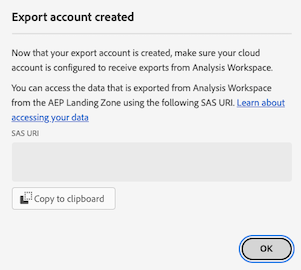
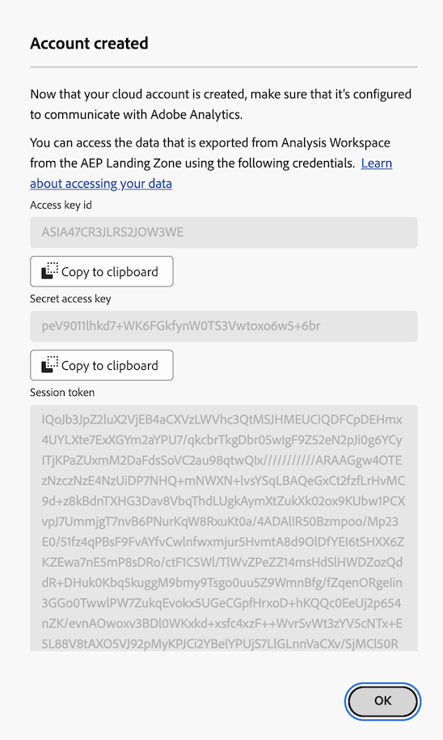
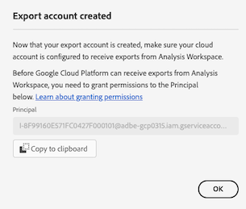

# クラウドの書き出しアカウントの設定

Customer Journey Analytics レポートをクラウドの宛先に書き出す前に（「Analysis Workspace Customer Journey Analytics レポートのクラウドへの書き出し [&#128279;](/help/analysis-workspace/export/export-cloud.md) またはReport Builder レポートのReport Builderからの書き出し [&#x200B; を使用して &#x200B;](/help/report-builder/report-builder-export.md)、データの送信先を設定する必要があります。

このプロセスでは、この記事で説明しているアカウント（Amazon S3、Google Cloud Platform など）を追加して設定し、次に [&#x200B; クラウド書き出しの場所の設定 &#x200B;](/help/components/exports/cloud-export-locations.md) で説明しているアカウント内の場所（アカウント内のフォルダーなど）を追加して設定します。

アカウントの表示、編集、削除など、既存のアカウントの管理方法について詳しくは、[&#x200B; クラウドの書き出し場所とアカウントの管理 &#x200B;](/help/components/exports/manage-export-locations.md) を参照してください。

## クラウド書き出しアカウントの作成を開始

1. レポートをクラウドに書き出すための [&#x200B; 最小要件 &#x200B;](/help/analysis-workspace/export/export-cloud.md#minimum-requirements) を満たしていることを確認します。
1. Customer Journey Analyticsで、[!UICONTROL **コンポーネント**]/[!UICONTROL **書き出し**] を選択します。
1. [!UICONTROL &#x200B; 書き出し &#x200B;] ページで、「[!UICONTROL **場所アカウント**]」タブを選択します。

   

1. [!UICONTROL **アカウントを追加**] を選択します。

   アカウントを追加ダイアログが表示されます。

1. [!UICONTROL **場所アカウント名**] フィールドに、場所アカウントの名前を指定します。 この名前は、場所を作成する際に表示されます。

1. 「[!UICONTROL **場所アカウントの説明**]」フィールドにアカウントの短い説明を入力します。これは、同じアカウントタイプを持つ他のアカウントとの区別に役立ちます。

1. 組織内の他のユーザーがアカウントを使用できるようにする場合は、[!UICONTROL **組織内のすべてのユーザーがアカウントを使用できるようにする**] オプションを有効にします。

   アカウントを共有する際は、次の点に注意してください。

   * 共有しているアカウントの共有を解除することはできません。

   * 共有アカウントは、そのアカウントの所有者のみが編集できます。

   * 共有アカウントの場所は誰でも作成できます。

1. 「[!UICONTROL **アカウントタイプ**]」フィールドで、書き出し先のクラウドアカウントのタイプを選択します。 使用可能なアカウントタイプは、Amazon S3 Role ARN、Google Cloud Platform、Azure SAS、Azure RBAC、Snowflake、AEP Data Landing Zone です。

1. 選択した [!UICONTROL **アカウントタイプ**] に対応する以下の節を続行します。

   * [AEP データランディングゾーン](#aep-data-landing-zone)

   * [Amazon S3 Role ARN](#amazon-s3-role-arn)

   * [Google Cloud Platform](#google-cloud-platform)

   * [Azure SAS](#azure-sas)

   * [Azure RBAC](#azure-rbac)

   * [Snowflake](#snowflake)

### AEP データランディングゾーン

>[!IMPORTANT]
>
>書き出しアカウントにAEP データランディングゾーンを使用する際は、次の点を考慮してください。
>
> * Customer Journey Analytics レポートをAdobe Experience Platform データランディングゾーンに書き出す場合は、7 日以内にデータをダウンロードし、AEP データランディングゾーンから削除してください。 7 日後、データはAEP データランディングゾーンから自動的に削除されます。
> * AEP Data Landing Zone は、Azure またはAWS ストレージを使用します。 Azure を使用するように設定されたログイン会社を使用している組織の場合、AEP Data Landing Zone では Azure が使用されます。 ログイン会社がAWSを使用するように設定されている場合、AEP データランディングゾーンはAWSを使用します。
>

1. 次のいずれかの方法で、クラウド書き出しアカウントの作成を開始します。

   * 前述した書き出しページの [&#x200B; クラウド書き出しアカウントの作成を開始 &#x200B;](#begin-creating-a-cloud-export-account)

   * [Analysis Workspaceからの完全なテーブルの書き出し &#x200B;](/help/analysis-workspace/export/export-cloud.md#export-full-tables-from-analysis-workspace) の場合

1. **[!UICONTROL AEP データランディングゾーン]** を選択した後、「**[!UICONTROL アカウントタイプ]**」フィールドで「[!UICONTROL **保存**]」を選択します。

   AEP データランディングゾーンが Azure とAWS ストレージのどちらを使用するように設定されているかに応じて、次のいずれかのダイアログが表示されます。

   * **Azure ストレージ：**

     [!UICONTROL **作成されたアカウントを書き出し**] ダイアログが表示されます。

     

   * **AWS ストレージ：**

     >[!AVAILABILITY]
     >
     >この節の内容は、Amazon Web Services（AWS）上で動作する Experience Platform の実装に適用されます。AWS 上で動作する Experience Platform は、現在、限られた数のお客様が利用できます。サポートされる Experience Platform インフラストラクチャについて詳しくは、[Experience Platform マルチクラウドの概要](https://experienceleague.adobe.com/ja/docs/experience-platform/landing/multi-cloud)を参照してください。

     [!UICONTROL **作成されたアカウント**] ダイアログが表示されます。

     

1. （条件付き） Azure ストレージを使用している場合：

   1. [!UICONTROL **SAS URI**] フィールドの内容をクリップボードにコピーします。 この SAS URI を使用して、AEP データランディングゾーンからAnalysis Workspaceから書き出されたデータにアクセスします。

      このフィールドが空の場合、Adobe Experience Platformへのアクセス権を付与されている必要があります。

   1. Adobe Experience Platformで、コピーした SAS URI を使用するようにデータランディングゾーンコンテナを設定します。

      >[!NOTE]
      >
      >Azure に基づくAEP Data Landing Zone アカウントを使用する場合、AEP Data Landing Zone に書き出すレポートにアクセスする最も簡単な方法は、Azure ストレージエクスプローラーを使用することです。 次の手順では、この方法を使用します。

      1. まだダウンロードしていない場合は、[Microsoft Azure ストレージエクスプローラー &#x200B;](https://azure.microsoft.com/en-us/products/storage/storage-explorer/) をダウンロードします。

      1. Adobe Experience Platform ドキュメントでは、[&#x200B; データランディングゾーンコンテナの Azure ストレージエクスプローラーへの接続 &#x200B;](https://experienceleague.adobe.com/docs/experience-platform/destinations/catalog/cloud-storage/data-landing-zone.html?lang=ja#connect-your-data-landing-zone-container-to-azure-storage-explorer) で説明されている手順に従います。

         [&#x200B; データランディングゾーンの資格情報の取得 &#x200B;](https://experienceleague.adobe.com/docs/experience-platform/destinations/catalog/cloud-storage/data-landing-zone.html?lang=ja#retrieve-dlz-credentials) および [&#x200B; データランディングゾーン資格情報の更新 &#x200B;](https://experienceleague.adobe.com/docs/experience-platform/destinations/catalog/cloud-storage/data-landing-zone.html?lang=ja#update-dlz-credentials) の節で説明したタスクはスキップできます。コピーした URI にはこれらの資格情報が含まれているからです。

      1. Adobe Experience Platformのドキュメントに従って「[!UICONTROL **Blob コンテナ SAS URL**]」フィールドに移動したら、手順 3 でコピーした SAS URI を貼り付けます。

         >[!NOTE]
         >
         >SAS URI は作成後 7 日で期限切れになるので、このアクションは 7 日ごとに実行する必要があります。 このプロセスを自動化するスクリプトを作成できます。

         

   1. [!UICONTROL **次へ**] / [!UICONTROL **接続**] を選択します。

   1. Customer Journey Analyticsの [!UICONTROL **作成されたアカウントを書き出し**] ダイアログで [!UICONTROL **OK**] を選択します。

      

1. （条件付き）AWS ストレージを使用している場合：

   1. 以下のフィールドの内容をクリップボードにコピーします（この情報を使用して、AEP データランディングゾーンからAnalysis Workspaceから書き出されたデータにアクセスします）。

      * [!UICONTROL **アクセスキー ID**]

      * **[!UICONTROL 秘密アクセスキー]**

      * **[!UICONTROL セッショントークン]**

      * **[!UICONTROL バケット名]**

      * **[!UICONTROL DLZ フォルダー]**

      

   1. [!UICONTROL **OK**] を選択します。

1. [&#x200B; クラウドの書き出し場所を設定 &#x200B;](/help/components/exports/cloud-export-locations.md) に進みます。

### Amazon S3 Role ARN

1. 次のいずれかの方法で、クラウド書き出しアカウントの作成を開始します。

   * 前述した書き出しページの [&#x200B; クラウド書き出しアカウントの作成を開始 &#x200B;](#begin-creating-a-cloud-export-account)

   * [Analysis Workspaceからの完全なテーブルの書き出し &#x200B;](/help/analysis-workspace/export/export-cloud.md#export-full-tables-from-analysis-workspace) の場合

1. [!UICONTROL **アカウントを追加**] ダイアログボックスの [!UICONTROL **アカウントプロパティ**] セクションで、次の情報を指定します。

   | フィールド | 機能 |
   |---------|----------|
   | [!UICONTROL **役割 ARN**] | アドビが Amazon S3 アカウントへのアクセス権を取得するために使用できる役割 ARN（Amazon リソースネーム）を指定する必要があります。これを行うには、ソースアカウントの IAM 権限ポリシーを作成し、そのポリシーをユーザーに関連付けてから、宛先アカウントの役割を作成します。詳しくは、[この AWS ドキュメント](https://repost.aws/ja/knowledge-center/cross-account-access-iam)を参照してください。 |

   {style="table-layout:auto"}

1. 「[!UICONTROL **保存**]」を選択します。

   [!UICONTROL **作成されたアカウントを書き出し**] ダイアログが表示されます。

   

1. [!UICONTROL **ユーザー ARN**] フィールドの内容をクリップボードにコピーします。 ユーザー ARN（Amazon リソースネーム）は、アドビが指定します。このユーザーをAmazon S3 Role ARN で作成したポリシーに関連付ける必要があります。

1. [!UICONTROL **OK**] を選択します。

1. [&#x200B; クラウドの書き出し場所を設定 &#x200B;](/help/components/exports/cloud-export-locations.md) に進みます。

### Google Cloud Platform

1. 次のいずれかの方法で、クラウド書き出しアカウントの作成を開始します。

   * 前述した書き出しページの [&#x200B; クラウド書き出しアカウントの作成を開始 &#x200B;](#begin-creating-a-cloud-export-account)

   * [Analysis Workspaceからの完全なテーブルの書き出し &#x200B;](/help/analysis-workspace/export/export-cloud.md#export-full-tables-from-analysis-workspace) の場合

1. [!UICONTROL **アカウントを追加**] ダイアログボックスの [!UICONTROL **アカウントプロパティ**] セクションで、次の情報を指定します。

   | フィールド | 関数 |
   |---------|----------|
   | [!UICONTROL **プロジェクト ID**] | Google Cloud アカウントからコピーするGoogle Cloud プロジェクト ID。 [プロジェクト ID の取得に関する Google Cloud ドキュメント](https://cloud.google.com/resource-manager/docs/creating-managing-projects?hl=ja#identifying_projects)を参照してください。 |

   {style="table-layout:auto"}

1. 「[!UICONTROL **保存**]」を選択します。

   [!UICONTROL **作成されたアカウントを書き出し**] ダイアログが表示されます。

   

1. [!UICONTROL **プリンシパル**] フィールドの内容をクリップボードにコピーし、このバケットにGoogle Cloud Platform でファイルをアップロードする権限をプリンシパルに付与していることを確認します。<!-- add link to Google Cloud docs on how to do this -->

1. [!UICONTROL **OK**] を選択します。

1. [&#x200B; クラウドの書き出し場所を設定 &#x200B;](/help/components/exports/cloud-export-locations.md) に進みます。

### Azure SAS

1. 次のいずれかの方法で、クラウド書き出しアカウントの作成を開始します。

   * 前述した書き出しページの [&#x200B; クラウド書き出しアカウントの作成を開始 &#x200B;](#begin-creating-a-cloud-export-account)

   * [Analysis Workspaceからの完全なテーブルの書き出し &#x200B;](/help/analysis-workspace/export/export-cloud.md#export-full-tables-from-analysis-workspace) の場合

1. [!UICONTROL **アカウントを追加**] ダイアログボックスの [!UICONTROL **アカウントプロパティ**] セクションで、次の情報を指定します。

   | フィールド | 関数 |
   |---------|----------|
   | [!UICONTROL **アプリケーション ID**] | 作成した Azure アプリケーションからこの ID をコピーします。Microsoft Azure では、この情報はアプリケーション内の「**概要**」タブにあります。詳しくは、[Microsoft ID プラットフォームにアプリケーションを登録する方法に関する Microsoft Azure ドキュメント](https://learn.microsoft.com/ja-jp/entra/identity-platform/quickstart-register-app)を参照してください。 |
   | [!UICONTROL **テナント ID**] | 作成した Azure アプリケーションからこの ID をコピーします。Microsoft Azure では、この情報はアプリケーション内の「**概要**」タブにあります。詳しくは、[Microsoft ID プラットフォームにアプリケーションを登録する方法に関する Microsoft Azure ドキュメント](https://learn.microsoft.com/ja-jp/entra/identity-platform/quickstart-register-app)を参照してください。 |
   | [!UICONTROL **Key Vault URI**] | <p>Azure Key Vault 内の SAS URI へのパス。Azure SAS を設定するには、Azure Key Vault を使用して SAS URI を秘密鍵として保存する必要があります。詳しくは、[Azure Key Vault で秘密鍵を設定および取得する方法に関する Microsoft Azure ドキュメント](https://learn.microsoft.com/ja-jp/azure/key-vault/secrets/quick-create-portal?source=recommendations)を参照してください。</p><p>Key Vault URI の作成後：<ul><li>作成した Azure アプリケーションに権限を付与するために、Key Vault にアクセスポリシーを追加します。<p><p>詳しくは、[Key Vault アクセスポリシーの割り当て方法に関する Microsoft Azure ドキュメント](https://learn.microsoft.com/ja-jp/azure/key-vault/general/assign-access-policy?tabs=azure-portal)を参照してください。</p>または</p><p>アクセスポリシーを作成せずに直接アクセスロールを付与する場合は、[Azure Portal を使用して Azure ロールを割り当てる方法に関するMicrosoft Azure ドキュメントを参照してください &#x200B;](https://learn.microsoft.com/en-us/azure/role-based-access-control/role-assignments-portal)。 これにより、Key Vault URI にアクセスするためのアプリケーション ID の役割の割り当てが追加されます。 </p></li><li>Key Vault URI にアクセスするには、アプリケーション ID に `Key Vault Certificate User` ビルトインの役割が付与されていることを確認してください。</br><p>詳しくは、[Azure のビルトインの役割](https://learn.microsoft.com/ja-jp/azure/role-based-access-control/built-in-roles)を参照してください。</p></li></ul> |
   | [!UICONTROL **Key Vault シークレット名**] | Azure Key Vault にシークレットを追加する際に作成したシークレット名。Microsoft Azure では、この情報は、作成した Key Vault の **Key Vault** 設定ページにあります。詳しくは、[Azure Key Vault からシークレットを設定および取得する方法に関する Microsoft Azure ドキュメント](https://learn.microsoft.com/ja-jp/azure/key-vault/secrets/quick-create-portal?source=recommendations)を参照してください。 |
   | [!UICONTROL **場所アカウントの秘密鍵**] | 作成した Azure アプリケーションからシークレットをコピーします。Microsoft Azure では、この情報はアプリケーション内の「**証明書とシークレット**」タブにあります。詳しくは、[Microsoft ID プラットフォーム &#x200B;](https://learn.microsoft.com/ja-jp/entra/identity-platform/quickstart-register-app) にアプリケーションを登録する方法に関するMicrosoft Azure のドキュメントを参照してください。<!-- need to grant permission to the bucket. Jun will send info on where that is documented) --> |

   {style="table-layout:auto"}

1. 「[!UICONTROL **保存**]」を選択します。

   [!UICONTROL **作成されたアカウントを書き出し**] ダイアログが表示されます。

   

1. まだ付与していない場合は、Azure SAS のバケットに権限を付与していることを確認してください。<!-- add link to Google Cloud docs on how to do this -->

1. [!UICONTROL **OK**] を選択します。

1. [&#x200B; クラウドの書き出し場所を設定 &#x200B;](/help/components/exports/cloud-export-locations.md) に進みます。

### Azure RBAC

1. 次のいずれかの方法で、クラウド書き出しアカウントの作成を開始します。

   * 前述した書き出しページの [&#x200B; クラウド書き出しアカウントの作成を開始 &#x200B;](#begin-creating-a-cloud-export-account)

   * [Analysis Workspaceからの完全なテーブルの書き出し &#x200B;](/help/analysis-workspace/export/export-cloud.md#export-full-tables-from-analysis-workspace) の場合

1. [!UICONTROL **アカウントを追加**] ダイアログボックスの [!UICONTROL **アカウントプロパティ**] セクションで、次の情報を指定します。

   | フィールド | 関数 |
   |---------|----------|
   | [!UICONTROL **アプリケーション ID**] | 作成した Azure アプリケーションからこの ID をコピーします。Microsoft Azure では、この情報はアプリケーション内の「**概要**」タブにあります。詳しくは、[Microsoft ID プラットフォームにアプリケーションを登録する方法に関する Microsoft Azure ドキュメント](https://learn.microsoft.com/ja-jp/entra/identity-platform/quickstart-register-app)を参照してください。 |
   | [!UICONTROL **テナント ID**] | 作成した Azure アプリケーションからこの ID をコピーします。Microsoft Azure では、この情報はアプリケーション内の「**概要**」タブにあります。詳しくは、[Microsoft ID プラットフォームにアプリケーションを登録する方法に関する Microsoft Azure ドキュメント](https://learn.microsoft.com/ja-jp/entra/identity-platform/quickstart-register-app)を参照してください。 |
   | [!UICONTROL **場所アカウントの秘密鍵**] | 作成した Azure アプリケーションからシークレットをコピーします。Microsoft Azure では、この情報はアプリケーション内の「**証明書とシークレット**」タブにあります。詳しくは、[Microsoft ID プラットフォームでのアプリケーション登録方法に関する Microsoft Azure ドキュメント](https://learn.microsoft.com/ja-jp/entra/identity-platform/quickstart-register-app)を参照してください。 |

   {style="table-layout:auto"}

1. 「[!UICONTROL **保存**]」を選択します。

   [!UICONTROL **作成されたアカウントを書き出し**] ダイアログが表示されます。

   

1. まだ付与していない場合は、Azure RBAC のバケットに権限を付与していることを確認します。<!-- add link to Google Cloud docs on how to do this -->

1. [!UICONTROL **OK**] を選択します。

1. [&#x200B; クラウドの書き出し場所を設定 &#x200B;](/help/components/exports/cloud-export-locations.md) に進みます。

### Snowflake

1. 次のいずれかの方法で、クラウド書き出しアカウントの作成を開始します。

   * 前述した書き出しページの [&#x200B; クラウド書き出しアカウントの作成を開始 &#x200B;](#begin-creating-a-cloud-export-account)

   * [Analysis Workspaceからの完全なテーブルの書き出し &#x200B;](/help/analysis-workspace/export/export-cloud.md#export-full-tables-from-analysis-workspace) の場合

1. [!UICONTROL **アカウントを追加**] ダイアログボックスの [!UICONTROL **アカウントプロパティ**] セクションで、次の情報を指定します。

   | フィールド | 関数 |
   |---------|----------|
   | [!UICONTROL **アカウント識別子**] | 組織内、およびSnowflakeがサポートするクラウドプラットフォームとクラウド地域のグローバルネットワーク全体で、Snowflake アカウントを一意に識別します。 <p>Snowflake アカウントからアカウント ID を取得し、ここに貼り付ける必要があります。</p><p>この情報の取得方法については、[Snowflake ドキュメントのアカウント識別子ページ &#x200B;](https://docs.snowflake.com/en/user-guide/admin-account-identifier) を参照してください。</p> |
   | [!UICONTROL **ユーザー**] | 接続に使用されるユーザーのログイン名。 Adobe専用の新しいユーザーを作成することをお勧めします。 ここに名前を指定して、Snowflakeに同じ名前のユーザーを作成します。 `CREATE USER` コマンドを使用して、Snowflakeでユーザーを作成できます。  <p>詳細については、[User, Role, &amp; Privilege Commands](https://docs.snowflake.com/en/sql-reference/commands-user-role) を参照してください。</p> |
   | [!UICONTROL **役割**] | ユーザーに割り当てられる役割。 Adobe専用の新しいロールを作成することをお勧めします。 ここでロールを指定し、Snowflakeで同じ名前のロールを作成してロールを付与します。 `CREATE ROLE` コマンドを使用して、Snowflakeで役割を作成できます。 <p>詳細については、[User, Role, &amp; Privilege Commands](https://docs.snowflake.com/en/sql-reference/commands-user-role) を参照してください。</p> |

   {style="table-layout:auto"}

1. 「[!UICONTROL **保存**]」を選択します。

   [!UICONTROL **作成されたアカウントを書き出し**] ダイアログが表示されます。

   

1. 「[!UICONTROL **公開鍵**] フィールドの内容をクリップボードにコピーします。 公開鍵はAdobeから提供されます。

   Snowflakeの公開鍵を使用して、Snowflake アカウントに接続します。 作成したユーザーをこの公開鍵に関連付ける必要があります。

   例えば、Snowflakeで次のコマンドを指定します。

   ```
   CREATE USER <your_adobe_user> RSA_PUBLIC_KEY = '<your_public_key>';
   ```

   詳しくは、[Snowflake ドキュメントのキーペア認証とキーペアのローテーション &#x200B;](https://docs.snowflake.com/en/user-guide/key-pair-auth) ページを参照してください。

1. [!UICONTROL **OK**] を選択します。

1. [&#x200B; クラウドの書き出し場所を設定 &#x200B;](/help/components/exports/cloud-export-locations.md) に進みます。
