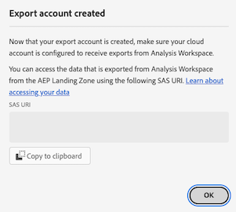
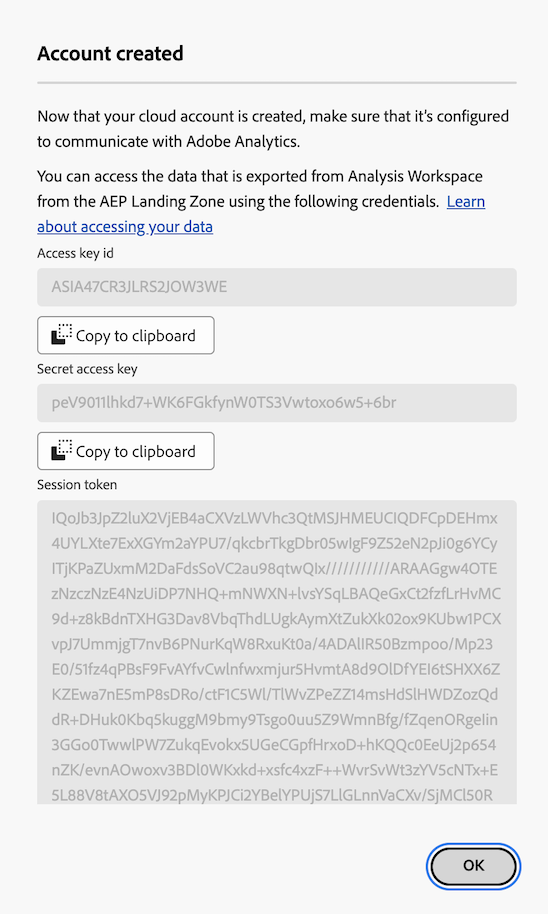
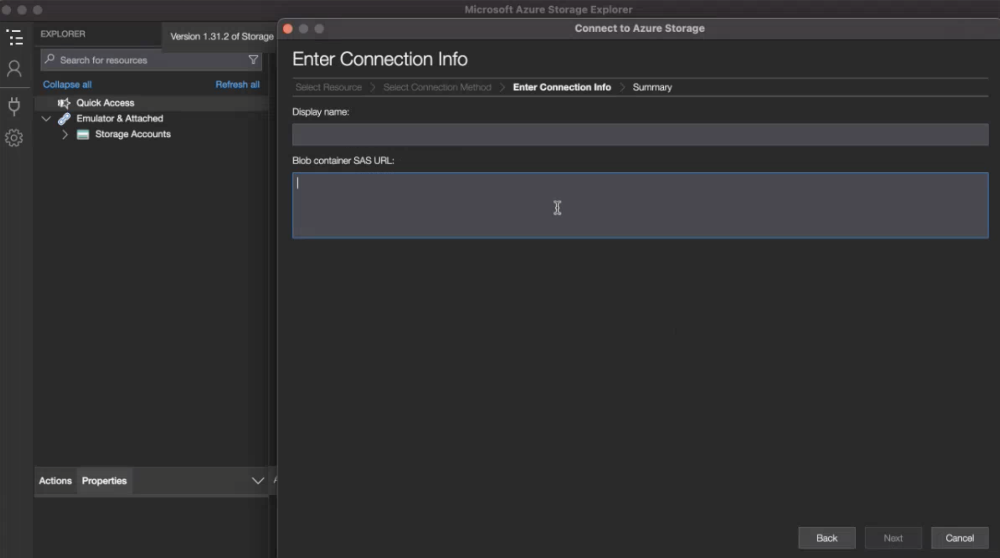
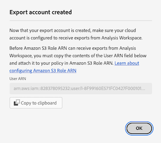
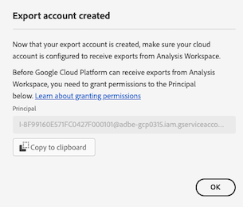
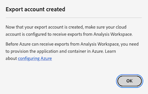
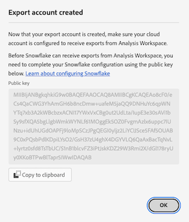

# クラウドの書き出しアカウントの設定

Customer Journey Analytics レポートをクラウドの宛先に書き出す前に（Analysis Workspaceから、[Customer Journey Analytics レポートをクラウドに書き出す](/help/analysis-workspace/export/export-cloud.md)またはReport Builderから、[Report Builderからレポートを書き出す](/help/report-builder/report-builder-export.md)で説明）、データを送信する宛先を追加して設定する必要があります。

このプロセスは、この記事で説明されているようにアカウント（Amazon S3、Google Cloud Platformなど）を追加および設定し、[&#x200B; クラウド書き出し場所の設定](/help/components/exports/cloud-export-locations.md)で説明されているように、そのアカウント内の場所（アカウント内のフォルダーなど）を追加および設定することから構成されます。

アカウントの表示、編集、削除など、既存のアカウントを管理する方法について詳しくは、[&#x200B; クラウド書き出し場所とアカウントの管理](/help/components/exports/manage-export-locations.md)を参照してください。

## クラウド書き出しアカウントの作成を開始

1. レポートをクラウドに書き出すための[最小要件](/help/analysis-workspace/export/export-cloud.md#minimum-requirements)を満たしていることを確認してください。
1. Customer Journey Analyticsで、[!UICONTROL **コンポーネント**]/[!UICONTROL **書き出し**]&#x200B;を選択します。
1. [!UICONTROL 書き出し] ページで、「[!UICONTROL **場所アカウント**]」タブを選択します。

   

1. 「[!UICONTROL **アカウントを追加**]」を選択します。

   アカウントを追加ダイアログが表示されます。

1. [!UICONTROL **場所アカウント名**] フィールドで、場所アカウントの名前を指定します。 この名前は、場所を作成するときに表示されます。

1. 「[!UICONTROL **場所アカウントの説明**]」フィールドに、アカウントの簡単な説明を入力して、同じアカウントタイプの他のアカウントと区別できるようにします。

1. アカウントの他のユーザーにアカウントの使用を許可する場合は、このオプションを有効にして&#x200B;[!UICONTROL **組織内のすべてのユーザーがアカウントを使用できるようにします**]。

   セグメントを共有する際は、次の点を考慮してください。

   * 共有したアカウントは、共有解除できません。

   * 共有したアカウントは、アカウントの所有者のみが編集できます。

   * 誰でも共有したアカウントの場所を作成できます。

1. 「[!UICONTROL **アカウントタイプ**]」フィールドで、書き出すクラウドアカウントのタイプを選択します。 使用可能なアカウントタイプは、Amazon S3 Role ARN、Google Cloud Platform、Azure SAS、Azure RBAC、Snowflake、AEP Data Landing Zone です。

1. 選択した&#x200B;[!UICONTROL **アカウントタイプ**]&#x200B;に対応する以下のセクションに進みます。

   * [AEP データランディングゾーン](#aep-data-landing-zone)

   * [Amazon S3 Role ARN](#amazon-s3-role-arn)

   * [Google Cloud Platform](#google-cloud-platform)

   * [Azure SAS](#azure-sas)

   * [Azure RBAC](#azure-rbac)

   * [Snowflake](#snowflake)

### AEP データランディングゾーン

>[!IMPORTANT]
>
>AEP Data Landing Zoneをエクスポートアカウントに使用する場合は、次の点を考慮してください。
>
> * Customer Journey Analytics レポートをAdobe Experience Platform Data Landing Zoneに書き出す場合は、7日以内にデータをダウンロードしてから、AEP Data Landing Zoneから削除してください。 7日後、データはAEP Data Landing Zoneから自動的に削除されます。
> * AEP Data Landing Zoneでは、AzureまたはAWS ストレージを使用します。 Azureを使用するように設定されたIMS組織を使用している場合、AEP Data Landing ZoneはAzureを使用します。 ログイン会社がAWSを使用するように設定されている場合、AEP Data Landing ZoneはAWSを使用します。
>

1. 次のいずれかの方法で、クラウド書き出しアカウントの作成を開始します。

   * 上記の書き出しページから、[&#x200B; クラウド書き出しアカウントの作成を開始](#begin-creating-a-cloud-export-account)します

   * Analysis Workspace[&#128279;](/help/analysis-workspace/export/export-cloud.md#export-full-tables)から完全なテーブルを書き出す場合

1. 「**[!UICONTROL アカウントタイプ]**」フィールドで「**[!UICONTROL AEP データランディングゾーン]**」を選択したら、「[!UICONTROL **保存**]」を選択します。

   AEP Data Landing ZoneがAzureまたはAWS ストレージを使用するように設定されているかどうかに応じて、次のいずれかのダイアログが表示されます。

   * **Azure ストレージ：**

     「[!UICONTROL **アカウントを書き出し**]」ダイアログが表示されます。

     

   * **AWS ストレージ：**

     >[!AVAILABILITY]
     >
     >この節の内容は、Amazon Web Services（AWS）上で動作する Experience Platform の実装に適用されます。 AWS 上で動作する Experience Platform は、現在、限られた数のお客様が利用できます。 サポートされる Experience Platform インフラストラクチャについて詳しくは、[Experience Platform マルチクラウドの概要](https://experienceleague.adobe.com/ja/docs/experience-platform/landing/multi-cloud)を参照してください。

     [!UICONTROL **アカウントが作成されました**] ダイアログが表示されます。

     

1. （条件付き）Azure ストレージを使用している場合：

   1. [!UICONTROL **SAS URI**] フィールドの内容をクリップボードにコピーします。 このSAS URIを使用して、AEP Data Landing Zoneから書き出されたAnalysis Workspace データにアクセスします。

      このフィールドが空の場合は、Adobe Experience Platformにアクセスする権限を付与する必要があります。

   1. Adobe Experience Platformで、コピーしたSAS URIを使用するようにData Landing Zone コンテナを設定します。

      >[!NOTE]
      >
      >Azureに基づくAEP Data Landing Zone アカウントを使用する場合、AEP Data Landing Zoneに書き出すレポートにアクセスする最も簡単な方法は、Azure Storage Explorerを使用することです。 次の手順では、この方法を使用します。

      1. まだダウンロードしていない場合は、[Microsoft Azure Storage Explorer](https://azure.microsoft.com/en-us/products/storage/storage-explorer/)をダウンロードしてください。

      1. Adobe Experience Platform ドキュメントで、[Data Landing Zone コンテナをAzure Storage Explorerに接続](https://experienceleague.adobe.com/docs/experience-platform/destinations/catalog/cloud-storage/data-landing-zone.html?lang=ja#connect-your-data-landing-zone-container-to-azure-storage-explorer)の手順に従います。

         「[&#x200B; データランディングゾーンの資格情報の取得](https://experienceleague.adobe.com/docs/experience-platform/destinations/catalog/cloud-storage/data-landing-zone.html?lang=ja#retrieve-dlz-credentials)および[&#x200B; データランディングゾーンの資格情報の更新](https://experienceleague.adobe.com/docs/experience-platform/destinations/catalog/cloud-storage/data-landing-zone.html?lang=ja#update-dlz-credentials)」の節で説明されているタスクは、コピーしたURIにこれらの資格情報が含まれているため、スキップできます。

      1. Adobe Experience Platform ドキュメントに従って&#x200B;[!UICONTROL **Blob container SAS URL**] フィールドに移動したら、前の手順でコピーしたSAS URIを貼り付けます。

         >[!NOTE]
         >
         >このアクションは、SAS URIが作成されてから7日後に期限切れになるため、7日ごとに実行する必要があります。 このプロセスを自動化するスクリプトを作成できます。

         

   1. [!UICONTROL **次**] > [!UICONTROL **接続**]&#x200B;を選択します。

   1. Customer Journey Analyticsで、[!UICONTROL **アカウントを作成した書き出し**] ダイアログで、[!UICONTROL **OK**]&#x200B;を選択します。

      

1. （条件付き）AWS ストレージを使用している場合：

   1. 次のフィールドの内容をクリップボードにコピーします（この情報を使用して、Analysis WorkspaceからAEP Data Landing Zoneから書き出されたデータにアクセスします）。

      * [!UICONTROL **アクセスキーID**]

      * **[!UICONTROL 秘密鍵]**

      * **[!UICONTROL セッショントークン]**

      * **[!UICONTROL バケット名]**

      * **[!UICONTROL DLZ フォルダー]**

      

   1. [!UICONTROL **OK**]&#x200B;を選択します。

1. [&#x200B; クラウド書き出し場所の設定](/help/components/exports/cloud-export-locations.md)で続行します。

### Amazon S3 Role ARN

1. 次のいずれかの方法で、クラウド書き出しアカウントの作成を開始します。

   * 上記の書き出しページから、[&#x200B; クラウド書き出しアカウントの作成を開始](#begin-creating-a-cloud-export-account)します

   * Analysis Workspace[&#128279;](/help/analysis-workspace/export/export-cloud.md#export-full-tables)から完全なテーブルを書き出す場合

1. [!UICONTROL **アカウントを追加**] ダイアログボックスの&#x200B;[!UICONTROL **アカウントプロパティ**] セクションで、次の情報を指定します。

   | フィールド | 関数 |
   |---------|----------|
   | [!UICONTROL **役割 ARN**] | アドビが Amazon S3 アカウントへのアクセス権を取得するために使用できる役割 ARN（Amazon リソースネーム）を指定する必要があります。 これを行うには、ソースアカウントの IAM 権限ポリシーを作成し、そのポリシーをユーザーに関連付けてから、宛先アカウントの役割を作成します。 詳しくは、[この AWS ドキュメント](https://repost.aws/ja/knowledge-center/cross-account-access-iam)を参照してください。 |

   {style="table-layout:auto"}

1. 「[!UICONTROL **保存**]」を選択します。

   「[!UICONTROL **アカウントを書き出し**]」ダイアログが表示されます。

   

1. [!UICONTROL **ユーザーARN**] フィールドの内容をクリップボードにコピーします。 ユーザー ARN（Amazon リソースネーム）は、アドビが指定します。 このユーザーは、Amazon S3 Role ARNで作成したポリシーに添付する必要があります。

1. [!UICONTROL **OK**]&#x200B;を選択します。

1. [&#x200B; クラウド書き出し場所の設定](/help/components/exports/cloud-export-locations.md)で続行します。

### Google Cloud Platform

1. 次のいずれかの方法で、クラウド書き出しアカウントの作成を開始します。

   * 上記の書き出しページから、[&#x200B; クラウド書き出しアカウントの作成を開始](#begin-creating-a-cloud-export-account)します

   * Analysis Workspace[&#128279;](/help/analysis-workspace/export/export-cloud.md#export-full-tables)から完全なテーブルを書き出す場合

1. [!UICONTROL **アカウントを追加**] ダイアログボックスの&#x200B;[!UICONTROL **アカウントプロパティ**] セクションで、次の情報を指定します。

   | フィールド | 関数 |
   |---------|----------|
   | [!UICONTROL **プロジェクト ID**] | Google Cloud アカウントからコピーしたGoogle Cloud プロジェクト ID。 [プロジェクト ID の取得に関する Google Cloud ドキュメント](https://cloud.google.com/resource-manager/docs/creating-managing-projects?hl=ja#identifying_projects)を参照してください。 |

   {style="table-layout:auto"}

1. 「[!UICONTROL **保存**]」を選択します。

   「[!UICONTROL **アカウントを書き出し**]」ダイアログが表示されます。

   

1. [!UICONTROL **プリンシパル**] フィールドの内容をクリップボードにコピーし、プリンシパルに対してGoogle Cloud Platformのこのバケットにファイルをアップロードする権限を付与していることを確認します。<!-- add link to Google Cloud docs on how to do this -->

1. [!UICONTROL **OK**]&#x200B;を選択します。

1. [&#x200B; クラウド書き出し場所の設定](/help/components/exports/cloud-export-locations.md)で続行します。

### Azure SAS

1. 次のいずれかの方法で、クラウド書き出しアカウントの作成を開始します。

   * 上記の書き出しページから、[&#x200B; クラウド書き出しアカウントの作成を開始](#begin-creating-a-cloud-export-account)します

   * Analysis Workspace[&#128279;](/help/analysis-workspace/export/export-cloud.md#export-full-tables)から完全なテーブルを書き出す場合

1. [!UICONTROL **アカウントを追加**] ダイアログボックスの&#x200B;[!UICONTROL **アカウントプロパティ**] セクションで、次の情報を指定します。

   | フィールド | 関数 |
   |---------|----------|
   | [!UICONTROL **アプリケーション ID**] | 作成した Azure アプリケーションからこの ID をコピーします。 Microsoft Azure では、この情報はアプリケーション内の「**概要**」タブにあります。 詳しくは、[Microsoft ID プラットフォームでのアプリケーションの登録方法に関する Microsoft Azure ドキュメント](https://learn.microsoft.com/ja-jp/entra/identity-platform/quickstart-register-app)を参照してください。 |
   | [!UICONTROL **テナント ID**] | 作成した Azure アプリケーションからこの ID をコピーします。 Microsoft Azure では、この情報はアプリケーション内の「**概要**」タブにあります。 詳しくは、[Microsoft ID プラットフォームでのアプリケーションの登録方法に関する Microsoft Azure ドキュメント](https://learn.microsoft.com/ja-jp/entra/identity-platform/quickstart-register-app)を参照してください。 |
   | [!UICONTROL **Key Vault URI**] | <p>Azure Key Vault 内の SAS URI へのパス。  Azure SAS を設定するには、Azure Key Vault を使用して SAS URI を秘密鍵として保存する必要があります。 詳しくは、[Azure Key Vault で秘密鍵を設定および取得する方法に関する Microsoft Azure ドキュメント](https://learn.microsoft.com/ja-jp/azure/key-vault/secrets/quick-create-portal?source=recommendations)を参照してください。</p><p>Key Vault URI の作成後：<ul><li>作成した Azure アプリケーションに権限を付与するために、Key Vault にアクセスポリシーを追加します。<p>詳しくは、[Key Vault アクセスポリシーの割り当て方法に関する Microsoft Azure ドキュメント](https://learn.microsoft.com/ja-jp/azure/key-vault/general/assign-access-policy?tabs=azure-portal)を参照してください。</p><p>または</p><p>アクセスポリシーを作成せずにアクセスの役割を直接付与する場合は、[Azure portal を使用して Azure の役割を割り当てる方法に関する Microsoft Azure ドキュメント](https://learn.microsoft.com/ja-jp/azure/role-based-access-control/role-assignments-portal)を参照してください。 これにより、Key Vault URI にアクセスするアプリケーション ID の役割の割り当てが追加されます。 </p></li><li>Key Vault URIにアクセスするには、アプリケーション IDに`Key Vault Certificate User`組み込みロールが付与されていることを確認してください。<p>詳しくは、[Azure のビルトインの役割](https://learn.microsoft.com/ja-jp/azure/role-based-access-control/built-in-roles)を参照してください。</p></li></ul> |
   | [!UICONTROL **Key Vault シークレット名**] | Azure Key Vault にシークレットを追加する際に作成したシークレット名。 Microsoft Azure では、この情報は、作成した Key Vault の **Key Vault** 設定ページにあります。 詳しくは、[Azure Key Vault からシークレットを設定および取得する方法に関する Microsoft Azure ドキュメント](https://learn.microsoft.com/ja-jp/azure/key-vault/secrets/quick-create-portal?source=recommendations)を参照してください。 |
   | [!UICONTROL **場所アカウントの秘密鍵**] | 作成した Azure アプリケーションからシークレットをコピーします。 Microsoft Azure では、この情報はアプリケーション内の「**証明書とシークレット**」タブにあります。 詳しくは、[Microsoft ID プラットフォームにアプリケーションを登録する方法についてMicrosoft Azureのドキュメント &#x200B;](https://learn.microsoft.com/ja-jp/entra/identity-platform/quickstart-register-app)を参照してください。<!-- need to grant permission to the bucket. Jun will send info on where that is documented) --> |

   {style="table-layout:auto"}

1. 「[!UICONTROL **保存**]」を選択します。

   「[!UICONTROL **アカウントを書き出し**]」ダイアログが表示されます。

   

1. まだ権限を付与していない場合は、Azure SASのバケットに権限を付与していることを確認してください。<!-- add link to Google Cloud docs on how to do this -->

1. [!UICONTROL **OK**]&#x200B;を選択します。

1. [&#x200B; クラウド書き出し場所の設定](/help/components/exports/cloud-export-locations.md)で続行します。

### Azure RBAC

1. 次のいずれかの方法で、クラウド書き出しアカウントの作成を開始します。

   * 上記の書き出しページから、[&#x200B; クラウド書き出しアカウントの作成を開始](#begin-creating-a-cloud-export-account)します

   * Analysis Workspace[&#128279;](/help/analysis-workspace/export/export-cloud.md#export-full-tables)から完全なテーブルを書き出す場合

1. [!UICONTROL **アカウントを追加**] ダイアログボックスの&#x200B;[!UICONTROL **アカウントプロパティ**] セクションで、次の情報を指定します。

   | フィールド | 関数 |
   |---------|----------|
   | [!UICONTROL **アプリケーション ID**] | 作成した Azure アプリケーションからこの ID をコピーします。 Microsoft Azure では、この情報はアプリケーション内の「**概要**」タブにあります。 詳しくは、[Microsoft ID プラットフォームでのアプリケーションの登録方法に関する Microsoft Azure ドキュメント](https://learn.microsoft.com/ja-jp/entra/identity-platform/quickstart-register-app)を参照してください。 |
   | [!UICONTROL **テナント ID**] | 作成した Azure アプリケーションからこの ID をコピーします。 Microsoft Azure では、この情報はアプリケーション内の「**概要**」タブにあります。 詳しくは、[Microsoft ID プラットフォームでのアプリケーションの登録方法に関する Microsoft Azure ドキュメント](https://learn.microsoft.com/ja-jp/entra/identity-platform/quickstart-register-app)を参照してください。 |
   | [!UICONTROL **場所アカウントの秘密鍵**] | 作成した Azure アプリケーションからシークレットをコピーします。 Microsoft Azure では、この情報はアプリケーション内の「**証明書とシークレット**」タブにあります。 詳しくは、[Microsoft ID プラットフォームでのアプリケーション登録方法に関する Microsoft Azure ドキュメント](https://learn.microsoft.com/ja-jp/entra/identity-platform/quickstart-register-app)を参照してください。 |

   {style="table-layout:auto"}

1. 「[!UICONTROL **保存**]」を選択します。

   「[!UICONTROL **アカウントを書き出し**]」ダイアログが表示されます。

   

1. まだ権限を付与していない場合は、Azure RBACでコンテナに権限を付与していることを確認してください。

1. [!UICONTROL **OK**]&#x200B;を選択します。

1. [&#x200B; クラウド書き出し場所の設定](/help/components/exports/cloud-export-locations.md)で続行します。

### Snowflake

1. 次のいずれかの方法で、クラウド書き出しアカウントの作成を開始します。

   * 上記の書き出しページから、[&#x200B; クラウド書き出しアカウントの作成を開始](#begin-creating-a-cloud-export-account)します

   * Analysis Workspace[&#128279;](/help/analysis-workspace/export/export-cloud.md#export-full-tables)から完全なテーブルを書き出す場合

1. [!UICONTROL **アカウントを追加**] ダイアログボックスの&#x200B;[!UICONTROL **アカウントプロパティ**] セクションで、次の情報を指定します。

   | フィールド | 関数 |
   |---------|----------|
   | [!UICONTROL **アカウント ID**] | 組織内だけでなく、Snowflakeがサポートするクラウドプラットフォームやクラウドリージョンのグローバルネットワーク全体で、Snowflakeアカウントを一意に識別します。 <p>Snowflake アカウントからアカウント IDを取得し、ここに貼り付ける必要があります。</p><p>この情報を入手する方法については、Snowflake ドキュメント [&#128279;](https://docs.snowflake.com/en/user-guide/admin-account-identifier)のAccount Identifiers ページを参照してください。</p> |
   | [!UICONTROL **ユーザー**] | 接続に使用されるユーザーのログイン名。 Adobeに特化した新しいユーザーを作成することをお勧めします。 ここで名前を指定し、Snowflakeで同じ名前のユーザーを作成します。 `CREATE USER` コマンドを使用して、Snowflakeでユーザーを作成できます。  <p>詳細については、[&#x200B; ユーザー、役割、および権限コマンド &#x200B;](https://docs.snowflake.com/en/sql-reference/commands-user-role)を参照してください。</p> |
   | [!UICONTROL **役割**] | ユーザーに割り当てる役割。 Adobeに特化した新しいロールを作成することをお勧めします。 ここでロールを指定し、Snowflakeで同じ名前のロールを作成して、そのロールをユーザーに付与します。 Snowflakeでは、`CREATE ROLE` コマンドを使用してロールを作成できます。 <p>詳細については、[&#x200B; ユーザー、役割、および権限コマンド &#x200B;](https://docs.snowflake.com/en/sql-reference/commands-user-role)を参照してください。</p> |

   {style="table-layout:auto"}

1. 「[!UICONTROL **保存**]」を選択します。

   「[!UICONTROL **アカウントを書き出し**]」ダイアログが表示されます。

   

1. [!UICONTROL **公開キー**] フィールドの内容をクリップボードにコピーします。 公開鍵はAdobeによって提供されます。

   Snowflakeの公開鍵を使用して、Snowflake アカウントに接続します。 作成したユーザーをこの公開鍵に関連付ける必要があります。

   例えば、Snowflakeで、次のコマンドを指定します。

   ```
   CREATE USER <your_adobe_user> RSA_PUBLIC_KEY = '<your_public_key>';
   ```

   詳しくは、Snowflake ドキュメント [&#128279;](https://docs.snowflake.com/en/user-guide/key-pair-auth)の「 キーペア認証とキーペアのローテーション」ページを参照してください。

1. [!UICONTROL **OK**]&#x200B;を選択します。

1. [&#x200B; クラウド書き出し場所の設定](/help/components/exports/cloud-export-locations.md)で続行します。
